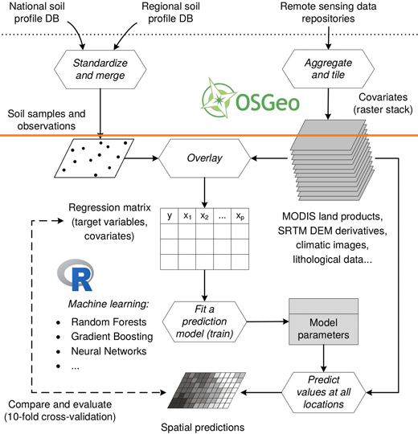

+++
title = 'Final_review_1'
date = 2025-03-06T09:38:06+01:00
draft = false
+++

[toc]

## 1. Explain GIS concepts, methods and techniques  

### Concept of predictive mapping

**预测性制图**（Predictive Mapping）是一种基于空间模型的技术，用于预测目标变量在空间（和时间）上的分布。
    
预测性制图的核心是构建一个空间模型，其基本形式为：**目标参数 ~ 解释变量**

- 目标参数（Target Parameter）：是需要预测的变量，通常是地理参考的点数据（如土壤属性、污染物浓度等）。
- 解释变量（Explanatory Variables）：是用于解释目标变量的因素，可以是矢量数据（如土地利用类型）或栅格数据（如地形坡度、海拔等）1。

### Workflow of predictive mapping

### Why ML for predictive mapping

即 ML pros 等
 
### ML Pro & Con

**优点（Pro’s）**

1. 处理大数据（Handling Big Data）：
机器学习算法能够高效处理和分析大规模数据集，从中提取有价值的信息。
2. 捕捉非线性关系（Non-linear Relationships）：
与传统的统计方法不同，机器学习能够捕捉目标变量与预测变量之间的复杂非线性关系。
3. 高预测性能（High Predictive Performance）：
通过优化模型参数和结构，机器学习在许多任务中（如图像识别、自然语言处理）表现出卓越的预测能力。

**缺点（Con’s）**

1. 容易过拟合（Easily Overfitted）：
机器学习模型可能过度拟合训练数据，导致在新数据上的泛化性能较差。
2. 知识发现有限（Limited Knowledge Discovery）：
许多机器学习模型（如深度学习）是“黑箱”模型，难以解释其内部机制和决策过程，限制了知识的发现和传播。

### Model Validation and Evaluation

1. **理解 vs 最佳统计预测**
- **理解（Understanding）**：
  指的是通过模型揭示数据背后的规律和机制，例如土壤形成过程与景观特征之间的关系。这种理解有助于知识发现（Knowledge Discovery）。
- **最佳统计预测（Best Statistical Prediction）**：
  指的是通过优化模型参数，尽可能提高预测精度，例如生成高精度的土壤属性图（Map Products）。
- **权衡**：
  在某些情况下，追求高预测精度的模型（如复杂的机器学习模型）可能难以解释，而简单的模型（如线性回归）虽然预测精度较低，但更容易理解。因此，需要根据目标（知识发现 vs 制图产品）选择合适的模型。

2. **不确定性信息的重要性**
- **不确定性（Uncertainty）**：
  模型预测结果通常存在不确定性，例如土壤属性值可能在一定范围内波动。
- **最终用户与失败成本（End Users & Failure Cost）**：
  不确定性信息对最终用户（如农民、土地规划者）至关重要，因为它可以帮助他们评估预测结果的可靠性，并降低决策失败的成本（如作物减产、规划失误）。
- **实践意义**：
  在模型输出中提供不确定性信息（如置信区间、标准差）是负责任的做法。

3. **数据质量 – 垃圾进，垃圾出**
- **数据质量（Data Quality）**：
  模型的质量高度依赖于输入数据的质量。如果输入数据存在错误或偏差（“垃圾进”），模型输出也会不可靠（“垃圾出”）。
- **合理的方法与数据（Sensible Methods and Data）**：
  为了提高模型的可信度，需要使用高质量的数据和合理的建模方法。例如，在土壤制图中，确保采样点的代表性和实验室分析的准确性。

## 2. Apply & interpret ML within soil context

### Digital Soil Mapping

**数字土壤制图**（也称为预测土壤制图或土壤计量制图）是指利用计算机辅助技术，基于土壤形成因素（如气候、地形、母质等）和空间数据，预测和生成土壤类型及土壤属性的数字地图。

它结合了传统的土壤调查方法和现代信息技术（如地理信息系统 GIS、遥感、机器学习等），以提高土壤信息的精度和覆盖范围。

### Landscape forming factors

**景观形成（Landscape Formation）**

景观形成是地质、气候和生物过程长期作用的结果，主要包括以下几个关键过程：

1. **岩石风化（Rock Weathering）**
- **物理风化**：
  - 由温度变化、水、冰和压力引起，导致岩石崩解成较小碎片。
  - 在寒冷或干燥气候中更为显著。
  - 例如，冻融循环使岩石裂缝扩大并最终破碎 [^1]。
- **化学风化和生物风化**：
  - 由大气化学物质或生物活动产生的化学物质引起，改变岩石的组成和物理特性。
  - 在温暖湿润的气候中更为显著。
  - 例如，植物根系分泌的酸类物质溶解岩石 [^1]。

2. **侵蚀（Erosion）**
- **水侵蚀**：
  - 水流冲刷地表，形成冲积物和河流沉积物。
  - 沉积物的分选性取决于能量水平：低能量环境沉积细颗粒，高能量环境沉积粗颗粒 [^1]。
- **冰/雪侵蚀**：
  - 冰川通过剥蚀、冻融和磨蚀作用搬运岩石碎片，形成冰碛物。
  - 冰碛物通常分选性较差 [^1]。
- **风侵蚀**：
  - 风力搬运细颗粒物质，形成风成沉积物（如黄土）。
  - 风成沉积物通常分选性较好 [^1]。
- **重力侵蚀**：
  - 重力作用下，岩石和土壤沿坡面滑落，形成崩积物 [^1]。

3. **搬运（Transport）**
- 风化产物通过水、冰、风和重力等介质被搬运到其他地点 [^1]。

4. **沉积（Sedimentation）**
- 搬运物质在低能量环境中沉积，形成不同质地和结构的沉积层 [^1]。

5. **主要景观形成因素**
- **构造运动**：如地壳抬升和俯冲，塑造地形的基本框架 [^1]。
- **水**：通过侵蚀、搬运和沉积作用塑造河流、湖泊和海岸地貌 [^1]。
- **冰/雪**：通过冰川作用塑造高山和极地地貌 [^1]。
- **风**：通过风蚀和风积作用塑造沙漠和黄土高原等地貌 [^1]。

### Soil-forming factors

**土壤形成（Soil Formation）**

土壤形成是岩石风化和生物活动长期作用的结果，主要包括以下几个关键过程：

1. **母质（Parent Material）**
- 土壤形成的物质基础，可以是岩石风化产物或沉积物 [^1]。

2. **气候（Climate）**
- 温度和降水影响风化速率和生物活动，从而影响土壤形成过程 [^1]。
- 例如，温暖湿润的气候有利于化学风化和有机质积累 [^1]。

3. **生物（Organisms）**
- 植物、动物和微生物通过分解有机质、混合土壤和分泌化学物质促进土壤形成 [^1]。
- 例如，植物根系改善土壤结构，微生物分解有机质形成腐殖质 [^1]。

4. **地形（Topography）**
- 坡度、坡向和海拔影响水分分布和侵蚀速率，从而影响土壤发育 [^1]。
- 例如，平坦地区土壤发育较厚，陡坡地区土壤较薄 [^1]。

5. **时间（Time）**
- 土壤形成是一个长期过程，需要数百年甚至数千年 [^1]。
- 随着时间的推移，土壤层次（如 A、B、C 层）逐渐形成 [^1]。

6. **土壤形成的主要过程**
- **添加（Additions）**：如有机质和沉积物的输入 [^1]。
- **损失（Losses）**：如侵蚀和淋溶导致的物质流失 [^1]。
- **转化（Transformations）**：如有机质分解和矿物质风化 [^1]。
- **迁移（Translocations）**：如水分和溶解物质的垂直或水平移动 [^1]。

#### 景观形成与土壤形成的关系

- **景观是土壤形成的基础**：地形、母质和气候等景观因素直接影响土壤的发育和特性 [^1]。
- **土壤是景观演化的产物**：土壤的形成和分布反映了景观的演化历史 [^1]。
- **相互作用**：土壤通过支持植被生长和调节水文过程进一步影响景观的演化 [^1]。

### Soil-Landscape paradigm

**土壤景观范式（Soil-Landscape Paradigm）** 是土壤科学中的一个核心理论框架，用于理解土壤形成、分布及其与景观特征的关系。

**土壤景观范式的起源与定义**

**起源**：由土壤学家 Hans Jenny 在 1941 年提出，他将土壤形成描述为五个主要因素的函数：气候（Climate）、生物（Organisms）、地形（Relief）、母质（Parent Material）和时间（Time），即著名的 **CLORPT 模型**：
$$
  Soil = f(Climate, Organisms, Relief, Parent Material, Time)
$$
- **定义**：土壤景观范式认为，土壤的形成和分布是由景观特征（如地形、母质）和环境条件（如气候、生物活动）共同决定的，且这些因素在不同空间和时间尺度上相互作用 [^1]。

#### **土壤形成的五大因素**

1. **气候（Climate）**
- **温度与降水**：
  - 影响岩石风化速率（如化学风化在温暖湿润气候中更快）。
  - 决定水分可利用性，进而影响植被生长和土壤有机质积累 [^1]。
- **辐射**：
  - 影响地表温度和蒸发速率，从而调节土壤水分和养分循环 [^1]。

2. **生物（Organisms）**
- **植被**：
  - 通过根系活动和枯枝落叶增加土壤有机质，改善土壤结构。
  - 影响土壤侵蚀潜力和养分循环 [^1]。
- **土壤动物与微生物**：
  - 分解有机质，促进养分释放和土壤团聚体形成 [^1]。

3. **地形（Relief）**
- **海拔、坡度和坡向**：
  - 影响水分分布、侵蚀速率和土壤发育（如陡坡土壤较薄，平坦地区土壤较厚）。
  - 形成土壤地形序列（Soil Toposequence），即沿地形梯度土壤特性的变化 [^1]。

4. **母质（Parent Material）**
- **岩石类型与沉积物**：
  - 决定土壤的初始物理和化学特性（如质地、pH、阳离子交换能力）。
  - 是土壤分类的重要依据 [^1]。

5. **时间（Time）**
- **土壤形成的时间尺度**：
  - 土壤形成是一个长期过程，需要数百年甚至数千年。
  - 土壤时间序列（Soil Chronosequence）研究土壤在相似环境条件下随时间的演变 [^1]。

## 3. Explain GIS concepts, methods and techniques 

### Pre-processing steps point and gridded data

Pre-processing is a critical step in predictive mapping to ensure that the data used for modeling is clean, consistent, and ready for analysis. Here’s a structured breakdown of the pre-processing steps for both **point data** and **gridded (spatial) data**:

**1. Pre-processing Point Data (Sampling Locations)**
Point data typically includes measurements taken at specific locations (e.g., soil properties, plant species, biodiversity). The pre-processing steps for point data include:

1. **Standardize and Merge Data**
   - If data comes from different sources, ensure consistency in units, formats, and coordinate systems.
   - Merge datasets into a single table for analysis.

2. **Check for Outliers and Unrealistic Values**
   - Identify outliers or errors using summary statistics (e.g., mean, median, standard deviation).
   - Visualize data distributions using histograms or boxplots.
   - Compare minimum values with the first quartile (Q1) to detect anomalies.

3. **Handle Missing Data**
   - Leave cells with missing data empty (e.g., `NA` in R).
   - Avoid using placeholder values like `0` or `-9999`, as they can mislead the model.

4. **Tidy the Data**
   - Follow the principles of tidy data:
     - Each variable has its own column.
     - Each observation has its own row.
     - Each value has its own cell.
   - Use short, sensible column names (e.g., `SOC` for soil organic carbon) and avoid spaces or special characters.

5. **Clean Up Unnecessary Data**
   - Remove redundant or irrelevant columns to simplify the dataset.

**2. Pre-processing Gridded Data (Spatial Covariates)**
Gridded data includes spatial layers such as Digital Elevation Models (DEMs), climate data, and satellite imagery. The pre-processing steps for gridded data include:

1. **Re-project the Coordinate System**
   - Ensure all layers are in the same coordinate system (e.g., using EPSG codes).

2. **Convert Vector Data to Raster**
   - If necessary, convert vector data (e.g., shapefiles) into raster format for consistency.

3. **Resample to a Common Resolution**
   - Adjust the resolution of all layers to match, ensuring compatibility.

4. **Align Grid Cells**
   - Ensure all raster layers share the same origin and alignment to avoid spatial mismatches.

5. **Save in GeoTIFF Format**
   - Save processed raster layers in GeoTIFF format for easy reuse and sharing.

6. **Check for Artefacts and Errors**
   - Look for issues like mosaicking errors, striping in satellite images, or incorrect DEMs.

7. **Handle NoData Values**
   - Identify and address areas with missing data (e.g., due to cloud removal or masking).

8. **Check for Constant Values**
   - Remove or adjust layers with no spatial variation (e.g., coarse resolution data).

### Identifying poor quality data

Poor quality data can lead to unreliable predictions. Here’s how to identify and address issues in both point and gridded data:

**1. Point Data Quality Issues**
- **Outliers**: Values that deviate significantly from the rest of the data.
  - Use summary statistics (e.g., quantile distribution) to detect outliers.
  - Visualize data distributions to identify unusual patterns.
- **Missing Data**: Empty or placeholder values (e.g., `NA`, `0`, `-9999`).
  - Check for missing values and decide how to handle them (e.g., imputation or removal).
- **Inconsistent Units**: Ensure all variables are in the same units (e.g., `%` for soil organic carbon).

**2. Gridded Data Quality Issues**
- **Artefacts**: Errors in spatial data, such as:
  - Mosaicking errors in satellite images.
  - Striping or banding in remote sensing data.
  - Incorrect DEMs (e.g., unrealistic elevation values).
- **NoData Values**: Areas with missing data (e.g., due to cloud removal or masking).
  - Identify and address these areas before modeling.
- **Constant Values**: Layers with no spatial variation (e.g., coarse resolution data).
  - Remove or adjust these layers to avoid redundancy.

### The origin of DEM’s & DEM definitions

**Digital Elevation Model (DEM)**

A DEM represents the bare ground surface (without vegetation or man-made structures) using elevation values.
It is typically stored as a raster grid where each cell contains an elevation value.

**Digital Surface Model (DSM)**

A DSM includes the elevation of all surfaces, such as buildings, trees, and other above-ground features.
It represents the "top of the landscape" rather than the bare ground.

**Digital Terrain Model (DTM)**

A DTM is a more detailed representation of the terrain, often including features like breaklines (e.g., ridges, valleys) and other terrain characteristics.
It is typically derived from DEMs but provides additional detail.
Resolution

**Spatial Resolution:** The size of each grid cell (e.g., 30m, 10m, 1m). Higher resolution provides more detail.
**Vertical Resolution:** The precision of elevation values (e.g., 1m, 0.1m).
Accuracy

**Absolute Accuracy**: How close the elevation values are to the true elevation.
**Relative Accuracy:** How well the model represents the terrain's morphology (e.g., slopes, ridges).

### Local, focal and zonal operations

### **Overview of Spatial Operations in DEM Analysis**

Spatial operations are essential for processing and analyzing Digital Elevation Models (DEMs). These operations can be categorized into four main types: **Local**, **Zonal**, **Focal**, and **Global**. Here’s a summary of their meanings and functions:

**1. Local Operations**
- **Definition**: Operations applied to each individual grid cell independently.
- **Function**:
  - Perform calculations or transformations on a cell-by-cell basis.
  - Examples:
    - Adding, subtracting, multiplying, or dividing a constant value for each cell.
    - Calculating a spectral index (e.g., NDVI) for each pixel in a raster.
- **Example**: Multiplying every cell in a DEM by 3.

**2. Zonal Operations**
- **Definition**: Operations applied within predefined zones or classes (e.g., land use types, elevation ranges).
- **Function**:
  - Perform calculations or transformations based on the characteristics of each zone.
  - Examples:
    - Calculating the average elevation within each land use class.
    - Applying different formulas or values to cells within specific zones.
- **Example**: Adding 0 to Class 1, multiplying Class 2 by 2, subtracting 1 from Class 3, and adding 1 to Class 4.

**3. Focal Operations**
- **Definition**: Operations applied to a moving window (e.g., 3x3, 5x5) over the grid.
- **Function**:
  - Perform calculations for each cell based on its neighboring cells within the window.
  - Examples:
    - Calculating the average, maximum, or minimum value within the window.
    - Smoothing or filtering the DEM to reduce noise.
- **Example**: Assigning the average value of a 3x3 window to the center cell.

 **4. Global Operations**
- **Definition**: Operations applied to the entire grid as a whole.
- **Function**:
  - Perform calculations or transformations that affect all cells uniformly.
  - Examples:
    - Calculating the average elevation of the entire DEM.
    - Normalizing elevation values across the entire grid.
- **Example**: Assigning the average value of the entire grid to every cell.

**Summary of Spatial Operations**

| **Operation Type** |         **Scope**         |                     **Function**                     |                 **Example**                  |
| ------------------ | ------------------------- | ---------------------------------------------------- | -------------------------------------------- |
| **Local**          | Individual cell           | Apply a function to each cell independently          | Multiply every cell by 3                     |
| **Zonal**          | Predefined zones/classes  | Apply a function based on zone characteristics       | Add 0 to Class 1, multiply Class 2 by 2      |
| **Focal**          | Moving window (e.g., 3x3) | Apply a function to each cell based on its neighbors | Assign the average of a 3x3 window to center |
| **Global**         | Entire grid               | Apply a function uniformly across all cells          | Assign the grid’s average to every cell      |

## 4. Apply & interpret ML within soil context

### Handling data in R

### Generating terrain-related predictors for predictive mapping in R

### **What is a Regression Matrix?**

A **regression matrix** is a structured table used in **Digital Soil Mapping (DSM)** to establish predictive relationships between soil properties and environmental covariates. It serves as the input for statistical models to predict soil properties across a landscape.

**Key Components of a Regression Matrix**
1. **Sample ID**: Unique identifier for each soil sampling site.
2. **Coordinates**: Geographic location (e.g., latitude, longitude) of the sampling site.
3. **Target Soil Property**: The soil property being modeled (e.g., clay content, pH).
4. **Covariate Values**: Values of environmental covariates (e.g., elevation, slope, NDVI) at each sampling site.

**Structure**
- **Rows**: Each row represents a soil sampling site.
- **Columns**: Each column represents a variable (e.g., sample ID, coordinates, target soil property, covariate values).
- **Purpose**: The matrix allows statistical models to analyze the relationship between soil properties and covariates, enabling predictions across unsampled areas.

### How to generate a regression matrix

**1. Data Collection**
- **Soil Sampling Data**: Collect soil samples and record their properties (e.g., clay content, pH).
- **Covariate Data**: Obtain environmental covariate layers (e.g., DEM, NDVI, land use) as raster or vector data.

**2. Spatial Overlay**
- **Overlay Sampling Points on Covariate Layers**: Use GIS software to extract covariate values at the locations of soil sampling points.
- **Match Coordinates**: Ensure that the coordinates of sampling points align with the covariate layers.

**3. Data Cleaning**
- **Remove Missing Data**: Exclude sampling points that lack covariate data.
- **Check Categorical Covariates**: Ensure there is sufficient data for each category.
  - If a category has too few samples, combine it with similar categories in a meaningful way.
  - Convert categorical covariates into binary variables (e.g., one-hot encoding) for modeling.

**4. Create the Matrix**
- **Organize Data**: Arrange the data into a table with rows for sampling sites and columns for sample ID, coordinates, target soil property, and covariate values.
- **Ensure Completeness**: Verify that all necessary data is included and formatted correctly.

**5. Statistical Modeling**
- **Input for Models**: Use the regression matrix as input for statistical or machine learning models (e.g., linear regression, random forest) to derive predictive relationships.

## 5. Explain GIS concepts, methods and techniques 

### (Multiple) Linear Regression model

**Simple Linear Regression**

- **Model**: $y = \beta_0 + \beta_1 x + \epsilon$
- **Purpose**: Predicts the relationship between one independent variable and the dependent variable.

**Multiple Linear Regression**

- **Model**: $y = \beta_0 + \beta_1 x_1 + \beta_2 x_2 + \dots + \beta_n x_n + \epsilon$
- **Purpose**: Predicts the relationship between multiple independent variables and the dependent variable.

### **Regression Coefficients**

Regression coefficients are the **parameters** in a linear regression model that quantify the relationship between the independent variables (predictors) and the dependent variable (target).

**Key Points**

1. **Simple Linear Regression**:
   - Model: $y = \beta_0 + \beta_1 x + \epsilon$
   - $\beta_0$: **Intercept** (value of \( y \) when \( x = 0 \)).
   - $\beta_1$: **Slope** (change in \( y \) for a 1-unit increase in \( x \)).

2. **Multiple Linear Regression**:
   - Model: $y = \beta_0 + \beta_1 x_1 + \beta_2 x_2 + \dots + \beta_n x_n + \epsilon$
   - $\beta_0$: Intercept.
   - $\beta_1, \beta_2, \dots, \beta_n$: **Partial regression coefficients** (change in \( y \) for a 1-unit increase in \( x_i \), holding other predictors constant).

3. **Interpretation**:
   - Positive \( \beta_i \): Increase in \( x_i \) leads to an increase in \( y \).
   - Negative \( \beta_i \): Increase in \( x_i \) leads to a decrease in \( y \).

4. **Estimation**:
   - Coefficients are estimated using the **Ordinary Least Squares (OLS)** method, minimizing the sum of squared residuals.

### **Prediction and Residual Values**

**Prediction Values**

- **Definition**: The values of the dependent variable (\( \hat{y} \)) predicted by the regression model.
- **Calculation**: Plug the values of independent variables into the regression equation.
  - Example: $\hat{y} = \beta_0 + \beta_1 x_1 + \beta_2 x_2$

**Residual Values**

- **Definition**: The difference between the observed (\( y \)) and predicted (\( \hat{y} \)) values.
  - Residual $\epsilon = y - \hat{y}$
- **Purpose**: Residuals are used to assess the model's accuracy and check assumptions (e.g., normality, homoscedasticity).

**Key Points**

- **Small Residuals**: Indicate a good fit.
- **Large Residuals**: Indicate poor fit or outliers.

### R² and RMSE

**R² (Coefficient of Determination)**

- **Definition**: Measures the proportion of variance in the dependent variable explained by the independent variables.
- **Range**: 0 to 1 (or 0% to 100%).
  - $R^2 = 1 - \frac{\text{SS}_{\text{res}}}{\text{SS}_{\text{tot}}}$
  - $\text{SS}_{\text{res}}$: Sum of squared residuals.
  - $\text{SS}_{\text{tot}}$: Total sum of squares.
- **Interpretation**:
  - \( R^2 = 1 \): Perfect fit (all variance explained).
  - \( R^2 = 0 \): No variance explained.

**RMSE (Root Mean Squared Error)**

- **Definition**: Measures the average deviation of predicted values from observed values.
- **Calculation**:
  $\text{RMSE} = \sqrt{\frac{1}{n} \sum_{i=1}^n (y_i - \hat{y}_i)^2}$
- **Interpretation**:
  - Lower RMSE: Better model performance.
  - Higher RMSE: Poorer model performance.

**Key Differences**

- $R^2$): Measures explanatory power (relative fit).
- RMSE: Measures prediction accuracy (absolute fit).

### Summary of Landform Elements

Landform elements are **sub-components of landform types** that are characterized by their **morphology** (shape, steepness, orientation, moisture regime, and relative position). They represent a hierarchical level below landform types and are essential for understanding and analyzing terrain features.

**Key Characteristics of Landform Elements**
1. **Shape (Curvature)**
   - Describes the convexity or concavity of the terrain.
   - Examples: Convex slopes, concave valleys.

2. **Steepness (Slope)**
   - Refers to the gradient or angle of the terrain.
   - Examples: Gentle slopes, steep slopes.

3. **Orientation (Aspect)**
   - Indicates the direction a slope faces (e.g., north-facing, south-facing).
   - Influences factors like sunlight exposure and moisture retention.

4. **Moisture Regime**
   - Describes the water availability in the area.
   - Often quantified using indices like the **Topographic Wetness Index (TWI)**.
   - Examples: Wet valleys, dry ridges.

5. **Relative Landform Position**
   - Refers to the position within the landform (e.g., upper, middle, lower).
   - Examples: Upper slopes, mid slopes, foot slopes.

**Examples of Landform Elements**

- **Foot Slope**: The base of a hill or mountain, often with concave curvature.
- **Upper Slope**: The higher part of a slope, often with convex curvature.
- **Alluvial Fan**: A fan-shaped deposit of sediment formed at the base of a slope.
- **Plains**: Flat or gently rolling areas with low relief.
- **Mountain Tops**: The highest points of mountains, often with steep slopes.
- **Plateaus**: Elevated flat areas with steep sides.

**Role in Soil Formation and Land Evaluation**
Landform elements influence soil formation and land suitability:

1. **Steep Slopes**:
   - Shallow soils due to erosion.
   - Prone to droughts and limited rooting depth.
   - Lower vegetation productivity.

2. **High Wetness Index (e.g., Clayey Materials)**:
   - Poor drainage conditions.
   - Prolonged wet periods.
   - Less suitable for agriculture.

### Checking on model assumption

Checking on model assumptions is a critical step in **statistical modeling**, particularly in **linear regression** and **multiple linear regression (MLR)**, to ensure the validity and reliability of the model's results. It involves verifying that the data and model meet the underlying assumptions of the statistical method being used.

1. **Normality of Residuals**
   - The residuals (differences between observed and predicted values) should follow a **normal distribution**.
   - **How to Check**: Use diagnostic plots (e.g., QQ plot, histogram of residuals) or statistical tests (e.g., Shapiro-Wilk test).
   - **Solution**: If residuals are not normally distributed, consider transforming the dependent variable (e.g., log transformation).

2. **Independence of Predictors**
   - The predictor variables (independent variables) should be **independent** of each other.
   - **How to Check**: Examine the **covariance matrix** or calculate **pairwise correlations** between predictors.
   - **Solution**: Remove highly correlated predictors or use techniques like **principal component analysis (PCA)** to reduce multicollinearity.

3. **Linearity**
   - The relationship between the dependent variable and each independent variable should be **linear**.
   - **How to Check**: Plot residuals against predicted values or individual predictors to identify non-linear patterns.
   - **Solution**: Apply transformations (e.g., polynomial terms) to capture non-linear relationships.

4. **Homoscedasticity**

   - The variance of residuals should be **constant** across all levels of the independent variables.
   - **How to Check**: Plot residuals against predicted values and look for patterns (e.g., funnel shape).
   - **Solution**: Use weighted least squares or transform the dependent variable.

5. **No Outliers**

   - The data should not contain extreme outliers that disproportionately influence the model.
   - **How to Check**: Use diagnostic plots (e.g., Cook's distance, leverage plots) to identify outliers.
   - **Solution**: Remove or address outliers if they are data errors or use robust regression techniques.

**Steps to Check Model Assumptions**

1. **Fit the Model**: Run the regression model (simple or multiple linear regression).
2. **Examine Residuals**: Analyze residuals for normality, homoscedasticity, and outliers.
3. **Check Predictor Independence**: Evaluate the correlation matrix for multicollinearity.
4. **Diagnostic Plots**: Use plots (e.g., residual vs. fitted, QQ plot) to visually assess assumptions.
5. **Transform Data**: If assumptions are violated, apply transformations or adjust the model.

**Why is Checking Assumptions Important?**

- Ensures the **validity** of the model's predictions and inferences.
- Prevents **biased** or **misleading** results.
- Improves the **generalizability** of the model to new data.

## 6. Apply & interpret ML within soil context

### Fit and evaluate a LM and MLR model to DEM data

### Explain model summaries from R both from a statistical as well as landscape perspective

## 7. Explain GIS concepts, methods and techniques 

### **CART Model (Classification and Regression Trees)**
- **Definition**: A decision tree algorithm used for both classification (categorical outcomes) and regression (continuous outcomes).
- **Key Features**:
  - **Splitting**: Recursively partitions data based on predictor variables to maximize homogeneity in subsets.
  - **Pruning**: Reduces tree complexity to prevent overfitting by removing less important branches.
- **Limitations**:
  - Instability (sensitive to small changes in data).
  - Prone to overfitting if not pruned properly.

### **Random Forest Model**
- **Definition**: An ensemble method that builds multiple decision trees (a "forest") and aggregates their predictions for improved accuracy and stability.
- **Key Features**:
  - **Randomness**: Uses bootstrapping (sampling with replacement) and random subsets of predictors (mtry) for each tree.
  - **Out-of-Bag (OOB) Assessment**: Evaluates model accuracy using data not included in the bootstrap sample for each tree.
- **Advantages**:
  - Reduces overfitting compared to single trees.
  - Handles non-linear relationships and high-dimensional data well.

### **Splitting, Pruning, and Out-of-Bag Accuracy Assessment**
- **Splitting**: Divides data into subsets based on predictor variables to minimize error (e.g., sum of squared errors for regression).
- **Pruning**: Reduces tree size by removing branches that do not significantly improve model performance.
- **Out-of-Bag (OOB) Accuracy**:
  - Measures model performance using data not included in the bootstrap sample for each tree.
  - Provides an unbiased estimate of model accuracy without needing a separate validation set.

### **Variable Importance**
- **Definition**: Measures the contribution of each predictor variable to the model's performance.
- **Methods**:
  - **Based on Split Error**: Quantifies the improvement in the split criterion (e.g., reduction in error) for each variable across all trees.
  - **Based on OOB**: Evaluates the increase in error when a variable is randomly permuted (shuffled) in the OOB data.
- **Use**: Helps identify the most influential variables for knowledge discovery and model interpretation.

### **Variable Selection**
- **Purpose**: Reduces the number of predictor variables to improve model efficiency and interpretability.
- **Methods**:
  - **Correlation Analysis**: Removes highly correlated predictors to avoid biased variable importance.
  - **Recursive Feature Elimination**: Iteratively removes the least important variables based on model performance.
- **Importance**: Ensures the model focuses on the most relevant predictors and avoids overfitting.

### **Prediction and Residual Values, R² and RMSE**
- **Prediction Values**: The output values predicted by the model for the dependent variable.
- **Residual Values**: The difference between observed and predicted values; used to assess model accuracy.
- **R² (Coefficient of Determination)**:
  - Measures the proportion of variance in the dependent variable explained by the model.
  - Range: 0 (no explanation) to 1 (perfect explanation).
- **RMSE (Root Mean Squared Error)**:
  - Measures the average deviation of predicted values from observed values.
  - Lower RMSE indicates better model performance.

## 8. Apply & interpret ML within soil context

### Fit and evaluate CART and RF models

### Understand the Variable Importance in relation to the predicted soil property

### Create a soil map of predicted SOC 

## **Splitting, Pruning, and Out-of-Bag (OOB) in Random Forests**

Random Forests (RF) are a powerful ensemble learning method that builds on the foundation of decision trees. The concepts of **splitting**, **pruning**, and **Out-of-Bag (OOB) assessment** are critical to understanding how Random Forests work and why they are effective. Below is a detailed explanation of these concepts in the context of Random Forests.

### ** Splitting in Random Forests**

**What is Splitting?**
Splitting is the process of dividing the data into subsets based on the values of predictor variables. In decision trees, this is done recursively to create branches that lead to leaf nodes (final predictions).

**How Splitting Works in Random Forests**:

1. **Random Subsets of Predictors**:
   - At each split, only a random subset of predictor variables (controlled by the `mtry` parameter) is considered for splitting.
   - This introduces randomness and ensures that trees in the forest are diverse.

2. **Maximizing Homogeneity**:
   - The split is chosen to maximize the reduction in error (e.g., sum of squared errors for regression or Gini impurity for classification).
   - For example, in regression, the split minimizes the variance in the subsets.

3. **Recursive Process**:
   - The splitting process is repeated for each subset until a stopping criterion is met (e.g., minimum number of samples in a node or maximum tree depth).

**Why Splitting is Important in Random Forests**:
- Creates diverse trees by introducing randomness in variable selection.
- Ensures that each tree in the forest captures different patterns in the data.

### **Pruning in Random Forests**

**What is Pruning?**
Pruning is the process of trimming a decision tree by removing branches that do not significantly improve the model's performance. This helps reduce overfitting and makes the tree simpler and more interpretable.

**How Pruning Works in Random Forests**:

1. **Growing Full Trees**:
   - Random Forests typically grow trees to their maximum depth (without pruning) to ensure diversity.
   - This is different from single decision trees, which are often pruned to prevent overfitting.

2. **Ensemble Effect**:
   - Instead of pruning individual trees, Random Forests rely on the **ensemble effect** of averaging predictions from multiple trees to reduce overfitting.

3. **Why Pruning is Less Common in Random Forests**:
   - The randomness introduced by bootstrapping and random subsets of predictors already helps prevent overfitting.
   - Averaging predictions from many trees smooths out errors and reduces variance.

### **Out-of-Bag (OOB) Assessment**

**What is Out-of-Bag (OOB) Assessment?**
OOB assessment is a built-in method for evaluating the performance of a Random Forest model without needing a separate validation set.

**How OOB Works**:

1. **Bootstrapping**:
   - Each tree in the forest is trained on a bootstrap sample (a random sample with replacement) of the training data.
   - On average, about **1/3 of the data** is not included in the bootstrap sample for each tree (this is the "out-of-bag" data).

2. **OOB Prediction**:
   - For each observation, the prediction is made using only the trees that did not include it in their bootstrap sample.
   - These predictions are aggregated (e.g., averaged for regression or majority vote for classification) to produce the OOB prediction.

3. **OOB Error**:
   - The OOB error is calculated as the difference between the OOB predictions and the actual values.
   - For regression, this is typically the **mean squared error (MSE)** or **root mean squared error (RMSE)**.
   - For classification, it is the **misclassification rate**.

**Why OOB is Important**:

- Provides an unbiased estimate of model performance without needing a separate validation set.
- Helps tune hyperparameters (e.g., `mtry` or number of trees) by monitoring OOB error.
- Ensures that the model generalizes well to unseen data.

### **How These Concepts Work Together in Random Forests**

1. **Splitting**:
   - Each tree in the forest is built by recursively splitting the data based on random subsets of predictors.
   - This ensures that trees are diverse and capture different patterns in the data.

2. **Pruning**:
   - Trees are grown to their full depth without pruning, allowing them to capture complex relationships.
   - Overfitting is controlled by averaging predictions from many trees.

3. **Out-of-Bag Assessment**:
   - The performance of the forest is evaluated using the OOB data, providing an unbiased estimate of accuracy.
   - This helps ensure that the model generalizes well to new data.

### **详细解释：Splitting、Pruning 和 Out-of-Bag (OOB) 在随机森林中的作用**

随机森林（Random Forest, RF）是一种基于决策树的集成学习方法，其核心思想是通过构建多个决策树并聚合它们的预测结果来提高模型的准确性和稳定性。**Splitting（分裂）**、**Pruning（剪枝）** 和 **Out-of-Bag (OOB) 评估** 是理解随机森林工作原理的关键概念。下面我们将详细解释这些概念，并探讨 CART 模型与随机森林的区别和联系。

### **Splitting（分裂）**

**什么是 Splitting？**
Splitting 是指根据预测变量的值将数据划分为子集的过程。在决策树中，这是一个递归的过程，通过不断分裂数据生成树的节点和分支，直到达到停止条件。

**随机森林中的 Splitting 过程**：

1. **随机选择预测变量**：
   - 在每次分裂时，随机森林仅考虑一部分预测变量（由 `mtry` 参数控制），而不是所有变量。
   - 这种随机性确保了每棵树在构建过程中使用的变量不同，从而增加了树的多样性。

2. **最大化子集的同质性**：
   - 选择分裂的标准是最大化子集的同质性（如回归树中最小化方差，分类树中最小化基尼不纯度）。
   - 例如，在回归问题中，分裂的目标是使子集内的数据点尽可能相似。

3. **递归分裂**：
   - 分裂过程在每个子集上重复进行，直到满足停止条件（如节点中的样本数达到最小值或树达到最大深度）。

**Splitting 的重要性**：

- 通过随机选择变量，确保每棵树捕捉到数据中的不同模式。
- 多样性的树是随机森林能够提高预测准确性的关键。

### **Pruning（剪枝）**

**什么是 Pruning？**
Pruning 是指通过移除对模型性能贡献较小的分支来简化决策树的过程。剪枝可以防止过拟合，使模型更简洁、更具泛化能力。

**随机森林中的 Pruning**：

1. **不进行剪枝**：
   - 随机森林通常不进行剪枝，而是让每棵树生长到最大深度。
   - 这是因为随机森林通过集成多棵树的结果来减少过拟合，而不是依赖单棵树的剪枝。

2. **集成效应**：
   - 随机森林通过平均多棵树的预测结果来平滑单棵树的误差，从而降低模型的方差。
   - 这种集成效应使得即使单棵树过拟合，整体模型仍然具有良好的泛化能力。

**Pruning 在随机森林中的作用**：
- 随机森林不依赖剪枝来控制过拟合，而是通过构建大量树并聚合它们的预测结果来实现。

### **Out-of-Bag (OOB) 评估**

**什么是 OOB 评估？**
OOB 评估是随机森林中一种内置的模型性能评估方法，它不需要额外的验证集。

**OOB 的工作原理**：

1. **Bootstrap 采样**：
   - 每棵树在训练时使用一个 Bootstrap 样本（有放回的随机采样）。
   - 平均而言，每个 Bootstrap 样本中大约有 **1/3 的数据** 未被选中，这部分数据称为“Out-of-Bag”数据。

2. **OOB 预测**：
   - 对于每个样本，仅使用那些在训练时未包含该样本的树进行预测。
   - 这些预测结果被聚合（如回归问题中的平均值或分类问题中的多数投票）以生成 OOB 预测。

3. **OOB 误差**：
   - OOB 误差是 OOB 预测值与真实值之间的差异。
   - 对于回归问题，通常使用 **均方误差 (MSE)** 或 **均方根误差 (RMSE)**。
   - 对于分类问题，使用 **错误分类率**。

**OOB 评估的重要性**：

- 提供了一种无需额外验证集的无偏模型性能评估方法。
- 帮助调优超参数（如 `mtry` 或树的数量）。
- 确保模型在新数据上的泛化能力。

### **CART 模型与随机森林的区别和联系**

**CART 模型**

- **定义**：CART（Classification and Regression Trees）是一种单棵决策树算法，可用于分类和回归任务。
- **特点**：
  - 通过递归分裂数据构建树。
  - 容易过拟合，通常需要进行剪枝以简化树结构。
- **局限性**：
  - 单棵树对数据变化敏感，预测结果不稳定。
  - 容易捕捉数据中的噪声，导致过拟合。

**随机森林**

- **定义**：随机森林是一种集成学习方法，通过构建多棵决策树并聚合它们的预测结果来提高模型的准确性和稳定性。
- **特点**：
  - 每棵树基于随机选择的样本和变量构建。
  - 使用 OOB 评估模型性能，无需额外验证集。
  - 通过集成多棵树的结果减少过拟合。
- **优势**：
  - 比单棵决策树更稳定，预测结果更准确。
  - 能够处理高维数据和非线性关系。

**CART 与随机森林的关系**：

- **基础**：随机森林的核心是 CART 模型，它通过构建多棵 CART 树来实现集成学习。
- **区别**：
  - 随机森林通过引入随机性（随机样本和随机变量）和集成多棵树的结果，克服了单棵 CART 树的局限性。
  - 随机森林不需要剪枝，而单棵 CART 树通常需要剪枝以防止过拟合。

**总结**

1. **Splitting**：通过随机选择变量和递归分裂数据，构建多样性的树。
2. **Pruning**：随机森林不依赖剪枝，而是通过集成多棵树的结果来控制过拟合。
3. **OOB 评估**：提供了一种无需额外验证集的无偏模型性能评估方法。
4. **CART 与随机森林**：
   - CART 是随机森林的基础，但随机森林通过集成多棵树克服了单棵树的局限性。
   - 随机森林更稳定、更准确，适用于复杂的高维数据。

