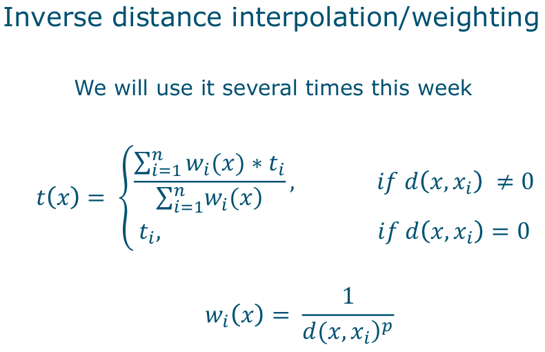
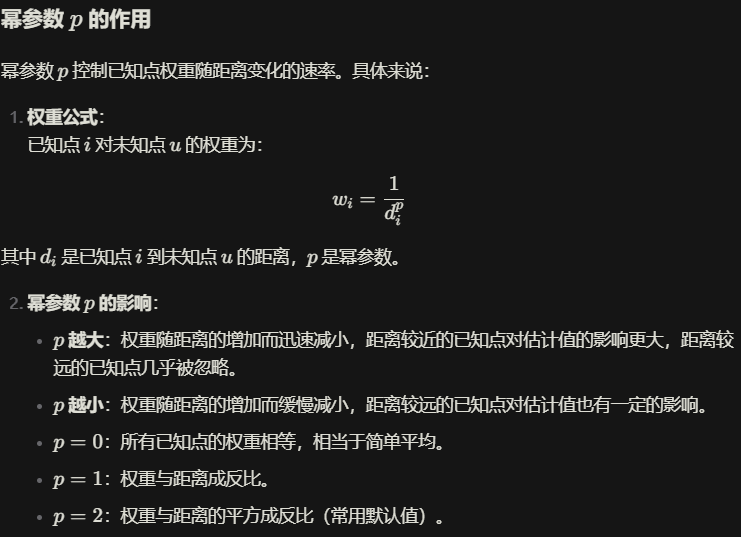

+++
title = 'final_review_2'
date = 2025-03-06T11:30:21+01:00
draft = false
+++

[toc]

## 1. Locations of trajectory points in space

### Data cleaning

- Definition: Data cleaning involves preparing raw data for analysis by addressing issues such as formatting, redundancy, and errors.
- Key Steps:
    - Format Conversions: Ensuring data is in a usable format (e.g., converting GPS data into a spatial format).
    - Removing Redundant Points: Identifying and eliminating unnecessary data points (e.g., "wait points" in trajectory data).
    - Handling Obvious Errors: Filtering out anomalies, such as points that would require unrealistic speeds (e.g., >25 km/h).
- Example: Cleaning trajectory data from GPS tracking of animals or humans.

- 数据清洗是指通过对原始数据进行处理，解决格式、冗余和错误等问题，使其适合分析的过程。
- 关键步骤
    - 格式转换：确保数据处于可用格式（例如，将GPS数据转换为空间格式）。
    - 去除冗余点：识别并删除不必要的数据点（例如，轨迹数据中的“等待点”）。
    - 处理明显错误：过滤掉异常点（例如，速度超过25 km/h的不合理点）。
- 示例：清理来自动物或人类GPS跟踪的轨迹数据。

### Where locations concentrated?

**活动范围（Home Range）**

- 定义：
活动范围是指动物周期性生活和移动的区域。它与领地概念相关，领地是动物主动防御的区域。活动范围的概念由W. H. Burt于1943年提出，他绘制了地图，显示动物在不同时间被观察到的位置。

- 问题与解答：
    - 我们计算了各个活动范围的并集，这代表了什么？
        - 并集代表了所有个体活动范围的综合区域，即这些动物可能共同覆盖的总区域。
    - 我们也可以计算所有点的凸包，这是一个好主意吗？
        - 计算凸包可以快速得到一个包含所有点的最小凸多边形，但它可能过于简化，无法反映动物实际活动的复杂性（例如，忽略地形或障碍物的影响）。因此，凸包在某些情况下可能不够精确。

**熊是否选择了它们的位置？**

- 方法：
    - 比较凸包并集内测量点的DEM衍生物与凸包内所有点的DEM衍生物。
- 问题与解答：
    - 这是一个好主意吗？（优缺点？）
        - 优点：简单直观，可以快速比较不同区域的DEM特征。
        - 缺点：可能忽略空间异质性或局部特征。
    - 替代方法？
        - 使用核密度估计、缓冲区分析或潜在路径区域（Potential Path Area）。
    - 分布是否不同？如何测试？
        - 可以使用非参数检验（如Kolmogorov-Smirnov检验）或自举采样（bootstrap sampling）来比较分布。
    - 对预测有多大用处？
        - 如果分布显著不同，DEM衍生物可以作为预测熊位置的有用变量。

**2D核密度估计**

- 定义：
    - 核密度估计是一种用于估计数据点分布密度的方法，特别适用于空间数据。
- 关键点：
    - 密度的总和是否考虑了单元格大小？
        - 是的，可以通过global(densRast, sum) * 300^2计算总密度。
    - 双变量（x, y）概率密度：
        - 核密度估计生成一个双变量概率密度函数，反映数据点在空间中的分布。
    - 核带宽：
        - 使用适合高斯分布的“经验法则”带宽。

**训练树分类器（CART, rpart）**

- 定义：
    - CART（分类与回归树）是一种递归划分数据的方法，将数据分为具有更高纯度的分支。
- 关键点：
    - 贪婪算法：
        - 在每一步选择最优划分，但不保证全局最优。

**交叉验证的优缺点**

- 优点
    - 充分利用数据，尤其适用于小数据集。
    - 评估结果更稳定，减少随机划分带来的偏差。
    - 帮助选择最佳模型和参数。
- 缺点
    - 计算成本较高，尤其是k较大或数据集较大时。
    - 对于时间序列数据，标准交叉验证方法可能不适用。

### Are preferred sites related to landscape features?

### Meijles et al. (2014) paper

## 2. Trajectories as linear features + time

### Do they intersect?

## 3. Space-time integration of trajectory data

### How can space and time be jointly represented?

### May two objects have met given a sparse set of control points? → alibi query

**问题1：如何利用时空棱镜和alibi query分析熊的轨迹数据？**

1. **时空棱镜的应用**：
   - 时空棱镜可以描述熊在给定时间预算内的可能移动范围。
   - 通过构建每只熊的时空棱镜，可以分析它们在时间和空间上的潜在路径。

2. **查找相交的时空段**：
   - 分析不同熊的时空棱镜，查找是否存在时间重叠（temporal overlap）且空间相交的段。
   - 这些相交段可能表明两只熊在同一时间和地点出现过。

3. **应用alibi query**：
   - 对选定的相交段应用alibi query，判断两只熊是否可能在同一时间和地点出现。
   - 如果两只熊的时空棱镜没有重叠，则可以证明它们不可能在同一时间和地点出现（即alibi成立）。

**问题2：如果某些子空间无法到达（如建筑物、陡坡或深谷），时空棱镜会如何变化？**

1. **受限环境的影响**：
   - 如果某些区域无法到达（如建筑物、陡坡或深谷），时空棱镜的形状会发生变化。
   - 这些不可达区域会“切掉”原本完整的棱锥形时空棱镜，形成**粗糙时空棱镜（Rough Space-Time Prisms）**。

2. **文献支持**：
   - Delafontaine等（2011）提出，在受限环境中，时空棱镜不再由两个完整的圆锥组成，而是部分被“切掉”。
   - 这种方法更符合实际环境，能够更准确地描述物体的移动范围。

3. **PPA的变化**：
   - 如果不考虑可达性，潜在路径区域（PPA）是一个完整的椭圆形。
   - 如果考虑可达性，PPA会因障碍物的存在而被“切掉”部分区域。

**问题3：我们对生命线（lifeline）的起点和终点是否确定？这对alibi query有何影响？**

1. **起点和终点的不确定性**：
   - 由于**时钟误差**和**GPS误差**，生命线的起点和终点可能存在不确定性。
   - 这种不确定性会影响时空棱镜的构建和alibi query的结果。

2. **解决方法**：
   - 进行两次alibi query：
     - **内-内查询**：使用最保守的起点和终点。
     - **外-外查询**：使用最宽松的起点和终点。
   - 通过这两种查询，可以评估alibi query的可靠性。

**问题4：增加或减少中间时空点（改变粒度）会有什么影响？**

1. **增加时空点**：
   - 增加时空点会**缩小子空间**，使潜在路径空间更加精确。
   - 例如，增加GPS数据点可以更准确地描述物体的移动轨迹。

2. **减少时空点**：
   - **随意删除时空点**会**扩大子空间**，可能导致潜在路径空间的范围变大。
   - **选择性删除**：基于最大速度选择性删除时空点，可以在不影响模型精度的情况下简化模型。
   - 例如，删除那些在最大速度限制下不可能到达的时空点。

**动态连续场（Dynamic Continuous Fields）**

动态连续场是指在时间和空间上连续变化的变量场（如温度、湿度、辐射等）。这些场通常通过采样数据来构建，但由于采样方式的限制，可能存在部分观测数据。

1. **部分观测数据**：
   - **时间上的空间全覆盖采样**：例如遥感（RS）数据，在特定时间点对空间进行全覆盖采样，但时间分辨率可能较低。
   - **时空稀疏采样**：在空间和时间上进行稀疏采样，数据点分布不均匀。

2. **如何获取时空场**：
   - **时间实例上的空间全覆盖采样**：
     - 通常使用目标变量的代理数据（如卫星影像）。
     - 例如，通过一系列时间点的卫星影像构建动态场。
   - **时空采样（规则或不规则）**：
     - 通过一系列时空采样点，结合 **时空插值** 方法构建动态场。

**在何处进行时空采样？**

1. **采样目标**：
   - 如果依赖采样数据，我们需要从中提取尽可能多的信息。
   - 例如，在地统计学中，目标是 **最小化预测误差的方差**。

2. **信息的价值**：
   - 采样数据的价值取决于上下文。例如，在高风险区域（如核污染区），采样数据的价值更高。

**基于风险的空间采样（Risk-based Spatial Sampling）**
基于风险的采样是一种有目的的采样方法，旨在最小化分类错误的预期成本。以下是其核心思想：

1. **热点区域的重要性**：
   - 某些“热点区域”需要重点采样，例如：
     - 森林砍伐或其他土地覆盖变化区域。
     - 矿产或矿石富集区域。
     - 污染区域。
     - 动物疾病爆发区域。

2. **分类错误的成本**：
   - **假阴性错误（False Negative）**：
     - 地图中将目标区域错误地分类为非目标区域，这种错误通常成本较高。
     - 例如，漏掉一个污染区域可能导致严重的环境或健康问题。
   - **假阳性错误（False Positive）**：
     - 地图中将非目标区域错误地分类为目标区域，这种错误通常成本较低。
     - 例如，将一个非污染区域标记为污染区域，可能只会导致不必要的调查成本。

3. **有目的采样（Purposive Sampling）**：
   - 基于风险的有目的采样，旨在 **最小化分类错误的预期成本**。
   - 这种方法也可以应用于连续变量。

