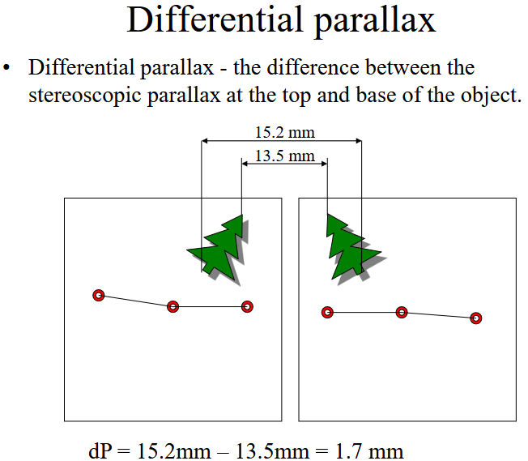

+++
title = 'AEO'
date = 2025-01-03T18:13:20+01:00
draft = false
+++

[toc]

## Photogrammetry

通过如今的“街景”功能，人们可以在决定去一家餐厅之前先使用现代化地图工具进行“侦察”，通过查看该地区的地标来实现更加准确的导航或模拟路途上的体验。

用于创建此类 3D 视图的技术叫作摄影测量，其通过捕捉并拼接图像信息以创建物理世界的数字模型。

摄影测量法分为两种：**航空摄影测量**和**地面摄影测量**。

**航空摄影测量**将相机置于空中，从高处拍摄照片。该方法通常用于较大或难以进入的区域。航空摄影测量是林业和自然资源管理方面使用最广泛的地理数据库创建方法之一。

**地面摄影测量/近景摄影测量**更侧重于对测量对象的聚焦，并且通常依赖于手持相机或固定在三脚架上的相机所拍摄的图像。这种方法能够快速采集现场数据，并捕捉到更加细节化的图像。 

#### Parallax 视差

视差是指从**两个不同的视角**观察同一个物体时，物体**表观位置**的**位移或差异**。这种位移是由于观察角度的不同而产生的，通常通过两条视线之间的**夹角**来测量。

把手指竖直放在前方，不要太远，然后依次只用一只眼睛观察手指，两次感觉到手指的位置会不一样，数学上把这个差异算了出来。这就是视差。

#### 重叠立体摄影（Overlapping Stereo Photography）

重叠立体摄影是指从不同角度拍摄同一场景的多张照片，且这些照片之间有部分重叠区域。这种重叠是生成**立体效果（3D效果）和计算视差（Parallax）**的关键。

为什么需要重叠摄影？

- 视差计算：通过重叠区域中的视差，可以计算出物体的深度或高度。
- 立体/3D视图：重叠照片可以用于生成立体图像，使观察者能够感知三维空间。
- 表面重建：在摄影测量学中，重叠照片是重建物体或地形表面的基础。

重叠率的要求

为了确保有效的立体摄影和3D重建，照片之间的重叠需要满足一定的比例：
- 前向重叠（Forward Overlap）：约60%
    - 指在飞行方向（或拍摄方向）上，相邻两张照片之间的重叠区域。
    - 60%的重叠率确保了足够的共同特征点，以便进行视差计算和3D重建。
- 侧向重叠（Sidelap）：约20-30%
    - 指在垂直于飞行方向（或拍摄方向）上，相邻照片之间的重叠区域。
    - 20-30%的重叠率确保了覆盖整个区域，避免遗漏。

### 立体摄影 Stereophotography 

立体摄影是指通过从**不同角度**拍摄同一场景的**重叠照片**（通常是成对的照片），利用这些照片之间的差异来重建三维空间或物体的表面形状。

不同角度的特征（Same Features from Different Angles）：
- 同一物体或场景在不同照片中会呈现出不同的视角和变形。
- 这种变形是由于相机位置和角度的变化引起的。

#### Inner Orientation（内方位元素）& Exterior Orientation（外方位元素

在摄影测量学和计算机视觉中，**Inner Orientation** 和 **Exterior Orientation** 是两个重要的概念，它们的中文翻译如下：

**1. Inner Orientation（内方位元素）**
- **中文**：**内方位元素** 或 **内部定向**
- **定义**：内方位元素描述了相机的**内部几何特性**，包括相机镜头的光学中心和成像平面之间的关系。
- **具体内容**：
  - **焦距（Focal Length）**：镜头到成像平面的距离。
  - **主点（Principal Point）**：成像平面的中心点，通常是光轴与成像平面的交点。
  - **镜头畸变参数（Lens Distortion Parameters）**：如径向畸变（桶形畸变、枕形畸变）和切向畸变。
- **作用**：内方位元素用于将照片中的像素坐标转换为相机坐标系中的坐标，是进行三维重建和测量的基础。

**2. Exterior Orientation（外方位元素）**
- **中文**：**外方位元素** 或 **外部定向**
- **定义**：外方位元素描述了相机在**世界坐标系**中的位置和方向，即相机的外部几何特性。
- **具体内容**：
  - **位置（Position）**：相机在世界坐标系中的三维坐标（X, Y, Z）。
  - **方向（Orientation）**：相机的旋转角度，通常用三个角度表示：
    - **俯仰角（Pitch）**：绕X轴旋转。
    - **偏航角（Yaw）**：绕Y轴旋转。
    - **滚动角（Roll）**：绕Z轴旋转。
- **作用**：外方位元素用于将相机坐标系中的点转换到世界坐标系中，从而确定物体在三维空间中的实际位置。

- **Inner Orientation（内方位元素）**：描述相机的内部几何特性，包括焦距、主点和镜头畸变。
- **Exterior Orientation（外方位元素）**：描述相机在世界坐标系中的位置和方向。

表面重建（Surface Reconstruction）：

- 通过分析照片中的特征点及其在不同照片中的位置变化，可以重建物体或场景的三维表面。
- 重建过程依赖于以下信息：
    - 已知的相机参数：如焦距、镜头畸变等。
        - 包括相机的内部参数，如焦距、镜头畸变系数、像素大小等
        - 这些参数通常通过相机校准获得，确保照片中的几何信息能够准确映射到三维空间。
    - 特征点在照片中的位置：特征点在不同照片中的位置变化反映了物体的三维形状。
        - 特征点是指照片中可识别的、具有独特性的点（如边缘、角点等）。
        - 这些特征点在不同照片中的位置变化（视差）用于计算物体的三维坐标。
        - 特征点的位置可能受到镜头畸变的影响，因此需要校正。
    - 相机相对于物体的位置和方向：相机的位置和角度决定了照片的视角和变形方式。
        - 相机的位置（X, Y, Z坐标）和方向（旋转角度，如俯仰角、偏航角、滚动角）决定了照片的视角。
        - 这些信息用于将二维照片中的特征点映射到三维空间。
    - 相机之间的相对位置和方向（Position and Orientation of Cameras with Respect to Each Other）：
        - 如果使用多台相机或从不同位置拍摄，相机之间的相对位置和方向也需要已知或估计。
        - 这些信息用于计算不同照片之间的几何关系，从而重建三维表面。

表面重建的过程

1. 特征点检测与匹配：
    - 使用算法（如SIFT、SURF）检测照片中的特征点，并匹配不同照片中的相同特征点。
2. 相机参数估计：
    - 通过特征点的匹配关系，估计相机的内部参数和外部参数（位置和方向）。
3. 三角测量（Triangulation）：
    - 利用特征点在不同照片中的位置和相机参数，计算特征点的三维坐标。
4. 生成点云和网格：
    - 将所有特征点的三维坐标组合成点云（Point Cloud），然后通过三角化生成网格（Mesh）。
    - 最后，可以为网格添加纹理，生成完整的三维模型。

#### 航空摄影中的误差来源 Aerial Photographs

**1. 镜头畸变（Lens Distortion）**
- **问题**：镜头畸变会导致照片边缘的物体发生变形，尤其是在广角镜头中更为明显。
- **表现**：
  - **桶形畸变（Barrel Distortion）**：图像边缘向外膨胀。
  - **枕形畸变（Pincushion Distortion）**：图像边缘向内收缩。
- **影响**：畸变会影响照片的几何精度，特别是在边缘区域。

**2. 相机倾斜（Camera Tilt）**
- **问题**：相机在拍摄时并不总是完全垂直向下（即不总是指向天底点）。
- **表现**：
  - 相机可能有一定的俯仰角（Pitch）或滚动角（Roll）。
- **影响**：
  - 倾斜会导致照片中的物体位置发生偏移，影响测量的准确性。
  - 需要通过校正来消除倾斜的影响。

**3. 飞行中的高度变化（Altitude Variation During Flight）**
- **问题**：在飞行过程中，飞行器的高度可能会发生变化。
- **表现**：
  - 高度变化会导致照片的**比例尺（Scale）**发生变化。
  - 例如，飞行器升高时，照片的比例尺会变小（即物体看起来更小）。
- **影响**：
  - 高度变化会影响照片的几何一致性，特别是在生成正射影像（Orthophoto）或数字高程模型（DEM）时。

**4. 地球曲率（Earth Curvature）**
- **问题**：在地球表面进行大范围航空摄影时，地球的曲率会影响照片的几何精度。
- **表现**：
  - 当比例尺为1:10000时，距离超过10公里时，地球曲率会导致高度差（dh）达到60厘米。
- **影响**：
  - 地球曲率会导致照片中的物体位置发生偏移，特别是在大范围摄影时。
  - 需要通过校正来消除地球曲率的影响。

**5. 大气畸变（Atmospheric Distortion）**
- **问题**：在大范围航空摄影（比例尺大于1:50000）时，大气条件（如折射、散射）会导致照片中的物体位置发生偏移。
- **表现**：
  - 大气折射会使光线发生弯曲，导致物体位置看起来与实际位置不一致。
- **影响**：
  - 大气畸变会影响照片的几何精度，特别是在高精度测量中。

**6. 比例尺变化（Scale Varies Across Photograph）**
- **问题**：由于上述所有因素（镜头畸变、相机倾斜、高度变化、地球曲率、大气畸变），照片中的比例尺可能会发生变化。
- **表现**：
  - 照片的不同区域可能具有不同的比例尺。
- **影响**：
  - 比例尺变化会导致照片中的物体位置和形状发生偏移，影响测量的准确性。

#### **视差位移（Parallax Shift）**
- **问题**：由于相机位置的变化，同一物体在不同照片中的位置会发生偏移，这种现象称为视差位移。
- **表现**：
  - 视差位移会导致物体在照片中的位置不一致。
- **影响**：
  - 视差位移会影响立体摄影和3D重建的精度，特别是在计算物体高度时。

航空摄影中的误差来源包括：
1. **镜头畸变**：导致照片边缘的物体变形。
2. **相机倾斜**：相机不垂直向下，导致物体位置偏移。
3. **高度变化**：飞行器高度变化导致比例尺不一致。
4. **地球曲率**：大范围摄影时，地球曲率导致高度差。
5. **大气畸变**：大气条件导致物体位置偏移。
6. **比例尺变化**：照片中不同区域的比例尺不一致。
7. **视差位移**：相机位置变化导致物体位置偏移。

这些误差需要通过**相机校准**、**几何校正**和**图像处理技术**来消除，以确保航空摄影的几何精度和测量准确性。

### 地形位移（Relief Displacement）

- 定义：地形位移是指由于地形高低起伏，物体在航空照片中的位置与其在平面地图上的位置不一致的现象。
- 原因：在航空摄影中，相机通常位于一定高度，当地形有高低变化时，物体的顶部和底部在照片中的位置会发生偏移。
- 表现：
    - 高处的物体（如山顶、建筑物）会向照片边缘“倾斜”或“偏移”。高处的物体离相机更近，因此在照片中显得更大，并且位置会向照片边缘偏移。
    - 低处的物体（如山谷）则相对较少偏移。低处的物体离相机更远，因此在照片中显得较小，位置偏移较少。

**地形位移的公式**

地形位移的大小可以通过以下公式计算：
$$
d = \frac{r \cdot h}{H}
$$
其中：
- $d$：地形位移的大小。
- $r$：物体在照片中到天底点（照片中心）的径向距离。
- $h$：物体的高度（相对于基准面的高差）。
- $H$：相机的飞行高度（相对于基准面的高度）。

相似三角形原理：
- 假设相机位于高度 $H$ 处，拍摄一个高度为 $h$ 的物体。
- 物体的顶部和底部在照片中的位置会有所不同，形成位移 $d$。
- 位移的大小与物体到天底点的距离$r$
- 根据相似三角形的原理，可以得到：
$$ \frac{d}{r}= \frac{h}{H}$$
  
**如何校正地形位移？**
- **正射校正（Orthorectification）**：
  - 通过数字高程模型（DEM）和相机参数，对航空照片进行几何校正，消除地形位移的影响。
  - 校正后的照片称为**正射影像（Orthophoto）**，具有地图的几何特性，没有地形位移。
- **使用地面控制点（GCPs）**：
  - 在地面上设置已知坐标的控制点，用于校正照片中的几何误差。

将三维物体的信息映射到二维平面上，称之为透视投影。( Such a mapping from three dimensions onto two dimensions is called perspective projection. )

[相机中的透视投影几何——讨论相机中的正交投影，弱透视投影以及透视的一些性质](https://fesianxu.github.io/2022/12/25/perspective-projection-geometry-20221225/)

而不是[ 计算机图形学基础（3）——观测变换 ](http://chuquan.me/2024/03/23/foundation-of-computer-graphic-03/)这种透视变换。

### Absolute stereoscopic parallax & Differential parallax

Adjacent but overlapping aerial photos are called stereo-pairs and are needed to determine parallax and stereo/3D viewing.

如何定向立体像对（stereopair）:

1. **定位主点（PP，Principal Point）**：
   - 主点是照片的光学中心或天底点（nadir），即相机镜头中心在照片上的投影点。
   - 通过连接照片的角框标（fiducial marks）来定位主点。通常，照片的四个角有框标，连接左上角（UL）和右下角（LR）的框标，以及右上角（UR）和左下角（LL）的框标，这两条线的交点就是主点（PP）。

2. **定位共轭主点（CPP，Conjugate Principal Point）**：
   - 共轭主点是相邻照片的主点。在立体像对中，每张照片都有一个主点，而相邻照片的主点就是当前照片的共轭主点。
   - 通过同样的方法在相邻照片上定位主点，这个点就是当前照片的共轭主点（CPP）。

3. **绘制飞行线**：
   - 连接当前照片的主点（PP）和相邻照片的共轭主点（CPP），这条线就是飞行线（flight line）。飞行线代表了飞机或无人机在拍摄时的飞行路径。

4. **对齐照片**：
   - 将两张照片对齐，使得当前照片的主点（PP）、共轭主点（CPP）、以及相邻照片的主点和共轭主点都位于一条直线上。这样做的目的是确保两张照片在空间上的相对位置正确，便于后续的立体观测和测量。

Absolute stereoscopic parallax  the average photo base length = average distance between PP and CP

**Differential parallax**
• Differential parallax - the difference between the stereoscopic parallax at the top and base of the object.

### Computing height using stereoscopic parallax

Computing height using stereoscopic parallax:
$h = (H') * dP / (P + dP)$
where 
- $h$ = object height
- $H'$ = flying height
- $dP$ = differential parallax
- $P$ = average photo base length

Alternate formulation: taken from one photo
$h = (H') * d / (r)$
where 
- $h$ = object height
- $H'$ = flying height
- $d$ = relief displacement from base to top
    - *same as dP*
- $r$ = distance from PP to top of object
    - *same as (P + dP)*

**Calculating Object Heights**

Object heights can be determined as follows:
- calculate flight altitude $(H')$ by multiplying the RF denominator by the focal length of the camera
-  $h = d * H' / r$ where:
    - $h$ = Object height
    - $d$ = length of object from base to top
    - $r$ = distance from P.P. to top of object

### 运动恢复结构（Structure-from-Motion, SfM）

### Match photos *SIFT*

### Gaussian Splatting

## LiDAR

