+++
title = 'Week 1'
date = 2025-03-12T22:57:28+01:00
draft = false
+++

[toc]

## 1. 卫星轨道力学

大多数卫星围绕地球以圆形轨道运行，但也有部分卫星以椭圆轨道运行。圆形轨道的形成是由于离心力与引力之间的平衡。这一平衡关系可以表示为：

$$
\frac{mv^2}{R} = \frac{Gm_Em}{R^2} \quad (1.1)
$$

其中，$v$ 是卫星的切向速度，$m$ 是卫星的质量，$G$ 是万有引力常数（$G = 6.673 \times 10^{-11} \, \text{N} \cdot \text{m}^2 \cdot \text{kg}^{-2}$），$m_E$ 是地球质量，$R$ 是轨道半径。通过解方程可以得到切向速度的表达式：

$$
v = \sqrt{\frac{Gm_E}{R}} \quad (1.2)
$$

根据轨道周期的定义，周期 $P$ 可以表示为：

$$
P = \frac{2\pi R}{v} = 2\pi \sqrt{\frac{R^3}{Gm_E}} \quad (1.3)
$$

公式 $1.3$ 表明，轨道半径越大，卫星的周期越长。如果卫星被放置到足够远的位置，其轨道周期可以与地球的自转周期相匹配。这样的卫星位于赤道平面内，以逆时针方向运行，其绕地球运行的速度与地球自转速度完全相同。因此，卫星将始终固定在地球上方的同一位置，形成**地球静止轨道**（Geostationary Orbit）。在习题 $1.1$ 中，你将推导地球静止轨道的高度。

用于观测大气的卫星主要运行在极地轨道或地球静止轨道。极地轨道卫星会飞越较高纬度地区，尽管卫星不一定直接经过两极。极地轨道卫星的高度通常低于 $2000$ 公里，这些卫星被称为**低地球轨道**（Low Earth Orbit, LEO）卫星。这类卫星以与轨道高度相关的周期性（如公式 $1.3$ 所预测）观测地球表面的一条带状区域（见下文术语表）。卫星的覆盖能力取决于轨道高度以及传感器的视场。

地球静止轨道（通常缩写为 GEO）能够详细观测大气现象的时间演变。如果轨道位于赤道平面内（如图 $1.1$ 所示），卫星将始终位于赤道上方的同一点，因此仪器可以持续观测地球。许多气象仪器以及通信卫星都运行在地球静止轨道上。

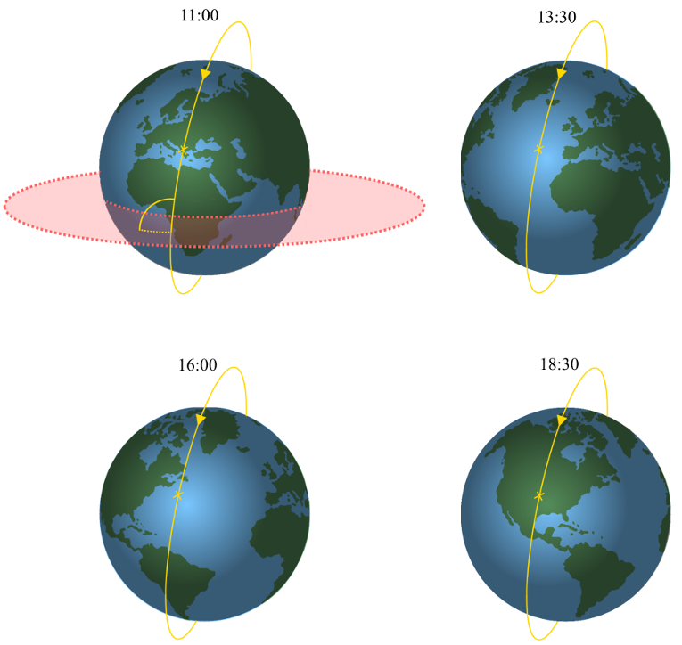

图 1.2：以太阳同步模式运行的极地轨道卫星（LEO）示例，卫星每天在同一本地时间穿过赤道。左上角的图表展示了倾角的概念，即轨道平面与赤道平面之间逆时针方向的夹角。时间以中欧时间（CET）给出。

地球静止轨道（通常缩写为 GEO）能够详细观测大气现象的时间演变。如果轨道位于赤道平面内（如图 $1.1$ 所示），卫星将始终位于赤道上方的同一点，因此仪器可以持续观测地球。许多气象仪器以及通信卫星都运行在地球静止轨道上。

极地轨道的一个重要特征是倾角，它决定了轨道向极地的延伸范围（如图 $1.2$ 所示）。倾角定义为轨道平面与赤道平面之间逆时针方向的夹角（$0^\circ$ 表示卫星沿赤道绕地球运行，$90^\circ$ 表示卫星从赤道直接飞向极地）。只有倾角大于 $90^\circ$ 的轨道才能覆盖整个地球。轨道的节点是指卫星穿过赤道的点。如果卫星在穿过赤道时向北移动，则该节点称为升交点；向南移动则称为降交点，如图 $1.2$ 所示。

轨道通常设计为卫星每天在同一本地时间穿过赤道。这对于需要散射阳光的仪器（包括大多数大气传感器）非常重要。这种轨道被称为**太阳同步轨道**，卫星轨道相对于太阳的位置始终保持不变。这并不意味着轨道在空间中固定不动，因为轨道必须精确移动以补偿地球绕太阳的旋转（每天约 $1^\circ$）。图 $1.2$ 展示了轨道如何移动或进动以提供这种补偿。这种进动机制是通过地球引力场的不均匀性实现的，因为地球并非完美的球体。大多数大气传感器都位于倾角为 $98^\circ$ 至 $100^\circ$ 的太阳同步轨道上。

在本课程中，我们将重点关注低地球轨道（LEO）中的卫星传感器，例如 TROPOMI（对流层监测仪）、臭氧监测仪（OMI）和红外大气探测干涉仪（IASI）。一个令人兴奋的最新发展是地球静止轨道上的新一代传感器，它们将从太空中提供关于大气成分的全新视角。这些传感器包括搭载在韩国 GK-2B 卫星上的地球静止环境监测光谱仪（GEMS，于 2019 年发射）、用于监测北美地区的对流层排放：污染监测卫星（TEMPO，于 2023 年 4 月发射），以及欧洲将于 2025 年 6 月发射的 Sentinel-4 传感器。

### 公式总结：

$$
\frac{mv^2}{R} = \frac{Gm_Em}{R^2} \quad (1.1)
$$
$$
v = \sqrt{\frac{Gm_E}{R}} \quad (1.2)
$$
$$
P = 2\pi \sqrt{\frac{R^3}{Gm_E}} \quad (1.3)
$$

## 2. 遥感数据的层级
卫星数据是一个非常广泛的概念。本课程的一个学习目标是让学生了解不同类别的卫星数据并学会使用它们。通常，卫星数据分为四个不同的类别。

大气成分的遥感测量通常与目标大气成分之间存在间接关系。当直接测量难度较大或成本较高时，会使用遥感测量，但代价是带来了复杂的解释问题，通常称为**反演问题**。大气科学中典型的反演问题是测量从大气中发出的电磁辐射，而所需的是某种大气成分的分布。

在卫星遥感中，遥感仪器直接测量的物理量通常被称为**一级数据（Level-1 Data）**，而目标大气成分（即关注的量）被称为**二级数据（Level-2 Data）**。数据层级之间存在明显的层次关系。对于大气科学家来说，原始测量数据的实用性低于反演得到的大气成分浓度。一级数据和二级数据的共同点是它们都是在仪器的空间分辨率、地理定位和观测时间上定义的。对于卫星仪器，这些通常被称为轨道一级数据和轨道二级数据。

大气科学家越来越重视卫星二级数据的内在科学价值，因为二级数据以高空间和时间分辨率提供了大气现象的信息。为了超越这些地理和时间参考的二级数据产品，这些数据可以被映射到统一的空间-时间网格尺度上，以便与大气模型模拟进行比较。通常，会生成二级数据产品的周期性摘要（每日、每周或每月）。这种网格化且有时经过时间平均的数据产品被称为**三级数据（Level-3 Data）**。为了进一步定量利用卫星数据，需要采用数据同化和反演建模（例如从大气浓度推断排放）等正式技术。当遥感数据与模型输出合并用于此类应用，并提供高度的完整性时，我们称之为**四级数据（Level-4 Data）**。

在本教材中，学生将接触到所有四个层级的卫星数据，描述它们之间的关系，并通过实例进行学习。为了帮助学生熟悉这一层级结构，我们将使用数学符号和指标，包括易于记忆的颜色方案，如表 $2.1$ 所示，并在本教材中贯穿使用。

#### 数据层级总结：
- **一级数据（Level-1 Data）**：遥感仪器直接测量的物理量。
- **二级数据（Level-2 Data）**：反演得到的目标大气成分浓度。
- **三级数据（Level-3 Data）**：网格化或时间平均的数据产品。
- **四级数据（Level-4 Data）**：遥感数据与模型输出合并后的高完整性产品。

## 3. 辐射

本章的学习目标是掌握电磁辐射的主要理论，以便你充分理解遥感传感器测量所涉及的细节，以及从一级数据（L1）到更高级数据产品所需的进一步处理步骤。在遥感仪器的实验设计中，电磁辐射以波的形式将信息从大气传递到观测者。我们通过眼睛检测到的光就是这样的波。电磁辐射的测量提供了遥感大气成分的基本测量数据，即一级数据（L1）。电磁波是由振荡的电荷产生的，这些电荷进一步产生振荡的电场。振荡电场的一个特点是它会伴随产生一个振荡的磁场，而磁场又会进一步产生振荡的电场。这些由振荡电荷引发的场从原始电荷向外传播，彼此相互产生。

### 3.1 电磁波谱
电磁理论预测，电磁波以唯一的速度 $c$ 传播，即光速（$3 \times 10^8, \text{m/s}$）。波的波长取决于电荷振荡的快慢（即频率）。我们将这个频率（每秒振荡次数）记为 $\nu$，其与 $c$ 的关系为：

$$
\nu = \frac{c}{\lambda}
$$

其中，$\lambda$ 是波的波长。例如，波长为 700 nm 的红光对应的频率为 $4.3 \times 10^{14}$ 次/秒，而波长为 400 nm 的紫光对应的频率为 $7.5 \times 10^{14}$ 次/秒。另一种描述辐射频率的方式是使用波数：

$$
\tilde{\nu} = \frac{1}{\lambda}
$$

波数是单位长度内波峰或波谷数量的度量。波长和波数是光谱学家及其他研究辐射与物质相互作用的实验测量中常用的度量。

紫外线（10-400 nm）和伦琴（或 X 射线，0.01-10 nm）辐射的波长更短，能量更高，这可以通过紫外线辐射对 DNA 的损害以及伦琴辐射在医学透视中的应用来证明。另一方面，红外辐射和无线电波的波长更长，能量更低。图 3.1 给出了光谱的各个部分及其常用术语。本课程所涉及的遥感技术通常关注从紫外线到微波和无线电波长区域的光谱部分，因为这些是来自太阳和地球的辐射与大气成分相互作用的谱域。

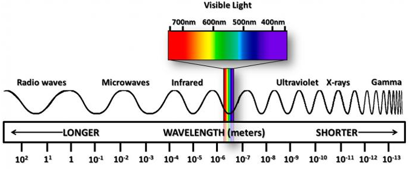

图 3.1： 电磁波谱显示频谱段及其关联的波长。

### 3.2 波的传播
图 3.2 展示了电磁波的快照，并说明了电磁波在传播过程中电场和磁场如何来回移动。一个完整波所覆盖的距离是辐射的波长 $\lambda$。在点 $x \pm \lambda$ 处的场强与点 $x$ 处的场强相同。我们得出结论，形式为 $\vec{E} = f(x \pm ct)$ 的数学表达式足以描述沿 $x$ 方向传播或重复的物理情况。

麦克斯韦方程（一组耦合的偏微分方程，与洛伦兹力定律一起构成了经典电磁学、经典光学和电路的基础）的解正是这种形式的谐波：

$$
E = E_0 \cos k(x - ct)
$$

其中，$E_0$ 反映了波的振幅，波携带的能量与此振幅的平方有关。$k$ 被称为波数，但它与 $\nu$ 并不相同，因为它们用于不同的上下文；$k = 2\pi\nu$。$k$ 通常用于描述波的传播，而 $\nu$ 用于区分电磁波谱中的区域。公式 3.3 也可以写成：

$$
E = E_0 \cos(kx - \omega t)
$$

其中，$\omega = kc = 2\pi c / \lambda$ 是波的角频率（见公式 3.1），且 $\omega = 2\pi\nu$。

公式 3.3 中余弦函数的参数也具有特定的意义。它由函数 $\phi$ 表示：

$$
\phi = k(x - ct)
$$

并被称为波的相位。

遥感仪器测量不同波长光的强度（L1）。代数运算表明，波的振幅平方为：

$$
|E(x, t)|^2 = |E_0|^2
$$

对于所有的 $x$ 和 $t$，其值相同，因为波的振幅 $E_0$ 是恒定的。波传递的能量与 $|E_0|^2$ 相关，在传播路径上不会变化。只有波与物质的相互作用才会改变传播波的能量。正是通过波与物质的相互作用对能量的调制，最终被用于遥感大气成分。

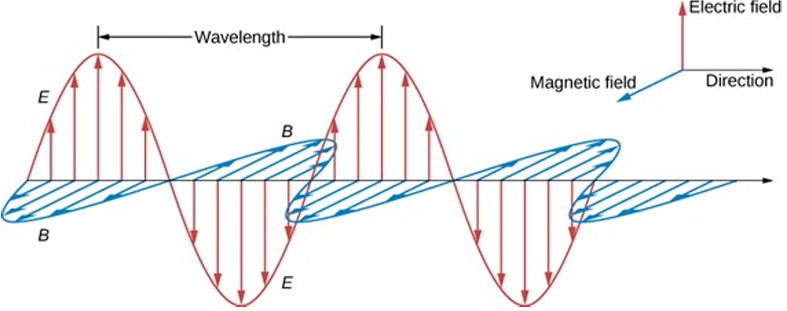

图 3.2：沿传播方向的时间谐波电磁波示意图x 轴。

### 3.3 电磁辐射的强度
本节简要讨论大气成分遥感中两个基本测量量——辐照度和辐射度的物理背景。

电磁波携带着电磁能量，传感器通过响应这种能量来检测它。能量的流动方向与波的传播方向一致，这一传播方向由电场 $\vec{E}$ 和磁场 $\vec{B}$ 的矢量叉积 $\vec{E} \times \vec{B}$ 定义（见图 3.2）。在自由空间中，垂直于某一表面单位面积单位时间内流动的能量由所谓的坡印廷矢量 $\vec{S}$ 给出：

$$
\vec{S} = c^2 \epsilon_0 \vec{E} \times \vec{B}
$$

其中，$\epsilon_0$ 是真空介电常数（见术语表）。单位时间的能量称为功率，因此 $\vec{S}$ 的国际单位是 $\text{W/m}^2$。电磁场的振荡速度非常快，因此在实际测量中，我们通常测量某一时间间隔内的平均值 $\langle S \rangle$，这一时间间隔与卫星探测器的特性相关。这一时间平均量称为辐射通量密度或辐照度，通常用符号 $I_0$ 表示，单位为 $\text{W/m}^2$。可以推导出辐照度通量为：

$$
I_0 = \frac{c \epsilon_0}{2} E_0^2
$$

（利用了余弦平方函数的时间积分等于 $\frac{1}{2}$ 的事实）。因此，电磁波携带的能量与电场的振幅平方成正比。

当光的流动方向不平行时，例如在点光源向所有方向辐射的情况下，或者当探测器收集的光被限制在某一方向范围内（由立体角 $d\Omega$ 指定，立体角是物体在探测器视角中的大小的度量），此时测量的量称为强度，也称为辐射度，定义为：

$$
I = \frac{\langle I_0 \rangle}{d\Omega}
$$

其单位为 $\text{W/m}^2 \cdot \text{sr}^{-1}$。接下来我们讨论立体角及其单位立体弧度（sr）。

辐射度是遥感仪器（L1）通常直接测量的量。换句话说，如果传感器测量辐射的强度，它是在其“可见”面积 $A$ 上进行的。立体角定义为该面积与距离 $r$ 的平方之比：

$$
\Omega = \frac{A}{r^2}
$$

立体角的单位是立体弧度（sr）。对于表面积为 $4\pi r^2$ 的球体，其（最大）立体角为 $4\pi \, \text{sr}$。微分立体角表示为：

$$
d\Omega = \frac{dA}{r^2} = \sin\theta \, d\theta \, d\phi
$$

其中，$\theta$ 是天顶角，$\phi$ 是方位角（见图 3.3）。通过练习 3.1，您将更熟悉立体角的概念。

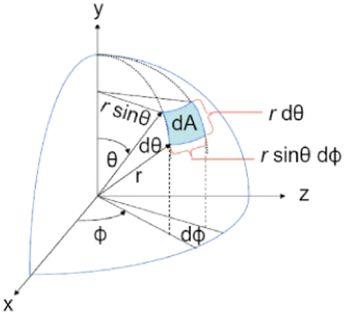

图 3.3：极坐标中微分立体角的示意图。微分立体角 dΩ = dA/r²，等于 sinθdθdϕ

### 3.4 辐照度与辐射度的关系
在轨卫星传感器通常测量从上方进入地球大气的辐照度（$\text{W/m}^2$）以及从下方离开大气的辐射度（$\text{W/m}^2 \cdot \text{sr}^{-1}$）。如你所见，这些量的物理单位并不相同。然而，对于许多应用来说，测量入射辐照度与出射辐射度之间的（无量纲）比值是非常有用的。这种比值称为反射率。你可以将其视为离开目标的光量与照射到目标的光量之比：

$$
R(\lambda) = \frac{\pi I(\lambda)}{\mu_0 I_0(\lambda)}
$$

其中，$I(\lambda)$ 是在某一立体角下测量的地球辐射度（星载探测器的尺寸是有限的），$\pi$ 是将辐射度积分到整个半球的因素，$\mu_0$ 是太阳天顶角的余弦值，用于考虑太阳光并非垂直照射目标，而 $I_0(\lambda)$ 是太阳辐照度。反射率是无量纲的。分子中的 $\pi$ 因子并不直观，但它可以从以下事实理解：卫星仪器仅测量其探测器立体角内的一小部分辐射强度。为了计算比值，我们需要总出射通量，这是通过对辐射度的向上分量 $I \cos\theta$ 在整个半球立体角（$\sin\theta \, d\theta \, d\phi$）内积分得到的。

### 3.5 平衡辐射与普朗克函数
电磁波的产生通常是由加速电荷引起的。任何物体都由大量分子组成，这些分子在连续频率范围内振荡，因此会发射所有频率的辐射。然而，辐射并非在所有频率下均匀发射，而是根据发射光谱分布，该光谱取决于物体的温度。

黑体（即表面吸收所有入射辐射的物体）的假设概念支持了对发射光谱的描述。考虑一个如图 3.5 所示的孤立腔体，其壁对所有辐射都是不透明的。腔体内壁粗糙且被涂黑，因此通过腔体壁上的小孔进入的辐射会被困在腔体内。当腔体壁吸收的辐射与发射的辐射完全相等时，孤立腔体将达到热力学平衡，此时平衡温度为 $T$。此外，在腔体内部，进入小孔的辐射与离开小孔的辐射达到平衡。通过分析从内壁（具有平衡温度 $T$）发射并通过小孔逃逸的辐射，可以得到该黑体的发射光谱。黑体发射的电磁波称为黑体辐射。黑体在物理上可以通过腔体辐射器壁上的一个小孔实现。腔体壁会不断发射、吸收和反射辐射，直到达到平衡状态（只要温度保持恒定）。

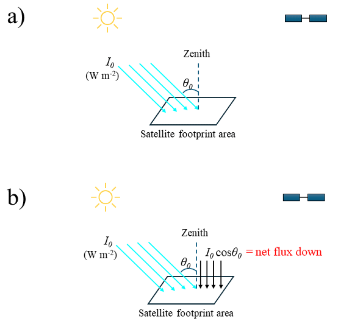
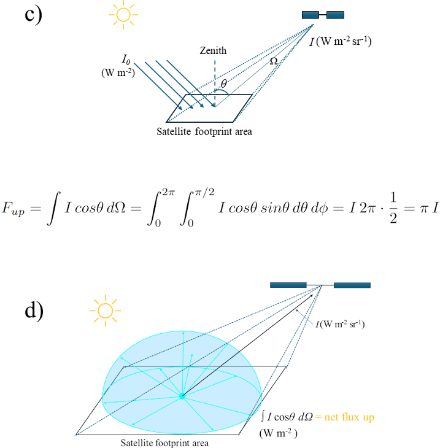

图 3.4：a）/b）：太阳通量（W m-2）撞击地球大气层的概念草图在太阳天顶角θ0 处。（蓝色）。b）是击中“目标”的光量从上方（黑色）。c）/d）：地球大气辐射的概念草图在探测器（W m-2 sr-1）观察到的视场顶角θ。d）显示向上半球（蓝色）上辐射的分量，即辐射量光线从目标正下方离开。卫星仅测量光线传播沿着黑色箭头。Fup 在 b)和 c)之间的计算显示了我们是如何进行计算的。通过将 I 乘以 π。

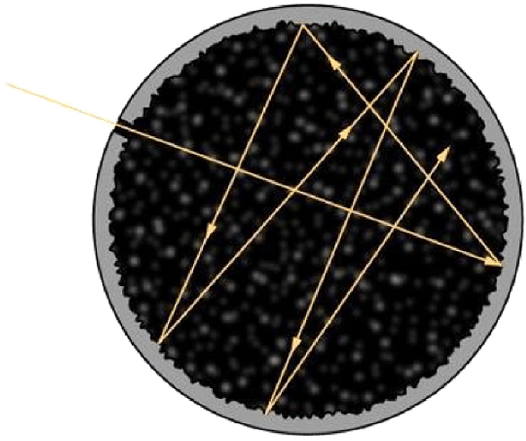

图 3.5：以一个小孔形式理想化的黑体表示墙体，称为腔体的封闭空间。来自 Branchetti, Cattabriga & Levrini (2019)。

### 3.5 普朗克的量子力学解释与黑体辐射
在量子力学对辐射的解释中，马克斯·普朗克提出，腔体壁（图 3.5）中的每个振荡器只能具有一组离散能量中的某一值，而不是能量可以取任何大于或等于 0 的值。振荡粒子的离散能级由下式给出：

$$
E = n h \nu
$$

其中，$n$ 是一个整数值，称为量子数，定义了振荡器允许的离散能量单位的数量。能量的基本单位与振荡器的频率成正比，比例常数 $h$ 称为普朗克常数。这些离散的能量包（或量子）在振荡器从一个量子化能态跃迁到另一个能态时，由腔体壁中的振荡器发射。基于这些论点，普朗克证明了以下关系式能够很好地描述黑体辐射（单位为 $\text{W/m}^2 \cdot \text{nm}^{-1} \cdot \text{sr}^{-1}$）：

$$
B_\lambda(T) = \frac{2 h c^2}{\lambda^5 (e^{h c / k_B \lambda T} - 1)}
$$

其中，$k_B$ 是玻尔兹曼常数（它给出了气体中粒子的能量与温度之间的关系，$k_B = 1.38 \times 10^{-23} \, \text{J/K}$），$T$ 是腔体壁的绝对温度。

图 3.6 展示了函数 $B_\lambda$ 的图形示例，即普朗克函数，针对四种不同温度。一般来说，物体温度越高，最大强度的波长越短。这被称为维恩位移定律，它是通过求普朗克函数的导数 $\frac{\partial B_\lambda}{\partial \lambda} = 0$ 推导出来的（从而确定辐射峰值对应的波长 $\lambda$，如图 3.6 中的深蓝色点所示），由此可得：

$$
T \lambda_{\text{max}} = 2898 \, \mu\text{m} \cdot \text{K}
$$

应用维恩定律意味着，在 $5000 \, \text{K}$ 时，最大发射位于可见光谱的绿色区域，并且在整个可见光谱范围内都有大量辐射发射。这种分布与太阳发射的波长分布相似。在 $300 \, \text{K}$ 时，最大强度出现在远红外波长约 $10 \, \mu\text{m}$ 处。然而，即使在这个温度下，辐射仍然在所有波长（包括可见光）发射，尽管强度通常太低，肉眼无法看到。

黑体辐射的另一个特征是，物体温度越高，给定表面积发射的总辐射量越大。这被称为斯特藩-玻尔兹曼定律，它是通过对 $B_\lambda$ 在所有波长上积分得出的：

$$
B_T = \int_0^\infty B_\lambda(T) \, d\lambda = \sigma T^4
$$

其中，$\sigma = 5.67 \times 10^{-8} \, \text{W/m}^2 \cdot \text{K}^{-4}$ 是斯特藩-玻尔兹曼常数，它描述了物质发射的热辐射强度与温度的关系。需要注意的是，公式 3.9 和公式 3.10 预测的是辐射源附近及其所有方向的辐射。通常，辐射会在远离源的地方被观测到，此时需要考虑感测辐射的立体角。

### 3.6 基尔霍夫定律
黑体辐射可以被视为平衡辐射。换句话说，在平衡条件下，物体的辐射能力与其吸收辐射的能力密切相关。其数学表述称为基尔霍夫定律：

$$
E_\lambda = \alpha_\lambda B_\lambda(T)
$$

其中，$E_\lambda$ 是发射的辐射，$B_\lambda(T)$ 是假设黑体的辐射，$\alpha_\lambda$ 是吸收系数，其值在 $0$ 到 $1$ 之间。吸收系数包含了发射辐射的物质类型的信息，因此在基于发射的传感方法中是一个重要参数。该系数的波长依赖性因发射辐射的物质类型和所考虑的电磁频谱部分而有显著差异。

基尔霍夫定律可用于表明，地球的温度远高于在没有大气层的情况下从能量平衡中获得的表面温度。这是因为大气在可见光部分（太阳发射的区域）是弱吸收体，而在红外部分（地球发射的区域）是强吸收体。因此，大气中吸收红外辐射的气体“捕获”了原本向外发射的红外辐射，并将这些辐射重新发射回地面。因此，地球表面接收到的辐射比没有大气层时更多，必须以更高的温度辐射：这就是温室效应。

在介绍了电磁辐射的基本原理、其强度（斯特藩-玻尔兹曼定律）、发射光谱（维恩定律）、辐照度与辐射度的区别以及发射率（基尔霍夫定律）之后，我们现在将利用这些知识来评估地球大气结构背景下遥感测量的具体细节，例如波长依赖性。

通过以下练习，您可以更好地理解遥感技术在哪些应用中使用短波长的辐射度（发射和反射的太阳光），以及在哪些应用中使用热遥感（基于地球发射的辐射）。

图 3.6：不同温度下的普朗克黑体曲线。该图的单位为：函数以 W m²sr⁻¹给出。蓝色线在曲线的极大值处相交描述维恩位移定律。来自 G. Popescu，《黑体辐射》，在《原理》中。生物光子学，第 2 卷，IOP 出版，2019 年。

**Exercise 3.1 Solid angle of the Moon**
(a) Calculate the solid angle of the radiation we see being reflected by a full Moon when viewed from the Earth. The Earth-Moon distance is $384000$ km, and the radius of the Moon is $1737$ km.
**解答：**
月球的表面积 $A_{\text{Moon}} = \pi r^2 = 9.48 \times 10^6$ km$^2$。立体角公式为：

$$
\Omega = \frac{A}{r^2} = \frac{9.48 \times 10^6}{384000^2} = 6.43 \times 10^{-5} \, \text{sr}
$$

**讲解：** 立体角是物体在观测者视角中的大小的度量，这里计算了从地球看月球的立体角。

(b) Which appears larger in the sky, the Moon or Sun? The Sun has a $6.8 \times 10^{-5}$ sr solid angle when viewed from Earth.
**解答：**
月球的立体角为 $6.43 \times 10^{-5}$ sr，略小于太阳的 $6.8 \times 10^{-5}$ sr，因此太阳在天空中看起来略大。

**讲解：** 通过比较立体角，可以判断天体在天空中的视觉大小。

(c) Using information from Exercise 1.2, calculate the solid angle of the GEMS sensor.
**解答：**
GEMS 传感器的立体角公式为：

$$
\Omega = \frac{A}{r^2}
$$

其中 $r = 35786$ km，$A = 22.2$ km$^2$，因此：

$$
\Omega = \frac{22.2}{35786^2} = 1.73 \times 10^{-8} \, \text{sr}
$$

**讲解：** 这里计算了 GEMS 传感器的立体角，反映了其观测范围的大小。

**Exercise 3.2 Short questions**
1. The unit of irradiance of light is:
(a) J m$^{-1}$
(b) J m$^{-2}$
(c) J s$^{-1}$ m$^{-1}$
(d) J s$^{-1}$ m$^{-2}$
**解答：** (d) J s$^{-1}$ m$^{-2}$
**讲解：** 辐照度的单位是 $\text{W/m}^2$，而 $1 \, \text{W} = 1 \, \text{J/s}$，因此答案为 $\text{J s}^{-1} \text{m}^{-2}$。

2. A student measures the irradiance of a lamp at a distance of $0.2$ m from the source. The light meter records $700$ W m$^{-2}$. Predict the irradiance at a distance of $0.5$ m from the source.
**解答：**
辐照度与距离的平方成反比，因此：

$$
I_2 = I_1 \times \left(\frac{r_1}{r_2}\right)^2 = 700 \times \left(\frac{0.2}{0.5}\right)^2 = 112 \, \text{W/m}^2
$$

**讲解：** 距离增加，辐照度减小，这是遥感中信号强度随距离变化的基本原理。

3. Look outside at three different areas of similar solid angle. Report which of these areas (or objects) provide the highest radiance.
**解答：** （学生需自行观察并报告结果）
**讲解：** 辐射度是单位立体角内的辐射通量，不同区域的辐射度取决于其反射或发射特性。

4. When calculating the effective temperature of the Earth, the Earth is usually viewed as a blackbody. However, the Earth only absorbs $72\%$ of solar radiation, so obviously the Earth is not a very good blackbody (which would absorb $100\%$ of all incoming radiation). Nevertheless, the assumption that the Earth emits as a blackbody is correct to within a few percent. How can you reconcile these two results?
**解答：**
地球吸收 $72\%$ 的太阳辐射，其余部分被云、冰和沙漠反射回太空。然而，未被云覆盖的区域（如海洋）具有低反照率，吸收大部分入射光，因此地球表面以接近黑体的方式发射辐射。

**讲解：** 地球的整体发射特性接近黑体，尽管其吸收率并非 $100\%$。

**Exercise 3.3 Physical structure of the Earth’s atmosphere**
(a) Sketch the change in atmospheric pressure as a function of altitude in the Earth’s atmosphere. Put pressure $p$ on the x-axis and altitude $z$ on the y-axis. Discuss briefly in which (vertical) section radiation is most likely to interact with the atmosphere.
**解答：**
大气压力随高度呈指数下降，辐射最可能与低层大气相互作用。

**讲解：** 低层大气密度高，辐射与大气相互作用的概率更大。

(b) Now sketch the change in atmospheric temperature as a function of altitude, with temperature $T$ on the x-axis. Discuss the main characteristics of the $T$-profile.
**解答：**
温度在对流层随高度下降，在平流层随高度上升，然后在更高层再次下降。

**讲解：** 地球表面白天加热最多，温度最高，随高度上升因绝热膨胀而冷却。

(c) Suppose the atmosphere consists of a slab near the Earth’s surface with a $T = 290$ K, and a slab at $12$ km has a $T = 220$ K. Calculate the total radiation emitted by both slabs. In what direction is the radiation emitted? Calculate at which wavelengths (in µm) the emitted radiation is maximum for the surface and for the $12$ km slab.
**解答：**
总辐射通量由斯特藩-玻尔兹曼定律给出：

$$
F = \sigma T^4
$$

对于地表层：

$$
F = 5.67 \times 10^{-8} \times 290^4 = 401.0 \, \text{W/m}^2
$$

对于 $12$ km 层：

$$
F = 5.67 \times 10^{-8} \times 220^4 = 132.8 \, \text{W/m}^2
$$

最大辐射波长由维恩位移定律给出：

$$
\lambda_{\text{max}} = \frac{2898}{T}
$$

对于地表层：

$$
\lambda_{\text{max}} = \frac{2898}{290} = 10 \, \mu\text{m}
$$

对于 $12$ km 层：

$$
\lambda_{\text{max}} = \frac{2898}{220} = 13.2 \, \mu\text{m}
$$

**讲解：** 辐射在所有方向上发射，最大辐射波长与温度成反比。

**Exercise 3.4 Infrared sensor in space**
(a) An infrared sensor aboard a meteorological satellite measures the outgoing radiation emitted from the Earth’s surface at a wavelength of $10$ µm. The viewing scene has a surface temperature of $300$ K. Assuming a transparent atmosphere, predict the radiation measured by the sensor.
**解答：**
根据普朗克函数计算：

$$
B_\lambda(T) = \frac{2hc^2}{\lambda^5 (e^{hc/k_B \lambda T} - 1)}
$$

代入数值后得到：

$$
B_\lambda(T) \approx 9.8 \, \text{W/m}^2 \cdot \mu\text{m}^{-1}
$$

**讲解：** 计算了传感器在 $10$ µm 波长处测量的辐射强度。

(b) Is $10$ µm a good choice to measure temperatures of around $300$ K, or would another wavelength be more appropriate? Use Wien’s law to motivate your answer.
**解答：**
根据维恩位移定律：

$$
\lambda_{\text{max}} = \frac{2898}{300} = 9.66 \, \mu\text{m}
$$

$10$ µm 接近 $9.66$ µm，因此是合适的。

**讲解：** 最大辐射波长与温度相关，$10$ µm 适合测量 $300$ K 左右的温度。

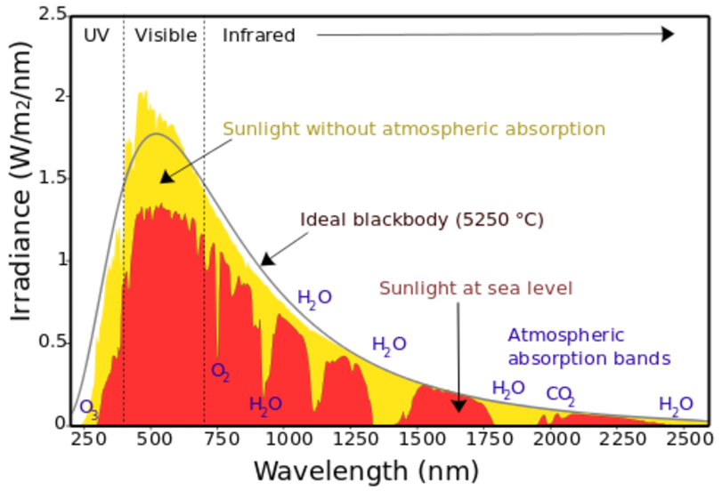

图 4.1：太阳光谱（黄色）以及大气吸收、散射和反射对 240 nm 至 2.5 µm 波长范围内地球表面辐照度（红色）的影响

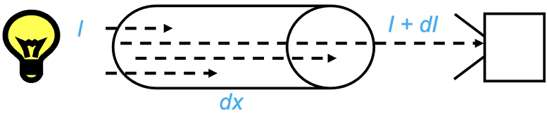

图 4.2：辐射通过介质向探测器传输。由于介质中的逐渐吸收和散射，辐射的强度 I 随距离 dx 而变化

## 4. 辐射与大气的相互作用（L1）

我们通过遥感测量推断大气信息的能力，离不开对电磁辐射与物质相互作用的理解，而这又离不开对大气中物质基本性质的理解。在这里，我们将讨论辐射在原子和分子层面上如何与物质相互作用，并重点关注地球大气中气体对辐射的吸收和散射。

请参考下图4.1。图中黄色曲线显示了太阳辐射在大气层外部的光谱辐照度，红色曲线显示了地球表面的光谱辐照度，涵盖了紫外-可见光-近红外光谱范围（我们稍后将讨论长波红外光谱）。显然，黄色曲线类似于高温黑体（$5250$ K）的普朗克曲线。地球表面的辐照度（红色值）相对于大气层顶部的辐照度显著降低，这表明太阳辐射通过吸收、散射和反射与大气和地球表面发生了相互作用。

### **4.1 辐射传输定义**
辐射传输是电磁辐射在介质中传播过程中能量转移的过程。它包括光的消光和发射过程。消光完全由吸收和散射描述（消光 $e = a + s$）。在散射过程中，辐射的方向发生改变，但辐射的强度保持不变。散射对短波长光（如紫外和可见光）非常有效，因为散射粒子（这里是空气分子）的尺寸与光的波长相近。这意味着散射对较长波长（如红外）不太重要，但对较短波长（如紫外和可见光）非常重要。

图4.2展示了朗伯-比尔定律，该定律指出，辐射与物质相互作用沿路径的强度变化与路径上的物质数量成正比，公式如下：

$$
dI = -\sigma n I(x) dx
$$

对公式$4.1$沿距离$dx$积分，得到朗伯-比尔定律的一般解，其中吸收截面$\sigma_a$或散射截面$\sigma_s$表示为：

$$
I(L) = I(0) e^{-n (\sigma_a + \sigma_s) L}
$$

---

### **4.2 柱密度**
公式$4.2$中的指数项也称为介质的**光学深度$\tau$**。这是一个无量纲量。$\tau$等于每个分子的吸收和/或散射截面（单位：$m^2$/分子）、吸收或散射路径长度$L$（单位：$m$）以及吸收和散射分子的平均数密度$n$（单位：分子/$m^3$）的乘积：

$$
\tau = \sigma L n
$$

公式$4.2$和$4.3$也可以写成另一种形式：$I(L) = I(0) T(0,L)$，其中$T$是所谓的**（单色）透射函数**，我们将在后续章节中使用。通过测量大气中某一水平（例如$L$）的辐射流，并结合沿同一方向入射辐射（例如$0$）的知识，可以获取透射率，并进一步推断出路径上特定气体的积分浓度。这是通过遥感仪器确定臭氧、水蒸气和二氧化氮（$NO_2$）柱密度的基本方法。

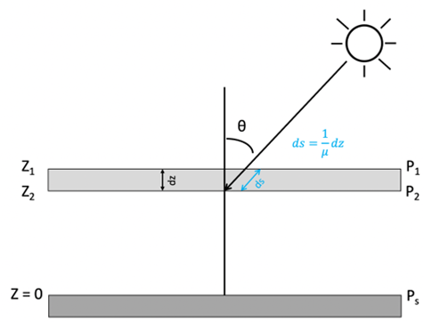

图 4.3：平面平行大气及倾斜路径与垂直路径的关系

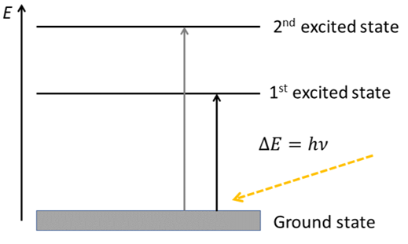

图 4.4：分子将吸收具有适当能量的光子，从较低状态转变为较高状态。这意味着原子或分子跃迁发生在与量子跃迁 hv 完全匹配的特定光子频率（波长）上。这种波长特定的吸收会导致暗线或透射率降低，这是该原子或分子独特性质所特有的。

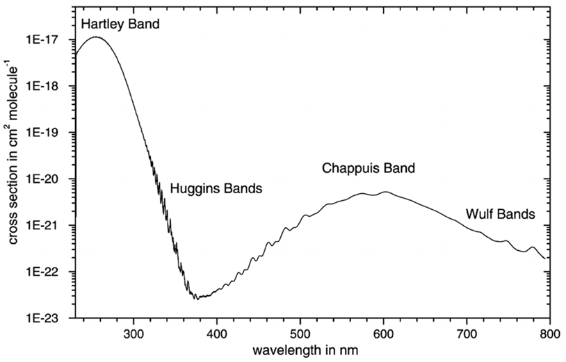

图 4.5：室温下测得的臭氧吸收截面光谱（Orphal，2002）。

倾斜或垂直柱密度可以直接从遥感仪器中推断。对于卫星测量，垂直柱密度$N_v$定义为从地球表面到大气层顶部（$TOA$）垂直积分的气体数密度（单位：分子/$m^2$）：

$$
N_v = \int_{0}^{TOA} n(z) dz
$$

通过物理单位分析可以验证，柱密度$N_v$可以表示为公式$4.3$中的$L$乘以$n$。

图$4.2$提供了一个简化的遥感设置示意图，图$4.3$则提供了更真实的描绘。通常将大气理想化为水平分层介质，并将光路相对于垂直方向定义。因此，沿与垂直方向倾斜角度$\theta$（天顶角）的倾斜路径的透射率$T(s_1, s_2)$与沿垂直路径的透射率$T(z_1, z_2)$的关系为：

$$
T(s_1, s_2) = T(z_1, z_2, \mu = \cos \theta) = e^{-\tau / \cos \theta}
$$

### **4.3 大气对辐射的吸收**
气体分子只有在辐射能量能够用于增加其内部能级时，才会吸收特定波长的辐射。这种内部能级以一系列电子、振动和旋转状态量化。通过跃迁到更高状态，可以实现内部能量的增加。

我们区分三种跃迁类型：
1. **电子跃迁**：电子移动到更高或更低的电子状态。这些跃迁通常需要紫外辐射（$<0.4$ µm）。
2. **振动跃迁**：需要近红外辐射（$0.7-20$ µm），对应于地球辐射峰值的波长范围。
3. **旋转跃迁**：需要远红外辐射（$>20$ µm）。

在可见光范围内，吸收很少发生，因为它介于电子跃迁和振动跃迁之间。吸收光谱在遥感中具有重要意义。吸收线是光谱指纹或条形码的一种形式，可用于识别地球大气的组成，也可用于识别遥远恒星和行星的组成。

吸收线的形状并非固定。线宽通常与大气压力和温度成正比，这是因为：
- **多普勒效应**：朝向或远离观测仪器运动的分子吸收的光频率与静止分子相比略有偏移。
- **压力展宽**：分子之间的碰撞减少了分子激发态的寿命，使得能量差异变得模糊。

### **4.3.1 臭氧**

臭氧的吸收是由于电子跃迁。最强的吸收发生在$200-300$ nm之间，称为哈特利带（Hartley bands），如图$4.5$所示，吸收截面值高达$10^{-17}$ cm²/分子。这些波段的吸收主要发生在大气上层（平流层和中间层，参见练习$3.1$）。$300-360$ nm之间的较弱波段具有更多的光谱结构（见图$4.5$），称为哈金斯带（Huggins bands）。在$450$ nm到$750$ nm之间的是查普伊斯带（Chappuis bands），其吸收强度远低于电磁波谱紫外部分的吸收带。

### **4.3.2 水汽**

除了臭氧外，水汽在从近红外光谱区域到远红外甚至微波区域的太阳光吸收中占据主导地位。这是由于$H_2O$的复杂振动-旋转吸收光谱，以及其在大气下层相对较高的浓度（有时高达$4\%$），远高于其他痕量气体如$CO_2$和$O_3$。

图$4.6$显示了与地球大气中水汽吸收相关的透射率。低透射率是由在相对平滑的背景吸收（称为连续吸收）之上的窄光谱线引起的。

### **4.3.3 二氧化碳**
$CO_2$分子的吸收光谱在大气遥感中具有重要意义。$CO_2$分子以四种不同的模式振动，这些模式分别称为对称伸缩模式、非对称伸缩模式和弯曲模式。

弯曲模式产生了热红外波段中最重要的带：$15$ µm $CO_2$带（见图$4.6$）。特别是非对称伸缩模式，因为它导致分子偶极矩的周期性变化，并且该模式在$4.3$ µm处“在红外波段活跃”。相比之下，对称伸缩模式在辐射上是不活跃的，因为它不会导致分子偶极矩的变化。非对称模式允许振动-旋转跃迁，从而在振荡器的基频中心产生一个大的吸收峰。$4.3$ µm波段位于太阳光谱的尾部，其对太阳吸收的影响可以忽略不计。此外，$CO_2$在太阳区域的$1.4$ µm、$1.6$ µm和$2.0$ µm处表现出一些弱组合带。较强的$2.7$ µm $CO_2$带与$H_2O$的$2.7$ µm带重叠，并贡献于平流层中太阳通量的吸收。

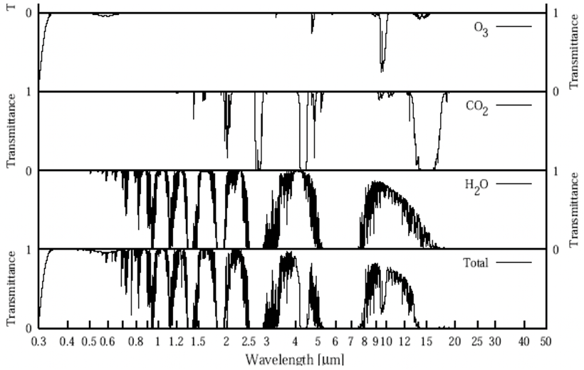

图 4.6：地球大气中主要吸收气体的透射光谱。透射率与文中使用的透射率相同。

### **4.4 大气分子散射**

光散射的一个重要物理定律是由瑞利（Rayleigh，1817年）发现的。他的研究结果解释了天空的蓝色。我们在这里通过瑞利定律的理论推导，获得对分子（通常是$N_2$和$O_2$）光散射行为的基本理解，即为什么散射强度与波长$\lambda$的负四次方（$\lambda^{-4}$）成正比，并且光在所有方向上散射，而不是沿一个或两个优先方向散射。瑞利散射的这些特性对于理解在紫外-可见光（UV-Vis）光谱范围内对痕量气体（如$O_3$和$NO_2$）和气溶胶的遥感至关重要，在这些范围内需要对瑞利散射进行校正。

考虑一个半径远小于入射辐射波长（$\lambda \gg r$）的小球形粒子。入射辐射产生一个均匀的电场$E_0$，称为外加电场。由于粒子非常小，外加电场在其上产生偶极子配置。由电偶极子引起的粒子的电场现在修改了粒子内部及其附近的外加电场，如图$4.7$所示。

粒子的偶极矩$p_0$（通过静电公式）可以写为$p_0 = \alpha E_0$，其中$\alpha$是粒子的极化率。外加电场$E_0$在固定方向上产生电偶极子的振荡。这个振荡的偶极子反过来产生一个平面偏振的电磁波，即散射波。散射电场与感应偶极矩的加速度和散射偶极矩$p$与观察者之间的夹角$\sin \gamma$成正比，与距离$r$成反比：

$$
E = \frac{1}{c^2} \frac{1}{r} \frac{\partial^2 p}{\partial t^2} \sin \gamma
$$

散射偶极矩可以写为$p = p_0 e^{ik(r - ct)}$，其中波数$k = \frac{2\pi}{\lambda}$。通过代入$p$和$p_0$，我们得到散射电场的表达式：

$$
E = -E_0 \frac{e^{-ik(r - ct)}}{r} k^2 \alpha \sin \gamma
$$

我们将电场矢量分解为正交分量，一个垂直于散射平面（$E_r$），另一个平行于散射平面（$E_l$）。然后可以分别写出两个电场分量$E_{0r}$和$E_{0l}$的散射：

$$
E_r = -E_{0r} \frac{e^{-ik(r - ct)}}{r} k^2 \alpha \sin \gamma_1
$$

$$
E_l = -E_{0l} \frac{e^{-ik(r - ct)}}{r} k^2 \alpha \sin \gamma_2
$$

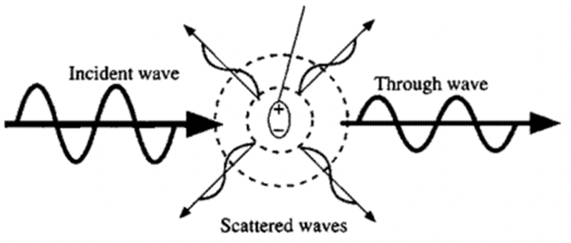

图 4.7：瑞利散射涉及小介电粒子或远小于光波长的区域的极化。场迫使粒子发生偶极振荡（通过使其极化），从而导致电磁波在“许多”方向上发射，从而使一部分光能远离入射光束。

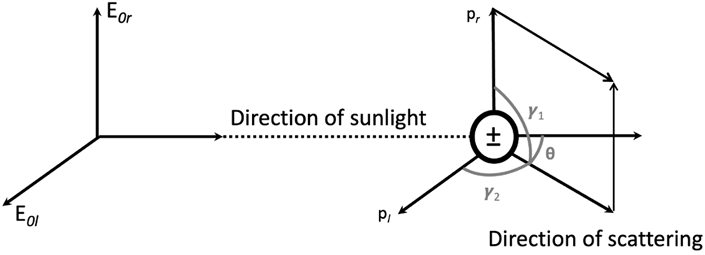

图 4.8：偶极子散射。入射电场是一个矢量，可以分解为平行和垂直分量，每个分量都经受偶极子散射。我们可以选择始终垂直于由入射光束和散射光束定义的散射平面的分量。

从图$4.8$中，我们得到$\gamma_1 = \frac{\pi}{2}$，$\gamma_2 = \frac{\pi}{2} - \theta$，其中$\theta$定义为散射角，即入射波与散射波之间的夹角。我们定义入射和散射辐射的强度分量（每单位立体角）为$I_0 = |E_0|^2$和$I = |E|^2$。因此，公式$4.8$可以表示为强度形式：$

$$
I_r = I_{0r} \frac{k^4 \alpha^2}{r^2}
$$

$$
I_l = I_{0l} \frac{k^4 \alpha^2 \cos^2 \theta}{r^2}
$$

其中，$I_r$和$I_l$分别是垂直于和平行于入射波与散射波所在平面的偏振强度分量，$\alpha$是粒子的极化率。对于非偏振太阳光入射到分子上，沿$\theta$方向的总散射强度为：

$$
I = I_r + I_l = (I_{0r} + I_{0l} \cos^2 \theta) \frac{k^4 \alpha^2}{r^2}
$$

对于非偏振太阳光，$I_{0r} = I_{0l} = \frac{I_0}{2}$，且由于$k = \frac{2\pi}{\lambda}$，我们得到瑞利最初描述分子散射非偏振太阳光强度的公式：

$$
I = \frac{I_0}{r^2} \alpha^2 \left( \frac{2\pi}{\lambda} \right)^4 \frac{1 + \cos^2 \theta}{2}
$$

因此，散射光的强度与入射光的强度、分子的极化率、入射光的波长（负四次方）以及散射角成正比。

公式$4.11$描述了小粒子（如分子）对非偏振辐射的散射强度。公式$4.11$预测的散射模式如图$4.9$所示。公式$4.9$表示的散射强度的偏振分量用虚线表示。组成入射辐射的两个独立光束被分子以不等比例散射，最大差异出现在散射角为$90^\circ$时，此时平行分量（$I_l$）完全消失。这样，原本非偏振的光通过散射变得偏振。分子散射的光不仅限于入射平面，而是发生在所有方位角方向上，因此是真正的三维分布（即图$4.9$实际上是三维分布的俯视图）。

### **4.5 大气气溶胶散射**
我们现在讨论气溶胶与分子在散射特性上的差异，以理解气溶胶散射的光谱依赖性及其为什么在优先方向上散射。大气气溶胶的这一特性与分子散射有根本不同，可用于区分在瑞利散射大气中气溶胶的存在。这也有助于理解为什么纯瑞利大气呈现蓝色，而含有气溶胶的大气呈现朦胧或白色。

为了区分瑞利散射（极小的分子）、气溶胶散射（小粒子）和更大物体（液滴、镜子）的散射，我们定义一个尺寸参数$x = \frac{2\pi a}{\lambda}$，其中$a$为粒子半径。表$4.1$列出了地球大气中不同尺寸参数值对应的散射范围。

瑞利散射关注$x \ll 1$时的散射事件，即粒子远小于光的波长。当$x \approx 1$时，散射事件称为洛伦兹-米氏散射。洛伦兹-米氏理论与上述瑞利散射的推导类似，区别在于气溶胶粒子远大于分子，因此不仅包含一个，而是许多受入射辐射影响的振荡偶极子。多个偶极子散射的辐射强度可以近似为$I_1 + I_2 + \dots + I_n$的叠加，其中每个单独贡献都满足公式$4.11$，但组合后导致散射辐射在前进方向（$\theta = 0^\circ$）上更强烈。图$4.10$展示了非前进方向上的散射辐射是两个具有不同相对相位差的波叠加的结果（这些波倾向于相互抵消）。然而，前进方向是特殊的，因为观察到的场保持同相。因此，大粒子的散射主要集中在前向方向，且随着粒子尺寸的增加而更加明显。

粒子越大，散射越集中在前向方向。气溶胶散射强度随方向的变化由下式给出：

$$
I(\theta) = I_0 \left( \frac{\sigma_s}{r^2} \right) \frac{P(\theta)}{4\pi}
$$

其中，$I_0$是入射（非偏振）强度，$P(\theta)$是描述散射能量角度分布的相位函数，它是一个无量纲参数，在相关角度（散射角$\theta$和方位角$\phi$）上积分归一化为$1$。$r$是粒子与观察者之间的距离，$\sigma_s$是散射截面。散射截面可以从洛伦兹-米氏理论推导出（此处不展开，如有兴趣可参考Liou, 2000），其表达式为：

$$
\sigma_s = Q_s \pi a^2
$$

其中，$a$是粒子半径，$Q_s$是无量纲散射效率。$Q_s$是单粒子散射效率，定义为单粒子散射截面$C_s$（$m^2$）除以粒子的横截面积$a$（$m^2$）。对于瑞利情况（$x \ll 1$），$Q_s$与$x^4$成正比。但对于$a \approx 0.1$ µm的气溶胶（$x > 1$），散射效率对波长的依赖性较小，而对粒子半径的依赖性更大。图$4.11(b)$显示了绿色光（$\lambda = 0.5$ µm）被球形水粒子散射的效率随粒子尺寸的变化。散射在粒子半径对应于辐射波长时达到最大。由于这些散射特性，大气中的气溶胶粒子使天空显得更白。一个有趣的结果是，对于大尺寸参数，散射效率接近$2$，即粒子的效果比基于几何考虑预期的强$2$倍。

气溶胶粒子也可能吸收辐射。单次散射反照率定义为：

$$
\omega = \frac{Q_s}{Q_{ext}} = \frac{Q_s}{Q_s + Q_a}
$$

它衡量散射（$Q_s$）对总消光（$Q_s + Q_a$）的贡献。单次散射反照率常用于遥感中以表征气溶胶类型，气溶胶混合物的单次散射反照率范围从灰尘和烟灰的$0.8$到城市气溶胶污染的$>0.98$。

### **4.6 云滴和冰晶的大气散射**
由非常大粒子（如云滴，$x \gg 1$）引起的大气散射由几何光学定律描述。在这一公式中，光线的传播方向通过局部反射和折射过程改变。图$4.12$说明了在几何光学中起作用的多种过程。

在Meirink博士（KNMI）的客座讲座中，您将了解云的遥感及其特征。图$4.11$的目标之一是说明气溶胶的散射特性，特别是非常大的液滴（$10$ µm，不再归类为气溶胶）优先在前向方向上散射光。然而，并非所有云粒子都是液滴。云中也可能包含六边形或柱状的固体粒子（冰晶），它们与液滴散射光的方式不同。如图$4.13$所示，对于可见光，水滴的侧向散射（$\theta \approx 90^\circ$）接近零，但冰粒子确实会侧向散射光。冰的这些不同散射特性也导致云滴和冰晶的单次散射反照率（公式$4.14$）不同，这在卫星从太空反演云时被利用。例如，对于$1.6$ µm和$3.8$ µm的入射光，冰晶的单次散射反照率低于水滴，表明它们散射入射光的效率低于水滴，这导致卫星传感器在水云上空检测到的光比在冰云上空多得多，如图$4.14$所示。

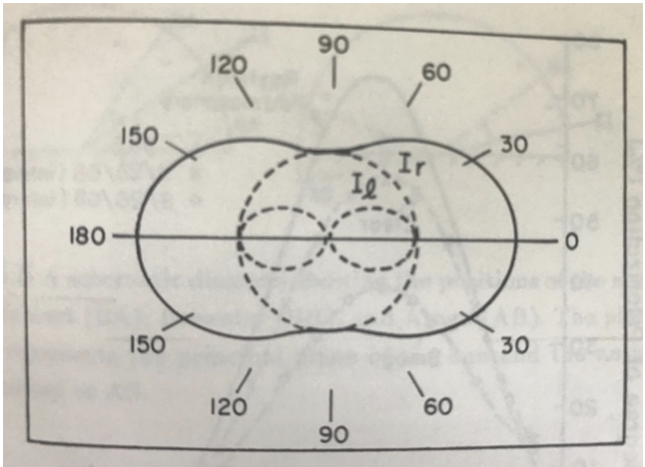

图 4.9：瑞利粒子（例如分子）对非偏振入射辐射的散射图样。平行（Il）和垂直（Ir）分量显示为虚线。实线表示平行 + 垂直分量的组合散射图样。很明显，瑞利粒子几乎向所有方向散射光。

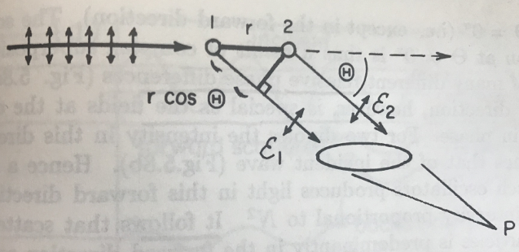

图 4.10：两个孤立的偶极子向各个方向发射波。在远离粒子（由这两个偶极子组成）的某个点 P 处，这些波叠加形成沿 θ 方向的散射波。这些波会根据它们的相对相位差 δϕ 发生相长或相消干涉。

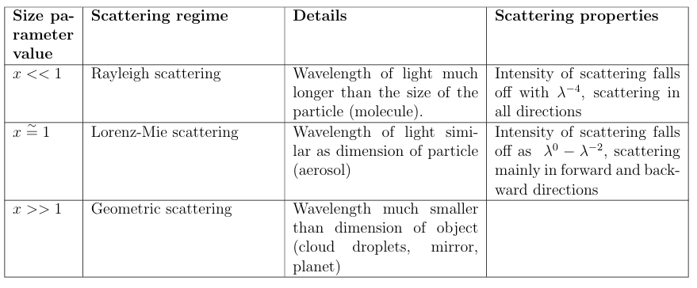

表Ⅰ. 不同尺寸的大气物体的光散射状况 a。

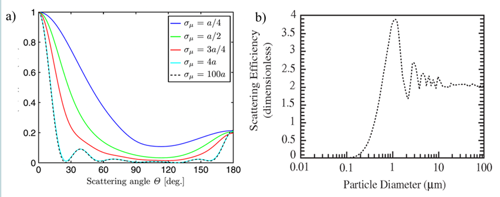

图 4.11：(a) 球体（气溶胶）散射的辐射的归一化强度（y 轴）。在此示例中，球体半径 a = 1λ，球体的折射率 n = 2。粒子越大，前向散射越强。来自 Fischer 等人的《Mie 散射中的相干效应》，J. Opt. Soc. Am. A.，29(1)，2012。(b) 液态水球体对绿光（λ = 0.5µm）的散射效率与球体直径的关系。由于衍射，散射效率可能大于 1。改编自 Jacobson, M. Z., 《大气建模基础》。英国剑桥：剑桥大学出版社，1999 年

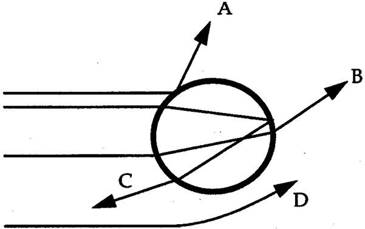

图 4.12：几何光学中辐射光束的散射：反射过程 (A)、折射过程 (B)、折射和内反射过程 (C) 以及衍射过程 (D)。摘自 Jacob，《大气化学导论》，1999 年。

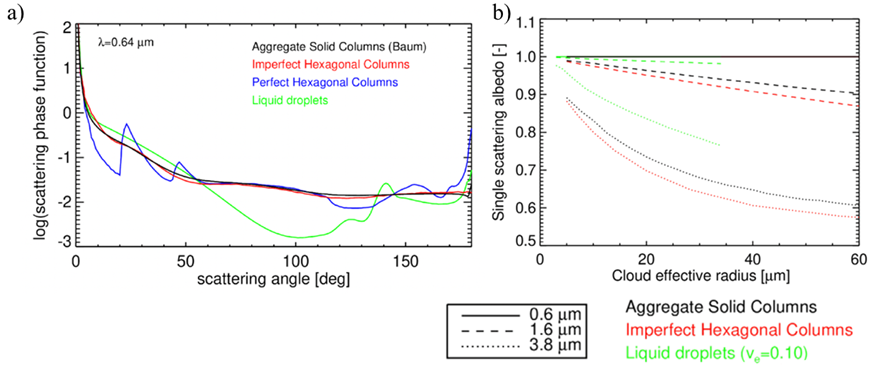

图 4.13：(a) 各种（固体）柱（冰晶）和水滴的散射相函数。光的波长为 0.64 µm，冰晶的（有效）半径为 10 µm，水滴的（有效）半径为 12 µm。来自 Meirink 和 Benas (2022)。

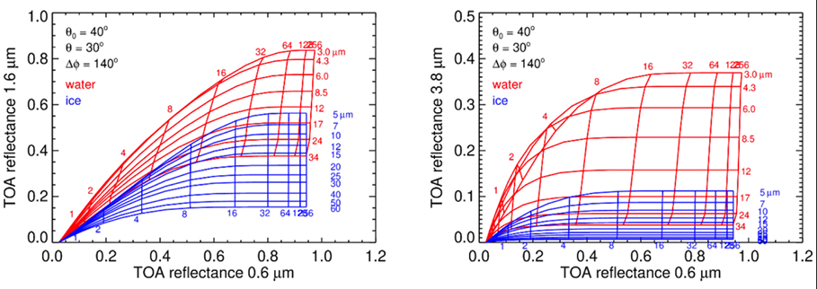

图 4.14：大气顶部反射率的辐射传输计算1.6 µm（左）和 3.8 µm（右）。图中标出了太阳天顶角、观测天顶角和相对方位角。图中垂直方向的线表示相等的云光学厚度，水平方向的线表示相等的颗粒大小。请注意两个图之间的不同 y 轴值。来自 Meirink 和 Benas (2022)。

