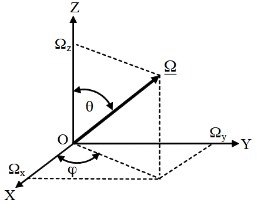

+++
title = 'RT'
date = 2025-01-11T14:25:05+01:00
draft = false
+++

Below are notes based on **Remote Sensing of Vegetation Leaf Area** part 1.1. 

A short list of as follows,

0. Radiometry 辐射度量学
    1. 这里面肯定是从辐射度量学角度更容易理解，也就是图形学。从遥感角度都进坑了。参考：
        1. [计算机图形学（三）——辐射度量学](https://zhuanlan.zhihu.com/p/389616851)
        2. [ 图形程序基础——辐射度学的一些基础概念和物理量 ](https://www.youtube.com/watch?v=eSQ2yH51x7s)
        3. [辐射度量学（Radiometry）、渲染方程（Rendering equation）和双向反射分布函数（BRDF）的小结](https://zhuanlan.zhihu.com/p/670380059)
        4. [（超详细！）计算机图形学 入门篇 9. 光追II: 辐射度量学与 Bidirectional Reflectance Distribution Function](https://zhuanlan.zhihu.com/p/466818755)
        5. 辐射物理量概念介绍
        6. 
1. Photon Transport Theory 光子输运理论 或者 Radiative Transfer Theory 辐射传输理论

## The Radiation Field and the Radiative Transfer Equation

1. 辐射场

光子：辐射场中的能量被假设为由称为光子的无质量中性点粒子携带。光子的能量$E$（以焦耳为单位）为$hv$，其中$h = 6.626176 \times 10^{-34} \, \text{J} \cdot \text{s}$（焦耳秒）是普朗克常数，$v$是光子频率（以秒$^{-1}$为单位）。频率与波长$\lambda$（以米为单位）的关系为$v = c/\lambda$，其中$c = 2.99792458 \times 10^8 \, \text{m/s}$是光速。光子在碰撞之间沿直线传播，并被视为点粒子，其位置由笛卡尔坐标系中的向量$\mathbf{r} = (x, y, z)$描述，传播方向由单位向量$\mathbf{\Omega} = (\Omega_x, \Omega_y, \Omega_z)$描述，$||\mathbf{\Omega}|| = 1$（图1）。在本书中，符号$||\mathbf{r}||$用于表示向量$\mathbf{r}$的长度，即$||\mathbf{r}||^2 = x^2 + y^2 + z^2$。我们还将使用极坐标系来指定单位向量$\mathbf{\Omega}$。$\mathbf{\Omega}$的笛卡尔坐标可以通过极角$\theta$和方位角$\varphi$表示为$\Omega_x = \sin \theta \cos \varphi$，$\Omega_y = \sin \theta \sin \varphi$，$\Omega_z = \cos \theta$（图1）。

光子分布的描述需要考虑光子在一个立体角范围内的传播方向。立体角是由从一个点（顶点）到闭合曲线上所有点的线段所包围的空间部分。圆锥是一个立体角的例子，它由从一个固定点到给定圆上所有点的线段所界定。立体角表示从顶点可以看到给定曲线上所有点的视角。

立体角的“大小”或“度量”是以顶点为中心的单位球面上被立体角截取的部分的面积。立体角的单位用球面度（sr）表示。对于一个面积为$4\pi$的单位球体，其立体角为$4\pi$球面度。在极坐标系中，微分立体角$d\Omega$截取了一个由极角$\theta$和方位角$\varphi$在区间$[\theta, \theta + d\theta]$和$[\varphi, \varphi + d\varphi]$内的点组成的区域。

类比平面角是圆的弧长与半径的比，立体角是投影面积S与球半径r平方值的比。单位用球面度表示。

一个完整球体的球面度是$4\pi$，而不是$4\pi r^2$。

1. **球面度（steradian，$sr$）** 是立体角的单位，用于描述三维空间中的角度范围。
2. **立体角的定义** 是基于单位球面的面积。单位球面的半径为1，其表面积为$4\pi$。
3. 一个完整球体所对应的立体角是$4\pi \, sr$，因为单位球面的总表面积为$4\pi$。

- 对于半径为$r$的球体，其表面积为$4\pi r^2$，但球面度是基于单位球面的，因此与半径无关。
- 立体角的计算公式为：
  $$
  \Omega = \frac{A}{r^2}
  $$
  其中：
  - $\Omega$ 是立体角（球面度），
  - $A$ 是球面上被截取的表面积，
  - $r$ 是球体的半径。

对于完整球体，表面积$A = 4\pi r^2$，因此：
$$
\Omega = \frac{4\pi r^2}{r^2} = 4\pi \, sr
$$

**图 1. 单位向量 $\underline{\Omega}=\left(\Omega_{x},\Omega_{y},\Omega_{z}\right)$ 的表示，$\|\underline{\Omega}\|^{2}={\Omega}_{x}^{2}+{\Omega}_{y}^{2}+{\Omega}_{z}^{2 }=1$，在笛卡尔坐标系和极坐标系中。这里 $\Omega_{x}$、$\Omega_{y}$ 和 $\Omega_{z}$ 是 $\underline{\Omega}$ 的笛卡尔坐标；$\theta$ 和 $\varphi$ 是极坐标系中对应的极角和方位角。**

**Particle Distribution Function 粒子分布函数：** 设 $f(r,v,\underline{\Omega},t)$ 表示密度分布函数，使得在时间 $t$ 时，位于点 $r$ 附近的体积元 $dr$（单位为 $m^{3}$）中，频率在 $v$ 到 $v+dv$（单位为 $s^{-1}$）范围内，且沿方向 $\underline{\Omega}$ 在立体角 $d\underline{\Omega}$（单位为 $sr$，见问题 3）内传播的光子数为

$$
{\rm dn}={\rm f\ dr\ dv\ d\underline{\Omega}}. (1)$$ 

在频域中，粒子分布函数 $f(x,v,\Omega,t)$ 的单位是每立方米每频率区间每立体角的光子数（$m^{-3} s sr^{-1}$）。在上述定义中，可以使用波长区间 $\lambda$ 到 $\lambda + d\lambda$（单位为米）来代替频率区间来定义粒子分布函数。因此，在波长域中，粒子分布函数的单位是每立方米每米每立体角的光子数（$m^{-4} sr^{-1}$）。

**Specific Intensity 比强度**：许多用于遥感的辐射测量设备对辐射能量有响应。因此，用光子传输的能量来表示粒子分布是很方便的。考虑一个体积元 $dr = d\sigma_\Omega dz$，其中底面积 $d\sigma_\Omega$（单位为 $m^2$）垂直于方向 $\Omega$，高度为 $dz$（单位为 $m$）。在该体积中沿方向 $\Omega$ 传播的光子数量取决于在时间区间 $t$ 到 $t + dz/c$ 内穿过 $d\sigma_\Omega$ 的光子数量，其中 $c$ 是光速，因为在时间间隔 $dt = dz/c$ 内光子传播的距离不超过 $dz$。方程 (1) 可以重写为 $dm = f d\sigma_\Omega c dt dv d\Omega$。由于一个光子的能量为 $h v$，因此在时间间隔 $dt$ 和频率区间 $v$ 到 $v + dv$ 内，穿过垂直于 $\Omega$ 的表面元 $d\sigma_\Omega$ 并在立体角 $d\Omega$ 内的辐射能量 $dE$（单位为焦耳）为

$$
dE = h v dm = c h v f(x,v,\Omega,t) d\sigma_\Omega dt dv d\Omega.
$$

光子传输的distribution of energy 能量分布由**specific intensity比强度**（或**radiance 辐射亮度**）给出，其定义为

$$
I(r, v, \Omega, t) = c h v f(r, v, \Omega, t).
$$

在频域中，其单位为 $J \, m^{-2} \, s^{-1} \, sr^{-1}$，在波长域中为 $J \, s^{-1} \, m^{-2} \, sr^{-1} = W \, m^{-2} \, sr^{-1}$。这里 $W$（瓦特，$1 \, W = 1 \, J \, s^{-1}$）是辐射功率的单位。

一些辐射测量设备会计算在一定时间间隔内撞击探测区域的光子数量。因此，用单位面积、单位时间、单位频率、单位立体角内通过的光子数来表示光子分布也很方便。这个量，即**光子强度**（单位为 $s^{-1} \, m^{-2} \, sr^{-1}$），是辐射强度与单个光子能量 $h v$ 的比值，可以通过粒子密度分布函数表示为

$$
I(r, v, \Omega, t) = c f(r, v, \Omega, t).
$$

在本书中，我们将使用**强度**作为基本的辐射度量，允许其定义中的两种可能性。如果在某一点上，比强度与$\Omega$无关，则称其在该点是**各向同性**的。如果强度既与$\underline{r}$无关，也与$\underline{\Omega}$无关，则称辐射场是**均匀且各向同性**的。需要强调的是，粒子分布函数$f$描述的是时间$t$时的光子，而比强度指的是在时间间隔$t$到$t+dt$内通过单位面积的辐射能量（光子数）。

**图 2**：一束光子以角度$\theta$入射到面积$d\sigma$上，$\underline{n}_{0}$为法线方向。这里$d\sigma_{\Omega}$是面积$d\sigma$在垂直于光子传播方向$\underline{\Omega}$的平面上的投影。其面积可以表示为$d\sigma_{\Omega} = d\sigma \cos\theta$。注意，$\cos\theta = \left|\underline{\Omega} \cdot \underline{n}_{0}\right|$，其中$\underline{\Omega} \cdot \underline{n}_{0}$是两个单位向量$\underline{\Omega}$和$\underline{n}_{0}$的点积。

**图 2** 展示了一个例子，其中一束强度为 $I$ 的光子以角度 $\theta$ 入射到面积 $d\sigma$ 上，$\underline{n}_{0}$ 是 $d\sigma$ 的法线方向。显然，穿过面积 $d\sigma$ 的光子数量与穿过其投影面积 $d\sigma_{\Omega}$ 的光子数量相同。因此，在时间间隔 $dt$ 内，频率区间 $\nu$ 到 $\nu + d\nu$ 内，穿过表面元 $d\sigma$ 并在立体角 $d\Omega$ 内传播的辐射能量（光子数）$dE$ 可以表示为

$$
dE = I(r, \nu, \Omega, t) \cos\theta \, d\nu \, d\Omega \, d\sigma \, dt. \quad (4)
$$

**辐射通量密度**：方程 (4) 给出了在频率区间 $\nu$ 到 $\nu + d\nu$ 内，穿过面积元 $d\sigma$ 的能量，其传播方向与法线 $\underline{n}$ 的夹角为 $\theta$，并且限制在立体角元 $d\Omega$ 内。所有方向上的净流量由下式给出：

$$
F(r, \nu, t) = \int_{4\pi} I(r, \nu, \Omega, t) \cos\theta \, d\Omega,
$$

其中积分在单位球面 $4\pi$ 的所有方向上进行。量 $F$ 称为点 $r$ 处的**净单色通量密度**，定义了单位面积和单位频率区间内辐射能量的流动速率。其单位在频域中为 $J \, m^{-2} \, s^{-1}$，在波长域中为 $W \, m^{-2}$。

净通量可以表示为相对于任意表面元 $d\sigma$ 的两个半球通量之和，即 $F_{\nu} = F_{\nu}^{+} - F_{\nu}^{-}$。这里 $F_{\nu}^{+}$ 和 $F_{\nu}^{-}$ 是 $d\sigma$ 两侧的单色通量密度，或单色辐照度，

$$
F_{\nu}^{+} = \int_{\Omega \cdot n > 0} I(r, \nu, \Omega, t) \, \Omega \cdot n \, d\Omega,
$$
$$
F_{\nu}^{-} = \int_{\Omega \cdot n < 0} I(r, \nu, \Omega, t) \, |\Omega \cdot n| \, d\Omega.
$$

总半球通量密度（单位为 $W \, m^{-2}$），或辐照度，对于所有频率（波长）可以通过在整个电磁频谱上对单色辐照度进行积分得到：

$$
F^{+} = \int_{0}^{\infty} F_{\nu}^{+} \, d\nu,
$$
$$
F^{-} = \int_{0}^{\infty} F_{\nu}^{-} \, d\nu.
$$

在面积 $A$ 上对辐照度进行积分得到总通量（单位为 $W$），或辐射功率：

$$
\Phi = \int_{A} F \, dA.
$$

对于**homogeneous and isotropic 均匀且各向同性**的辐射，强度 $I(r, \nu, \Omega, t) = I(\nu, t)$ 与角度和空间变量无关，上述量可以表示为：

$$
F_{\nu}(t) = \pi I(\nu, t),
$$
$$
F^{+}(t) = \pi \int_{0}^{\infty} I(\nu, t) \, d\nu,
$$
$$
F^{-}(t) = \pi \int_{0}^{\infty} I(\nu, t) \, d\nu.
$$

将这些量归一化为单个光子的能量 $h\nu$，可以得到相应的光子通量：

$$
F_{\nu, \text{photons}}(t) = \frac{\pi I(\nu, t)}{h\nu},
$$
$$
F_{\text{photons}}^{+}(t) = \pi \int_{0}^{\infty} \frac{I(\nu, t)}{h\nu} \, d\nu,
$$
$$
F_{\text{photons}}^{-}(t) = \pi \int_{0}^{\infty} \frac{I(\nu, t)}{h\nu} \, d\nu.
$$

