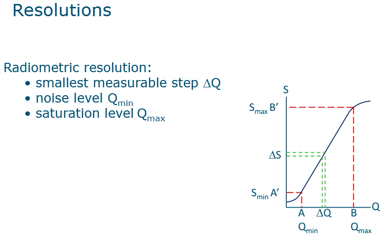

+++
title = 'Basic'
date = 2024-12-11T08:56:13+01:00
draft = false
+++

[toc]

## 1.惠更斯的波动理论和牛顿的粒子理论。

从历史背景看，这是光学发展初期的核心争议之一。惠更斯认为光是一种波动现象，强调了光的传播具有类似于水波的连续性。而牛顿则提出光由粒子组成，这种观点强调了光的离散性和运动的方向性。

这种对光本质的争议为后来的科学发展奠定了基础。从纵向上看，这种争议直到19世纪才因光的干涉和衍射实验被进一步解释；而从横向来看，这两种理论最终被量子力学所融合，形成了现代光的波粒二象性理论。

### 光的波动理论

波动理论认为光是一种电磁波，由相互垂直的电场（$E$）和磁场（$M$）组成，它们都与光的传播方向垂直。

1. **波速公式**：
$$c = \lambda \cdot \nu$$
   - $c$：光速，约为 $3 \times 10^8 \, \text{m/s}$。
   - $\lambda$：波长，单位为米（m）。
   - $\nu$：频率，单位为赫兹（Hz）。

**应用场景**：
波速公式用于描述光的传播特性。例如：
- 在遥感中，特定波长的电磁波用于分析不同目标的反射或吸收特性。
- 微波遥感（如雷达）利用长波长（低频）进行地表探测，而可见光遥感利用短波长进行图像分析。

2. **电磁波的振幅和相位**：
   电场强度的波动可以表示为：
$$E = A \cdot \cos(\omega t + \phi)$$
   - $A$：振幅，决定了波动的能量强度。
   - $\omega = 2\pi \nu$：角频率，反映了振动速度。
   - $\phi$：相位，表示波动在周期中的位置。

**应用场景**：
- 干涉测量中，利用光的相位信息来确定微小的位移或高度变化。例如，干涉合成孔径雷达（InSAR）测量地表形变。
- 振幅则反映了辐射强度，是能量的重要衡量指标。

---

### 光的粒子理论

粒子理论认为光是一种由光子组成的粒子流，每个光子的能量与其频率相关：

$$Q = h \cdot \nu$$

将波速公式 $c = \lambda \cdot \nu$ 代入，可以得到：
$$Q = \frac{h \cdot c}{\lambda}$$

- $Q$：光子的能量（单位：焦耳）。
- $h$：普朗克常数，约为 $6.626 \times 10^{-34} \, \text{Js}$。
- $\lambda$：波长。

**应用场景**：
粒子理论对高能光的分析至关重要，例如：
- 光电效应：高频光（如紫外线）照射金属表面释放电子。
- 遥感中短波红外到紫外区域：分析材料的能量吸收特性，用于识别矿物、植被健康状态等。

**联系**：
波动理论描述了光的传播特性，而粒子理论关注光的能量传递，二者在波粒二象性中得以统一。例如，在遥感应用中，光子的能量（粒子理论）决定了目标的光谱反射特性，而光波的波长和频率（波动理论）决定了传输过程中的衰减和散射。

---

### 热辐射及相关规律

1. **斯特藩-玻尔兹曼定律**：
$$M = \varepsilon \cdot \sigma \cdot T^4$$
   - $M$：总辐射出射度（单位：$W/m^2$）。
   - $\varepsilon$：发射率，反映物体表面对辐射的能力。
   - $\sigma$：斯特藩-玻尔兹曼常数，约为 $5.67 \times 10^{-8} \, \text{W/m}^2/\text{K}^4$。
   - $T$：绝对温度（K）。

**应用场景**：
- 在遥感中，通过测量目标的辐射强度 $M$，可以反算其温度 $T$，用于监测地表温度、植被蒸腾作用等。

**深入分析**：
- 发射率 $\varepsilon$ 接近 1 的材料是“黑体”，可以完全吸收和发射辐射。遥感中，水体的发射率较高（$\varepsilon \approx 0.95$），而沙漠发射率较低。

2. **维恩位移定律**：
$$\lambda_{\text{max}} = \frac{A}{T}$$
   - $\lambda_{\text{max}}$：辐射峰值波长（单位：$\mu$m）。
   - $A \approx 2898 \, \mu \text{m} \cdot \text{K}$：维恩位移常数。

**应用场景**：
- 通过峰值波长 $\lambda_{\text{max}}$，可以判断物体的温度。例如：
  - 地球表面温度（约 $300 \, \text{K}$）的辐射峰值在 $10 \, \mu \text{m}$ 附近（热红外范围）。
  - 太阳表面温度（约 $6000 \, \text{K}$）的峰值在 $0.5 \, \mu \text{m}$（可见光范围）。

---

### 单位 $Wcm^{-2}\mu m^{-1}$ 的解释及辐射图分析

辐射强度单位 $Wcm^{-2}\mu m^{-1}$ 表示每平方厘米表面、每单位波长（微米）范围内的辐射能量分布。辐射图展示了物体在不同波长范围内的辐射强度特性。

**辐射曲线分析**：
- 在短波（可见光和紫外线范围），辐射主要来自反射太阳辐射。
- 在长波（红外范围），辐射主要由目标的热辐射决定。

遥感中的应用：
- 通过分析短波和长波辐射的比例，可以区分不同地表类型。例如，植被在短波范围反射强，可用于植被指数（NDVI）计算；水体在长波范围辐射较强，可用于水温监测。

---

### 综合分析

1. **联系**：
   - 波动理论（$c = \lambda \cdot \nu$）和粒子理论（$Q = h \cdot \nu$）结合，解释了光的传播特性和能量特性。
   - 热辐射定律（斯特藩-玻尔兹曼定律和维恩位移定律）描述了目标辐射强度与温度的关系。

2. **应用结合**：
   - 在遥感中，波动理论用于分析光谱反射特性，而粒子理论用于解释光的能量吸收。热辐射定律则用于地表温度监测和热红外成像。
   - 例如，利用热辐射定律监测农田温度，结合短波反射光谱分析作物健康状态，可以全面了解农田生长状况。

### 1. **出射度的计算**

对于黑体辐射，出射度 $M$（单位：$W/m^2$）是根据斯特藩-玻尔兹曼定律计算的：

$$
M = \sigma \cdot T^4
$$

- $\sigma$：斯特藩-玻尔兹曼常数（约为 $5.67 \times 10^{-8} \, W/m^2/K^4$）。
- $T$：物体的绝对温度（单位：K）。

#### 对太阳：

太阳表面的温度约为 $T_{\text{solar}} = 6000 \, \text{K}$，出射度为：

$$
M_{\text{solar}} = \sigma \cdot T_{\text{solar}}^4
$$

#### 对地球：

地球表面温度约为 $T_{\text{earth}} = 300 \, \text{K}$，出射度为：

$$
M_{\text{earth}} = \sigma \cdot T_{\text{earth}}^4
$$

---

### 2. **峰值波长的计算**

使用维恩位移定律计算辐射峰值波长：

$$
\lambda_{\text{max}} = \frac{2898}{T}
$$

#### 对太阳：

$$
\lambda_{\text{max, solar}} = \frac{2898}{6000} \approx 0.48 \, \mu\text{m}
$$

峰值波长位于可见光区域。

#### 对地球：

$$
\lambda_{\text{max, earth}} = \frac{2898}{300} \approx 9.66 \, \mu\text{m}
$$

峰值波长位于热红外区域。

---

### 3. **地球物体的反射与发射**

对于地球表面的物体：

- **反射出射度**：由物体的反射率（$\rho$）与太阳出射度（$\sigma \cdot T_{\text{solar}}^4$）共同决定：

$$
M_{\text{reflected}} = \rho \cdot M_{\text{solar}}
$$

- **发射出射度**：由物体的发射率（$\varepsilon$）与地球出射度（$\sigma \cdot T_{\text{earth}}^4$）共同决定：

$$
M_{\text{emitted}} = \varepsilon \cdot M_{\text{earth}}
$$

这些计算说明，同一物体的反射和发射强度与其反射率、发射率以及温度直接相关。

---

### 4. **反射和发射曲线的交点**

反射辐射主要由太阳辐射贡献，在短波（0.2–5 μm）范围占主导；发射辐射则由地球热辐射贡献，在长波（$>5 \, \mu\text{m}$）范围占主导。

通过公式：

$$
\rho \cdot M_{\text{solar}}(\lambda) = \varepsilon \cdot M_{\text{earth}}(\lambda)
$$

可以计算交点波长。对于地球上的大部分物体，反射率和发射率均接近 0.6，因此交点通常位于约 $ \lambda \approx 4.5 \, \mu\text{m} $。

---

### 5. **总结**

- **出射度**：通过斯特藩-玻尔兹曼定律计算太阳和地球的总辐射强度。
- **峰值波长**：使用维恩位移定律计算太阳和地球辐射的主波长。
- **反射和发射辐射**：通过反射率和发射率修正太阳和地球的辐射强度分布。
- **交点**：反射辐射和发射辐射的交点通常在 $4.5 \, \mu\text{m}$ 处，反映了反射和发射辐射的过渡。

---

以下是详细描述 \(M_{\text{solar}}\) 和 \(M_{\text{earth}}\) 的数量级分析，并解释为何乘以反射率和发射率后两者达到相同数量级的原因。

---

### 1. **太阳和地球的辐射出射度数量级**

根据斯特藩-玻尔兹曼定律：

$$
M = \sigma \cdot T^4
$$

#### 对太阳：

太阳表面温度为 $T_{\text{solar}} = 6000 \, \text{K}$，出射度为：

$$
M_{\text{solar}} = \sigma \cdot T_{\text{solar}}^4
$$

将 $\sigma = 5.67 \times 10^{-8} \, \text{W/m}^2/\text{K}^4$ 和 $T_{\text{solar}} = 6000 \, \text{K}$ 代入计算：

$$
M_{\text{solar}} = 5.67 \times 10^{-8} \cdot (6000)^4 \approx 7.3 \times 10^7 \, \text{W/m}^2
$$

#### 对地球：

地球表面温度为 $T_{\text{earth}} = 300 \, \text{K}$，出射度为：

$$
M_{\text{earth}} = \sigma \cdot T_{\text{earth}}^4
$$

将 $\sigma = 5.67 \times 10^{-8} \, \text{W/m}^2/\text{K}^4$ 和 $T_{\text{earth}} = 300 \, \text{K}$ 代入计算：

$$
M_{\text{earth}} = 5.67 \times 10^{-8} \cdot (300)^4 \approx 459 \, \text{W/m}^2
$$

#### 数量级对比：

太阳出射度和地球出射度的数量级差异为：

$$
\frac{M_{\text{solar}}}{M_{\text{earth}}} = \frac{7.3 \times 10^7}{459} \approx 1.6 \times 10^5
$$

太阳的出射度远高于地球的出射度。

---

### 2. **乘以反射率和发射率后达到相同数量级的原因**

#### 反射辐射的计算：

太阳辐射传递到地球表面后，由于地日距离 \(d\) 的影响，辐射强度会衰减。地球接收到的太阳辐射强度可以表示为：

$$
M_{\text{solar, received}} = \frac{M_{\text{solar}}}{d^2}
$$

其中，地日距离 $d \approx 1.496 \times 10^{11} \, \text{m}$。

代入计算：

$$
M_{\text{solar, received}} = \frac{7.3 \times 10^7}{(1.496 \times 10^{11})^2} \approx 1361 \, \text{W/m}^2
$$

再乘以物体的反射率 $\rho \approx 0.6$，得到反射辐射的出射度：

$$
M_{\text{reflected}} = \rho \cdot M_{\text{solar, received}} \approx 0.6 \cdot 1361 \approx 817 \, \text{W/m}^2
$$

#### 发射辐射的计算：

地球的热辐射强度由其发射率 $\varepsilon$ 调整：

$$
M_{\text{emitted}} = \varepsilon \cdot M_{\text{earth}}
$$

代入 $\varepsilon \approx 0.6$ 和 $M_{\text{earth}} \approx 459 \, \text{W/m}^2$，得到：

$$
M_{\text{emitted}} \approx 0.6 \cdot 459 \approx 275 \, \text{W/m}^2
$$

#### 数量级接近的原因：

1. **距离衰减效应**：
   太阳辐射强度经过地日距离的平方衰减后，数量级显著降低，从 $10^7$ 降至 $10^3$，与地球的热辐射强度接近。

2. **反射率和发射率的修正**：
   地球表面的反射率 $\rho \approx 0.6$ 和发射率 $\varepsilon \approx 0.6$ 进一步调整了两种辐射强度，使得最终结果的数量级接近。

---

### 3. **交点波长的确定**

反射辐射和发射辐射的交点波长反映了两者能量相等的平衡点，可以通过以下公式确定：

$$
\rho \cdot M_{\text{solar, received}}(\lambda) = \varepsilon \cdot M_{\text{earth}}(\lambda)
$$

由于反射辐射和发射辐射的波长分布不同，交点通常位于 $4.5 \, \mu \text{m}$ 附近，这是一种典型的地表能量分布特征。

---

### 总结

1. **数量级差异**：
   - 太阳的出射度 $M_{\text{solar}} \sim 10^7 \, \text{W/m}^2$。
   - 地球的出射度 $M_{\text{earth}} \sim 10^2 \, \text{W/m}^2$。

2. **为何达到相同数量级**：
   - 太阳辐射经过地日距离的平方衰减后，其强度降至 $10^3 \, \text{W/m}^2$ 的数量级。
   - 反射率和发射率（均为 $0.6$）的修正，使反射辐射和发射辐射的强度最终达到相同数量级。

3. **交点波长**：
   反射和发射辐射的交点波长通常位于 $4.5 \, \mu \text{m}$，反映了反射和发射能量的平衡点。

## 2.光学遥感

三种成像传感器系统的原理实际上反映了遥感技术从模拟到数字、从离散到连续发展的过程。

相机（航空摄影）是模拟记录的典型代表，通过快门瞬间捕捉整个场景影像，光学成像直接决定了其空间分辨率。这种方法简单高效，但受限于胶片存储和数据处理，难以实现动态变化的连续记录。与之相比，摆扫扫描仪通过单点探测器和扫描镜逐点记录光线，实现了数字记录的初步突破。虽然这种方法解决了动态场景的记录问题，但扫描镜的机械摆动限制了数据采集效率，且分辨率易受扫描速度和精度影响。

推扫扫描仪继承了摆扫的数字化特性，但通过线阵探测器取代了摆扫镜，实现了整个线段影像的同步记录，不仅提升了空间分辨率，还大幅提高了记录效率。这一转变并非单纯的技术替代，而是由现代遥感任务对大范围、高精度影像的需求所驱动。

从纵向看，三者技术递进，体现了从模拟到数字化的逐步优化；从横向比较，相机适合静态场景，摆扫扫描仪更适合光谱分析，而推扫扫描仪则在动态记录和多光谱遥感中表现出明显优势。这种技术发展背后体现了效率与精度需求的辩证统一，推动了遥感技术的持续演进。

这张图展示了遥感仪器的基本概念，其中包括传感器、接收站以及角分辨率等要素。这些要素共同构成了遥感成像的核心体系。以下从纵向技术逻辑与横向功能联系的视角，分析各个要素的作用及其关联。

---

### **1. 传感器（Sensor）**

- **核心功能**：传感器是遥感系统的核心，负责收集地物发出的或反射的电磁辐射信号。
- **结构组成**：
  - **Collector**：用于汇聚来自地表的辐射信号，其设计决定了光学系统的集光效率。
  - **Detector**：完成光电转换，将光信号转化为电信号。
  - **Recorder**：负责记录信号数据，后续用于地面处理和分析。

#### **技术逻辑：传感器与数据精度的关联**
传感器的设计直接影响遥感数据的光谱分辨率、空间分辨率和时间分辨率。Collector 的光学性能和 Detector 的探测精度共同决定了系统整体性能。

---

### **2. 即时视场（IFOV, Instantaneous Field of View）**

- **定义**：IFOV 表示传感器在单位时间内从特定角度观察地表的瞬时视场。
- **计算公式**：
  $$
  IFOV = \beta \cdot H
  $$
  - $\beta$：传感器的角分辨率（angular aperture）。
  - $H$：传感器与地表的高度。

- **物理意义**：
  - IFOV 决定了地面上的分辨单元，即每个像素代表的地面面积大小。
  - 较小的 $\beta$ 或较低的 $H$ 可提高空间分辨率，但同时会减少单次观测的覆盖范围。

#### **技术逻辑：IFOV 与地表细节的捕获**
IFOV 越小，分辨率越高，地表细节捕获能力越强。然而，这通常伴随探测范围缩小以及数据量增大的代价。

---

### **3. 角分辨率（Angular Aperture, $\beta$）**

- **定义**：角分辨率 $\beta$ 是传感器光学系统的视场角，用于描述传感器在特定方向上的精度。
- **作用**：
  - 决定了传感器光学系统的能力，即其在观测目标时的分辨精度。
  - 角分辨率受光学系统设计的限制，例如透镜直径和焦距。

#### **横向功能联系：角分辨率与 IFOV 的关系**
$\beta$ 与 $IFOV$ 成正比，直接影响地面分辨单元的大小。优化 $\beta$ 是提升遥感精度的关键。

---

### **4. 高度（$H$）**

- **定义**：传感器与地表的距离，通常是卫星或航空平台的飞行高度。
- **作用**：
  - 高度与 IFOV 成正比，因此高度增加会增大地面覆盖范围，但分辨率降低。
  - 不同任务决定了不同的高度选择，例如低轨道卫星适合高分辨率观测，而高轨道卫星适合大范围覆盖。

#### **纵向技术逻辑：高度与任务需求的匹配**
遥感任务的分辨率和覆盖范围需求通常决定了平台的飞行高度。例如，精细农业遥感需要低轨卫星，而气象遥感多用高轨卫星。

---

### **5. 地面接收站（Ground Receiving Station）**

- **功能**：
  - 负责接收传感器通过遥测（Telemetry）传回的数据。
  - 对数据进行初步处理，并将其存储或传递到进一步分析的系统。

- **作用机制**：
  - 地面接收站的分布密度与轨道卫星的传输带宽直接相关。
  - 数据接收的实时性和完整性影响了遥感系统的响应效率。

#### **横向功能联系：地面接收站与传感器的协调**
接收站与传感器的同步决定了遥感任务的实时性。例如，极轨卫星的接收需多个地面站协同工作，而静止轨道卫星可以通过少量接收站完成。

---

### **6. 地表目标（Terrain Objects）**

- **作用**：地表目标是遥感观测的对象，其特性决定了传感器设计的光谱需求。
- **特点**：
  - 不同地表物体（如植被、水体、建筑物）对电磁波的反射和辐射特性不同，导致其光谱响应不同。
  - 这种差异构成了遥感影像的分类依据。

#### **因果关系：地表目标与遥感系统设计**
例如，植被的反射光谱集中在近红外波段，而水体在短波红外表现为强吸收，这决定了遥感器光谱波段的选择。

---

### **总结分析**
- **纵向发展**：从传感器的精度优化到地面站的实时数据接收，遥感系统经历了从分辨率提升到覆盖范围扩展的演进。这种发展体现了任务需求对技术参数的直接驱动。
- **横向功能联系**：高度、IFOV 和角分辨率共同决定了遥感的空间分辨率和覆盖范围，而传感器和地面站的协同确保了数据传输的完整性。
- **辩证思维**：分辨率与覆盖范围、实时性与数据精度之间的权衡，是遥感系统设计的核心矛盾。这种矛盾通过高度、角分辨率和接收站分布的优化实现平衡。

---

### **公式重述**

在 **nadir** 方向（垂直向下），IFOV（瞬时视场角）的公式为：

$$
\text{IFOV}_{\text{nadir}} = \beta \cdot H
$$

#### 参数解释：
- $$\beta$$：传感器的角分辨率（angular aperture），单位是**弧度**，范围通常为 $$[0, \pi]$$。
- $$H$$：传感器与地面的垂直高度，单位为**米（m）**。

---

### **IFOV 单位的解析**

公式中的单位可以通过解析公式得出：

$$
\text{IFOV}_{\text{nadir}} = \beta \cdot H
$$

- $$\beta$$ 的单位是弧度（无量纲，但可以视作 $$\text{m/m}$$）。
- $$H$$ 的单位是米（$$\text{m}$$）。

因此，$$\text{IFOV}_{\text{nadir}}$$ 的单位是 **米（m）**，表示传感器在地面上每个像素的实际覆盖范围。

例如：
- 若 $$\beta = 0.001 \, \text{rad}$$ 且 $$H = 700 \, \text{km}$$：
  $$
  \text{IFOV}_{\text{nadir}} = 0.001 \cdot 700,000 = 700 \, \text{m}
  $$

---

### **公式的几何基础与近似条件**

从严格的几何角度，IFOV 在地面的实际覆盖范围可以通过以下公式计算：

$$
\text{IFOV} = 2 \cdot H \cdot \tan\left(\frac{\beta}{2}\right)
$$

#### 参数解释：
- $$\tan\left(\frac{\beta}{2}\right)$$ 表示角分辨率一半对应的正切值，用于计算视场的地面投影宽度。

---

#### **小角度近似**

当 $$\beta \ll 1 \, \text{rad}$$ 时（例如，$$\beta \approx 0.001 \, \text{rad}$$），我们可以使用小角度近似：

$$
\tan\left(\frac{\beta}{2}\right) \approx \frac{\beta}{2}
$$

代入公式：

$$
\text{IFOV} = 2 \cdot H \cdot \frac{\beta}{2} = \beta \cdot H
$$

因此，$$\text{IFOV} = \beta \cdot H$$ 是一种小角度条件下的近似公式。

---

### **几何意义与实际应用**

1. **几何意义**：
   - $$\text{IFOV}_{\text{nadir}}$$ 表示传感器在垂直观测下，每个像素在地面上的覆盖范围。
   - 小角度近似适用于大部分遥感任务，因为 $$\beta$$ 通常非常小（如 $$\beta < 0.01 \, \text{rad}$$）。

2. **实际应用**：
   - $$\text{IFOV}_{\text{nadir}}$$ 直接决定地面分辨率，是遥感数据精细程度的核心指标。
   - 较小的 $$\beta$$ 提供更高的分辨率，但需要更高质量的光学系统和探测器。

---

### **总结**

1. **公式基础**：
   $$\text{IFOV}_{\text{nadir}} = \beta \cdot H$$ 是基于小角度近似（$$\tan\left(\frac{\beta}{2}\right) \approx \frac{\beta}{2}$$）的简化公式。

2. **单位解析**：
   - $$\beta$$ 的单位为弧度（rad）。
   - $$H$$ 的单位为米（m）。
   - $$\text{IFOV}$$ 的单位为米（m）。

3. **物理意义**：
   $$\text{IFOV}_{\text{nadir}}$$ 是地面分辨单元的实际大小，反映了传感器捕获地表细节的能力。

这张图展示的是 **辐射分辨率（Radiometric Resolution）** 的概念，它描述了遥感传感器能够测量的最小辐射差异（$$\Delta Q$$）。图中的曲线表示遥感器的测量信号（$$S$$）与输入辐射值（$$Q$$）之间的关系。以下对图中各要素进行解析，并解释辐射分辨率的意义和作用。

---

### **1. 辐射分辨率的定义**

- **辐射分辨率**：表示传感器能够区分的最小可测量辐射差异（$$\Delta Q$$）。它反映了传感器感知辐射能量变化的灵敏程度。

- **三个关键参数**：
  - **最小噪声水平（Noise Level, $$Q_{\text{min}}$$）**：
    - 传感器感知的最低辐射水平，通常对应于噪声信号下限。
  - **饱和水平（Saturation Level, $$Q_{\text{max}}$$）**：
    - 传感器能够感知的最大辐射水平，超过此值时信号会失真或饱和。
  - **最小可测量步长（Smallest Measurable Step, $$\Delta Q$$）**：
    - 输入辐射量 $$Q$$ 变化的最小单位，引起输出信号 $$S$$ 的明显变化。

---

### **2. 图中要素的解析**

1. **横轴（$$Q$$）**：输入的辐射信号，单位通常为能量或辐射强度。

2. **纵轴（$$S$$）**：传感器输出的数字信号，单位通常为数字量级（如灰度值）。

3. **线段 $$AB'$$**：
   - 表示传感器的响应曲线，从最低检测值 $$Q_{\text{min}}$$ 到最高饱和值 $$Q_{\text{max}}$$。
   - 曲线的斜率反映了传感器的增益，即输入辐射变化对输出信号的影响程度。

4. **关键点解释**：
   - $$Q_{\text{min}}$$ 和 $$Q_{\text{max}}$$：
     - 定义了传感器的动态范围（Dynamic Range）。
   - $$\Delta Q$$ 和 $$\Delta S$$：
     - $$\Delta Q$$ 是输入辐射信号的最小分辨步长。
     - $$\Delta S$$ 是相应的输出信号变化幅度。

---

### **3. 辐射分辨率的公式表达**

辐射分辨率可以用以下公式表达：

$$
\Delta Q = \frac{Q_{\text{max}} - Q_{\text{min}}}{2^n}
$$

- $$n$$ 是传感器的量化位数（bit depth），例如 8-bit 表示 $$n = 8$$。

#### 动态范围与分辨率的关系：
- 较大的动态范围（$$Q_{\text{max}} - Q_{\text{min}}$$）和较高的量化位数（$$n$$）能够提高传感器的灵敏度。

---

### **4. 实际意义与应用**

1. **遥感影像灰度级**：
   - 辐射分辨率决定了影像的灰度级数量。例如，8-bit 传感器可以记录 $2^8 = 256$ 个灰度级。

2. **弱信号检测**：
   - 辐射分辨率越高，传感器越能区分微小的辐射能量差异。例如：
     - 在植被监测中，高辐射分辨率能够捕捉细微的健康状态变化。
     - 在水体监测中，可检测到微弱的污染信号。

3. **传感器设计权衡**：
   - 提高辐射分辨率通常意味着更高的噪声控制成本和数据存储需求，需要在灵敏度与硬件资源之间平衡。

---

### **总结**

这张图通过 $$\Delta Q$$、$$Q_{\text{min}}$$ 和 $$Q_{\text{max}}$$ 描述了传感器对辐射信号的测量能力。辐射分辨率反映了传感器区分微弱信号变化的能力，同时动态范围和量化位数共同影响了其性能。高辐射分辨率对于细微变化的检测非常关键，在植被、水体、城市热岛等遥感应用中有广泛的意义。

### **Pan-sharpening 和 Image Cube 的概念分析**

Pan-sharpening 和 Image Cube 是遥感图像处理中两个重要的技术和概念，分别针对图像分辨率提升和多光谱/高光谱数据组织进行处理和分析。以下通过对两者的纵向发展及横向对比，详细解释它们的原理、方法和应用。

---

### **1. Pan-sharpening**

#### **概念**
Pan-sharpening 是一种图像融合技术，用于将低空间分辨率的多光谱影像与高空间分辨率的全色影像（Panchromatic Image）结合，从而生成具有高空间分辨率和多光谱信息的融合影像。

#### **原理**
- **全色影像（Panchromatic Image）**：在较宽波段范围内（通常为可见光到近红外）获取的单波段高分辨率影像。
- **多光谱影像（Multispectral Image）**：在多个窄波段范围内获取的低分辨率影像。
- Pan-sharpening 的核心是利用全色影像的高空间细节信息，增强多光谱影像的空间分辨率，同时保持多光谱影像的光谱信息。

#### **数学表示**
假设 $$I_{\text{PAN}}$$ 为全色影像，$$I_{\text{MS}}$$ 为多光谱影像，融合后影像表示为：
$$
I_{\text{fused}} = f(I_{\text{PAN}}, I_{\text{MS}})
$$
其中 $$f$$ 是融合算法。

#### **常见方法**
1. **简单加权法**：
   - 将全色影像的高频信息直接叠加到多光谱影像。
2. **主成分分析（PCA）**：
   - 对多光谱影像进行主成分变换，将第一主成分与全色影像结合后反变换。
3. **IHS 变换**：
   - 利用色调（Hue）、亮度（Intensity）、饱和度（Saturation）模型，将亮度信息替换为全色影像后反变换。
4. **小波变换**：
   - 分解全色影像和多光谱影像的频率信息，并进行融合。

#### **应用**
- **土地利用与覆盖分类**：高空间分辨率影像有助于精细地物分类。
- **城市规划**：结合高分辨率与多光谱信息进行建筑物精细提取。
- **农业遥感**：用于作物分区与病害检测。

---

### **2. Image Cube**

#### **概念**
Image Cube 是遥感影像数据的三维组织方式，将地表空间信息（二维平面）与光谱信息（第三维度）结合，形成一个“影像立方体”。

#### **原理**
- Image Cube 的三维结构：
  - **空间维度（x, y）**：代表地理空间位置。
  - **光谱维度（z）**：代表每个像元在多个波段的光谱反射值。
- 每个像元在 Image Cube 中可以看作一条光谱曲线，反映了目标在不同波段的光谱响应。

#### **数学表示**
假设影像立方体为 $$C(x, y, \lambda)$$，则某个像素的光谱响应为：
$$
S(\lambda) = \{C(x, y, \lambda_1), C(x, y, \lambda_2), \dots, C(x, y, \lambda_n)\}
$$
其中：
- $$(x, y)$$ 表示像元的空间位置。
- $$\lambda$$ 表示光谱波长。

#### **特点**
1. **光谱维度丰富**：
   - 包含从可见光到近红外甚至热红外的多个波段信息。
   - 高光谱影像可以包含数百个波段。
2. **信息存储与分析**：
   - 可以提取每个像素的光谱曲线，用于目标分类或特性分析。

#### **应用**
- **地物分类**：
   - 不同地物的光谱曲线差异显著，通过 Image Cube 提供的光谱信息可以精准分类。
- **矿物识别**：
   - 高光谱数据可以区分矿物的独特光谱特性。
- **植被健康监测**：
   - 利用近红外和红边光谱信息，分析植被光合作用和健康状况。

---

### **3. 二者的联系与对比**

#### **联系**
- **目标一致**：都旨在提高遥感影像的信息利用率。
  - Pan-sharpening 提升空间分辨率，使影像细节更丰富。
  - Image Cube 提供光谱信息，揭示地物光谱特性。
- **综合应用**：在高光谱遥感中，可能需要对 Image Cube 进行 Pan-sharpening 融合，以同时提高空间分辨率和光谱分析能力。

#### **对比**
| 特性               | Pan-sharpening                        | Image Cube                          |
|--------------------|---------------------------------------|-------------------------------------|
| **维度侧重**      | 空间分辨率提升                        | 光谱信息组织与分析                  |
| **处理方式**      | 图像融合                              | 数据立体存储                        |
| **应用方向**      | 精细分类与地物提取                   | 地物光谱特性分析与目标分类          |
| **数据需求**      | 全色影像与多光谱影像                 | 高光谱影像或多光谱影像              |

---

### **4. 综合分析与总结**
- **Pan-sharpening** 强调空间细节的捕捉，适合精细化的地表结构分析。
- **Image Cube** 强调光谱维度的信息，适合地物类型和物质成分的深入分析。
- **辩证联系**：
   - 二者并非独立存在，而是遥感数据处理中的互补技术。
   - Image Cube 中的每个波段可以通过 Pan-sharpening 提高分辨率，使其在光谱和空间维度上达到平衡。

## 3.光谱特征

---

### **1. Reflection (1) 基本概念**

#### **反射的定义**
反射是指物体将接收到的电磁辐射部分反射回去的过程。反射的强度依赖于物体表面的性质和入射辐射的波长。

#### **反射因子（Reflectance Factor）**
- **范围**：
  - 系数形式：$$[0, 1]$$，表示反射的相对比例。
  - 百分比形式：$$[0\%, 100\%]$$，将反射比例转换为百分比表示。

#### **反射因子的计算公式**
对于给定波长 $$\lambda$$，反射因子 $$\rho(\lambda)$$ 的计算公式为：

$$
\rho(\lambda) = \frac{L_r(\lambda)}{L_i(\lambda)}
$$

- $$L_r(\lambda)$$：在波长 $$\lambda$$ 的反射辐射强度（Reflected Radiance）。
- $$L_i(\lambda)$$：在波长 $$\lambda$$ 的入射辐射强度（Incoming Radiance）。

#### **物理意义**
该公式描述了目标反射辐射强度与入射辐射强度的比值，是衡量目标反射能力的核心指标。反射因子的值取决于物体的材质和表面特性：
- 高反射物体（如雪、沙）：$$\rho(\lambda)$$ 接近 1。
- 低反射物体（如水体）：$$\rho(\lambda)$$ 接近 0。

---

### **2. Reflection (2) 扩展分析**

#### **实际应用中的反射因子计算**
对于现实中的复杂情况，目标的反射因子可以通过标准参考板校正计算：

$$
\rho_{\text{obj}}(\lambda) = \frac{L_{\text{obj}}(\lambda)}{L_{\text{ref}}(\lambda)} \cdot \rho_{\text{ref}}(\lambda)
$$

- $$L_{\text{obj}}(\lambda)$$：目标在波长 $$\lambda$$ 下的辐射亮度。
- $$L_{\text{ref}}(\lambda)$$：参考板在波长 $$\lambda$$ 下的辐射亮度。
- $$\rho_{\text{ref}}(\lambda)$$：参考板的已知反射因子。

#### **参考板校正的意义**
通过与已知反射特性的参考板比较，可以消除环境光照条件和大气影响对测量反射因子的干扰，提高反射因子的准确性。

---

### **3. Atmospheric Correction Model 大气校正模型**

#### **引入原因**
电磁波在从目标到传感器的传播过程中，会受到大气的散射和吸收，导致传感器接收到的辐射信号包含多种成分：
- **直接辐射**：目标物体反射的辐射。
- **大气路径辐射**：由大气分子或颗粒散射直接进入传感器的辐射。
- **背景辐射**：通过地表背景的散射和反射间接到达传感器的辐射。

#### **大气校正的公式**
假设传感器接收到的总辐射为 $$L_{\text{sensor}}$$，大气校正的目标是提取目标物体的真实辐射 $$L_{\text{obj}}$$，其关系为：

$$
L_{\text{sensor}} = L_{\text{obj}} + L_{\text{atm}} + L_{\text{path}}
$$

- $$L_{\text{sensor}}$$：传感器接收到的总辐射。
- $$L_{\text{atm}}$$：大气路径辐射。
- $$L_{\text{path}}$$：背景辐射。

#### **模型修正方法**
1. 利用参考板或辐射定标器校正。
2. 结合大气模型（如 MODTRAN 或 6S）模拟大气影响。

---

### **总结与应用**

#### **关键点总结**
1. **反射因子**是目标反射能力的量化指标，计算公式简单，但实际应用中需要参考板校正和大气校正。
2. **大气校正模型**是遥感数据处理中不可或缺的一部分，确保反射因子的计算真实反映目标特性。

#### **实际应用**
- **植被健康监测**：利用植被的高近红外反射特性区分健康与非健康植被。
- **水体检测**：通过低反射因子区分水体与陆地。
- **城市热岛效应**：分析地物表面的反射率与吸收率。

---

### **1. Spectral Signatures of Leaf**
#### **图 1：叶片的光谱响应特性**
- 横轴：波长（Wavelength），范围为 $$0.4 \, \mu m$$ 至 $$2.8 \, \mu m$$，涵盖可见光（VIS）、近红外（NIR）、中红外（MIR）。
- 纵轴：反射率（Reflectance, %），描述了叶片对入射电磁波的反射比例。

#### **光谱特性分段解析**
1. **可见光（VIS, $$0.4 \, \mu m - 0.7 \, \mu m$$）**：
   - **叶绿素吸收（Absorptance by Chlorophyll）**：
     - 叶绿素在蓝光和红光波段有强吸收，导致叶片在这些波段反射率较低。
     - 绿光（$$0.55 \, \mu m$$）反射率较高，形成植物的绿色外观。

2. **近红外（NIR, $$0.7 \, \mu m - 1.3 \, \mu m$$）**：
   - **细胞壁和空气界面的散射（Reflectance due to Cell Walls - Air Transitions）**：
     - 叶片细胞结构对近红外光有强散射，导致反射率显著升高（可超过 60%）。
     - 此特性与植被健康状态密切相关，是植被指数（如 NDVI）的核心基础。

3. **中红外（MIR, $$1.3 \, \mu m - 2.8 \, \mu m$$）**：
   - **水吸收（Absorptance by Water）**：
     - 叶片在中红外波段的反射率明显下降，这是由于水对该波段的强吸收。
     - 水分含量越高，反射率越低。

#### **应用**
- **植被健康监测**：
  - 健康植被在近红外波段有高反射，而病害或缺水植被表现为低反射。
- **水分状况监测**：
  - 中红外波段反射率可用于估算植物的含水量。

---

### **2. Spectral Information of a Leaf**
- **总结了不同光谱区域的物理特性和主导因子**：
  - **可见光（VIS）**：叶绿素吸收（Absorptance）。
  - **近红外（NIR）**：细胞结构散射（Reflectance）。
  - **中红外（MIR）**：水吸收（Absorptance）。

#### **分析**
- 每个波段的光谱特性由特定的生物化学物质决定：
  - 叶绿素主要影响可见光波段；
  - 细胞结构主导近红外；
  - 水分特性反映在中红外。
- 这种分段特性使得遥感器能够通过不同波段的信息提取地物的具体特性。

---

### **3. Spectral Signatures: Leaf - Plant Type**
#### **图 2：不同植物类型的光谱响应**
- 不同植物（柑橘、番茄、高粱、棉花）的光谱响应在近红外和中红外波段显示出一定的差异。

#### **光谱差异的来源**
1. **叶片结构**：
   - 叶片的厚度、细胞结构以及含水量不同，导致光谱曲线的细微变化。
   - 例如，高粱和棉花在近红外波段的反射率稍低，可能与叶片结构的散射能力较弱有关。

2. **化学组成**：
   - 含水量、叶绿素和其他色素含量的差异会影响中红外波段的反射率。

#### **应用**
- **农作物分类**：
  - 通过光谱曲线的细微差异，可以实现不同作物类型的遥感分类。
- **作物健康评估**：
  - 根据光谱响应的变化，可以识别病害作物或营养缺乏情况。

---

### **4. Spectral Signatures: Vegetation**
#### **图 3：植被与土壤的光谱响应对比**
- 植被（如大麦）与湿土壤、干土壤的光谱差异主要体现在可见光和近红外波段。

#### **植被与土壤的对比**
1. **可见光波段**：
   - 植被在蓝光和红光波段吸收强，反射率低。
   - 土壤在该波段反射率较高，且干土壤比湿土壤的反射率更高。

2. **近红外波段**：
   - 植被反射率显著升高，超过 40%，而土壤的反射率保持较低且稳定。
   - 湿土壤的反射率略低于干土壤，体现水分的吸收特性。

#### **应用**
- **植被-土壤分离**：
  - 利用植被在近红外波段的高反射特性，可以有效区分植被和土壤。
- **土壤湿度监测**：
  - 中红外波段可用于估算土壤的含水量。

---

### **总结**
- **光谱特性解析**：
  - 可见光波段由叶绿素吸收主导，反映植物的健康状况。
  - 近红外波段由细胞散射主导，反映植被的结构和健康。
  - 中红外波段由水分吸收主导，反映植被和土壤的水分特性。
- **实际应用**：
  - 植被健康评估、作物分类、土壤湿度监测以及精细农业管理。

## 4.Accessibility of Earth Observation data

几何校正（Geometric Correction）是遥感影像处理中至关重要的步骤，通过地面控制点（Ground Control Points, GCPs）实现影像空间几何精度的提升。以下从 **一阶、二阶、三阶几何校正** 的方法、数学模型和应用特点出发，详细分析这些校正方法的理论与实践。

---

## 5.几何校正

### **1. 一阶几何校正（First-order Geometric Correction）**

#### **方法与模型**
一阶校正通常采用线性变换模型，假设影像的几何变形是由平移、旋转和尺度变化引起的。这种校正方法主要用于简单的几何失真校正，例如因传感器姿态变化或简单投影导致的失真。

##### 数学模型：
基于 2D 仿射变换，像素坐标从原始影像位置 $$(x, y)$$ 转换到目标位置 $$(x', y')$$ 的公式为：

$$
\begin{bmatrix}
x' \\
y'
\end{bmatrix}
=
\begin{bmatrix}
a_0 \\
b_0
\end{bmatrix}
+
\begin{bmatrix}
a_1 & a_2 \\
b_1 & b_2
\end{bmatrix}
\begin{bmatrix}
x \\
y
\end{bmatrix}
$$

- $$a_0, b_0$$：平移参数。
- $$a_1, a_2, b_1, b_2$$：旋转和尺度变换参数。

#### **需要的 GCP 数量**：
- 至少需要 3 个 GCP 才能解算仿射变换参数。

#### **适用场景**：
- 用于影像的简单校正，例如正射影像生成中的初步调整。
- 当影像仅存在线性几何失真时（如倾斜或轻微平移）。

---

### **2. 二阶几何校正（Second-order Geometric Correction）**

#### **方法与模型**
二阶校正使用二次多项式变换模型，可以校正因投影误差、地形起伏或传感器非线性运动造成的复杂几何失真。相比一阶校正，二阶校正能够处理非线性失真。

##### 数学模型：
二阶多项式变换公式为：

$$
x' = a_0 + a_1x + a_2y + a_3x^2 + a_4xy + a_5y^2
$$
$$
y' = b_0 + b_1x + b_2y + b_3x^2 + b_4xy + b_5y^2
$$

#### **需要的 GCP 数量**：
- 至少需要 6 个 GCP 才能解算二阶模型的参数。

#### **适用场景**：
- 用于较复杂的影像校正，例如地形起伏显著的区域。
- 适合传感器非线性失真引起的几何偏差。

#### **误差分布分析**：
二阶校正可以显著减少系统误差，但残余误差可能与地形特征高度相关。

---

### **3. 三阶几何校正（Third-order Geometric Correction）**

#### **方法与模型**
三阶校正使用三次多项式模型，能够处理高度复杂的非线性几何失真。这种校正适用于几何变形非常复杂的影像，特别是在传感器存在非线性畸变或地形效应强烈的情况下。

##### 数学模型：
三阶多项式变换公式为：

$$
x' = a_0 + a_1x + a_2y + a_3x^2 + a_4xy + a_5y^2 + a_6x^3 + a_7x^2y + a_8xy^2 + a_9y^3
$$
$$
y' = b_0 + b_1x + b_2y + b_3x^2 + b_4xy + b_5y^2 + b_6x^3 + b_7x^2y + b_8xy^2 + b_9y^3
$$

#### **需要的 GCP 数量**：
- 至少需要 10 个 GCP 才能解算三阶模型的参数。

#### **适用场景**：
- 用于非常复杂的几何校正，例如航空影像和大视角卫星影像的非线性畸变。
- 适合影像中的高度非线性失真校正，例如鱼眼镜头的畸变修正。

#### **误差分布分析**：
三阶校正可以显著减小大部分残余误差，但需要较多的高精度 GCP，且易出现过拟合问题。

---

### **GCP 的作用与误差评估**

1. **GCP 的选择**：
   - 必须选择分布均匀、地物清晰且精度高的控制点。
   - 对于复杂的校正模型，需要更多数量且高质量的 GCP。

2. **误差评估**：
   - 校正后影像的误差通常通过 RMS（Root Mean Square Error）评估：
     $$
     RMS = \sqrt{\frac{\sum_{i=1}^{n}(x_i' - x_i)^2 + (y_i' - y_i)^2}{n}}
     $$
   - RMS 越小，校正效果越好。

3. **模型选择的权衡**：
   - 一阶校正简单高效，但适用范围有限。
   - 二阶校正能处理大部分常见失真，但需要更多 GCP。
   - 三阶校正精度最高，但过拟合风险和计算复杂度较大。

---

这张图展示了三种常见的重采样方法：**最近邻法**（Nearest Neighbour）、**双线性插值**（Bilinear Interpolation）和**三次卷积插值**（Cubic Convolution）。以下采用**由浅入深、循序渐进**的方法，从原理、计算过程到适用场景逐步讲解它们的特点与应用。

---

### **1. 最近邻法（Nearest Neighbour）**

#### **原理**
最近邻法是一种最简单的重采样方法。它直接选择目标像素在输入影像中最接近的原始像素值作为插值结果。

#### **计算过程**
- 假设目标像素位置为 $$(x, y)$$，找到输入影像中最接近该位置的像素（最近邻的像素）。
- 选取该最近邻像素的值赋予目标像素，不进行插值计算。

#### **优点**
- **快速简单**：计算量低，非常高效。
- **保持原始值**：不会改变原始像素值（特别适合分类任务）。

#### **缺点**
- **锯齿效应**：当影像有旋转或拉伸时，边界区域可能出现不连续性。
- **几何精度较低**：由于没有利用周围像素的信息，结果的平滑性较差。

#### **适用场景**
- **分类影像**：如土地覆盖分类，因为分类像素值是离散的，不适合插值。
- **快速分析**：当计算效率是首要目标时。

---

### **2. 双线性插值（Bilinear Interpolation）**

#### **原理**
双线性插值利用目标像素周围 4 个最近像素的加权平均值来计算目标像素的值。权重根据目标像素距离各原始像素的距离确定。

#### **计算过程**
1. 目标像素 $$(x, y)$$ 位于输入影像像素网格内。
2. 选择其周围的 4 个邻近像素点 $$(f(0,0), f(1,0), f(0,1), f(1,1))$$。
3. 首先在 $x$ 方向进行线性插值，计算 $y$ 轴两个中间值：
   $$
   f_x(0) = (1-x)f(0,0) + x f(1,0)
   $$
   $$
   f_x(1) = (1-x)f(0,1) + x f(1,1)
   $$
4. 然后在 $y$ 方向插值：
   $$
   f(x, y) = (1-y)f_x(0) + y f_x(1)
   $$

#### **优点**
- **几何精度更高**：考虑了目标像素周围像素的值，结果更平滑。
- **过渡自然**：减少了锯齿效应，边缘过渡更柔和。

#### **缺点**
- **计算复杂度较高**：相比最近邻法，计算量增加。
- **改变原始值**：原始像素值会被重新计算，分类影像可能出现问题。

#### **适用场景**
- **连续数据影像**：如遥感影像中的辐射值或高程模型（DEM）。
- **几何精度要求较高的应用**。

---

### **3. 三次卷积插值（Cubic Convolution）**

#### **原理**
三次卷积插值是一种更高级的插值方法，利用目标像素周围 $$4 \times 4 = 16$$ 个像素点的值，通过三次多项式函数进行插值计算。

#### **计算过程**
1. 确定目标像素 $$(x, y)$$ 在输入像素网格中的位置。
2. 选择目标像素周围的 16 个像素值（通常为 4x4 网格）。
3. 使用三次卷积公式对这些像素值进行加权平均计算，得出目标像素值：
   $$
   f(x, y) = \sum_{i=-1}^{2} \sum_{j=-1}^{2} w(i, j) \cdot f(x+i, y+j)
   $$
   - 权重 $$w(i, j)$$ 由三次多项式函数计算。

#### **优点**
- **高精度**：适用于复杂的几何变形，插值结果的光滑性和连续性最好。
- **保留细节**：在几何变形较大的区域，细节损失最小。

#### **缺点**
- **计算复杂**：需要较大的计算资源和时间。
- **改变原始值**：所有像素值都被重新计算。

#### **适用场景**
- **高精度影像处理**：例如遥感影像的几何校正、高分辨率数据的重采样。
- **光滑性要求高的应用**：如影像镶嵌时避免边界突变。

---

### **总结与对比**

|      方法       |      最近邻法      |        双线性插值        |  三次卷积插值  |
| -------------- | ------------------ | ----------------------- | -------------- |
| **计算复杂度** | 低                 | 中                      | 高             |
| **原始值保持** | 是                 | 否                      | 否             |
| **结果平滑性** | 差                 | 好                      | 最好           |
| **几何精度**   | 低                 | 较高                    | 最高           |
| **适用场景**   | 分类影像、快速处理 | 连续数据影像（如反射率） | 高精度影像处理 |

## 6.大气校正

### 大气校正知识点总结

#### 1. 大气校正的背景

大气校正是光学遥感数据处理的关键步骤，其主要目的是消除大气对遥感信号的影响，以获得地物的真实反射率。大气对电磁波的影响主要表现为：

- 吸收：主要由水汽、臭氧等引起。
- 散射：包括瑞利散射（由气体分子引起）和米氏散射（由大气气溶胶引起）。

#### 2. 大气散射类型

- **瑞利散射**：
  - 发生在波长大于散射粒子直径的情况下。
  - 强度与波长的四次方成反比（λ⁻⁴）。
  - 主要影响短波长（如蓝光），使天空呈现蓝色。
- **米氏散射**：
  - 发生在波长与粒子直径相当时。
  - 对不同波长的影响相对均匀。
  - 常由气溶胶（如灰尘、烟雾）引起。

#### 3. 大气校正的必要性

根据应用场景的不同，大气校正的需求也不同：

- **单时相分类**：由于类别拓扑关系基本保持，通常对线性变换不敏感，因此大气校正不是绝对必要。
- **多时相监测和参数估算**：需精确的反射率值，大气校正是必须的。

#### 4. 常见的大气校正方法

- **最暗像素法**：
  - 假设某些像素（如深水体）在大气顶部的反射率为零。
  - 利用这些像素估算大气散射的影响，并进行校正。
- **行星反射率法**：
  - 根据公式：

    其中：
    - ：行星反射率。
    - ：传感器接收到的辐射亮度（通过传感器内部校准参数计算）。
    - ：到达大气顶的太阳辐照度，计算公式：

      ：太阳的外大气辐照度，：地球轨道偏心率校正因子，：太阳天顶角，：波段宽度。
- **复杂模型法**：如Richards模型和Verhoef模型，考虑了大气吸收、散射等多种影响因素，适用于精度要求高的科学研究。

#### 5. 大气校正结果验证

校正后的数据通常需与地面实测数据（如反射率值）进行比较，验证校正方法的准确性。

#### 6. 大气校正的典型应用

- **植被监测**：通过校正后的反射率计算植被指数（如NDVI）。
- **水体监测**：消除大气对水体光谱的影响，提取悬浮物和色素信息。
- **多时相变化检测**：确保不同时相数据的可比性。

#### 7. 实际注意事项

- 大气校正的效果与传感器的辐射校准精度、输入的大气参数和所选算法密切相关。
- 一些遥感数据提供商已提供经过大气校正的地表反射率产品（如Landsat的Level 2产品）。

通过上述方法和注意事项，可以有效提高光学遥感数据的分析精度，从而更好地服务于科学研究和实际应用。

## 8.雷达遥感

### 雷达遥感概述与分析知识点总结

#### 1. 雷达遥感概述
- **定义**：雷达遥感（RADAR）是一种主动遥感技术，通过发射和接收电磁波实现地表探测。
- **工作原理**：雷达向目标发射电磁脉冲，接收目标反射的回波，利用回波的时间和强度确定目标的距离和特性。
  - 距离（Range）计算公式：
    $$R = \frac{c \cdot T}{2}$$
    其中\(R\)为目标距离，\(c\)为光速，\(T\)为回波的时间延迟。
- **与光学遥感的对比**：
  - 雷达为主动遥感，全天候、全时段工作，能够穿透云层和植被。
  - 光学遥感依赖太阳光，为被动遥感，受天气和光照条件限制。

#### 2. 雷达遥感的基本测量
- **后向散射系数（\(\sigma^0\)**）：反映地物的电磁散射强度，常用分贝（dB）表示：
  $$\sigma^0 = 10 \cdot \log_{10}\left(\frac{I_{\text{received}}}{I_{\text{incident}}}\right)$$
  - 与地表粗糙度、湿度、植被覆盖和波长有关。
- **相位信息**：表示电磁波在到达传感器时的波动状态，用于高精度的地形测量（如干涉雷达生成DEM）和形变监测。

#### 3. 雷达图像的几何效应
- **几何畸变**：
  - **前向拉伸（Foreshortening）**：斜坡朝向雷达时，斜坡长度在图像中被压缩。
  - **叠掩（Layover）**：陡峭斜坡导致高处回波先于低处到达，出现位置颠倒。
  - **阴影（Shadow）**：背向雷达的陡峭斜坡未接收到回波，导致数据缺失。
- **地面分辨率**：由脉冲长度（Range Resolution）和天线方向分辨率（Azimuth Resolution）决定。

#### 4. 相干斑（Speckle）
- **产生原因**：
  - 分辨率单元内多个散射体的回波相干叠加，形成类似噪声的现象。
  - 相干斑本质上是信号而非噪声。
- **处理方法**：
  - 采用滤波技术（如Lee滤波、Gamma-MAP滤波）降低相干斑对图像质量的影响。

#### 5. 空间分辨率与像素分辨率
- **空间分辨率**：指雷达分辨两个紧邻目标的能力，与脉冲带宽和天线孔径有关。
- **像素分辨率**：图像网格中相邻像素的距离，通常为空间分辨率的两倍。

#### 6. 雷达数据的预处理
- **原始数据处理**：将雷达原始回波数据（Level 0）压缩生成单视复杂图像（SLC，Level 1）。
- **几何校正**：使用DEM进行地形校正，将影像投影到地面坐标系。
- **去相干斑**：采用空间滤波方法减少相干斑影响。
- **辐射校正**：校正雷达信号的强度，消除天线方向性影响。

#### 7. 雷达影像的应用
- **地形测量**：利用干涉SAR生成高精度数字高程模型（DEM）。
- **地表形变监测**：通过多时相SAR影像分析地震、滑坡等地表运动。
- **土地覆盖分类**：根据后向散射特性区分地表类型（如森林、农业用地）。

#### 8. 实际应用案例
- **森林监测**：基于长波雷达（如L波段）进行生物量估算。
- **水文监测**：利用雷达低回波特性提取水体信息，用于洪水监测。
- **农业监测**：使用多时相雷达影像跟踪作物生长情况。

#### 总结
雷达遥感以其独特的全天候探测能力，在地形测量、形变监测和资源监测等领域具有广泛的应用潜力。同时，雷达影像的几何畸变和相干斑等问题需要通过合理的预处理和算法优化加以解决，以充分发挥其优势。

## 11.主成分分析

### 主成分分析（PCA）在遥感中的应用

#### 1. 主成分分析的定义
主成分分析（PCA）是一种线性变换技术，用于将高维数据投影到较低维空间，同时尽可能保留原始数据的主要信息。PCA的核心思想是通过特征值分解或奇异值分解，找到数据的主要变异方向（主成分）。

#### 2. 应用场景
1. **数据降维**：
   - 解决“维度灾难”（高维数据的处理问题）。
   - 保留信息丰富的主成分，降低数据冗余。
2. **多光谱数据的可视化**：
   - 使用最前三个主成分创建红绿蓝（RGB）图像，直观显示主要特征。
3. **数据分析**：
   - 提取数据的主要变化模式，如土地覆盖分类、环境变化分析等。

#### 3. PCA的基本原理
1. **数据中心化**：
   - 去均值处理，以确保每个变量的均值为零。
2. **协方差矩阵计算**：
   - 用于衡量变量间的相关性。
3. **特征值分解**：
   - 计算协方差矩阵的特征值和特征向量。
   - 特征值反映每个主成分的方差大小，特征向量则定义了主成分的方向。
4. **选择主成分**：
   - 按特征值从大到小排序，选取累计解释方差较高的主成分。

#### 4. 主成分的解释
1. **信息压缩**：
   - 原始多光谱数据的相关性较高，PCA通过去相关性将信息“压缩”到少数几个主成分中。
2. **可重构性**：
   - 使用选取的主成分，能够以较高精度重构原始数据。
   - 例如，利用前两个主成分可重构数据的93%方差，前六个主成分可重构99%的方差。

#### 5. 遥感中的典型应用
1. **多光谱图像的RGB可视化**：
   - 选取前三个主成分映射到RGB通道，直观显示植被、建筑和水体等特征。
2. **分类与变化检测**：
   - 利用少量主成分代替原始波段进行土地覆盖分类。
   - 在多时相数据中，PCA可突出主要变化模式，用于变化检测。

#### 6. 优势与局限
1. **优势**：
   - 数据降维显著降低计算成本。
   - 消除波段间的相关性，便于后续分析。
2. **局限**：
   - 主成分没有直接的物理意义，需要结合具体应用解读。
   - 适用于线性相关性较强的数据，非线性问题可能需要其他方法。

#### 7. 总结
PCA是一种功能强大的工具，广泛应用于遥感数据处理和分析中。通过压缩高维信息、消除相关性，它有效提高了数据处理效率，并在多光谱数据的可视化、分类和变化检测等领域发挥了重要作用。
、

