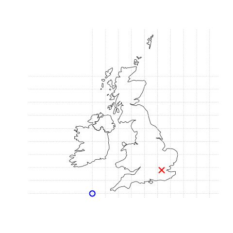

+++
title = '1'
date = 2024-10-01T21:24:32+02:00
draft = false
+++

本章概述了两种基本的地理数据模型--矢量和栅格，并介绍了处理它们的主要 Python 软件包。在演示它们在 Python 中的实现之前，我们将介绍每种数据模型背后的理论以及它们主要应用的学科。

- 矢量数据模型（第 1.2 节）使用点、线和多边形来表示世界。这些数据具有离散、明确的边界，这意味着矢量数据集通常具有较高的精度（但不一定准确）。
- 另一方面，栅格数据模型（第 1.3 节）将表面划分为大小不变的单元格。栅格数据集是网络制图中使用的背景图像的基础，自航空摄影和卫星遥感设备诞生以来，栅格数据集一直是地理数据的重要来源。栅格将特定的空间特征聚合到一个给定的分辨率，这意味着它们在空间上是一致的，并且可以扩展，有许多世界范围的栅格数据集可用。

使用哪个？答案可能取决于您的应用领域以及您有权访问的数据集：

- 矢量数据集和方法在社会科学中占主导地位，因为人类住区和过程（例如交通基础设施）往往具有离散的边界
- 由于对遥感数据的依赖，栅格数据集和方法在许多环境科学中占据主导地位

Python 对这两种数据模型都有强大的支持。我们将重点关注用于处理地理矢量数据的 shapely 和 geopandas，以及用于处理栅格的 rasterio。

有多个部分重叠的用于处理栅格数据的软件包，每个都有其优点和缺点。在本书中，我们重点介绍最突出的一个：rasterio。它通过将“简单的”栅格数据集与 numpy 数组相结合，并使用一个元数据对象（字典）提供地理元数据（如坐标系）来表示。xarray 是另一个值得注意的替代方案，但本书没有涵盖。它使用原生的 xarray.Dataset 和 xarray.DataArray 类来有效表示复杂的栅格数据集，例如具有多个波段和元数据的‘NetCDF’文件。

在某些领域中存在大量重叠，栅格数据和矢量数据可以一起使用。例如，生态学家和人口统计学家常常同时使用矢量和栅格数据。此外，这两种数据形式可以相互转换（见第 5 章）。无论你的工作更侧重于矢量数据还是栅格数据，在使用它们之前，理解基础的数据模型都是值得的，正如后续章节所讨论的那样。

## 矢量数据

地理矢量数据模型基于位于坐标参考系 (CRS) 内的点。点可以表示独立的特征（例如，公交站的位置），或者它们可以连接在一起形成更复杂的几何图形，如线和多边形。大多数点的几何形状仅包含两个维度（三维 CRS 可能包含一个附加的 z 值，通常表示高于海平面的高度）。

在该系统中，例如，伦敦可以用坐标 (-0.1, 51.5) 表示。这意味着它的位置是距离原点向东 -0.1 度，向北 51.5 度。在这里，原点是指 0 度经度（位于格林尼治的本初子午线）和 0 度纬度（赤道）在地理 CRS 中的坐标（‘经纬度’ CRS）。相同的点也可以用投影的 CRS 近似表示，其‘东坐标/北坐标’值为 (530000, 180000) 在英国国家网格中，这意味着伦敦位于 CRS 原点以东 530 公里，以北 180 公里的位置。英国国家网格的原点位置位于英国西南半岛以外的海域，确保了英国大多数地点的东坐标和北坐标为正值。




图 1.1：矢量（点）数据的示意图，其中伦敦的位置（红色 X）是相对于原点（蓝色圆圈）表示的。左侧图表示一个地理坐标参考系 (CRS)，其原点位于 0° 经度和纬度。右侧图表示一个投影的坐标参考系，其原点位于西南半岛以西的海域。

坐标参考系 (CRS) 涉及的内容更多，如第 1.4 节和第 6 章所述，但在本节的目的中，了解坐标由两个数字组成，表示距原点的距离，通常在两个维度中表示，这已足够。

`geopandas` (Bossche 等，2023) 提供了用于地理矢量数据的类和一致的命令行接口，方便在 Python 中进行可重复的地理数据分析。它还提供了三个成熟的地理计算库的接口，结合起来，构成了许多地理应用（包括 QGIS 和 R 的空间生态系统）的坚实基础：

- **GDAL**：用于读取、写入和操作各种地理数据格式，详细内容见第 7 章。
- **PROJ**：一个用于坐标系统转换的强大库，相关内容见第 6 章。
- **GEOS**：一个用于执行操作的平面几何引擎，如计算具有投影 CRS 的数据的缓冲区和质心，详细内容见第 4 章。

与这些地理库的紧密集成使得可重复的地理计算成为可能：使用 Python 这样的高级语言访问这些库的一个优势在于，你不需要了解底层组件的复杂性，从而能够专注于方法，而不是实现。

矢量数据类

用于处理 Python 中地理矢量数据的主要类是分层的，这意味着最高级别的“矢量图层”类是由更简单的“几何列”和单个“几何”组件组成的。本节将按顺序介绍这些类，从最高级别的类开始。对于许多应用来说，高级别的矢量图层类（本质上是带有几何列的数据框）已经足够使用。然而，理解矢量地理对象的结构及其组成部分，对于更高级的应用是非常重要的。Python 中的三种主要矢量地理数据类如下：

- **GeoDataFrame**：表示矢量图层的类，包含一个几何列（类为 GeoSeries）。
- **GeoSeries**：用于表示 GeoDataFrame 对象中的几何列的类。
- **shapely 几何对象**：用于表示单个几何形状（如点或多边形）的类，存在于 GeoSeries 对象中。

前两个类（GeoDataFrame 和 GeoSeries）由 `geopandas` 定义。第三个类是由 `shapely` 包定义的，它处理单个几何形状，并且是 `geopandas` 包的主要依赖之一。

矢量图层

最常用的地理矢量数据结构是矢量图层。在 Python 中处理矢量图层有多种方法，从低级别的软件包（例如 `osgeo`，`fiona`）到本节重点讨论的相对高级的 `geopandas` 包。在编写和运行代码以创建和处理地理矢量对象之前，我们需要导入 `geopandas`（按照惯例缩写为 `gpd` 以使代码更简洁）和 `shapely`。

```python
import pandas as pd
import shapely
import geopandas as gpd
```

我们还通过使用 `pandas` 的 `display.max_rows` 选项将打印的最大行数限制为 6 行，以节省空间。

```python
pd.set_option('display.max_rows', 6)
```

项目通常从导入现有的矢量图层开始，这些图层保存为 GeoPackage (.gpkg) 文件、ESRI Shapefile (.shp) 或其他地理文件格式。函数 `gpd.read_file` 将位于 Python 工作目录的 `data` 目录中的名为 `world.gpkg` 的 GeoPackage 文件导入为一个名为 `gdf` 的 `GeoDataFrame`。

```python
gdf = gpd.read_file('data/world.gpkg')
```

结果是一个 `GeoDataFrame` 类型的对象，具有 177 行（要素）和 11 列，如以下代码的输出所示：

```python
type(gdf)
# geopandas.geodataframe.GeoDataFrame

gdf.shape
# (177, 11)
```

`GeoDataFrame` 类是 `pandas` 包中 `DataFrame` 类的扩展（McKinney 2010）。这意味着我们可以将矢量图层中的非空间属性视为表格，并使用普通的、即非空间的函数方法来处理它们。例如，可以使用标准的数据帧子集方法。以下代码创建了 `gdf` 数据集的一个子集，仅包含国家名称和几何列。

```python
gdf = gdf[['name_long', 'geometry']]
gdf
```

输出示例：

| name_long            | geometry                              |
|----------------------|---------------------------------------|
| Fiji                 | MULTIPOLYGON (((-180 -16.55522,...    |
| Tanzania             | MULTIPOLYGON (((33.90371 -0.95,...    |
| Western Sahara       | MULTIPOLYGON (((-8.66559 27.656...    |
| ...                  | ...                                   |
| Kosovo               | MULTIPOLYGON (((20.59025 41.855...    |
| Trinidad and Tobago  | MULTIPOLYGON (((-61.68 10.76, -...    |
| South Sudan          | MULTIPOLYGON (((30.83385 3.5091...    |

177 行 × 2 列

以下表达式基于条件创建一个子数据集，例如 `name_long` 列的值等于字符串 "Egypt"。

```python
gdf[gdf['name_long'] == 'Egypt']
```

输出示例：

| name_long  | geometry                              |
|------------|---------------------------------------|
| Egypt      | MULTIPOLYGON (((36.86623 22, 36...    |

最后，为了了解矢量图层的空间组件，可以使用 `.plot` 方法进行绘制（图 1.2）。

```python
gdf.plot();
```


图 1.2：GeoDataFrame 的基本绘图

可以使用 `.explore` 方法创建 GeoDataFrame 对象的交互式地图，正如图 1.3 所示。以下命令用于生成该交互式地图：

```python
gdf.explore()
```

Figure 1.3: Basic interactive map with .explore

A subset of the data can be also plotted in a similar fashion.

```python
gdf[gdf['name_long'] == 'Egypt'].explore()
```

图 1.4：GeoDataFrame 子集的交互式地图

1.2.3 几何列

`GeoSeries` 类的几何列是 `GeoDataFrame` 中的重要列，它包含了矢量图层的几何部分，并且是所有空间操作的基础。可以通过列名访问该列，通常（例如从文件中读取时）其名称为 'geometry'，如 `gdf['geometry']`。不过，推荐使用固定的 `.geometry` 属性来访问几何列，无论列名是否是 'geometry'。对于 `gdf` 对象来说，几何列包含了与每个国家相关联的 'MultiPolygon'。

```python
gdf.geometry
```

输出：

```
0      MULTIPOLYGON (((-180 -16.55522,...
1      MULTIPOLYGON (((33.90371 -0.95,...
2      MULTIPOLYGON (((-8.66559 27.656...
                      ...                
174    MULTIPOLYGON (((20.59025 41.855...
175    MULTIPOLYGON (((-61.68 10.76, -...
176    MULTIPOLYGON (((30.83385 3.5091...
Name: geometry, Length: 177, dtype: geometry
```

几何列还包含空间参考信息（可以通过 `gdf.crs` 访问）。

```python
gdf.geometry.crs
```

输出：

```
<Geographic 2D CRS: EPSG:4326>
Name: WGS 84
Axis Info [ellipsoidal]:
- Lat[north]: Geodetic latitude (degree)
- Lon[east]: Geodetic longitude (degree)
Area of Use:
- name: World.
- bounds: (-180.0, -90.0, 180.0, 90.0)
Datum: World Geodetic System 1984 ensemble
- Ellipsoid: WGS 84
- Prime Meridian: Greenwich
```

许多几何操作，比如计算质心、缓冲区或每个要素的边界框，涉及的仅仅是几何列。因此，在 `GeoDataFrame` 上应用此类操作基本上是对几何列 `GeoSeries` 对象进行操作的快捷方式。例如，以下两个命令返回完全相同的结果，都是一个包含国家边界框多边形的 `GeoSeries`（使用 `.envelope` 方法）。

```python
gdf.envelope
gdf.geometry.envelope
```

输出：

```
0      POLYGON ((-180 -18.28799, 179.9...
1      POLYGON ((29.34 -11.72094, 40.3...
2      POLYGON ((-17.06342 20.99975, -...
                      ...                
174    POLYGON ((20.0707 41.84711, 21....
175    POLYGON ((-61.95 10, -60.895 10...
176    POLYGON ((23.88698 3.50917, 35....
Length: 177, dtype: geometry
```

注意 `.envelope` 和 `geopandas` 中的其他类似操作符（如 `.centroid`、`.buffer` 或 `.convex_hull`）仅返回几何（即 `GeoSeries`），而不是带有原始属性数据的 `GeoDataFrame`。如果我们想要后者，可以复制 `GeoDataFrame`，然后“覆盖”其几何列（或者，如果不需要原始几何列，可以直接覆盖它们，如 `gdf.geometry = gdf.envelope`）。

```python
gdf2 = gdf.copy()
gdf2.geometry = gdf.envelope
gdf2
```

输出示例：

| name_long            | geometry                              |
|----------------------|---------------------------------------|
| Fiji                 | POLYGON ((-180 -18.28799, 179.9...    |
| Tanzania             | POLYGON ((29.34 -11.72094, 40.3...    |
| Western Sahara       | POLYGON ((-17.06342 20.99975, -...    |
| ...                  | ...                                   |
| Kosovo               | POLYGON ((20.0707 41.84711, 21....    |
| Trinidad and Tobago  | POLYGON ((-61.95 10, -60.895 10...    |
| South Sudan          | POLYGON ((23.88698 3.50917, 35....    |

177 行 × 2 列

几何列的另一个有用的属性是几何类型，如下代码所示。注意，几何列（以及矢量图层）中包含的几何类型并不一定在每一行都相同。一个 `GeoSeries` 中可以包含多个几何类型。因此，`.type` 属性返回的是一个 `Series`（其值类型为字符串 `str`），而不是单一值（同样可以通过快捷方式 `gdf.geom_type` 实现）。

```python
gdf.geometry.type
```

输出：

```
0      MultiPolygon
1      MultiPolygon
2      MultiPolygon
           ...     
174    MultiPolygon
175    MultiPolygon
176    MultiPolygon
Length: 177, dtype: object
```

为了总结几何列中不同几何类型的出现情况，可以使用 `pandas` 的 `.value_counts` 方法。在本例中，我们可以看到 `gdf` 图层只包含 'MultiPolygon' 几何类型。

```python
gdf.geometry.type.value_counts()
```

输出：

```
MultiPolygon    177
Name: count, dtype: int64
```

一个 `GeoDataFrame` 还可以拥有多个 `GeoSeries` 列，如下面代码所示。

```python
gdf['bbox'] = gdf.envelope
gdf['polygon'] = gdf.geometry
gdf
```

一次只能有一个几何列是“活动的”，即它参与与几何相关的操作（如 `.centroid`、`.crs` 等）。要将活动几何列从一个 `GeoSeries` 列切换到另一个，可以使用 `.set_geometry`。图 1.5 和图 1.6 显示了 `gdf` 图层在 'bbox' 和 'polygon' 几何列激活时的交互式地图。

```python
gdf = gdf.set_geometry('bbox')
gdf.explore()
```

Figure 1.5: Switching to the 'bbox' geometry column in the world layer, and plotting it

```python
gdf = gdf.set_geometry('polygon')
gdf.explore()
```

Simple Features 标准

几何体是矢量图层的基本构建块。虽然 Simple Features 标准定义了大约 20 种几何类型，但我们将重点关注七种最常用的类型：**POINT**（点）、**LINESTRING**（线）、**POLYGON**（多边形）、**MULTIPOINT**（多点）、**MULTILINESTRING**（多线）、**MULTIPOLYGON**（多边形）和 **GEOMETRYCOLLECTION**（几何集合）。在 R 语言的 `sf` 包文档中可以找到所有可能的几何类型的有用列表。

Simple Features 几何体可以通过 **well-known binary (WKB)** 和 **well-known text (WKT)** 编码表示。WKB 通常是计算机易于读取的十六进制字符串，因此 GIS 软件和空间数据库使用 WKB 来传输和存储几何对象。WKT 是人类可读的文本标记描述，描述 Simple Features。两种格式是可互换的，如果我们要展示一种格式，通常会选择 WKT 表示法。

每种几何类型的基础是**点**。点是二维、三维或四维空间中的一个坐标点，如图 1.7 所示。

```
POINT (5 2)
```

**线串 (LINESTRING)** 是一系列点，点与点之间通过直线相连（图 1.8）。

```
LINESTRING (1 5, 4 4, 4 1, 2 2, 3 2)
```

**多边形 (POLYGON)** 是一系列点，这些点形成一个闭合的、无交叉的环。闭合意味着多边形的第一个和最后一个点具有相同的坐标（图 1.9）。

```
POLYGON ((1 5, 2 2, 4 1, 4 4, 1 5))
```

到目前为止，我们只创建了每个要素中包含一个几何实体的几何体。然而，Simple Features 标准允许在一个要素中存在多个几何实体，使用几何类型的“多”版本，如图 1.10、图 1.11 和图 1.12 所示。

```
MULTIPOINT (5 2, 1 3, 3 4, 3 2)
MULTILINESTRING ((1 5, 4 4, 4 1, 2 2, 3 2), (1 2, 2 4))
MULTIPOLYGON (((1 5, 2 2, 4 1, 4 4, 1 5), (0 2, 1 2, 1 3, 0 3, 0 2)))
```

最后，**几何集合 (GEOMETRYCOLLECTION)** 可以包含其他六种类型的几何体的任意组合，如下图所示，包含一个多点和一个线串的组合（图 1.13）。

```
GEOMETRYCOLLECTION (MULTIPOINT (5 2, 1 3, 3 4, 3 2),
                    LINESTRING (1 5, 4 4, 4 1, 2 2, 3 2))
```

1.2.5 几何体

几何列（`GeoSeries`）中的每个元素都是一个 `shapely` 类的几何对象（Gillies 等，2007--）。例如，以下是 `gdf` 的几何列中按隐式索引选出的一个特定几何体（加拿大，`gdf.geometry` 列中的第 4 个元素）。

```python
gdf.geometry.iloc[3]
```


We can also select a specific geometry based on the `name_long` attribute (i.e., the 1st and only element in the subset of gdf where the country name is equal to Egypt):

```python
gdf[gdf['name_long'] == 'Egypt'].geometry.iloc[0]
```


`shapely` 包兼容 Simple Features 标准（见 1.2.4 节），因此支持七种几何类型。以下部分演示了如何从头创建每种 `shapely` 几何对象。在第一个示例中（创建一个 'Point'），我们展示了创建几何对象的两种输入类型：坐标列表或 WKT（Well-Known Text）格式的字符串。在其余几何类型的示例中，我们使用前一种方法（坐标列表）。

要从坐标列表创建一个 'Point' 几何对象，可以使用 `shapely.Point` 函数，如以下表达式所示（图 1.7）：

```python
point = shapely.Point([5, 2])
point
```

此代码会创建一个表示点的几何对象，其中点的坐标为 (5, 2)。


Figure 1.7: A Point geometry (created either from a list or WKT)

Alternatively, we can use shapely.from_wkt to transform a WKT string to a shapely geometry object. Here is an example of creating the same 'Point' geometry from WKT (Figure 1.7).

```
point = shapely.from_wkt('POINT (5 2)')
point
```

A 'LineString' geometry can be created based on a list of coordinate tuples or lists (Figure 1.8).

```
linestring = shapely.LineString([(1,5), (4,4), (4,1), (2,2), (3,2)])
linestring
```


Figure 1.8: A LineString geometry

Creation of a 'Polygon' geometry is similar, but our first and last coordinate must be the same, to ensure that the polygon is closed. Note that in the following example, there is one list of coordinates that defines the exterior outer hull of the polygon, followed by a list of lists of coordinates that define the holes (if any) in the polygon (Figure 1.9).

```
polygon = shapely.Polygon(
    [(1,5), (2,2), (4,1), (4,4), (1,5)],  ## Exterior
    [[(2,4), (3,4), (3,3), (2,3), (2,4)]]  ## Hole(s)
)
polygon
```


A 'MultiPoint' geometry is also created from a list of coordinate tuples (Figure 1.10), where each element represents a single point.

```
multipoint = shapely.MultiPoint([(5,2), (1,3), (3,4), (3,2)])
multipoint
```


Figure 1.10: A MultiPoint geometry

A 'MultiLineString' geometry, on the other hand, has one list of coordinates for each line in the MultiLineString (Figure 1.11).

```
multilinestring = shapely.MultiLineString([
    [(1,5), (4,4), (4,1), (2,2), (3,2)],  ## 1st sequence
    [(1,2), (2,4)]  ## 2nd sequence, etc.
])
multilinestring
```


Figure 1.11: A MultiLineString geometry

A 'MultiPolygon' geometry (Figure 1.12) is created from a list of Polygon geometries. For example, here we are creating a 'MultiPolygon' with two parts, both without holes.

```
multipolygon = shapely.MultiPolygon([
    [[(1,5), (2,2), (4,1), (4,4), (1,5)], []],  ## Polygon 1 
    [[(0,2), (1,2), (1,3), (0,3), (0,2)], []]   ## Polygon 2, etc.
])
multipolygon
```


Figure 1.12: A MultiPolygon geometry

Since the required input has four hierarchical levels, it may be more clear to create the single-part 'Polygon' geometries in advance, using the respective function (shapely.Polygon), and then pass them to shapely.MultiPolygon (Figure 1.12). (The same technique can be used with the other shapely.Multi* functions.)

```
multipolygon = shapely.MultiPolygon([
    shapely.Polygon([(1,5), (2,2), (4,1), (4,4), (1,5)]),  ## Polygon 1 
    shapely.Polygon([(0,2), (1,2), (1,3), (0,3), (0,2)])   ## Polygon 2, etc.
])
multipolygon
```

And, finally, a 'GeometryCollection' geometry is a list with one or more of the other six geometry types (Figure 1.13):

```
geometrycollection = shapely.GeometryCollection([multipoint, multilinestring])
geometrycollection
```


`shapely` 几何对象作为矢量数据的原子单位，这意味着不存在几何集合的概念：每个操作都接受单个几何对象作为输入，并返回一个单个几何对象作为输出。（在 `geopandas` 中定义的 `GeoSeries` 和 `GeoDataFrame` 对象用于处理 `shapely` 几何对象的集合）。例如，以下表达式计算了一个缓冲的 `multipolygon`（缓冲距离为 0.2）与其自身之间的差异（参见 4.2.5 节），以及缓冲操作（参见 4.2.3 节）（如图 1.14 所示）：

```python
from shapely.geometry import MultiPolygon
from shapely.ops import unary_union

# 创建一个示例 MultiPolygon
multipolygon = MultiPolygon([[(0, 0), (1, 1), (1, 0), (0, 0)], [(2, 2), (3, 3), (3, 2), (2, 2)]])

# 缓冲操作 (距离为 0.2)
buffered_multipolygon = multipolygon.buffer(0.2)

# 计算缓冲后的 MultiPolygon 与其自身的差异
difference = buffered_multipolygon.difference(multipolygon)

difference
```

在这个例子中，首先对 `multipolygon` 应用了缓冲操作，然后计算了缓冲后的几何对象与原始几何对象的差异。`shapely` 几何对象的这些基本操作返回的也是单个几何对象。

```
multipolygon.buffer(0.2).difference(multipolygon)
```


图 1.14：缓冲后的 MultiPolygon 与其自身的差异

正如前几张图所示，当使用支持显示的界面（如 Jupyter Notebook）时，`shapely` 几何对象会自动显示为该几何体的小型图像。如果想打印 WKT（Well-Known Text）格式的字符串，可以使用 `print` 函数：

```python
print(linestring)

# 输出
LINESTRING (1 5, 4 4, 4 1, 2 2, 3 2)
```

最后，重要的是要注意到 `shapely` 几何对象的原始坐标可以通过 `.coords`、`.geoms`、`.exterior` 和 `.interiors` 属性进行访问，具体取决于几何体的类型。这些访问方法在需要开发自己的空间操作符时非常有用。例如，以下表达式返回多边形几何体外部轮廓的所有坐标列表：

```python
list(polygon.exterior.coords)

# 输出
[(1.0, 5.0), (2.0, 2.0), (4.0, 1.0), (4.0, 4.0), (1.0, 5.0)]
```

另见第 4.2.8 节，其中使用 `.coords`、`.geoms` 和 `.exterior` 来将给定的 `shapely` 几何体转换为不同的类型（例如，将 'Polygon' 转换为 'MultiPoint'）。

从零开始创建矢量图层

在前面的章节中，我们从现有的 GeoPackage 文件中导入了一个矢量图层（GeoDataFrame），并“分解”它以提取几何列（GeoSeries，见第 1.2.3 节）和单个几何体（`shapely`，见第 1.2.5 节）。在本节中，我们将演示相反的过程，如何从 `shapely` 几何体构建一个 GeoDataFrame，并将它们组合成一个 GeoSeries。这将帮助你更好地理解 GeoDataFrame 的结构，并在你需要以编程方式构建简单的矢量图层（例如，在两个给定点之间绘制线段）时提供帮助。

矢量图层由两部分组成：几何体和非地理属性。图 1.15 显示了如何创建一个 GeoDataFrame 对象——几何体来自 GeoSeries 对象（由 `shapely` 几何体组成），而属性来自 `Series` 对象。


最终结果，一个矢量图层（GeoDataFrame），因此是一个层次结构（如图 1.16 所示），它包含一个几何列（GeoSeries），而几何列内部包含几何对象（shapely）。每个“内部”组件都可以访问或“提取”，有时这是必要的，后续章节中我们将看到这种情况。


图 1.16：GeoDataFrame 的结构

非地理属性可以表示特征的名称，以及其他属性，例如测量值、组等。为了说明属性的使用，我们将表示 2023 年 6 月 21 日伦敦的温度为 25°C。这个示例包含一个几何体（坐标）以及三个具有不同数据类型的属性（地点名称、温度和日期）。`GeoDataFrame` 类的对象通过将属性（Series）与简单特征几何列（GeoSeries）结合在一起来表示这样的数据。首先，我们创建一个点几何体，正如我们在 1.2.5 节中学习的那样（如图 1.17 所示）。

几何体

几何列（GeoSeries）中的每个元素都是一个 `shapely` 类的几何对象（Gillies 等，2007--）。例如，以下是通过隐式索引选取的一个具体几何体（加拿大，是 `gdf` 几何列中的第 4 个元素）。

现在，让我们创建伦敦的点几何体：

```python
lnd_point = shapely.Point(0.1, 51.5)
lnd_point
```

这会创建一个表示伦敦位置的 `Point` 对象，坐标为 (0.1, 51.5)。


图 1.17：表示伦敦的 `shapely` 点

接下来，我们创建一个包含该点和 CRS 定义的 GeoSeries（长度为 1），在本例中使用 WGS84（通过 EPSG 代码 4326 定义）。还需要注意的是，`shapely` 几何体被放入一个列表中，以说明在其他情况下可以包含多个几何体，而不仅限于当前示例中的一个几何体。

```python
lnd_geom = gpd.GeoSeries([lnd_point], crs=4326)
lnd_geom
```

输出：

```
0    POINT (0.1 51.5)
dtype: geometry
```

接下来，我们将 `GeoSeries` 与其他属性组合到一个字典中。几何列是一个名为 `geometry` 的 `GeoSeries`。其他属性（如果有）可以使用列表或 `Series` 对象定义。在这里，为了简化，我们使用列表定义三个属性：名称（`name`）、温度（`temperature`）和日期（`date`）。再次注意，列表的长度可以大于 1，以便我们为多个要素创建图层（即多个行）。

```python
lnd_data = {
  'name': ['London'],
  'temperature': [25],
  'date': ['2023-06-21'],
  'geometry': lnd_geom
}
```

最后，可以将字典转换为 `GeoDataFrame` 对象，如下代码所示：

```python
lnd_layer = gpd.GeoDataFrame(lnd_data)
lnd_layer
```

输出：

| name   | temperature | date       | geometry         |
|--------|-------------|------------|------------------|
| London | 25          | 2023-06-21 | POINT (0.1 51.5) |

发生了什么？
1. 首先，使用坐标创建了一个简单的 `shapely` 几何对象。
2. 然后，该几何对象被转换为包含 CRS 的 `GeoSeries`（简单特征几何列）。
3. 最后，将属性与 `GeoSeries` 组合在一起。最终结果是一个名为 `lnd_layer` 的 `GeoDataFrame` 对象。

创建包含多个要素的图层示例

为了展示如何创建包含多个要素的图层，下面是一个包含两个点（伦敦和巴黎）的图层示例：

```python
lnd_point = shapely.Point(0.1, 51.5)
paris_point = shapely.Point(2.3, 48.9)
towns_geom = gpd.GeoSeries([lnd_point, paris_point], crs=4326)
towns_data = {
  'name': ['London', 'Paris'],
  'temperature': [25, 27],
  'date': ['2013-06-21', '2013-06-21'],
  'geometry': towns_geom
}
towns_layer = gpd.GeoDataFrame(towns_data)
towns_layer
```

输出：

| name   | temperature | date       | geometry         |
|--------|-------------|------------|------------------|
| London | 25          | 2013-06-21 | POINT (0.1 51.5) |
| Paris  | 27          | 2013-06-21 | POINT (2.3 48.9) |

创建交互式地图

现在，我们可以创建 `towns_layer` 对象的交互式地图（如图 1.18 所示）。为了使点更容易看到，我们自定义了填充颜色和大小（在第 8.3 节中将详细讨论 `.explore` 的选项）。

```python
towns_layer.explore(color='red', marker_kwds={'radius': 10})
```

图 1.18：从零开始创建的 `towns_layer`，使用 `.explore` 可视化

空间点图层也可以从包含坐标列的 `DataFrame` 对象（使用 `pandas` 包）创建。为了演示，我们首先从坐标创建一个 `GeoSeries` 对象，然后将其与 `DataFrame` 结合，形成一个 `GeoDataFrame`。

```python
towns_table = pd.DataFrame({
  'name': ['London', 'Paris'],
  'temperature': [25, 27],
  'date': ['2017-06-21', '2017-06-21'],
  'x': [0.1, 2.3],
  'y': [51.5, 48.9]
})
towns_geom = gpd.points_from_xy(towns_table['x'], towns_table['y'])
towns_layer = gpd.GeoDataFrame(towns_table, geometry=towns_geom, crs=4326)
```

输出与之前创建的 `towns_layer` 相同。这种方法在我们需要从 CSV 文件读取数据时特别有用，例如使用 `pd.read_csv`，并将生成的 `DataFrame` 转换为 `GeoDataFrame`（见第 3.2.3 节的另一个示例）。

派生数值属性

矢量图层有两个重要的派生数值属性：**长度（`.length`）**——适用于线，和**面积（`.area`）**——适用于多边形。面积和长度可以对上述任意数据结构进行计算：如果是 `shapely` 几何体，返回值是一个数字；如果是 `GeoSeries` 或 `GeoDataFrame`，返回值是一个数值 `Series`。

```python
linestring.length  # 输出：9.39834563766817

multipolygon.area  # 输出：8.0

gpd.GeoSeries([point, linestring, polygon, multipolygon]).area

# 输出：
0    0.0
1    0.0
2    6.0
3    8.0
dtype: float64
```

与 `geopandas` 中所有数值计算一样，结果假设为平面坐标参考系 (CRS) 并返回其原生单位。这意味着，对于在 WGS84（`crs=4326`）中的几何体，长度和面积以十进制度表示，因此没有实际意义（运行 `gdf.area` 可以看到警告）。

为了获得地理 CRS 中有意义的长度和面积测量结果，几何体首先需要转换为适用于感兴趣区域的投影 CRS（见第 6.7 节）。例如，斯洛文尼亚的面积可以在 UTM 第 33N 区域的 CRS 中计算（`crs=32633`），结果以 UTM 第 33N 区域的单位表示。

```python
gdf[gdf['name_long'] == 'Slovenia'].to_crs(32633).area
# 输出：
150    1.910410e+10
dtype: float64
```

## 栅格数据

空间栅格数据模型通过连续的网格单元（通常也称为像素；图 1.19 (A)）来表示世界。该数据模型通常指所谓的规则网格，其中每个单元的大小相同且恒定——在本书中我们将仅关注规则网格。不过，也存在其他类型的网格，包括旋转网格、剪切网格、直角网格和曲线网格（参见 Pebesma 和 Bivand (2022) 第 1 章或 Tennekes 和 Nowosad (2022) 第 2 章）。

栅格数据模型通常由栅格头文件（或元数据）和表示等距单元（通常称为像素）的矩阵（具有行和列）组成（图 1.19 (A)）。栅格头文件定义了坐标参考系、原点和分辨率。原点（或起点）通常是矩阵左下角的坐标。元数据定义了原点和单元大小，即分辨率。结合列数和行数，可以推导出栅格的范围。


图 1.19：栅格数据类型：（A）单元格 ID，（B）单元格值，（C）彩色栅格地图

栅格地图通常用于表示连续现象，如海拔、高温、人口密度或光谱数据。离散特征（例如土壤类型或土地覆盖分类）也可以通过栅格数据模型来表示。图 1.20 中展示了栅格数据集的这两种用途，显示了离散特征的边界在栅格数据集中可能会变得模糊。根据应用的性质，使用矢量表示离散特征可能会更加合适。


图 1.20：连续栅格和分类栅格示例

如前所述，与处理矢量图层和 `geopandas` 相比，Python 中处理栅格数据的方法并没有围绕一个全面的软件包展开。相反，不同的软件包提供了处理栅格数据的替代方法。

Python 中处理栅格数据的两个主要方法分别由 `rasterio` 和 `rioxarray` 软件包提供。它们的范围和底层数据模型有所不同。具体来说，`rasterio` 使用 `numpy` 数组表示栅格，并通过单独的对象存储空间元数据。而 `rioxarray` 是 `rasterio` 的包装器，它使用 `xarray`“扩展”数组表示栅格，这是 `numpy` 数组的扩展，能够在同一对象中保存轴标签和属性，以及栅格值数组。类似的方法还由较少知名的 `xarray-spatial` 和 `geowombat` 软件包提供。相比之下，`rasterio` 更成熟，但它更偏低级（这既有优点也有缺点）。

然而，上述所有软件包都不像 `geopandas` 那样全面。例如，在使用 `rasterio` 时，可能还需要其他软件包来完成常见任务，如区域统计（`rasterstats` 软件包）或计算地形指数（`richdem` 软件包）。

在接下来的两个小节中，我们将介绍 `rasterio`，这是我们将在本书中使用的栅格相关软件包。

使用 rasterio

要使用 `rasterio` 软件包，首先需要导入它。另外，由于栅格数据存储在 `numpy` 数组中，我们还需导入 `numpy` 软件包，以便有效地操作数据。最后，我们导入 `rasterio.plot` 子模块中的 `rasterio.plot.show` 函数，用于快速可视化栅格数据。

```python
import numpy as np
import rasterio
import rasterio.plot
```

栅格数据通常是从现有文件中导入的。在使用 `rasterio` 时，导入栅格数据实际上是一个两步过程：

1. 首先，使用 `rasterio.open` 打开栅格文件的“连接”。
2. 然后，使用 `.read` 方法从连接中读取栅格值。

这种分离方式类似于 Python 中用于读取文件的基本函数，例如使用 `open` 和 `.readline` 从文本文件中读取。其背后的逻辑是我们不总是希望将文件中的所有信息读入内存，这一点在栅格数据的大小可能超过内存时尤为重要。因此，第二步（`.read`）是选择性的，用户可以精细调整实际读取的数据子集（波段、行/列、分辨率等）。例如，我们可能只想读取一个栅格波段，而不是读取所有波段。

在第一步中，我们将文件路径传递给 `rasterio.open` 函数，以创建一个 `DatasetReader` 文件连接，命名为 `src`。在此示例中，我们使用一个存储在 `srtm.tif` 文件中的单波段栅格，表示锡安国家公园的海拔。

```python
src = rasterio.open('data/srtm.tif')
src
```

输出：

```
<open DatasetReader name='data/srtm.tif' mode='r'>
```

为了对栅格数据有一个初步印象，我们可以使用 `rasterio.plot.show` 函数绘制栅格数据（如图 1.21 所示）：

```python
rasterio.plot.show(src);
```


图 1.21：栅格的基本绘图，数据来自 rasterio 文件连接

`DatasetReader` 包含栅格的元数据，即除栅格值之外的所有信息。我们可以使用 `.meta` 属性来查看这些元数据。

```python
src.meta
```

输出结果：

```python
{'driver': 'GTiff',
 'dtype': 'uint16',
 'nodata': 65535.0,
 'width': 465,
 'height': 457,
 'count': 1,
 'crs': CRS.from_epsg(4326),
 'transform': Affine(0.0008333333332777796, 0.0, -113.23958321278403,
        0.0, -0.0008333333332777843, 37.512916763165805)}
```

这些元数据包括以下属性，我们将在后面的章节中详细介绍：

- `driver`：栅格文件格式
- `dtype`：数据类型
- `nodata`：表示“无数据”的标记值
- 尺寸：
  - `width`：列数
  - `height`：行数
  - `count`：波段数
- `crs`：坐标参考系统
- `transform`：栅格仿射变换矩阵

最后一项（即 `transform`）值得特别关注。要将栅格定位到地理空间中，除了 CRS 外，还必须指定栅格的原点（x_min，y_max）和分辨率（delta_x，delta_y）。在变换矩阵的表示中，假设网格是规则的，数据项的存储方式如下：

```python
Affine(delta_x, 0.0, x_min,
       0.0, delta_y, y_max)
```

注意，按照惯例，栅格 y 轴的原点设为最大值（y_max）而不是最小值，因此 y 轴分辨率（delta_y）为负数。换句话说，由于原点位于左上角，沿着 y 轴前进时是向下移动的（负方向）。

第二步，使用 `DatasetReader` 的 `.read` 方法读取实际的栅格值。重要的是，我们可以读取以下内容：

- 所有波段（如 `.read()`）
- 某个特定波段，传入数字索引（如 `.read(1)`）
- 波段子集，传入索引列表（如 `.read([1,2])`）

注意，波段索引从 1 开始，这与 Python 的索引从 0 开始的惯例不同。

`.read` 返回的对象是一个 `numpy` 数组，具有二维或三维：

- 如果读取多个波段（如 `.read()` 或 `.read([1,2])`），则返回的数组为三维，维度模式为 (波段，行，列)。
- 如果读取特定波段（如 `.read(1)`），则返回的数组为二维，维度模式为 (行，列)。

现在，我们使用文件连接对象 `src` 和 `.read` 方法读取 `srtm.tif` 栅格的第一个（也是唯一一个）波段。

```python
src.read(1)
```

输出结果是一个二维 `numpy` 数组，每个值代表相应像素的海拔高度。

```python
array([[1728, 1718, 1715, ..., 2654, 2674, 2685],
       [1737, 1727, 1717, ..., 2649, 2677, 2693],
       [1739, 1734, 1727, ..., 2644, 2672, 2695],
       ...,
       [1326, 1328, 1329, ..., 1777, 1778, 1775],
       [1320, 1323, 1326, ..., 1771, 1770, 1772],
       [1319, 1319, 1322, ..., 1768, 1770, 1772]], dtype=uint16)
```

图 1.22 总结了 `rasterio` 文件连接与派生属性之间的关系。通过 `rasterio.open` 创建的文件连接可以访问栅格数据的两个组成部分：元数据（通过 `.meta` 属性）和栅格值（通过 `.read` 方法）。


图 1.22：从零开始创建 GeoDataFrame

从零开始创建栅格数据

在本节中，我们将演示如何从零开始创建栅格数据。我们将构建两个小的栅格数据 `elev` 和 `grain`，稍后将在本书的示例中使用。与创建矢量图层（见 1.2.6 节）不同，从零开始创建栅格数据在实际中很少需要，因为要编程方式对齐栅格的空间范围具有挑战性（GIS 软件中的“地理配准”工具更适合这类工作）。尽管如此，这些示例将有助于熟悉 `rasterio` 的数据结构。

概念上，栅格是一个数组与地理参考信息的结合，而后者包括：

- 一个变换矩阵，包含原点和分辨率，将像素索引与特定坐标系统中的坐标关联起来
- 一个 CRS 定义，指定该坐标系统与地球表面的关联（可选）

因此，要创建栅格，我们首先需要一个包含值的数组，然后补充地理参考信息。我们来创建 `elev` 和 `grain` 数组。`elev` 数组是一个 6x6 的数组，包含从 1 到 36 的顺序值。可以使用 `numpy` 的 `np.arange` 函数和 `.reshape` 方法创建它：

```python
elev = np.arange(1, 37, dtype=np.uint8).reshape(6, 6)
elev
```

输出：

```python
array([[ 1,  2,  3,  4,  5,  6],
       [ 7,  8,  9, 10, 11, 12],
       [13, 14, 15, 16, 17, 18],
       [19, 20, 21, 22, 23, 24],
       [25, 26, 27, 28, 29, 30],
       [31, 32, 33, 34, 35, 36]], dtype=uint8)
```

`grain` 数组表示一个分类栅格，值为 0、1、2，分别对应于类别“黏土”（clay）、“粉砂”（silt）、“沙”（sand）。我们将使用 `numpy` 的 `np.array` 和 `.reshape` 函数创建它：

```python
v = [
  1, 0, 1, 2, 2, 2, 
  0, 2, 0, 0, 2, 1, 
  0, 2, 2, 0, 0, 2, 
  0, 0, 1, 1, 1, 1, 
  1, 1, 1, 2, 1, 1, 
  2, 1, 2, 2, 0, 2
]
grain = np.array(v, dtype=np.uint8).reshape(6, 6)
grain
```

输出：

```python
array([[1, 0, 1, 2, 2, 2],
       [0, 2, 0, 0, 2, 1],
       [0, 2, 2, 0, 0, 2],
       [0, 0, 1, 1, 1, 1],
       [1, 1, 1, 2, 1, 1],
       [2, 1, 2, 2, 0, 2]], dtype=uint8)
```

注意，在两个示例中，我们都使用了 `uint8` 数据类型（8 位无符号整数，即 0-255），这足以表示给定栅格的所有可能值。这是推荐的做法，可以将内存占用最小化。

现在缺少的是地理参考信息（见 1.3.1 节）。在这个例子中，由于栅格是任意的，我们也设置了一个任意的变换矩阵，其中：

- 原点 (x_min, y_max) 在 (-1.5, 1.5)
- 栅格分辨率 (delta_x, delta_y) 是 (0.5, -0.5)

我们可以使用 `rasterio.transform.from_origin` 添加此信息，并指定 `west`、`north`、`xsize` 和 `ysize` 参数。生成的变换矩阵对象命名为 `new_transform`：

```python
new_transform = rasterio.transform.from_origin(
    west=-1.5, 
    north=1.5, 
    xsize=0.5, 
    ysize=0.5
)
new_transform
```

输出：

```python
Affine(0.5, 0.0, -1.5,
       0.0, -0.5, 1.5)
```

注意，尽管 `ysize` 实际上是负数（-0.5），在 `rasterio.transform.from_origin` 中使用正值（0.5）来定义。

现在，我们可以将数组 `elev` 与变换矩阵 `new_transform` 一起传递给 `rasterio.plot.show`，在其坐标系中绘制栅格数据（如图 1.23 所示）：

```python
rasterio.plot.show(elev, transform=new_transform);
```


图 1.23：`elev` 栅格的绘图，一个从零开始创建的连续栅格的简单示例

`grain` 栅格可以用同样的方法绘制，因为我们将为它使用相同的变换矩阵（如图 1.24 所示）。

```python
rasterio.plot.show(grain, transform=new_transform);
```


图 1.24：`grain` 栅格的绘图，一个从零开始创建的分类栅格的简单示例

此时，我们已经有了两个栅格数据，每个都由一个数组和相关的变换矩阵组成。我们可以通过以下方式使用 `rasterio` 处理栅格数据：

- 在栅格像素坐标重要的地方传递变换矩阵（例如在 `rasterio.plot.show` 函数中）
- 记住我们在分析中使用的任何其他图层都必须在相同的 CRS 中

最后，为了将栅格导出到永久存储，同时保留空间元数据，我们需要执行以下步骤：

1. 创建一个栅格文件连接（在此过程中我们设置 `transform` 和 CRS 等其他设置）
2. 将栅格值数组写入连接
3. 关闭连接

如果以下代码暂时不清楚，不必担心；将栅格数据写入文件的相关概念会在第 7.6.2 节中解释。为了完整性，也为了在后续章节中使用这些栅格文件而无需重新创建，我们提供了将 `elev` 和 `grain` 栅格导出到输出目录的代码。对于 `elev`，我们使用 `rasterio.open`、`.write` 和 `.close` 方法进行导出。

```python
new_dataset = rasterio.open(
    'output/elev.tif', 'w', 
    driver='GTiff',
    height=elev.shape[0],
    width=elev.shape[1],
    count=1,
    dtype=elev.dtype,
    crs=4326,
    transform=new_transform
)
new_dataset.write(elev, 1)
new_dataset.close()
```

注意，我们为 `elev` 栅格任意设置的 CRS 是 WGS84，使用 `crs=4326`（根据 EPSG 代码定义）。

导出 `grain` 栅格的方式相同，唯一的区别是文件名和写入连接的数组。

```python
new_dataset = rasterio.open(
    'output/grain.tif', 'w', 
    driver='GTiff',
    height=grain.shape[0],
    width=grain.shape[1],
    count=1,
    dtype=grain.dtype,
    crs=4326,
    transform=new_transform
)
new_dataset.write(grain, 1)
new_dataset.close()
```

结果是 `elev.tif` 和 `grain.tif` 文件被写入输出目录。我们将在后续示例中使用这些小型栅格文件（例如第 2.3.1 节）。

需要注意的是，`elev` 和 `grain` 的变换矩阵和尺寸是相同的。这意味着这些栅格是重叠的，并且可以组合成一个包含两个波段的栅格，用于栅格代数操作（见第 3.3.2 节）等。

## 坐标参考系 (CRS)

矢量和栅格空间数据类型共享空间数据固有的概念。其中最基本的可能是坐标参考系 (CRS)，它定义了数据的空间元素与地球（或其他天体）表面的关系。CRS 分为地理和投影坐标参考系，正如本章开始时介绍的那样（见 1.2 节）。本节解释了每种类型，为第 6 章的深入讨论奠定基础，后者将深入探讨设置、转换和查询 CRS。

地理坐标系统

地理坐标系统通过两个值——经度和纬度——来识别地球表面的任何位置（参见图 1.26 左侧）。经度是东西方向上相对于本初子午线平面的角距离，纬度是相对于赤道平面的北或南的角距离。因此，在地理 CRS 中，距离不是以米为单位测量的，这会产生重要的影响，正如第 6 章中所示。

在地理坐标系统中，地球表面通常表示为球形或椭球形表面。球形模型假设地球是一个给定半径的完美球体——它们的优点是简单，但同时它们不准确：地球并不是一个球体！椭球模型由两个参数定义：赤道半径和极半径。这些模型适用于地球因为其被压缩的形状：赤道半径比极半径长约 11.5 公里。尽管地球也不是一个椭球体，但它比球体更接近实际情况。

椭球体是 CRS 的一个更广泛组成部分：基准面。基准面包含了使用哪个椭球体以及笛卡尔坐标与地球表面位置之间的精确关系的信息。基准面有两种类型——地心基准面（如 WGS84）和本地基准面（如 NAD83）。图 1.25 展示了这两种基准面的示例。黑线表示地心基准面，其中心位于地球的重心处，没有为特定位置进行优化。图中的紫色虚线表示本地基准面，椭球体表面经过移动，以与特定位置的地表对齐。这允许本地 CRS 考虑地球表面上的局部变化，例如大型山脉。图 1.25 显示了本地基准面与菲律宾区域对齐，但与地球表面的其他大部分区域不一致。这两种基准面都放置在地球平均海平面模型——大地水准面之上。


 图 1.25：显示在大地水准面上的地心和本地大地基准（使用假彩色和 10,000 倍垂直夸大比例）。大地水准面的图像改编自 Ince 等人（2019）的作品。

投影坐标参考系统

所有投影 CRS 都基于上一节中描述的地理 CRS，并依赖地图投影将地球的三维表面转换为投影 CRS 中的东向和北向（x 和 y）值。投影 CRS 基于隐式平面表面上的笛卡尔坐标（参见图 1.26 右侧）。它们有一个原点、x 和 y 轴，以及以米为单位的线性测量单位。

这种转换不能在不增加变形的情况下进行。因此，地球表面的某些属性（如面积、方向、距离和形状）在此过程中会发生变形。投影坐标系统只能保留这些属性中的一个或两个。投影通常以保留的属性命名：等面积投影保留面积，方位投影保留方向，等距投影保留距离，等角投影保留局部形状。

投影类型主要分为三大类：圆锥投影、圆柱投影和平面投影（方位投影）。在圆锥投影中，地球表面被投影到一个沿着单条切线或两条切线的圆锥上。沿切线的变形最小，距离切线越远，变形越大。因此，它最适合用于中纬度地区的地图。圆柱投影将地表映射到一个圆柱体上。此投影也可以通过沿单条切线或两条切线与地球表面接触来创建。圆柱投影最常用于绘制世界地图。平面投影将数据投影到一个在某点或沿切线接触地球的平面上。它通常用于极地地区的制图。

Python 中的 CRS

与大多数开源地理空间软件一样，`geopandas` 和 `rasterio` 包使用 `PROJ` 软件来定义和计算 CRS。`pyproj` 包是 `PROJ` 的低级接口。使用它的函数（如 `get_codes` 和 `from_epsg`），我们可以查看 `PROJ` 支持的投影列表。

```python
import pyproj
epsg_codes = pyproj.get_codes('EPSG', 'CRS')  # 支持的 EPSG 代码
epsg_codes[:5]  # 打印前五个支持的 EPSG 代码
```

输出：

```python
['10150', '10151', '10156', '10157', '10158']
```

使用 EPSG 代码 4326 打印 WGS84 CRS：

```python
pyproj.CRS.from_epsg(4326)
```

输出：

```python
<Geographic 2D CRS: EPSG:4326>
Name: WGS 84
Axis Info [ellipsoidal]:
- Lat[north]: Geodetic latitude (degree)
- Lon[east]: Geodetic longitude (degree)
Area of Use:
- name: World.
- bounds: (-180.0, -90.0, 180.0, 90.0)
Datum: World Geodetic System 1984 ensemble
- Ellipsoid: WGS 84
- Prime Meridian: Greenwich
```

关于不同投影类型、属性和适用性的快速总结可以在 [geo-projections 网站](https://www.geo-projections.com/) 上找到。我们将在第 6 章中进一步扩展 CRS，并解释如何在不同 CRS 之间进行转换。但目前只需了解以下几点：

- 坐标系统是地理对象的关键组成部分。
- 了解数据所处的 CRS，以及它是地理 CRS（经度/纬度）还是投影 CRS（通常以米为单位），非常重要，这会影响 Python 如何处理空间和几何操作。
- 可以使用 `.crs` 属性查询 `geopandas`（矢量图层或几何列）和 `rasterio`（栅格）对象的 CRS。

以下是最后一点的演示，我们导入一个矢量图层并确定其 CRS（在本例中是投影 CRS，即 UTM 第 12 区），使用 `.crs` 属性：

```python
zion = gpd.read_file('data/zion.gpkg')
zion.crs
```

输出：

```python
<Bound CRS: PROJCS["UTM Zone 12, Northern Hemisphere",GEOGCS[" ...>
Name: UTM Zone 12, Northern Hemisphere
Axis Info [cartesian]:
- [east]: Easting (Meter)
- [north]: Northing (Meter)
Area of Use:
- undefined
Coordinate Operation:
- name: Transformation from GRS 1980(IUGG, 1980) to WGS84
- method: Position Vector transformation (geog2D domain)
Datum: unknown
- Ellipsoid: GRS80
- Prime Meridian: Greenwich
Source CRS: UTM Zone 12, Northern Hemisphere
```

我们还可以通过在两种 CRS 中绘制 `zion` 数据来展示地理 CRS 和投影 CRS 之间的差异（如图 1.26 所示）。注意，我们使用 `matplotlib` 的 `.grid` 方法在绘图上添加网格线。

```python
# WGS84
zion.to_crs(4326).plot(edgecolor='black', color='lightgrey').grid()
# NAD83 / UTM 第 12 区
zion.plot(edgecolor='black', color='lightgrey').grid();
```


图 1.26：矢量图层的坐标参考系统 (CRS) 示例

我们将在第 6 章中详细讨论如何将一个 CRS 重投影到另一个 CRS（如上面的代码段中的 `.to_crs`）。

单位

CRS 的一个重要功能是包含空间单位的信息。显然，了解房屋的测量单位是英尺还是米是至关重要的，地图也是如此。一个好的制图实践是在地图上添加比例尺或其他距离指示器，以显示页面或屏幕上的距离与地面距离之间的关系。同样，用户了解几何坐标的单位也很重要，以确保后续计算在正确的上下文中进行。

在 `geopandas` 和 `rasterio` 中的 Python 空间数据结构本质上不支持度量单位的概念。矢量图层或栅格的坐标只是普通数字，指的是一个任意的平面。例如，查看 `srtm.tif` 的 `.transform` 矩阵可以发现栅格的分辨率是 0.000833，并且其 CRS 是 WGS84（EPSG: 4326）：

```python
src.meta

{'driver': 'GTiff',
 'dtype': 'uint16',
 'nodata': 65535.0,
 'width': 465,
 'height': 457,
 'count': 1,
 'crs': CRS.from_epsg(4326),
 'transform': Affine(0.0008333333332777796, 0.0, -113.23958321278403,
        0.0, -0.0008333333332777843, 37.512916763165805)}
```

你可能已经知道 WGS84 坐标系（EPSG: 4326）的单位是十进制度。然而，这一信息不会被纳入任何数值计算中，这意味着诸如缓冲区的操作可能会返回以度为单位的结果，这在大多数情况下是不合适的。

因此，你应该始终了解数据集的 CRS 及其使用的单位。通常情况下，这些单位是在地理 CRS 中的十进制度，或在投影 CRS 中的米，尽管也有例外。几何计算（如长度、面积或距离）以与 CRS 单位相同的单位返回普通数字（如米或平方米）。用户需要自己确定结果所使用的单位，并相应地处理结果。例如，如果面积输出是以平方米为单位的，而我们需要的结果是平方公里，那么我们需要将结果除以 1,000,000。

