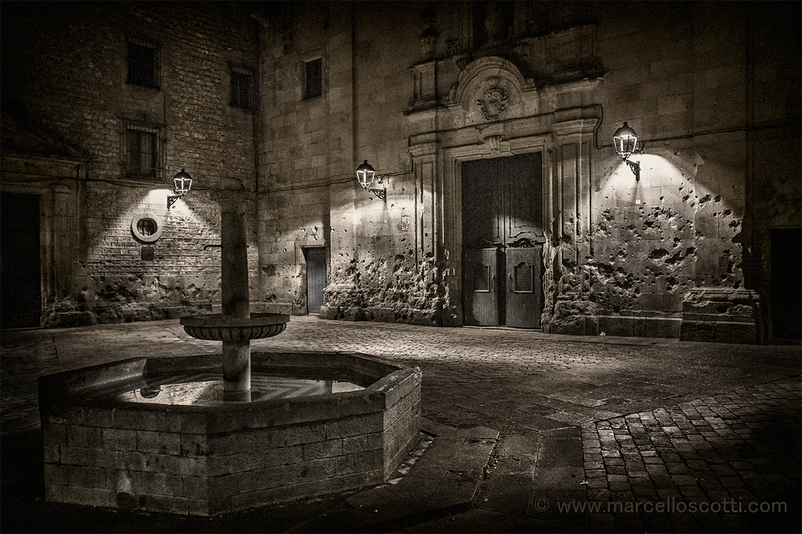

+++
title = 'Spain'
date = 2024-12-21T11:22:36+01:00
draft = false
+++

[toc]

## 行程安排及推荐景点

### **12月22日 阿姆斯特丹 → 巴塞罗那**

Tetuan

抵达后可以去城市漫步，推荐巴塞罗那老城区（哥特区），体验当地文化氛围和小吃。

巴塞罗那古城的扩展区，完全是十分严谨的棋盘式格局，且已跨越了两个世纪，也可称作老城了。中国有街坊一词，古时的“坊”大多就是方块形相对封闭的社区，清朝入关后就逐渐解体了。巴塞罗那老城中整齐化一的社区，有点类似于中国古时的坊。虽然并不封闭，但都呈方块状，大小一致、十分规整。这个老城中的道路大都是单行道，一律仅有20米宽，只有三条60米宽的大道。在这样的道路之间，全部围着133×133米的方形小区。交叉路口全部是十字路口，每个红绿灯之间的距离都是103米。在路口的每栋楼房都按照45°切去一角，使得十字路口呈钻石形。这样每个社区实际上都是缺角的正方形。这是1859年设计师伊尔德方斯•塞尔达城市规划方案中标后，多年建设的结果。

巴塞罗那老城区的哥特区（**El Barri Gòtic**）并不是单指一座老教堂，而是整个历史悠久的城区。这是巴塞罗那保存最完好的中世纪区域，充满了古老的建筑、狭窄的小巷和广场。它因丰富的哥特式建筑风格而得名，是当地文化和历史的重要象征。

以下是哥特区的一些特色和必看景点：

1. **巴塞罗那大教堂（La Catedral de Barcelona）**  
巴塞罗那大教堂的全名是“圣十字与圣欧拉利亚大教堂”，是一座始建于13世纪的哥特式建筑杰作。它供奉的是巴塞罗那的主保圣人圣欧拉利亚，这位少女在罗马帝国时期为捍卫基督教信仰而殉道，其遗骸安葬于教堂的地下墓穴。教堂以其华丽的哥特式外观而闻名，高耸的塔尖和雕刻精美的立面令人叹为观止。教堂内部装饰典雅，彩色玻璃窗散发柔和的光芒。庭院内饲养的13只鹅象征着圣欧拉利亚殉道时的年龄。游客还可以登上教堂屋顶，俯瞰整个哥特区和巴塞罗那的壮丽景色，是探索巴塞罗那历史与艺术的必经之地。
哥特区最重要的地标之一，这座教堂也被称为圣十字与圣欧拉利亚大教堂，是典型的哥特式建筑，拥有华丽的塔楼和精美的内饰。

2. **国王广场（Plaça del Rei）**  
   一个安静的中世纪广场，被多座历史建筑环绕，比如皇宫（Palau Reial Major），曾是加泰罗尼亚君主的住所。也就是巴塞罗那大教堂后面。

3. **圣雅各圣殿（Basílica de Sant Just i Pastor）**  
   哥特区中的一座隐藏宝藏教堂，以其古朴的哥特式风格和悠久的历史闻名。也是巴塞罗那大教堂后面。

4. **犹太区（El Call）**  
   曾是巴塞罗那的犹太人聚集地，可以感受古老的街巷以及犹太文化的遗迹。

5. **圣菲利普内里广场（Plaça de Sant Felip Neri）**  
一个美丽且略带忧伤的广场，墙上还有内战时期留下的弹孔痕迹，非常适合漫步和沉思。
圣菲利普内里广场位于巴塞罗那哥特区，是一个充满历史感的小型广场，被中世纪建筑环绕。广场中央矗立着一座简约而典雅的巴洛克风格教堂——圣菲利普内里教堂，建于18世纪中期。这个广场的宁静掩盖了一段悲伤的历史，在西班牙内战期间，1938年的一次空袭造成了多人死亡，其中包括许多儿童。教堂墙壁上的弹孔至今清晰可见，是战争悲剧的无声见证。如今，广场成为一片静谧之地，喷泉水流和周围树荫让人得以反思历史，也为游客提供了一片避开喧嚣的安静角落。

一个有子弹孔的小广场，也在巴塞罗那大教堂旁边。

6. **哥伦布广场（Plaça de Sant Jaume）**  
   这里是巴塞罗那市政厅和加泰罗尼亚政府所在地，也是哥特区的中心。

因此，哥特区不仅是教堂的集合地，更是一个综合了中世纪建筑、现代生活和文化氛围的区域。漫步在这里，你会感受到历史的厚重和生活的活力。也在巴塞罗那大教堂后面。

### 22-25日住宿

Placa de Tetuan 德士安广场旁边

---

### **12月23日 巴塞罗那**

安东尼·高迪（Antoni Gaudí）简介

安东尼·高迪（1852–1926）是西班牙加泰罗尼亚地区最著名的建筑师，也是**加泰罗尼亚现代主义（Catalan Modernisme）**的杰出代表。他的建筑以独特的造型语言、丰富的色彩和自然形态的运用著称，具有强烈的个人风格，被称为“上帝的建筑师”。

高迪的作品融合了新艺术风格（Art Nouveau）的自由与曲线设计，同时深受自然、宗教和加泰罗尼亚文化的影响。他常用陶瓷、铁艺和玻璃等材料进行装饰，将建筑视为整体艺术作品。他的许多作品已被列为联合国教科文组织世界遗产，包括这次提到的“高迪三件套”。

**高迪三件套：**
1. **圣家堂**：早上参观（建议提前预订门票，避免排队）。上午9:00 至晚上 8:00
- 背景：圣家堂全名为“圣家族赎罪教堂”，是高迪最宏大的未完成之作，始建于1882年，次年高迪接手设计，耗费了他余生的大部分精力。高迪的设计融合了哥特式建筑的庄严与现代主义的创新，其灵感来源于宗教信仰和自然的和谐。
- 外观：教堂目前有三大立面：诞生立面（完成于1930年代，展现耶稣的出生场景）、受难立面（表现耶稣受难，风格简洁而深邃）、荣耀立面（尚未完工）。
- 内部设计：高迪通过树状柱体、彩色玻璃和复杂的几何结构，创造出一个如森林般的神圣空间。
- 工程现状：尽管高迪逝世后工程曾多次中断，但目前计划于2030年代完工。
- 意义：圣家堂象征着高迪的宗教信仰，是建筑与艺术、信仰与技术结合的巅峰之作。
2. **古埃尔公园**：中午前往，享受美丽的景观。
- 背景：古埃尔公园原本是工业家**欧塞比·古埃尔（Eusebi Güell）**委托高迪设计的一处住宅区，但由于商业失败，项目被废弃，后改建为公共公园。公园建于1900-1914年期间，是高迪将自然元素融入设计的实验场。
- 亮点：色彩与材料：公园内广泛使用陶瓷拼贴（Trencadís），形成色彩斑斓的装饰。
- 标志性景观：公园入口的蜥蜴雕塑（El Drac），以及蛇形长椅和摩天广场，体现了高迪的自然灵感与设计创新。
- 融于自然：公园建筑与周围山丘和植被融为一体，展示了人与自然的和谐共生。
- 意义：古埃尔公园是高迪将自然主义与建筑完美结合的杰作，深受游客喜爱，充满童话色彩。
3. **巴特罗之家**：下午游览，感受高迪的建筑风格。
- 背景：巴特罗之家位于巴塞罗那著名的格拉西亚大道（Passeig de Gràcia），是高迪1904-1906年间改建的一座住宅。这座建筑以海洋为主题，被称为“骨之屋”或“龙之屋”，灵感来源于传说中圣乔治屠龙的故事。
- 亮点：外观：建筑立面以彩色玻璃和陶瓷装饰，呈现波浪起伏的效果，屋顶则被设计成龙鳞般的形状。
- 内部设计：高迪创造了流动性极强的空间，包括曲线楼梯、灯光采集设计，以及天然通风系统。
- 屋顶露台：烟囱造型独特，被认为是高迪艺术与功能结合的典范。
- 意义：巴特罗之家体现了高迪对自然与传说的探索，是加泰罗尼亚现代主义建筑的巅峰之作。

---

理想的旅行计划：

#### **1️⃣ 巴特罗之家（Casa Batlló）**

巴特略之家官网： www.casabatllo.es/

巴特罗之家是高迪设计的一座奇特住宅，充满自然主义和梦幻般的设计风格。早场票（8:30-8:45am）是体验最佳的选择，能避免人群拥挤，第一波入场时几乎可以享受空无一人的参观体验。重点在于内部设计，每个房间都充满细节与故事，门票包含讲解器，可以了解房子每个角落的历史与设计灵感。参观时长约1-2小时，结束后可以步行前往米拉之家，非常方便。

---

#### **2️⃣ 米拉之家（Casa Milà）**

米拉之家官网：lapedrera.com/ca/home

米拉之家是高迪设计的又一经典之作，特别以其屋顶设计而闻名。屋顶拥有巨大的雕塑和流畅的曲线造型，展现了高迪对于建筑与艺术的巧妙结合，站在屋顶还可以俯瞰环形的建筑结构，视觉上极为震撼。中间楼层展示了许多建筑模型，如果时间有限，半小时即可走马观花地参观。建议上午11:00-11:30之间入场，越早越能避开人群，拍照更加方便。

---

#### **3️⃣ 圣家堂（La Sagrada Família）**

圣家堂官网：www.sagradafamilia.cat

圣家堂是高迪最宏伟的未完成作品，其外部的复杂雕花和高耸入云的建筑风格震撼人心。下午3:30-4:00pm入场是绝佳时间，可以欣赏到阳光透过彩色玻璃窗洒进教堂的奇妙光影效果，仿佛整个教堂被圣光笼罩。内部的森林状柱体、尖顶设计和极繁主义的雕刻让人叹为观止。参观时长约1-2小时，从山顶如焦糖山或Tibidabo山远眺圣家堂，其全景更加壮美。

---

焦糖山最后一段是避免不了爬坡的，Tibidabo可以通过打车的方式规避一些爬坡，带阿姨去的话可以去Tibidabo，不过如果想上圣心圣殿也需要爬台阶，两个景点的区别主要在于1️⃣焦糖山的景色属于放大版，因为离市区建筑更近，然后圣心圣殿的景色属于缩小版，但是更能浏览到全景，因为是最高的2️⃣前者人一般会更多，因为也有很多本地青年或者其他国家的游客去欣赏景色，人挤人😂后者人没有那么多

[怎么去焦糖山](https://www.xiaohongshu.com/explore/668552a9000000000a0072f0?xsec_token=ABgwnWBtDcPaEgwdBpMhrmuDHPhQNMELVa2bXvWiiErrc=&xsec_source=pc_search&source=web_search_result_notes)

#### **4️⃣ 焦糖山（Bunkers El Carmel）**
焦糖山是欣赏巴塞罗那全景的最佳地点之一，可以俯瞰整座城市和背靠大海的圣家堂。山顶有开放式的空间，非常适合拍照和欣赏日落。从这里可以感受到巴塞罗那城市和自然的和谐融合。建议在参观完圣家堂后前往，傍晚时分这里的景色尤为迷人。

---

### **5️⃣ Tibidabo山**
Tibidabo山是巴塞罗那的制高点之一，山顶有一座壮观的圣心教堂（Temple Expiatori del Sagrat Cor），教堂顶部的耶稣雕像象征着对城市的庇佑。从这里可以俯瞰整个巴塞罗那市区和延伸至地中海的壮丽景色，同时山上还有一座历史悠久的游乐园，为山顶增添了一丝童趣。傍晚登山欣赏日落和夜景，会是难忘的体验。

---

### **12月24日 巴塞罗那**
**诺坎普球场（翻修中）**：
- 可以选择在周边步行探索，例如Camp Nou Experience博物馆。
- 或前往蒙锥克山（Montjuïc）欣赏城市风景。

---

### **12月25日 巴塞罗那 → 马德里**
**圣诞节活动：**
- 前往**马约尔广场（Plaza Mayor）**和**太阳门广场（Puerta del Sol）**，感受当地节日气氛。

---

### **12月26日 马德里**
1. **伯纳乌球场**：皇马主场，适合球迷参观。
2. **大都会球场**：马竞主场，也有很棒的游览体验。
3. 傍晚游览**马德里王宫**，感受皇室建筑的壮丽。

---

### **12月27日 马德里 → 格拉纳达**
到达格拉纳达后：
- 游览市中心的**阿尔拜辛区（Albaicín）**，俯瞰阿尔罕布拉宫的夜景。

---

### **12月28日 格拉纳达**
全天游览**阿尔罕布拉宫**（务必提前预订门票）。  
参观完后，探索附近的**阿尔拜辛老城区**。

---

### **12月29日 格拉纳达 → 塞维利亚中转 → 里斯本**
途经塞维利亚时：
- 可选择参观**塞维利亚大教堂**和**吉拉尔达塔**，然后继续前往里斯本。

---

### **12月30日 里斯本**
1. **贝伦塔**和**发现者纪念碑**：了解葡萄牙的航海历史。
2. **圣若热城堡**：俯瞰里斯本全景。
3. **阿尔法玛区**：体验传统的葡萄牙文化和美食。

---

### **12月31日 里斯本 → 波尔图**
波尔图建议游览：
- **路易一世大桥**。
- **里贝拉河畔区**。
- 波尔图的酒窖，品尝波特酒。

---

### **1月1日 波尔图 → 埃因霍温**
根据出发时间：
- 可早起在波尔图市中心漫步，参观早晨市场或教堂。
