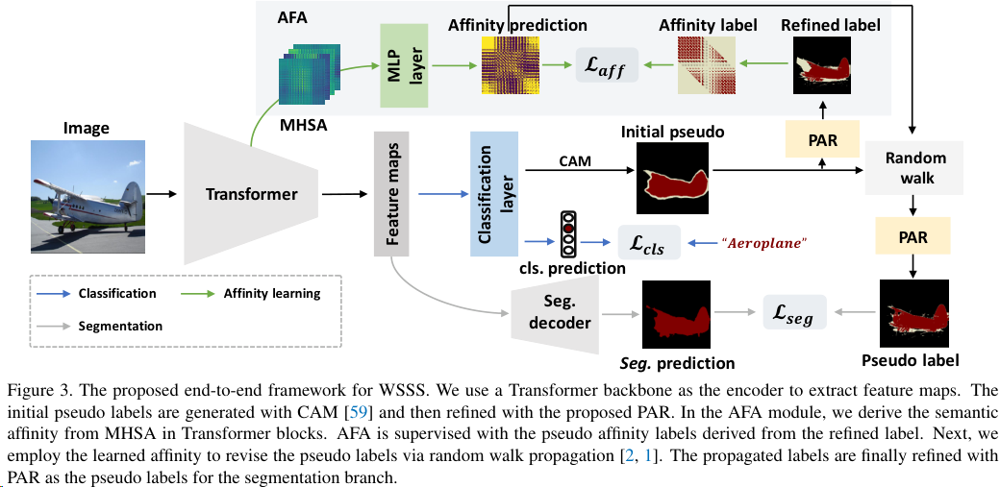
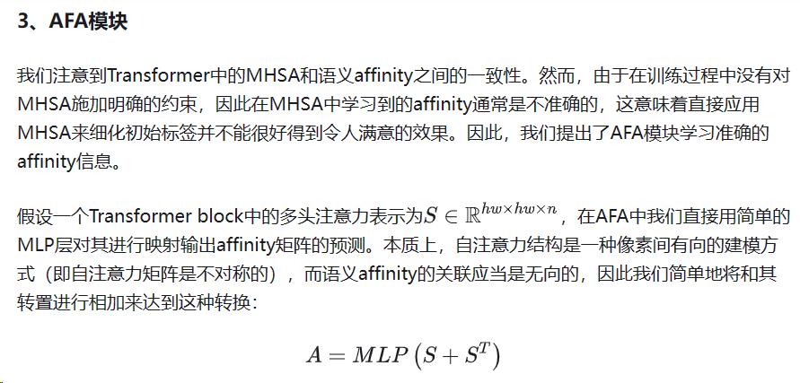
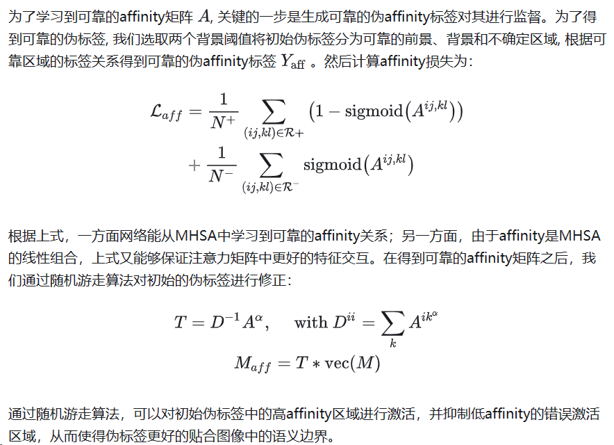
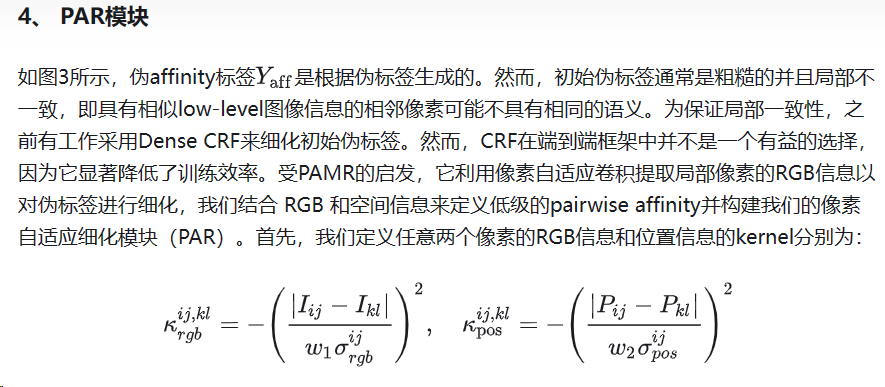
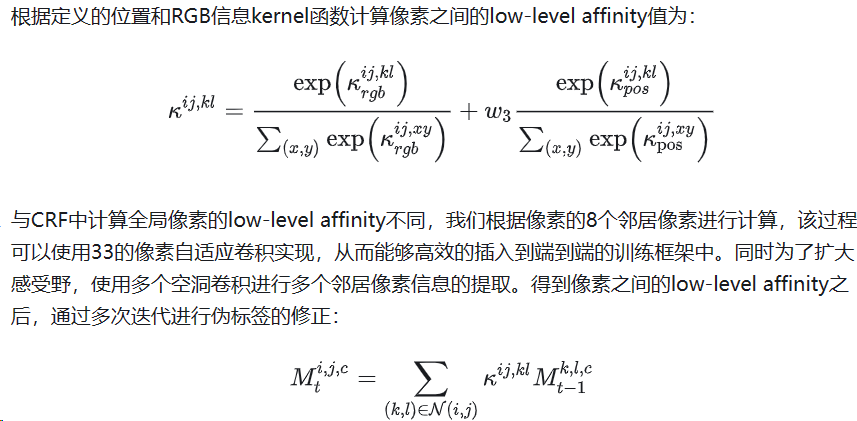

做的比较好的一篇论文

Reference [746](https://hxhen.com/archives/746)

在基于图像级别标注的弱监督语义分割问题中，CNN分类模型中卷积操作的局部信息感知会导致不完全的语义区域激活。为解决这个问题，本文引入视觉Transformer结构，并探索了适合视觉Transformer的初始伪标签生成方法。同时，受视觉Transformer中学习到的自注意力与图像中的语义Affinity的一致性启发，本文提出了一个Affinity from Attention（AFA）模块，从Transformer的注意力矩阵中学习高质量的语义Affinity信息，用于对初始伪标签进行改善。为了进一步补充伪标签的局部细节信息，同时保证端到端训练的效率，本文基于像素自适应卷积设计了一个高效的处理模块。本文提出的方法在两个数据集上超过了当前的端到端方法，以及部分多阶段方法。

- Existing WSSS methods often rely on multi-stage frameworks that are inefficient, while end-to-end methods based on CNNs fail to capture global feature relations adequately.

- The paper introduces a Transformer-based end-to-end framework for WSSS that leverages the self-attention mechanism to generate more complete initial pseudo labels.

- An Affinity from Attention (AFA) module is proposed to refine these pseudo labels by learning semantic affinity from the multi-head self-attention (MHSA) in Transformers.

- A Pixel-Adaptive Refinement (PAR) module is also introduced to further refine the pseudo labels by incorporating low-level image appearance information.

