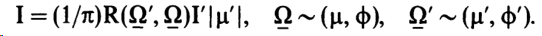
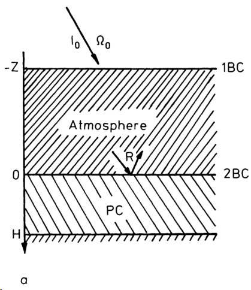
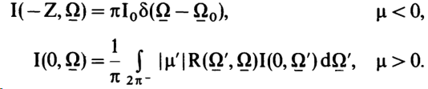
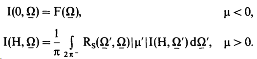
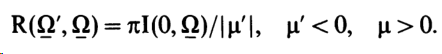
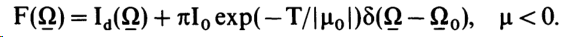
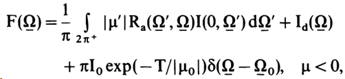
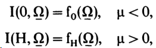
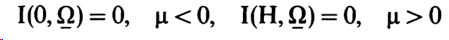

[Prev]()

边界条件取决于入射辐射场和边界的反射特性。通常，为了描述介质的反射特性，会引入双向反射率因子（bidirectional reflectance factor）  $\mathbf{R}\left(\underline{\Omega}^{\prime}, \underline{\Omega}\right)$。[BRDF](https://www.zhihu.com/question/20286038) $f\left(\vec{\omega}_i, \vec{\omega}_o\right)=\frac{d L_o\left(\vec{\omega}_o\right)}{d E_i\left(\vec{\omega}_i\right)}$. 如果 $I^{\prime}$ 和 $I$ 分别是入射和反射辐射度，则有

根据研究的目的不同，边界条件也各不相同（Gerstl and Zardecki 1985; Germogenova 1986）。

辐射的反射性质，其中 $\mathrm{I}$ 是反射辐射率，$\mathrm{I}^{\prime}$ 是入射辐射率。这个公式描述了辐射在表面反射后的变化。公式右侧的 $\mathrm{R}\left(\underline{\Omega}^{\prime}, \underline{\Omega}\right)$ 是双向反射率因子，表示了辐射从 $\underline{\Omega}^{\prime}$ 方向入射到表面后反射到 $\underline{\Omega}$ 方向的比例。$\mu^{\prime}$ 是 $\underline{\Omega}^{\prime}$ 方向的余弦值。$\pi$ 用来归一化。

- 问题 $A$。研究了边界于叶冠相邻的大气中辐射的传输。设 $\mathbf{Z}$ 是物理深度，$T$ 是大气的光学深度（图 2a）。我们定义以下边界条件 ${ }^1$

这里，$\Omega_0 \sim\left(\mu_0, \phi_0\right)$ 是单向太阳辐射的方向，$\mathrm{I}_0$ 是其强度，$R\left(\Omega^{\prime}, \Omega\right)$ 是叶冠的双向反射因子。

- 问题 $B$。叶冠被视为一个独立的层。叶冠与大气之间没有相互作用。因此，

最后一个条件描述了来自土壤的反射情况，其中$R_s\left(\Omega^{\prime}, \underline{\Omega}\right)$是土壤反射因子。值得注意的是，在土壤呈现 Lambertian 反射的情况下，$R_{{s}}\left(\underline{\Omega}^{\prime}, \underline{\Omega}\right) = R_{{s}} = {const}$。$\mu<0$有两个实际上非常重要的问题需要指出。

问题 B1. 对于问题 A，求解植被的双向反射因子，例如 $\mathbf{R}\left(\Omega^{\prime}, \Omega\right)$。在这种情况下，
$$
\mathrm{F}(\underline{\Omega})=\pi \delta\left(\underline{\Omega}-\underline{\Omega^{\prime}}\right), \quad \mu<0 .
$$

然后，利用 $\mathrm{Q}(\mathrm{z}, \underline{\Omega}) \equiv 0$ 并且边界条件 (1.7) 求解传输方程 (1.5)，对于每个 $\Omega^{\prime}$ 我们得到了植被冠层中辐射的分布函数 $\mathrm{I}(\mathrm{z}, \boldsymbol{\Omega})$。因此（Sobolev 1975），

问题 B2. 如果入射辐射被大气削弱和散射（图2b），则求植被冠层中辐射分布 $\mathrm{I}(\mathrm{z}, \underline{\Omega})$。对于这样的情况，我们可以通过以下表达式定义函数 $\mathrm{F}$：

其中，$I_d$ 是漫射天空辐亮度。
问题 C. 考虑了一个双层问题，其中大气被视为反射边界层（图2c）；一个逃离植被冠层的光子可能由于大气内的相互作用而返回冠层。在这种情况下，只有第一个边界条件（$1.7 \mathrm{a}$）被指定为：

其中 $\mathrm{R}_{\mathrm{a}}\left(\Omega^{\prime}, \underline{\Omega}\right)$ 是大气的双向反射因子（Sobolev 1975）。
问题 $D$（标准问题）。传输方程的标准问题具有以下边界条件：

其中 $\mathrm{f}_0$ 和 $\mathrm{f}_{\mathrm{H}}$ 是一些已知函数。
通常情况下，传输方程的边界值问题通过迭代方法来解决（参见第 3 节）。在每一步迭代中，问题 $D$ 被解决，而不是边界条件 A-C，因为在未知函数的位置上有一个已知函数，是在先前步骤计算得到的。

这种方法的数学基础由Germogenova (1986) 提出。我们注意到问题 $\mathrm{D}$ 可以简化为真空边界条件，

（参见第 1.7 节）。
有关解的存在性、唯一性和对初始数据的连续依赖性的数学问题已经被详细研究（例如，Vladimirov 1963; Case 和 Zweifel 1967）。一些涉及叶冠层传输方程解的存在性和唯一性的问题在附录 1 中进行了讨论。

