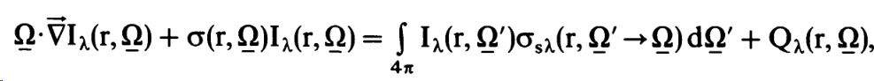
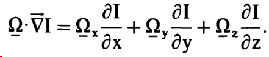
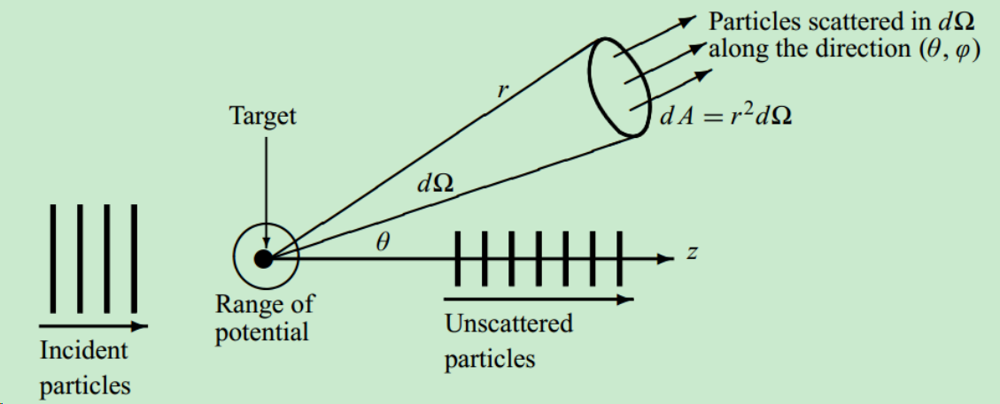
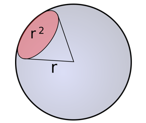
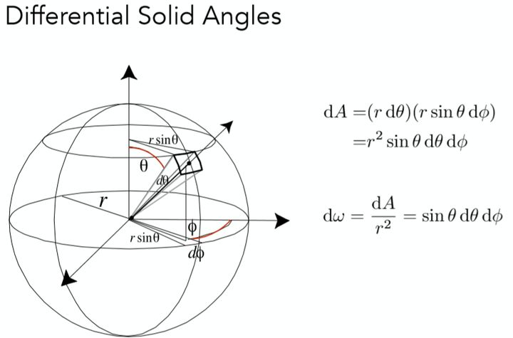

### Introduction
用于描述辐射场的函数是辐射度$I_\lambda(r, \Omega)$，取决于波长 $\lambda$、位置 $\mathrm{r}=(\mathrm{x}, \mathrm{y}, \mathrm{z})$ 和方向 $\Omega=(\Omega_{\mathrm{x}}, \Omega_y, \Omega_z)$；$\Omega_x^2+\Omega_y^2+\Omega_z^2=1$。传输方程是相空间能量守恒的表述。确定以下表达式中每个组成部分的物理性质：

这被称为传输方程。为简化起见，我们将省略表示波长依赖性的符号 $\lambda$。第一项是在$r$点沿着方向 $\Omega$ 的导数：

[散射又称作量子碰撞. 它是研究微观粒子运动规律、相互作用以及它们的内部结构的基础，在亚原子物理学的发展中占有举足轻重的地位。]([access?resId=0&materialId=slides&confId=3126](https://cicpi.ustc.edu.cn/indico/getFile.py/access?resId=0&materialId=slides&confId=3126))
在散射实验中，具有确定动量的粒子沿确定的方向射向靶粒子、受到靶粒子的作用后发生偏转. 这就是散射的基本物理图像。
在原子核物理学和粒子物理学中，截面是一个用于表达粒子间发生相互作用可能性的术语。

在考虑辐射传输问题时，为了度量源点对某一范围的视场角大小，我们引入立体角的概念。通常教材上的定义如下图所示，一个半径为 $r$ 的球体，用顶点与球心重合的圆雉去截球面，截取的球面积 $A$的大小除以半径的平方，即是立体角。公式为$\Omega=\frac{A}{r^2}$
 
立体角是以圆锥体的顶点为心，半径为r的球面被锥面所截得的面积来度量的，度量单位为“球面度”（steradian，符号∶sr）。球面度表示为三维弧度。 Sphere has $4 \pi$ steradians.

其中 $\theta$ 为天顶角， $\Phi$ 为方位角。
微分散射截面表达为：$d \sigma / d \Omega$。
其中 $\Omega$ 为出射粒子的空间角。这个微分表示每单位空间角的出射粒子对应的入射区域，因此对这个量在一个完整的空间角中积分即可获得总截面。微分散射截面在量子力学中可方便地由 $|f(\theta)|^2$ 求得；而 $f(\theta)$ 由量子力学中散射结果，进行渐近分析分解为入射波与散射波后 (如用分波方法分解为球谐函数，或玻恩近似），设定入射项的系数为 1 ，出射项系数即为 $f(\theta) / r$ 。

函数 $\sigma(\mathrm{r}, \boldsymbol{\Omega})$ 称作总散射截面，是散射截面 $\sigma_{\mathrm{s}^{\prime}}$ 和吸收截面 $\sigma_{\mathrm{a}}$ 的和：
$$
\sigma(\mathrm{r}, \underline{\Omega})=\sigma_{\mathrm{s}^{\prime}}(\mathrm{r}, \underline{\Omega})+\sigma_{\mathrm{a}}(\mathrm{r}, \underline{\Omega}) \text {. }
$$

这些截面被定义为光子在传播距离 $ds$ 时发生散射的概率为 $\sigma_{\mathrm{s}^{\prime}}(\mathrm{r}, \underline{\Omega}) \mathrm{ds}$。类似地，光子在传播距离 $ds$ 时被吸收的概率为 $\sigma_{\mathrm{a}}(\mathrm{r}, \Omega) \mathrm{ds}$。函数 $\sigma_{\mathrm{s}}$ 是从 $\Omega^{\prime}$ 散射到 $\mathrm{r}$ 点 $\Omega$ 周围一个单位[立体角](https://zhuanlan.zhihu.com/p/450731138) $\mathrm{d} \Omega$ 的微分散射截面。因此，
$$
\sigma_{\mathrm{s}^{\prime}}\left(\mathrm{r}, \underline{\Omega}^{\prime}\right)=\int_{4 \pi} \sigma_{\mathrm{s}}\left(\mathrm{r}, \underline{\Omega}^{\prime} \rightarrow \underline{\Omega}\right) \mathrm{d} \underline{\Omega}
$$
和,
$$
\frac{\sigma_{\mathrm{s}^{\prime}}\left(\mathrm{r}, \underline{\Omega}^{\prime}\right)}{\sigma\left(\mathrm{r}, \underline{\Omega}^{\prime}\right)} \leqslant 1
$$
