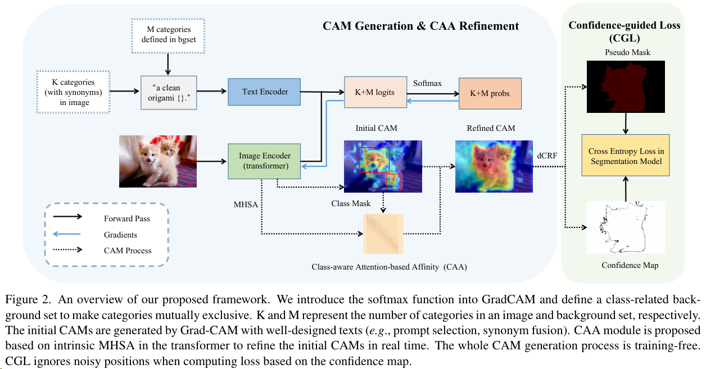
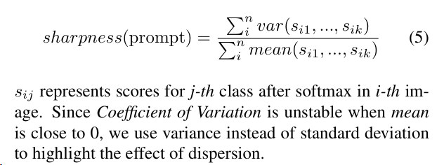

黑色星期五冲动消费scispace一年会员，基于AI的阅读助手，不打折买比较肉疼。

可以自动概括内容，给一些准确的、有条理的summary。但是最好是英文，翻译成中文就无法保持术语了。

22年12月的文章，用CLIP做的解释性方法。

We first review GradCAM and CLIP, and demonstrate the effect of the softmax function on GradCAM with the corresponding class-related background suppression strategy. Then, we introduce two text-driven strategies proposed for CLIP in the WSSS setting: sharpness-based prompt selection and synonym fusion. Finally, we present class-aware attention-based affinity (CAA) and confidence-guided loss (CGL) in detail

## Methods Used in CLIP-ES Framework:

### Utilizes the softmax function in GradCAM for background suppression.
在vit-based CLIP里做了Grad-CAM，用Softmax算梯度。附录里有和resnet-based clip的对比。

### Employs sharpness-based prompt selection for text input optimization.
大概是说imagenet是每张图一个类，voc每张图多个类。提出一种猜想，多标签任务，在voc里每张图多个类中，分数最高最显著的类会抑制其他类，导致分割结果不好。
Definition of Sharpness-Based Prompt
- A metric designed to measure the distribution of target class scores for multi-label images using different text prompts.

Purpose of Sharpness-Based Prompt
- Utilized to select the most effective text prompts that enhance the performance of Class Activation Maps (CAMs) generation in WSSS.

为了验证猜想，提出个指标 `sharpness`，

- The equation suggests that sharpness is a normalized measure, as it is a ratio of variance to mean, which could indicate the relative dispersion of data points.
- A higher sharpness value might imply that the prompts have a greater degree of variability relative to their mean, which could be interpreted as less consistency or predictability.
- Conversely, a lower sharpness value could indicate that the prompts are more consistent or have less variability relative to their average value.

### Implements synonym fusion to enhance text-driven strategies.

It involves placing different synonyms into one sentence, like "A clean origami of person, people, human," to clarify polysemous words.

Synonyms are sourced from WordNet or the nearest Glove word embedding, and specific words can be customized to enhance class performance.

### Introduces a class-aware attention-based affinity (CAA) module for CAM refinement.

搞了个类别感知亲和矩阵。CAA用MHSA的权重来修正CAMs。

### Applies a confidence-guided loss (CGL) for training the segmentation model.

