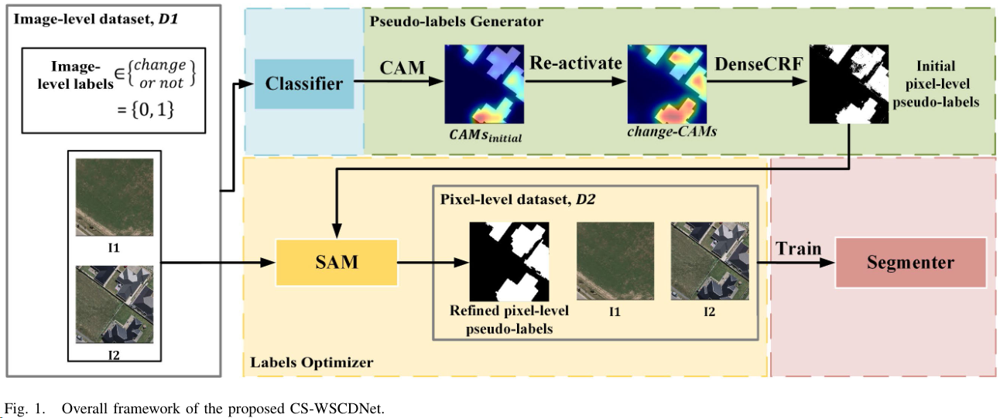
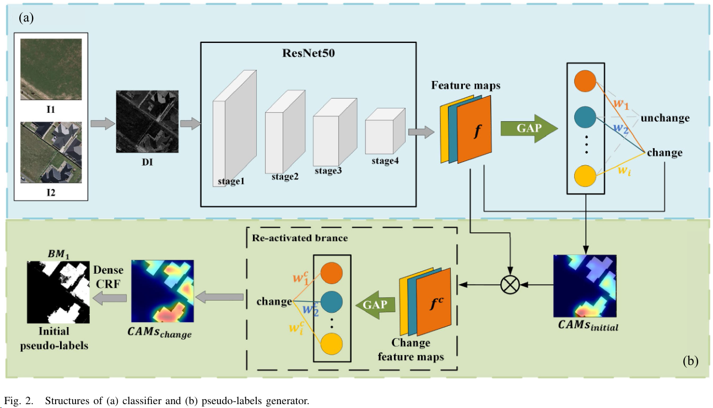
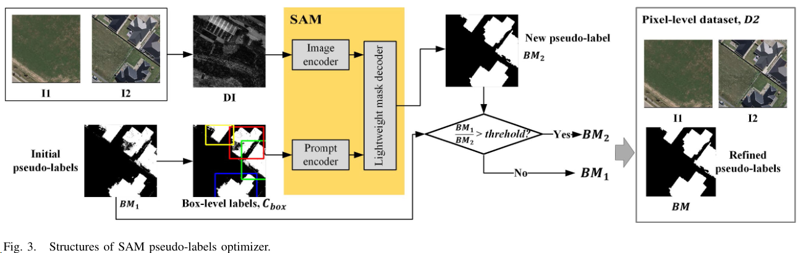
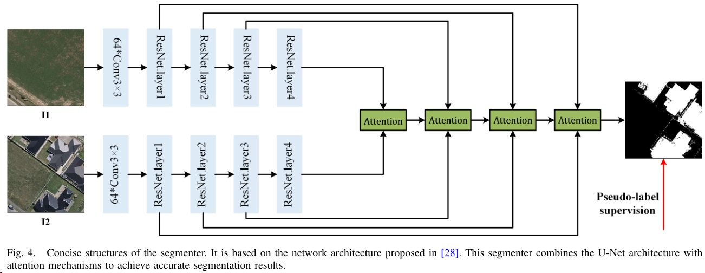

### CS-WSCDNet: Class Activation Mapping and Segment Anything Model-Based Framework for Weakly Supervised Change Detection
摘要：利用深度学习技术进行变化检测（CD）是遥感领域的热门话题；然而，大多数现有网络需要像素级标签进行监督学习，从多时相图像中标记所有变化像素是困难且耗时的。为解决这一挑战，我们提出了一种新型的弱监督变化检测（WSCD）框架，即CS-WSCDNet，它可以通过对具有图像级标签的样本进行训练来实现像素级结果。具体而言，该框架建立在类激活映射（CAM）的定位能力和基础模型零-shot分割能力（即segment anything model，SAM）的基础上。首先训练一个图像级分类器来确定图像对中是否发生了变化，然后利用CAM粗略定位图像对中变化的区域。随后，利用SAM优化这些粗略区域，并为变化对象生成像素级伪标签。这些伪标签随后用于像素级训练变化检测模型。为评估CS-WSCDNet的有效性，在两个高分辨率遥感数据集上进行了实验。结果表明，该框架不仅在WSCD任务中取得了最先进的性能，还展示了弱监督学习在CD领域的潜力。演示代码可在 https://github.com/WangLukang/CS-WSCDNet 找到。

- Results:

- Summary:
先训练resnet找到变化的区域，生成CAM。然后用DenseCRF精修边界，生成伪标签。伪标签生成box-level label 作为prompt，和图片一起输入SAM。再和DenseCRF精修进行threhold，得到最终的伪标签。

- Pipeline:
如图 1 所示，所提出的框架由四个模块组成: 1)用于确定图像对是否发生变化的图像级分类器，2)为变化的图像对生成初始像素级伪标签的伪标签生成器，3)SAM 伪标签优化器对初始伪标签进行细化以提高其准确性，4)伪标签引导的像素级 CD 分割器。

训练数据：让$I_1$和$I_2$分别表示第一和第二时间相位中对应的遥感图像。我们需要一个训练数据集（即$D_1=\left\langle I_1, I_2, C_{\text {image }}\right\rangle^N$），其中包含$N$个样本和图像级别标签$C_{\text {image }} \in\{0,1\}$。它被称为WSCD训练数据集，因为它只知道$I_1$和$I_2$之间是否存在变化，而没有像素级注释。WSCD框架的流程如下。

步骤1：利用ResNet 基于$D_1$训练一个图像级分类器，能够有效地将输入的双时相遥感图像分类为变化图像对和未变化图像对。

步骤2：在分类器收敛后，我们利用CAM技术从分类器网络生成CAMs。我们重新激活变化图像对的CAMs，得到变化-CAMs以粗略估计变化像素的位置，并使用DenseCRF对变化-CAMs进行后处理，生成一个二进制地图，表示为$\mathrm{BM}_1$，代表初始像素级伪标签。

步骤3：将$\mathrm{BM}_1$和原始图像$\left(I_1\right.$和$\left.I_2\right)$同时输入SAM，SAM生成一个二进制地图，表示为BM。该二进制地图表示具有精确边界的精细化像素级伪标签，更准确地勾画了变化区域。

步骤4：我们使用$I_1, I_2$和BM形成一个新的像素级训练集$D_2=\left\langle I_1, I_2, \mathrm{BM}\right\rangle^N$，其中包含$N$个样本。将$D_2$输入基于U-Net的分割器进行训练，以构建一个像素级监督的CD网络。

- Contribution:

该文主要贡献如下：
    - 提出了一个基于CAM和SAM的新型WSCD框架CS-WSCDNet，可以仅使用图像级标签实现像素级CD结果。
    - 这是SAM基础模型首次在WSCD领域进行零-shot迁移，为进一步发展WSCD提供了先驱性的参考。
    - 在两个高分辨率CD数据集上对所提出的框架进行了评估，结果表明其在处理高分辨率遥感图像WSCD任务方面的有效性，尤其在WSCD方面达到了最先进的性能。

- Code:

