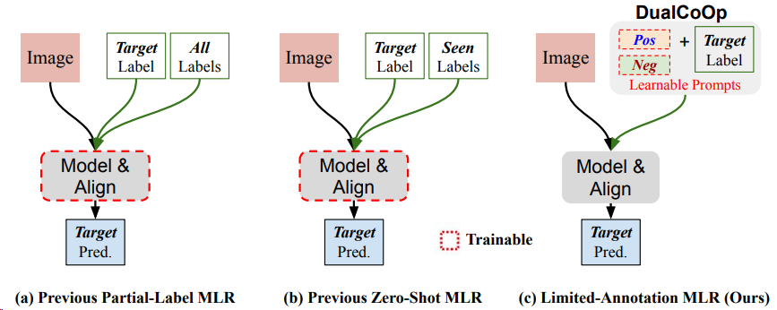
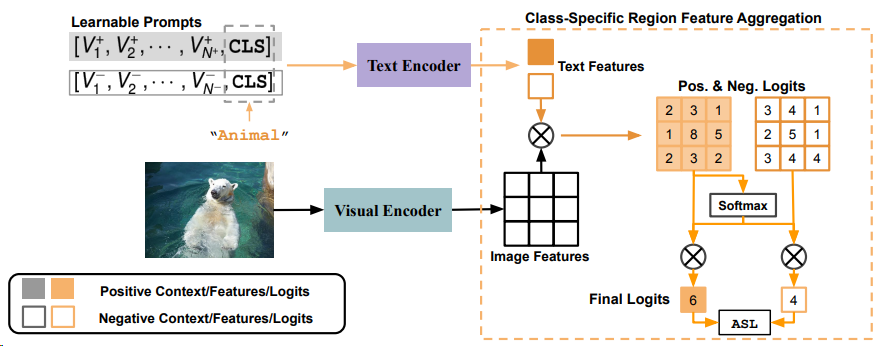

## DualCoOp: Fast Adaptation to Multi-Label Recognition with Limited Annotations

图1：以前的多标签识别（MLR）方法与我们的方法的概念比较。
在部分标签MLR（a）和零射击MLR（b）中，以前的工作学习对视觉和文本输入进行建模和对齐，并根据数据集上可用的有限语义注释，探索目标标签与所有/已见标签之间的相关性，这导致了次优性能和复杂的模型架构。相比之下，我们提出了一个统一的框架来解决两种有限注释任务（c）。我们依靠对包含大规模预训练视觉语言模型的视觉和文本输入进行建模和对齐，并仅学习了一对正和负的提示给这个模型。

### 方法
**问题定义。** 我们正式将具有有限注释的多标签识别定义如下：考虑$M$作为描述图像中对象或属性的类别集合。给定一个训练图像$I$，类别$m \in M$的存在可以是积极的、消极的或未知的，分别对应标签$y_m=1,-1$或0。在推理过程中，我们对输入图像预测每个感兴趣的标签。

图2：我们提出方法的示意图。
DualCoOp学习一对正和负的提示，以快速适应强大的预训练视觉-文本编码器到MLR任务。对于每个类别，两个提示生成两个对比的（正和负）文本嵌入作为文本编码器的输入。此外，我们提出了类别特定的区域特征聚合，将每个区域的特征首先投影到文本空间，然后通过类别特定语义响应的幅度来聚合空间logits。在训练期间，我们应用ASL损失[51]来优化可学习的提示，同时保持其他网络组件冻结。在推理期间，我们比较正和负的logits来对每个类别进行预测。

**方法概述。** 为了弥补图像标签不足或缺失的问题，学习类别名称的含义如何相互关联是很重要的，这样我们就可以在相关类别之间转移知识。通常，这是通过学习视觉和文本空间之间的对齐来实现的。然而，我们的数据集过于有限，无法学习到广泛且可推广的映射。我们建议利用大规模视觉语言预训练（CLIP [48]）学习的视觉和文本特征空间之间的强对齐性，这种方法具有轻量级的可学习开销，可以快速适应具有有限语义注释的MLR任务。图2提供了我们提出的方法的概述。DualCoOp学习一对“提示”上下文，形式为两个可学习的单词向量序列，以提供给定类别名称$m$的正和负上下文。这生成了正和负的文本特征$\left(F_t^m\right)_{+}$和$\left(F_t^m\right)_{-}$，这些特征被馈送到预训练的文本编码器中。此外，为了更好地识别位于图像不同位置的多个对象，空间聚合步骤被修改。我们首先计算每个投影的视觉特征$F_v^i$在位置$i$与$\left(F_t^m\right)_{+}/\left(F_t^m\right)_{-}$的相似度得分，以获得区域的预测logits。对于每个类别，我们执行所有空间logit的聚合，其中每个logit的权重由其相对幅度确定。我们称之为类别特定的区域特征聚合。在训练期间，我们通过ASL损失[51]优化可学习的提示，同时保持所有其他网络组件冻结。在推理过程中，我们直接比较最终的正和负logits来对每个标签$y_m$进行预测。

**双学习提示。** 我们提出了双重上下文优化（DualCoOp），而不是学习单一类别的单个提示[71]。DualCoOp为每个类别学习两个对比的提示上下文。双提示中的可学习部分分别携带正和负的上下文环境，并可以通过数据端到端地优化二元分类损失。具体地，我们定义给文本编码器的一对提示如下：
$$
\begin{aligned}
& \text{Prompt}^{+}=\left[V_1^{+}, V_2^{+}, \cdots, V_{N^{+}}^{+}, \text{CLS}\right], \\
& \text{Prompt}^{-}=\left[V_1^{-}, V_2^{-}, \cdots, V_{N^{-}}^{-}, \text{CLS}\right]
\end{aligned}
$$
其中每个$V$是一个可学习的单词嵌入向量（例如，在CLIP [48]中的维度为512），CLS是给定的类别名称。$N^{+}$和$N^{-}$分别是正和负提示中学习的单词标记的数量。为了简化，我们在实验中设置$N^{+}=N^{-}$。在解决具有部分标签的MLR时，我们为每个类别学习一对正和负提示（即类特定的提示对），并在零射击MLR中学习一对适用于所有类别的提示对。有了一对提示，我们计算二元分类输出$p$如下：
$$
p=\frac{\exp \left(\left<A\left(E_v(I)\right), E_t\left(\text{Prompt}^{+}\right)\right>/ \tau\right)}{\exp \left(\left<A\left(E_v(I)\right), E_t\left(\text{Prompt}^{+}\right)\right>/ \tau\right)+\exp \left(\left<A\left(E_v(I)\right), E_t\left(\text{Prompt}^{-}\right)\right>/ \tau\right)},
$$
其中$\left<\cdot, \cdot\right>$表示余弦相似度，$p$是对给定（图像，标签）对作为正样本的预测概率。$E_v(\cdot)$和$E_t(\cdot)$分别是来自视觉语言预训练的视觉和文本编码器。$A(\cdot)$是我们新的聚合函数，用于自适应地减少每个类别的视觉特征的空间维度，接下来将讨论。

**类别特定区域特征聚合。** 在多标签图像识别中，常见的情况是多个对象出现在图像的不同区域。对所有类别产生单个图像级特征向量的汇聚会导致次优性能，因为空间信息被减少，不同的对象被混合在一起。在这项工作中，我们重新构造了CLIP [48]中视觉编码器的最后一个多头注意力池化层，并应用了类别特定池化来自适应地聚合多标签设置中的区域特征。CLIP中的原始注意力池化层首先对视觉特征图进行池化，然后将全局特征向量投影到文本空间，如下所示：
$$
\begin{aligned}
& \operatorname{AttrPool}(x)=\operatorname{Proj}_{v \rightarrow t}\left(\sum_i \operatorname{softmax}\left(\frac{q(\bar{x}) k\left(x_i\right)^T}{C}\right) \cdot v\left(x_i\right)\right) \\
& =\sum_i \operatorname{softmax}\left(\frac{q(\bar{x}) k\left(x_i\right)^T}{C}\right) \cdot \operatorname{Proj}_{v \rightarrow t}\left(v\left(x_i\right)\right)=\operatorname{Pool}\left(\operatorname{Proj}_{v \rightarrow t}\left(v\left(x_i\right)\right)\right),
\end{aligned}
$$
其中$q, v$和$k$是独立的线性嵌入层，$x=E_v(I)$是视觉编码器的输出特征图。通过移除池化操作，我们可以将每个区域$i$的视觉特征$x_i$投影到文本空间[70]：

$$
F_v^i=\operatorname{Proj}_{v \rightarrow t}\left(v\left(x_i\right)\right) .
$$

对于每个区域$i$和每个类别$m$，我们计算$F_v^i$和$\left(F_t^m\right)^{+}=E_t\left(\mathrm{Prompt}^{+}\right)$之间的余弦相似度，记为$S_{i, m}^{+}=<F_v^i,\left(F_t^m\right)^{+}>$，并以相同的方式计算$S_{i, m}^{-}$。为了对整个图像进行单一预测，我们根据$S_{i, m}^{+}$的大小聚合$S_{i, m}^{+}$和$S_{i, m}^{-}$到$S_m^{+}$和$S_m^{-}$，即：
$$
\begin{aligned}
& S_m^{+}=A\left(S_{i, m}^{+}\right)=\sum_i\left(\operatorname{softmax}\left(S_{i, m}^{+}\right) \cdot S_{i, m}^{+}\right), \\
& S_m^{-}=A\left(S_{i, m}^{-}\right)=\sum_i\left(\operatorname{softmax}\left(S_{i, m}^{+}\right) \cdot S_{i, m}^{-}\right) .
\end{aligned}
$$
值得注意的是，在我们重新定义的空间聚合函数中，我们没有引入任何新的参数。将视觉特征投影到文本空间所使用的所有参数都继承自CLIP中原始的多头注意力池化层。

**优化。** 我们应用了不对称损失（ASL）[51]来处理多标签识别优化中固有的正负不平衡问题。具体来说，我们计算了正（图像，标签）对$\mathcal{L}_{+}$和负（图像，标签）对$\mathcal{L}_{-}$的损失如下：
$$
\begin{aligned}
& \mathcal{L}_{+}=(1-p)^{\gamma_{+}} \log (p), \\
& \mathcal{L}_{-}=\left(p_c\right)^{\gamma_{-}} \log \left(1-p_c\right),
\end{aligned}
$$
其中$p_c=\max (p-c, 0)$是通过硬阈值化通过间隔$c$来转移负样本的概率。我们设置超参数$\gamma_{-} \geq \gamma_{+}$，以便ASL降低并硬阈值化简单的负样本。一对可学习的提示通过将ASL反向传播到冻结的文本编码器来更新。

