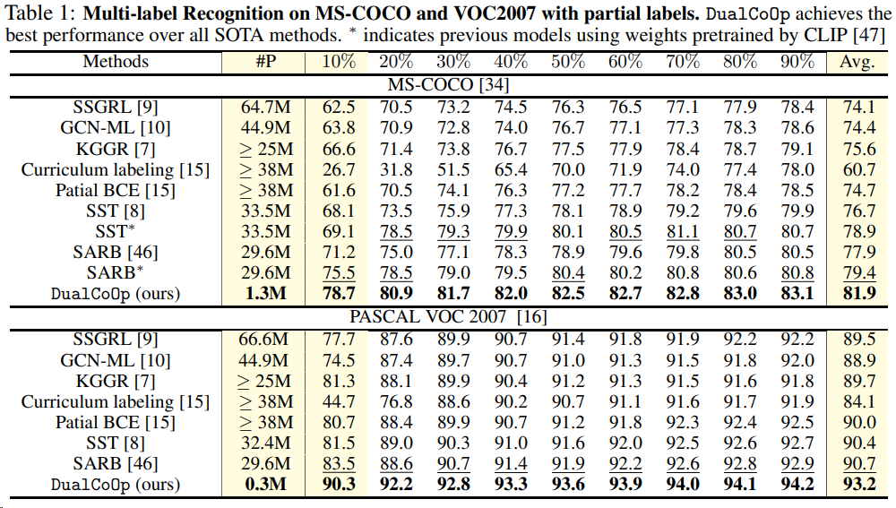
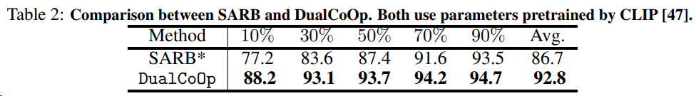
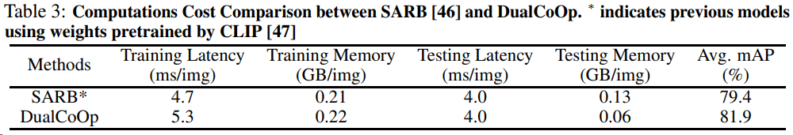
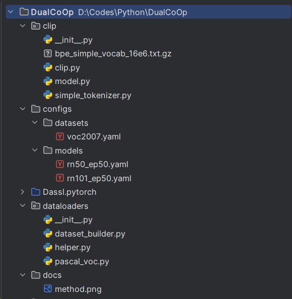
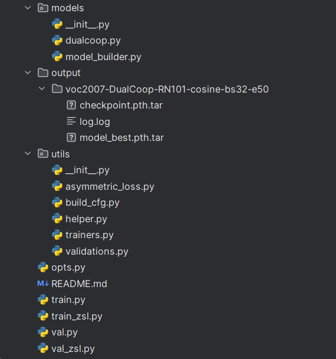
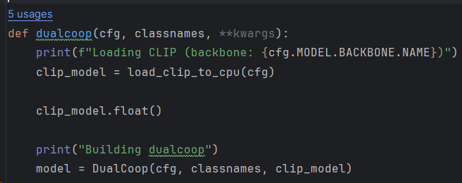
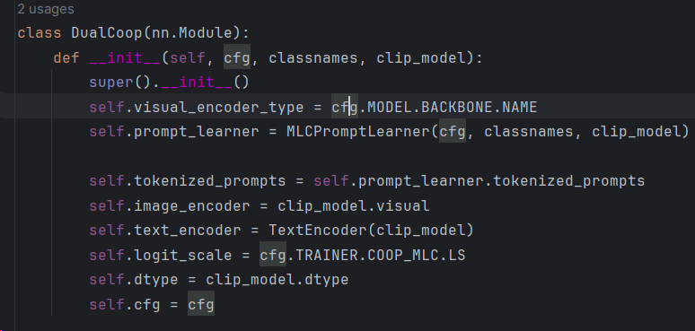
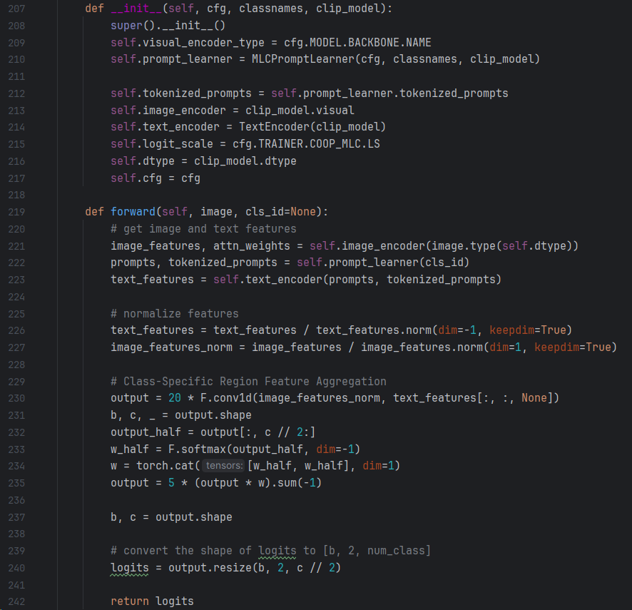

## DualCoOp: Fast Adaptation to Multi-Label Recognition with Limited Annotations


图1：以前的多标签识别（MLR）方法与我们的方法的概念比较。
在部分标签MLR（a）和零射击MLR（b）中，以前的工作学习对视觉和文本输入进行建模和对齐，并根据数据集上可用的有限语义注释，探索目标标签与所有/已见标签之间的相关性，这导致了次优性能和复杂的模型架构。相比之下，我们提出了一个统一的框架来解决两种有限注释任务（c）。我们依靠对包含大规模预训练视觉语言模型的视觉和文本输入进行建模和对齐，并仅学习了一对正和负的提示给这个模型。


### 方法
**问题定义。** 我们正式将具有有限注释的多标签识别定义如下：考虑$M$作为描述图像中对象或属性的类别集合。给定一个训练图像$I$，类别$m \in M$的存在可以是积极的、消极的或未知的，分别对应标签$y_m=1,-1$或0。在推理过程中，我们对输入图像预测每个感兴趣的标签。


图2：我们提出方法的示意图。
DualCoOp学习一对正和负的提示，以快速适应强大的预训练视觉-文本编码器到MLR任务。对于每个类别，两个提示生成两个对比的（正和负）文本嵌入作为文本编码器的输入。此外，我们提出了类别特定的区域特征聚合，将每个区域的特征首先投影到文本空间，然后通过类别特定语义响应的幅度来聚合空间logits。在训练期间，我们应用ASL损失[51]来优化可学习的提示，同时保持其他网络组件冻结。在推理期间，我们比较正和负的logits来对每个类别进行预测。

**方法概述。** 为了弥补图像标签不足或缺失的问题，学习类别名称的含义如何相互关联是很重要的，这样我们就可以在相关类别之间转移知识。通常，这是通过学习视觉和文本空间之间的对齐来实现的。然而，我们的数据集过于有限，无法学习到广泛且可推广的映射。我们建议利用大规模视觉语言预训练（CLIP [48]）学习的视觉和文本特征空间之间的强对齐性，这种方法具有轻量级的可学习开销，可以快速适应具有有限语义注释的MLR任务。图2提供了我们提出的方法的概述。DualCoOp学习一对“提示”上下文，形式为两个可学习的单词向量序列，以提供给定类别名称$m$的正和负上下文。这生成了正和负的文本特征 $\left(F_t^m\right)_{+}$ 和 $\left(F_t^m\right)_{-}$ ， 这些特征被馈送到预训练的文本编码器中。此外，为了更好地识别位于图像不同位置的多个对象，空间聚合步骤被修改。我们首先计算每个投影的视觉特征$F_v^i$在位置$i$与$\left(F_t^m\right)_{+}/\left(F_t^m\right)_{-}$的相似度得分，以获得区域的预测logits。对于每个类别，我们执行所有空间logit的聚合，其中每个logit的权重由其相对幅度确定。我们称之为类别特定的区域特征聚合。在训练期间，我们通过ASL损失[51]优化可学习的提示，同时保持所有其他网络组件冻结。在推理过程中，我们直接比较最终的正和负logits来对每个标签$y_m$进行预测。

**双学习提示。** 我们提出了双重上下文优化（DualCoOp），而不是学习单一类别的单个提示[71]。DualCoOp为每个类别学习两个对比的提示上下文。双提示中的可学习部分分别携带正和负的上下文环境，并可以通过数据端到端地优化二元分类损失。具体地，我们定义给文本编码器的一对提示如下：
$$
\begin{aligned}
& \text{Prompt}^{+}=\left[V_1^{+}, V_2^{+}, \cdots, V_{N^{+}}^{+}, \text{CLS}\right], \\
& \text{Prompt}^{-}=\left[V_1^{-}, V_2^{-}, \cdots, V_{N^{-}}^{-}, \text{CLS}\right]
\end{aligned}
$$
其中每个$V$是一个可学习的单词嵌入向量（例如，在CLIP [48]中的维度为512），CLS是给定的类别名称。$N^{+}$和$N^{-}$分别是正和负提示中学习的单词标记的数量。为了简化，我们在实验中设置$N^{+}=N^{-}$。在解决具有部分标签的MLR时，我们为每个类别学习一对正和负提示（即类特定的提示对），并在零射击MLR中学习一对适用于所有类别的提示对。有了一对提示，我们计算二元分类输出$p$如下：

$$
p=\frac{\exp \left(\left<A\left(E_v(I)\right), E_t\left(\text{Prompt}^{+}\right)\right>/ \tau\right)}{\exp \left(\left<A\left(E_v(I)\right), E_t\left(\text{Prompt}^{+}\right)\right>/ \tau\right)+\exp \left(\left<A\left(E_v(I)\right), E_t\left(\text{Prompt}^{-}\right)\right>/ \tau\right)},
$$

- $p$ 是对于给定图像 $I$ 和标签的预测概率。
- $E_v(I)$ 是图像 $I$ 经过视觉编码器编码后的特征表示。
- $E_t(\text{Prompt}^{+})$ 和 $E_t(\text{Prompt}^{-})$ 分别是与目标类别相关的正向和负向提示的文本编码表示。
- $\langle \cdot, \cdot \rangle$ 表示向量之间的点积，这里是用来计算视觉特征与文本特征之间的相似度。
- $A(\cdot)$ 是自适应地减少了视觉特征的空间维度的函数，用于适应地汇总每个类别的视觉特征。在这个公式中，$A(\cdot)$ 会将每个区域的特征映射到文本空间中。
- $\tau$ 是一个温度参数，用于控制指数函数的平滑度。

公式的计算流程是这样的：
1. 首先，计算图像特征 $E_v(I)$ 和正向提示的文本特征 $E_t(\text{Prompt}^{+})$ 之间的点积，然后除以温度参数 $\tau$ 并进行指数化。
2. 同样地，计算图像特征 $E_v(I)$ 和负向提示的文本特征 $E_t(\text{Prompt}^{-})$ 之间的点积，然后除以温度参数 $\tau$ 并进行指数化。
3. 分别将正向和负向的指数化结果相加。
4. 将正向的指数化结果除以上一步的结果，得到最终的概率值。

这个公式的目的是利用图像的视觉特征和类别的文本特征来预测每个标签的概率，从而实现多标签图像识别任务。`类似softmax`

其中$\left<\cdot, \cdot\right>$表示余弦相似度，$p$是对给定（图像，标签）对作为正样本的预测概率。$E_v(\cdot)$和$E_t(\cdot)$分别是来自视觉语言预训练的视觉和文本编码器。$A(\cdot)$是我们新的聚合函数，用于自适应地减少每个类别的视觉特征的空间维度，接下来将讨论。

**类别特定区域特征聚合。** 在多标签图像识别中，常见的情况是多个对象出现在图像的不同区域。对所有类别产生单个图像级特征向量的汇聚会导致次优性能，因为空间信息被减少，不同的对象被混合在一起。在这项工作中，我们重新构造了CLIP [48]中视觉编码器的最后一个多头注意力池化层，并应用了类别特定池化来自适应地聚合多标签设置中的区域特征。CLIP中的原始注意力池化层首先对视觉特征图进行池化，然后将全局特征向量投影到文本空间，如下所示：

$$
\begin{aligned}
& \operatorname{AttrPool}(x)=\operatorname{Proj}_{v \rightarrow t}\left(\sum_i \operatorname{softmax}\left(\frac{q(\bar{x}) k\left(x_i\right)^T}{C}\right) \cdot v\left(x_i\right)\right) \\
& =\sum_i \operatorname{softmax}\left(\frac{q(\bar{x}) k\left(x_i\right)^T}{C}\right) \cdot \operatorname{Proj}_{v \rightarrow t}\left(v\left(x_i\right)\right)=\operatorname{Pool}\left(\operatorname{Proj}_{v \rightarrow t}\left(v\left(x_i\right)\right)\right),
\end{aligned}
$$

其中$q, v$和$k$是独立的线性嵌入层，$x=E_v(I)$是视觉编码器的输出特征图。通过移除池化操作，我们可以将每个区域$i$的视觉特征$x_i$投影到文本空间[70]：

$$
F_v^i=\operatorname{Proj}_{v \rightarrow t}\left(v\left(x_i\right)\right) .
$$

对于每个区域$i$和每个类别$m$，我们计算$F_v^i$和$\left(F_t^m\right)^{+}=E_t\left(\mathrm{Prompt}^{+}\right)$之间的余弦相似度，记为$S_{i, m}^{+}=<F_v^i,\left(F_t^m\right)^{+}>$，并以相同的方式计算$S_{i, m}^{-}$。为了对整个图像进行单一预测，我们根据$S_{i, m}^{+}$的大小聚合$S_{i, m}^{+}$和$S_{i, m}^{-}$到$S_m^{+}$和$S_m^{-}$，即：
$$
\begin{aligned}
& S_m^{+}=A\left(S_{i, m}^{+}\right)=\sum_i\left(\operatorname{softmax}\left(S_{i, m}^{+}\right) \cdot S_{i, m}^{+}\right), \\
& S_m^{-}=A\left(S_{i, m}^{-}\right)=\sum_i\left(\operatorname{softmax}\left(S_{i, m}^{+}\right) \cdot S_{i, m}^{-}\right) .
\end{aligned}
$$
值得注意的是，在我们重新定义的空间聚合函数中，我们没有引入任何新的参数。将视觉特征投影到文本空间所使用的所有参数都继承自CLIP中原始的多头注意力池化层。

**优化。** 我们应用了不对称损失（ASL）[51]来处理多标签识别优化中固有的正负不平衡问题。具体来说，我们计算了正（图像，标签）对$\mathcal{L}_{+}$和负（图像，标签）对$\mathcal{L}_{-}$的损失如下：
$$
\begin{aligned}
& \mathcal{L}_{+}=(1-p)^{\gamma_{+}} \log (p), \\
& \mathcal{L}_{-}=\left(p_c\right)^{\gamma_{-}} \log \left(1-p_c\right),
\end{aligned}
$$
其中$p_c=\max (p-c, 0)$是通过硬阈值化通过间隔$c$来转移负样本的概率。我们设置超参数$\gamma_{-} \geq \gamma_{+}$，以便ASL降低并硬阈值化简单的负样本。一对可学习的提示通过将ASL反向传播到冻结的文本编码器来更新。

### 实验

#### 部分标签的多标签识别

**数据集。** 我们在MS-COCO [34]、VOC2007 [16]和BigEarth [5]上进行实验，以评估具有部分标签的多标签识别。MS-COCO [34]包含80个常见的物体类别，我们使用官方的train2014（82K图像）和val2014（40K图像）拆分用于训练和测试。VOC2007 [16]包含20个物体类别，我们使用官方的trainval（5K图像）和test（5K图像）拆分用于训练和测试。此外，由于CLIP预训练数据不公开，并且有理由相信CLIP预训练数据涵盖了许多粗粒度和细粒度的视觉领域，因为它在许多下游任务的零射击评估中表现良好，我们还在Remote Sensing Image数据集BigEarth [5]上进行了实验，其领域远离主流论文中的数据集（即PASCAL VOC、MS-COCO和NUS-WIDE）。为了创建具有部分标签的训练集，我们从完全注释的训练集中随机屏蔽标签，并使用剩余的标签进行训练，遵循标准做法[8, 15, 46]。在这项工作中，我们将保留标签的比例从10%变化到90% [8, 46]。

**评估。** 在所有数据集上，我们按照[8, 15, 46]的做法，报告了每个可用于优化的标签比例（从10%到90%）的平均平均精度（mAP）及其所有比例的平均值。我们计算了每个基线和DualCoOp的可学习参数（#P）来衡量优化的复杂性。由于页面限制，我们还将在补充材料中报告DualCoOp在不同训练标签比例下的每类和总体精度（CP和OP）、召回率（CR和OR）和F1值（CF1和OF1）。

**实现。** 我们在所有基线和DualCoOp中采用ResNet-101 [19]作为视觉编码器，输入分辨率为$448 \times 448$，并使用与CLIP [47]中相同的Transformer [48, 58]作为文本编码器。`视觉编码器和文本编码器从CLIP预训练模型中初始化，并在优化过程中保持冻结状态`。`对于每个类别/标签，我们学习两个独立的上下文向量，其中包含16个上下文令牌`$(\mathrm{N}=16)$，遵循[71]的方法，这是DualCoOp中唯一可学习的部分。我们使用SGD优化器，初始学习率为0.002，按照余弦退火规则衰减。我们训练上下文向量50个epochs，批量大小分别为32/8/32（对于MS-COCO/VOC2007/BigEarth）。对于ASL损失，我们通过验证选择$\gamma_{+}=1, \gamma_{-}=2$和$c=0.05$。训练使用一台RTX A6000完成。

**基线。** 为了评估DualCoOp的有效性，我们与以下基线进行比较：（1）SSGRL [9]、GCN-ML [10]和KGGR [7]采用图神经网络来建模标签依赖关系。我们按照[8]的方法报告它们在部分标签设置下的性能。（2）课程标签[15]和SST [8]为未知标签生成伪标签。（3）Partial BCE [15]使用标准化的BCE损失来更好地利用部分标签。（4）SARB [46]将不同图像中的类别特定表示混合在一起，将已知标签的信息转移到未知标签以补充。



**结果。** 表1显示了DualCoOp和所有基线在使用10%至90%的标签进行优化时的mAP比较结果。对于最近的两个工作（SST [8]和SARB [46]），我们进一步将它们的视觉编码器的初始化中的ImageNet预训练权重 [19] 替换为CLIP预训练权重 [47]，得到表1中的SST∗和SARB∗。由于我们学习了类别特定的提示，DualCoOp在MS-COCO上采用的可学习参数比VOC2007更多。我们提出的DualCoOp在训练过程中的所有标签比例下都取得了最佳性能，并且具有最小的可学习开销（在MS-COCO上为1.3M vs. SARB∗的29.6M，在VOC2007上为0.3M vs. SARB∗的29.6M）。值得注意的是，DualCoOp相对于次佳方法的改进非常明显，MS-COCO上为3.2%，VOC2007上为6.8%，尤其是在训练过程中只提供10%的标签时。这表明DualCoOp可以快速适应具有少量标签的多标签识别任务。在BigEarth上，我们将DualCoOp与强基线SARB进行了比较。表2显示，DualCoOp在提供10%标签时始终比SARB提高了11.0%，平均性能提高了6.1%，这证明了DualCoOp通过利用强大的视觉-语言预训练在各种视觉领域中提高了性能。




**全标签训练。** 在MS-COCO上，我们使用100%的训练标签并对视觉编码器进行微调，DualCoOp实现了85.2%的mAP，在性能上优于以往的SOTA方法，如ASL [51]（85.0% mAP）和CSRA [74]（83.5% mAP），使用相同的ResNet-101骨干网络。没有对视觉编码器进行微调时，我们注意到我们的性能下降到了83.2%的mAP，尽管如此，仍然与ASL和CSRA的性能相当。这样的性能下降可能是由于用于预训练CLIP模型的图像-文本对中的噪声以及预训练任务与MLR任务之间的目标不一致造成的。这也表明，即使是使用更大规模的数据进行预训练，利用预训练的CLIP模型解决MLR任务也是非常困难的。

**计算成本。** 我们使用相同的设备（一台Nvidia A100 GPU）比较DualCoOp和SARB [46]在训练/测试延迟和内存方面的计算成本（见表3）。对于当前的多标签识别任务，在推断之前，类别是预先设置的（即我们已经知道在推断过程中要考虑哪些类别）。在这种情况下，我们根据学习的提示和类别名称为每个类别计算文本特征。然后，在测试期间，我们使用预先计算的文本特征来预测每个图像。由于文本特征是预先计算的（计算开销非常轻），因此在推断过程中不执行文本编码器。对于训练，基于CLIP的方法稍微提高了延迟时间和内存消耗，因为在前向过程中同时执行图像和文本编码器，并且在DualCoOp中只更新提示。

###  代码

**训练**
```python
python train.py --config_file configs/models/rn101_ep50.yaml --datadir ../VOC2007/ --dataset_config_file configs/datasets/voc2007.yaml --input_size 224 --lr 0.001 --loss_w 0.03 -pp 1
```

**推理**
```python
python val.py --config_file configs/models/rn101_ep50.yaml --datadir ../VOC2007/ --dataset_config_file configs/datasets/voc2007.yaml --input_size 224  --pretrained output/voc2007-DualCoop-RN101-cosine-bs32-e50/model_best.pth.tar --csc
```




#### 模型








