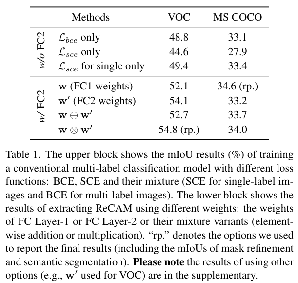
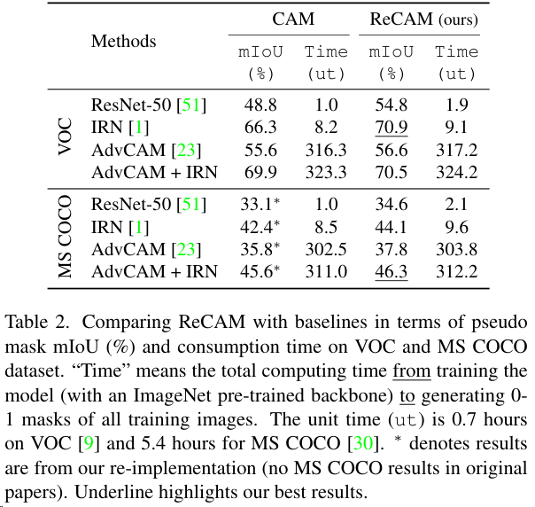
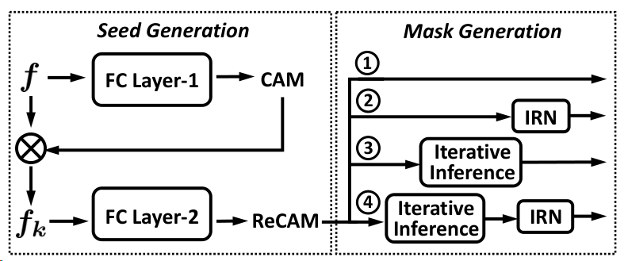
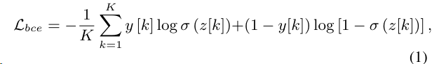
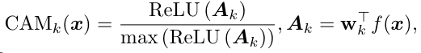
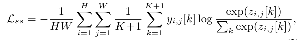
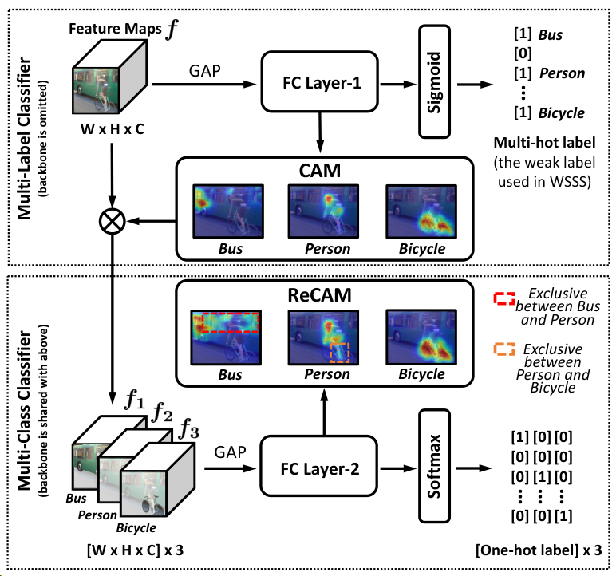
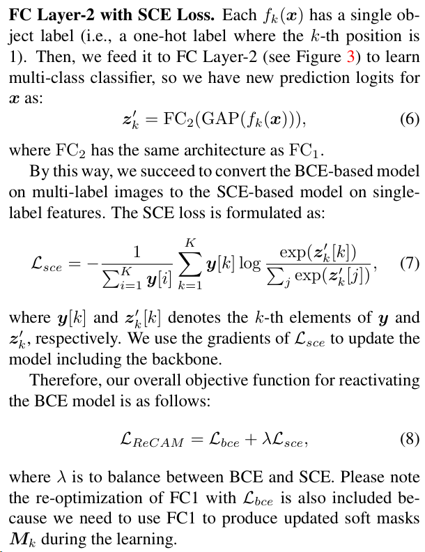
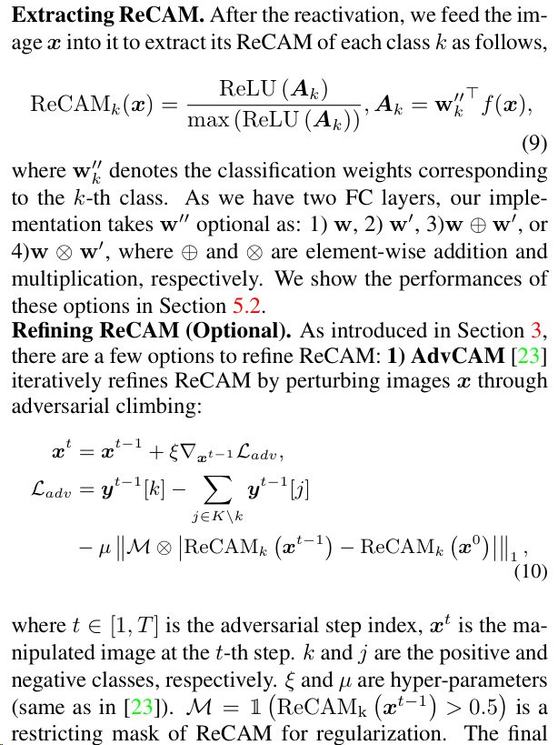
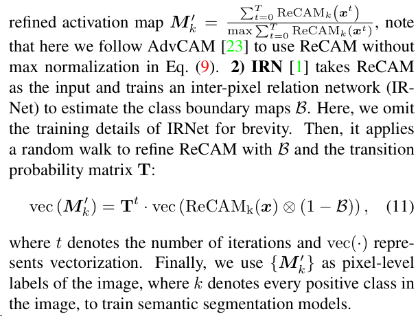

## CVPR 2022 Class Re-Activation Maps for Weakly-Supervised Semantic Segmentation

本篇文章从改进弱监督语义分割三部曲的第一步-利用分类标签训练分类网络生成CAM出发，引出了使用BCE作为损失函数对于分类网络生成CAM的缺陷，并以此为基础，提出了一种结合BCE和SCE（即softmax 交叉熵，一般用于单标签图像分类）来训练分类网络的的方法。

代码Heavily bought from AdvCAM & IRNet

将类激活映射（CAM）提取为弱监督语义分割（WSSS）的伪掩码，可以说是生成伪掩码的最标准步骤。然而，我们发现令人不满意的伪掩码的关键在于广泛应用于CAM中的二元交叉熵损失（BCE）。具体来说，由于BCE的类求和池化特性，CAM中的每个像素可能对出现在同一感受野中的多个类别具有响应。因此，给定一个类别，其热点CAM像素可能错误地侵入属于其他类别的区域，或者非热点像素实际上可能属于该类别的一部分。为此，我们引入了一个非常简单但惊人有效的方法：通过使用softmax交叉熵损失（SCE）重新激活收敛的CAM，将其称为ReCAM。对于给定的图像，我们使用CAM来提取每个单独类别的特征像素，并将它们与类别标签一起使用，在backbone之后使用SCE学习另一全连接层。一旦收敛，我们以与CAM相同的方式提取ReCAM。由于SCE的对比性质，像素响应被分解成不同的类别，因此预期掩码的歧义性更少。在PASCAL VOC和MS COCO上的评估表明，ReCAM不仅生成高质量的掩码，而且支持在任何CAM变体中轻松插入使用，几乎没有额外开销。我们的代码公开在https://github.com/zhaozhengChen/ReCAM。

### Results

### Code
 
Following general WSSS models, the progress can be easily comprehend in the `step` folder.

#### 训练类激活图

### Preliminaries

图2. 使用 ReCAM 生成弱监督语义分割（WSSS）的伪掩码的流程。该流程分为两个步骤，即种子生成和掩码生成，而我们的 ReCAM 被作为一个模块嵌入到种子生成步骤中。掩码生成有几个选项：1）直接将 ReCAM 作为伪掩码；2）使用最常见的 IRN [1] 方法对 ReCAM 进行改进；3）通过 ReCAM 模型迭代地推断出更好的掩码；以及4）级联选项3和2。学习 ReCAM 模型的详细信息如图3所示。表2展示了这些选项的总体比较结果。

**CAM**。CAM [51] 的第一步是使用全局平均池化（GAP）后跟预测层（例如 ResNet [12] 的 FC 层）训练一个多标签分类模型。每个训练样本的预测损失由以下公式中的 BCE 函数计算：

其中，$z[k]$ 表示第 $k$ 类的预测 logit，$\sigma(\cdot)$ 是 sigmoid 函数，$K$ 是前景对象类别的总数（在数据集中）。$y[k] \in\{0,1\}$ 是第 $k$ 类的图像级标签，其中 1 表示图像中存在该类别，0 则表示不存在。

一旦模型收敛，我们将图像 $x$ 输入模型中以提取出出现在 ${x}$ 中的第 $k$ 类的 CAM（类激活映射）：

其中，${w}_k$ 表示与第 $k$ 类相对应的分类权重（例如 ResNet 的 ${FC}$ 层），$f(x)$ 表示 GAP 前的 ${x}$ 的特征图。

请注意，为了简化，我们假设模型的分类头始终是一个单独的 FC 层，并在接下来使用 ${w}$ 表示其权重。

**伪掩码**。有几种选项可以从 CAM 生成伪掩码：1）将 CAM 阈值化为 0-1 掩码；2）使用 IRN [1]——一种广泛使用的改进方法对 CAM 进行改进；3）通过分类模型迭代地改进 CAM，例如使用 AdvCAM [23]；以及4）级联选项3和2。在图2中，我们用我们的 ReCAM 演示了这些选项的使用方式。我们将在第4.1节中详细阐述这些内容。

**语义分割**。这是弱监督语义分割（WSSS）的最后一步。我们使用伪掩码来训练语义分割模型。
以完全监督的方式训练模型。目标函数如下：

其中，$y_{i, j}$ 和 $z_{i, j}$ 分别表示像素 $(i, j)$ 处的标签和预测 logit。$y_{i, j}[k]$ 和 $z_{i, j}[k]$ 分别表示 $y_{i, j}$ 和 $z_{i, j}$ 的第 $k$ 个元素。$H$ 和 $W$ 分别为图像的高度和宽度。$K$ 是类别的总数。$K+1$ 表示包括背景类。
W
### ReCAM方法

图3. ReCAM 的训练框架。在上部块中，是使用 BCE 对多标签分类器进行传统训练。为了简洁起见，通过骨干网络进行的特征提取被省略。我们为每个类别提取 CAM，然后将其（作为归一化的软掩码）应用于特征图 $f$ 上，以获得特定类别的特征 $f_k$。在下部块中，我们使用 $f_k$ 及其单个标签，使用 SCE 损失来学习多类分类器。该损失的梯度通过整个网络反向传播，包括骨干网络在内。

**骨干网络和多标签特征**。我们使用标准的 ResNet-50 作为我们的骨干网络（即特征编码器）来提取特征。对于给定的输入图像 ${x}$ 和其多标签类别 ${y} \in \{0,1\}^K$，我们将特征编码器的输出表示为 $f({x}) \in {R}^{W \times H \times C}$。这里，$C$ 表示通道数，$H$ 和 $W$ 分别表示高度和宽度。$K$ 是数据集中前景类别的总数。请注意，在图3中，1）为简洁起见省略了特征提取过程；2）特征 $f({x})$ 在上部块中被写作 ${f}$，通常代表多个对象。

**带有 BCE 损失的全连接层-1**。在 CAM 的传统模型中，特征 $f({x})$ 首先经过一个 GAP 层，然后结果被送入一个全连接层进行预测[51]。因此，预测 logits 可以表示为
$$
{z}={FC}_1({GAP}(f({x}))) .
$$
然后，${z}$ 和图像级别标签 ${y}$ 被用于计算 ${BCE}$ 损失。元素级的公式如 Eq. (1) 给出。提取 CAM。我们根据特征 $f({x})$ 和全连接层对应的权重 ${w}_k$ 提取每个单独类别 $k$ 的 CAM，其形式如 Eq. (2) 所示。简记为 ${CAM}_k({x})$，记为 ${M}_k \in {R}^{W \times H}$。

**单标签特征**。如图3所示，我们使用 ${M}_k$ 作为软掩码，应用在 $f({x})$ 上提取类特定特征 $f_k({x})$。我们计算 ${M}_k$ 与 $f({x})$ 每个通道的逐元素乘积，如下所示，
$$
f_k^c({x})={M}_k \otimes f^c({x}),
$$
其中 $f^c({x})$ 和 $f_k^c({x})$ 分别表示乘法前后的单通道（通过使用 ${M}_k$），$c$ 范围从 1 到 $C$，$C$ 是特征图的数量（即通道数）。特征图块 $f_k({x})$（每个包含 $C$ 个通道）对应于图3中的示例 ${f}_1, {f}_2, {f}_3$。

### 实验

实验
5.1. 数据集和设置
数据集包括常用的 PASCAL VOC 2012 [9] 和 MS COCO 2014 [30]。VOC 包含 20 个前景目标类别和 1 个背景类别。它在训练集、验证集和测试集中分别有 1,464、1,449 和 1,456 个样本。根据相关工作 [1,23,45]，我们使用了由 Hariharen 等人提供的扩充训练集，其中包含 10,582 张训练图像。MS COCO 包含 80 个目标类别和 1 个背景类别。它在训练集和验证集中分别有 80,000 和 40,000 个样本。在这两个数据集上，我们仅在训练过程中使用图像级别标签，这是弱监督语义分割中最具挑战性的设置。

评估指标。我们主要有两个评估步骤。掩码生成：我们为训练集中的图像生成伪掩码，并使用其对应的地面实况掩码计算 mIoU。语义分割：我们训练语义分割模型，用其预测验证集或测试集图像的掩码，并基于它们的地面实况掩码计算 mIoU。我们还在补充材料中提供了 F1 值和像素精度的结果。

网络架构。对于掩码生成，我们遵循 [1,23,45] 使用 ResNet-50 作为骨干网络，其生成的特征图大小为 32 × 32 × 2048。对于语义分割，我们采用 ResNet-101（遵循 [1,23,45]）和 Swin Transformer [31]（首次用于 WSSS）。两者均在 ImageNet [8] 上进行了预训练。我们将 ResNet-101 集成到 DeepLabV2 [5] 和 DeepLabV3+ [6] 中，后者的结果由于空间限制在补充材料中。我们将 Swin 集成到 UperNet [41] 中。

实现细节。对于掩码生成，我们使用与 [1] 中相同的设置训练 FC Layer-1。我们通过以下方式训练 FC Layer-2：在 VOC 和 MS COCO 数据集上分别将 λ 设置为 1 和 0.1；在两个数据集上以初始学习率 5e−4 运行 4 个 epochs，并使用多项式学习率衰减。我们遵循 IRN [1] 以应用相同的数据增强和权重衰减策略。方程式（10）和方程式（11）中的所有超参数均遵循原始的 AdvCAM [23] 和 IRN [1] 论文。对于语义分割步骤中的 DeepLabV2，我们使用与 [1,21,23] 中相同的训练设置。请参阅补充材料中的详细信息。对于 UperNet，首先将输入图像统一调整大小为 2,048 × 512，长宽比范围从 0.5 到 2.0，然后随机裁剪为 512×512 后输入模型。数据增强包括水平翻转和颜色抖动。我们在 VOC 和 MS COCO 数据集上分别对模型进行了 40,000 和 80,000 次迭代的训练，使用批量大小为 16。我们采用了 AdamW [32] 求解器，初始学习率为 6e−5，权重衰减为 0.01。学习率按多项式衰减计划衰减幂次为 1.0。

