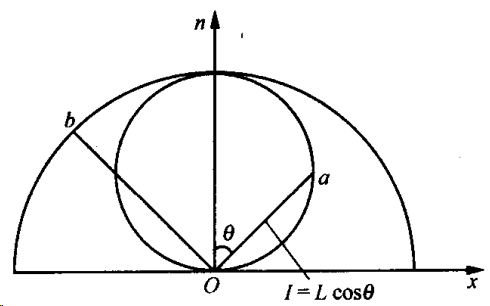
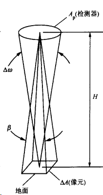
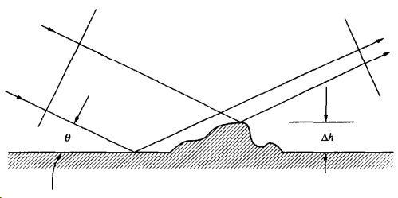
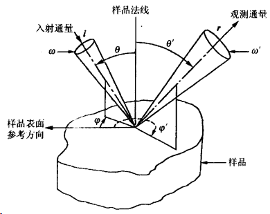

可见光与近红外波段的遥感具有两个基本特征:
   1. 遥感所利用的电磁波波长范围选择在 $0.4 \sim 2.5 \mu \mathrm{m}$ 之间, 其中 $0.4 \sim 0.74 \mu \mathrm{m}$ 波段范围正是人眼的色觉波段, 因此在遥感应用的初级阶段, 人们大量借助图像处理技术, 凭借人眼对现实世界的观察所获得的直观经验, 去判断或理解遥感影像所传递的信息, 故称之为 “目视解译”或“目视判读”. 这是这一波段遥感所特有的现象.
   2. 依赖太阳作为光源, 换言之, 遥感器所接收的是来自于目标物对太阳短波辐射的反射、散射能量. 按照电磁波与目标物相互作用的性质上的差别, 对目标物大体上可以分为三种类型:
   * 镜面反射体: 当目标物的表面粗糙尺度远低于电磁波的波长时, 那么目标物对电磁波的反射作用可由斯涅耳反射、折射定理所描述. 可以说镜面反射、折射定律是麦克斯韦定律在光滑边界条件下的表现.
   * 漫反射体: 当目标物的表面足够粗糙, 以至于它对太阳短波辐射的散射辐射亮度在以目标物为中心的 $2 \pi$ 空间中呈常数, 即散射辐射亮度不随观测角度而变, 我们称该物体为漫反射体, 亦称朗伯体. 严格讲自然界中只存在近似意义下的朗伯体. 只有黑体才是真正的朗伯体. 这种漫反射特性出自于表面十分粗糙,可以设想表面面积元 $\mathrm{d} \sigma$ 在 $2 \pi$ 空间中的取向是具有统计随机性质的.
   * 非朗伯体: 介于前两类之间的物体在自然界中占绝大多数, 即它们对太阳短波辐射的散射具有各向异性性质. 当遥感应用进入定量分析阶段,我们必须抛弃“目标是朗伯体”的假设, 对目标的非朗伯体特性的讨论构成本篇的主要内容之一.

# Chapter 1 基本物理概念

## 物理名词定义

- 辐射能量 $Q$ : 电磁波是物质存在的一种形式, 因此与其他物质存在形式一样, 电磁场亦具有能量、动量等性质, 电磁场所具有的能量, 我们称之为辐射能量, 它可用尔格 (erg)、焦耳、卡等单位度量
$1  mathrm{erg}=10^{-7} \mathrm{~J}, 1 \mathrm{cal}=4.1868 \mathrm{~J}$

- 辐射通量 $\Phi$ : 单位时间内穿过某一面积的电磁辐射能量, $\Phi=\frac{\mathrm{d} Q}{\mathrm{~d} t}$.

- 辐射通量密度 $E$ : 单位时间内, 穿过单位面积的电磁辐射能量, $E=\frac{\mathrm{d} \Phi}{\mathrm{d} A}$.
 
   以上两项中的符号 $t$ 与 $A$ 分别代表时间和面积, 当电磁波由体外穿入体内时所构成的辐射通量密度, 通称为入射度, 用 $E$ 表示; 当电磁波由体内穿出体外时, 称之为出射度, 一般用 $M$ 表示.

- 辐射强度 $I$ : 它是用来描述点辐射源强度的物理量, $I=\frac{\mathrm{d} \Phi}{\mathrm{d} \omega}$. 此处的 $\omega$ 为立体角 (如果是各向同性辐射源, 则 $I=E / 4 \pi$ ), 表明 $I$ 描述了辐射通量在 $2 \pi$ 空间中的变化状况.

- 辐射亮度 $L:$ 它是用来表述面光源强弱的物理量, $L(\theta)=\frac{\mathrm{d}^2 \Phi}{\mathrm{d} \omega \mathrm{d}(A \cos \theta)}=$ $\frac{\mathrm{d} I}{\mathrm{~d}(A \cos \theta)}$. 此处的 $\theta$ 为辐射方向与面法线方向间的夹角, $L$ 与 $I, M$ 有什么样的关系呢?

$$
\mathrm{d} I=L(\theta) \cos \theta \mathrm{d} A, \quad \frac{\mathrm{d} I}{\mathrm{~d} A}=L(\theta) \cos \theta,
$$

根据 $I$ 的定义, 单位面积的辐射强度仍叫辐射强度, $I=L(\theta) \cos \theta$, 如果 $L$ 在 $2 \pi$ 空间中取值恒定不变, 则 $I$在 $2 \pi$ 空间中的变化如图所示. 其中 $O x$ 代表物体水平面, $O n$ 为其法线方向, $O a$ 的长度代表对应 $\theta$ 方向的 $I$ 值, $O b$ 的长度代表 $L$ 值.

由于 $L(\theta)=\frac{\mathrm{d}}{\mathrm{d} \omega}\left(\frac{\mathrm{d} \Phi}{\mathrm{d} A}\right) \cdot \frac{1}{\cos \theta}=\frac{\mathrm{d} M}{\mathrm{~d} \omega} \cdot \frac{1}{\cos \theta}$, 得
$$
\frac{\mathrm{d} M}{\mathrm{~d} \omega}=L(\theta) \cdot \cos \theta,
$$
$$
M=\int_{2 \pi} \mathrm{d} M=\int_{2 \pi} L(\theta) \cos \theta \mathrm{d} \omega .
$$

对于朗伯体, 因为 $L(\theta)$ 具有各向同性性质, 所以 $M=L \int_{2 \pi} \cos \theta \mathrm{d} \omega$ $=\pi L$. 所以, 对于朗伯体, 其出射度为辐射亮度值的 $\pi$ 倍.

## 传感器的信号强度与传感器的口径、视场角之间的关系

如图, 口径是指传感器光强检测器件的有效几何尺寸,检测器对目标物所张的立体角为 $\Delta \omega$, 用 $A_{\mathrm{p}}$ 表示检测器的几何面积, $H$ 代表检测器到目标物之间的垂直距离, 则 $\Delta \omega=\frac{A_{\mathrm{p}}}{H^2}$.

视场角 $\beta$ 是指传感器的视场面积 (通称像元) 对传感器所张的立体角. 传感器的视场面积决定于传感器光闲的结构和尺寸,如果用 $\Delta A$ 代表传感器的视场面积, 则 $\beta=\frac{\Delta A}{H^2}$. 传感器所接收到的总能量正比于 $\Delta \omega \cdot \Delta A$, 即 $E \propto \Delta \omega \cdot \Delta A=A_{\mathrm{p}} \beta$.

结论: 传感器的信号强弱只与传感器自身的口径、视场角有关, 而与传感器对目标的距离无关.

## 地物的波谱特征与方向谱特征

### 地物波谱特征与方向谱特征问题的由来

对非朗伯体而言, 它对太阳短波辐射的反射、散射能力不仅随波长而变, 同时亦随空间方向而变. 所谓地物的波谱特征, 是指该地物对太阳辐射的反射、散射能力随波长而变的规律. 地物波谱特征与地物的组成成分及物体内部的结构关系密切, 通俗讲, 地物波谱特征也就是地物的颜色特征. 而地物的方向谱特征描述地物对太阳辐射的反射、散射能力的空间变化,这种空间变化特征主要决定于两种因素. 其一是物体的表面粗糙度,它不仅取决于表面平均粗糙高度值与电磁波波长之间的比例关系, 而且还与视角关系密切, 见图. 

图充分说明由于平均粗糙高度 $\Delta h$ 可能引起两束电磁波之间的相位差 $\Delta \phi$ 为
$$
\Delta \phi \approx 4 \pi \Delta h \sin \theta / \lambda .
$$

瑞利 (L. Rayleigh) 等提出表面为光滑或粗糙的标准为:
当 $\Delta h \sin \theta<\frac{\lambda}{8}$, 为光滑表面;
当 $\Delta h \sin \theta \gg \frac{\lambda}{8}$, 为粗糙表面.

所以从垂直界面的方向看, 一个物体可以展示出粗糙面的特性, 但当视线的高度角趋于零时, 它的行为向光滑面 “过渡”, 这种过渡的快慢因目标不同而异. 其二是物体的三维几何结构特征及其阴影的影响, 这种目标物三维结构与阴影的影响取决于目标一太阳一传感器三者之间的空间关系. 过去相当长的时间内人们过分地强调地物波谱特征的重要性, 而忽略了地物方向特征的意义, 其原因在于: (1) 人们熟悉的传感器, 比如 TM, 均采用垂直俯枧地面的姿态, 人们还不熟悉斜视可能带来何种影响. (2) 在轨道设计上总是设法使卫星通过地面目标的时间处在地方时 $9 \sim 10$ 时内, 以便获得最佳辐照效果, 此时除山脉、云朵外, 物体的阴影面积小于一个像元尺度, 因此阴影效果被隐含在像元信号之内, 不易被觉察, 这种隐含的阴影效果对目视判断几乎不产生什么明显的影响, 故造成可以忽视阴影效果的错误印象. （3）遥感定量分析还没有提到议事日程上来, “目标物具有朗伯体特性的假定”对遥感应用的初级阶段一一定性分析, 已经足够精确, 当遥感进入定量分析阶段之后, 我们必须放弃目标为朗伯体的假定, 还其非朗伯体的本来面目. 因此地物谱特征应该包含两方面的内容: 波谱特征与方向谱特征.
### 地物反射特征的几种描述方法

#### 双向反射率分布函数(BRDF)

设波长为 $\lambda$, 空间具有 $\delta$ 分布函数的入射辐射, 如图所示, 从 $i\left(\theta^{\prime}, \phi^{\prime}\right)$ 方向, 以辐射亮度 $L\left(\theta^{\prime}, \varphi^{\prime}, \lambda\right)$ 投射向点目标, 造成该点目标的辐照度为 $\mathrm{d} E=L\left(\theta^{\prime}, \phi, \lambda\right) \cos \theta \mathrm{d} \omega$; 传感器从 $\boldsymbol{r}(\theta, \varphi)$ 方向观察目标物, 接收到来自目标物对外来辐射的反射、散射辐射, 其亮度值为 $\mathrm{d} L(\theta, \varphi, \lambda)$. 由于假定传感器的视场角为无穷小量 $\mathrm{d} \omega$, 所以用微分符号表达传感器所接收的辐射亮度值, 则定义
$$
f\left(\theta^{\prime}, \varphi^{\prime} ; \theta, \varphi, \lambda\right)=\frac{\mathrm{d} L(\theta, \varphi, \lambda)}{\mathrm{d} E\left(\theta^{\prime}, \varphi^{\prime}, \lambda\right)},
$$

并称 $f$ 为双向反射率分布函数 (BRDF). 其物理意义是来自 $i$ 方向地表辐照度的微增量与其所引起的 $r$ 方向上反射辐射亮度增量之间的比值.
这样定义的 BRDF 为什么可以恰当地表达地物的非朗伯体特性呢?
众所周知, 在现实世界中投射到地物表面上的辐射能量往往由两部分组成, 即来自太阳的直射辐射与天空散射辐射, 而传感器在 $r$方向上测得的辐射亮度是 $2 \pi$ 空间入射辐射场的综合效应, 它不仅与该点地物的反射特性有关, 而且与辐射环境 (即入射辐射亮度的空间分布函数) 有关. 为了摆脱辐射环境的影响, 我们采取三个措施: 其一, 设定入射辐射场为 $\delta$ 分布函数; 其二, 把入射辐射亮度 $L^{\prime}$ 变换为对目标的辐照度 $\mathrm{d} E^{\prime}=L^{\prime} \cos \theta \mathrm{d} \omega$, 这样就消除了来自不同方向的 $L^{\prime}$ 可能对 $\mathrm{d} L$ 值的影响; 其三, 采用 $\mathrm{d} L / \mathrm{d} E^{\prime}$ 的比值形式, 而不采用 $\mathrm{d} L$ 绝对值. 这样定义的 $f$ 有如下三个特点:
(1) 与辐射环境无关, 它仅与该地物的反射、散射辐射特性有关, 并且具有立体角的量纲.
(2) 它是 $\theta, \varphi, \theta^{\prime}, \varphi^{\prime}$ 与 $\lambda$ 五个自变量的函数,在 $2 \pi$ 空间中无论是 $i$ 还是 $r$ 均有无穷多个方向, 从概念上说要完整地表达一个物体的非朗伯体特性需要有无穷多个测量数据, 而且这组无穷多个测量数据仅与一个具体对象相联系, 例如对某一棵树的 BRDF 测量结果一般不同于对另一棵树的测量结果. 实际上它使得对物体的非朗伯体的描述成为不可能, 所以重要的问题是能否对一类地物建立一种模型, 从无穷多个测量数据集中找到一组个数有限的子集, 它足以表征这类地物共同的对入射辐射的反射、散射特性, 并且它与这类地物的空间结构特征有着稳定的函数关系, 我们把这样的特殊子集称为这类地物的方向谱. 到目前为止,这样的特征子集从理论上说还没有真正找到, 人们试图把包含热点效应的入射面与主雉面当作这样的特征子集,但它们是否真正具有我们所希望的性质仍有待进一步的研究去证实.
(3) 这样定义的 BRDF, 虽然从理论上能较好地表征地物的非朗伯体特性,但在实际测量上困难较大, 精确测量 $\mathrm{d} E\left(\theta^{\prime}, \varphi^{\prime}, \lambda\right)$ 很困难, 为此我们将引入另一种描述地物非朗伯体特性的方法, 即双向反射率因子(BRF).
#### 双向反射率因子(BRF)
定义: 在相同的辐照度条件下, 地物向 $r$ 方向的反射辐射亮度与一个理想的漫反射体在该方向上的反射辐射亮度之比值,称为双向反射率因子,一般惯用 $R$ 表示,
$$
R=\frac{\mathrm{d} L_{\mathrm{T}}(\theta, \varphi, \lambda)}{\mathrm{d} L_{\mathrm{P}}(\theta, \varphi, \lambda)} .
$$

下标 $\mathrm{T}$ 与 $\mathrm{P}$ 分别代表目标物及具有理想漫反射体特性的参考板. 所谓理想的漫反射体是指反射率为 $100 \%$ 的朗伯体, 即 $\mathrm{d} E_{\mathrm{P}}=\mathrm{d} M_{\mathrm{P}}$. 在 $R$ 的定义中 $L_{\mathrm{T}}$ 与 $L_{\mathrm{P}}$ 均采用微分形式是因为假定传感器的视场角 $\Delta \omega$ 为无穷小量.
根据漫反射体辐射通量密度值与亮度值的关系公式, 有
$$
f_{\mathrm{P}}=\frac{\mathrm{d} L_{\mathrm{P}}}{\mathrm{d} E_{\mathrm{P}}}=\frac{\mathrm{d} M_{\mathrm{P}} / \pi}{\mathrm{d} M_{\mathrm{P}}}=\frac{1}{\pi} .
$$
结论: 理想漫反射体的 BRDF 值为 $\frac{1}{\pi}$.
对于双向反射率因子 $R$ 的性质, 我们应注意到:
(1) 我们在给出 BRF 的定义时, 并没有对辐射环境作任何限定, $i(\theta, \varphi)$ 并没有出现在 $R$ 的定义中, 因此严格讲 $R$ 值不仅取决于目标物的非朗伯体特性, 而且还与辐射环境有关.因此它并不是一个理想的描述地物非朗伯体特性的物理量. 它与 $f$ 有原则上的不同,两者的量纲亦不相同,这充分地表明了它们的区别.
(2) 如果入射光源对目标物所张的立体角 $\Delta \omega$ 以及传感器对目标物所张的立体角 $\Delta \omega^{\prime}$都趋于无穷小,则
$$
\begin{gathered}
R=\frac{\mathrm{d} L_{\mathrm{T}}}{\mathrm{d} L_{\mathrm{P}}}=\frac{f_{\mathrm{T}} \mathrm{d} E}{f_{\mathrm{P}} \mathrm{d} E}=\pi f_{\mathrm{T}} . \\
f_{\mathrm{T}}=\lim _{\Delta \omega, \Delta \omega \rightarrow 0}\left[\frac{R}{\pi}\right] .
\end{gathered}
$$

换言之，
当 $\Delta \omega$ 与 $\Delta \omega^{\prime}$ 趋近无穷小时, 在数值上 $R$ 为 $f_{\mathrm{T}}$ 的 $\pi$ 倍, 这为测定目标物的 $f_{\mathrm{T}}$ 值提供了一条现实可行的通道.
#### 半球反射率 (albedo)
定义: 目标物的出射度与入射度之比值称为半球反射率, 通常用 $\rho$ 表示,
$$
\rho=\frac{M}{E} .
$$

在某些问题中我们并不需要知道辐射亮度值及其空间分布, 而只需要知道辐射通量密度值, 比如在求解辐射热平衡问题中, 或者在讨论作物光合作用强度问题时都是如此. 严格讲要求解出射度 $M$, 必须对 $2 \pi$ 空间的 $f$ 值进行积分, 这几乎是不可能的. 因为从个别方向的 BRDF 的测量值中, 我们无法判断目标物在 $2 \pi$ 空间中的反射辐射行为, 因此也无法由积分求得半球反射率. 目前流行的目标物的半球反射率的测量方法, 实际上只是视角取天底角条件下的 BRF. 如果用此值代替严格意义下的半球反射率, 其误差有时可以高达 $45 \%$.

#### 方向 $\rightarrow$ 半球反射率与半球 $\rightarrow$ 方向反射率
正如 BRDF 的定义中指出的那样, 用 $\theta^{\prime}, \varphi^{\prime}$ 代表入射方向, 而用 $\theta, \varphi$ 代表出射方向, 则
$$
\begin{aligned}
& \int_{2 \pi} f\left(\theta^{\prime}, \varphi^{\prime}, \theta, \varphi, \lambda\right) \cos \theta \mathrm{d} \Omega=r_{\theta^{\prime}, \varphi^{\prime} \rightarrow \Omega}, \\
& \int_{2 \pi} f\left(\theta^{\prime}, \varphi^{\prime}, \theta, \varphi, \lambda\right) \cos \theta^{\prime} \mathrm{d} \Omega^{\prime}=r_{\Omega^{\prime} \rightarrow \theta . \varphi^*}
\end{aligned}
$$

此处 $\mathrm{d} \Omega$ 代表入射 $\left(\theta^{\prime}, \varphi^{\prime}\right)$ 方向的微立体角, $\mathrm{d} \Omega$ 代表出射 $(\theta, \varphi)$ 方向的微立体角, 则称 $r_{\theta^{\prime}, \psi^{\prime} \rightarrow \Omega}$为方向 $\rightarrow$ 半球反射率, 称 $r_{\Omega^{\prime} \rightarrow \theta, \varphi}$ 为半球 $\rightarrow$ 方向反射率. 一般讲, $r_{\theta^{\prime}, \varphi^{\prime} \rightarrow \Omega^{\prime}} \neq r_{\Omega^{\prime} \rightarrow \theta, \varphi}$, 它们的含义是不同的. 对宏观粗䊁面而言阴影的出现是双向反射率形成的原因之一. 方向 $\rightarrow$ 半球与半球 $\rightarrow$方向条件下所形成的阴影区是不同的. 所以,一般互易原理在此并不适用.

新一代传感器的设计已把地物的方向谱问题考虑进去, 具有多视角扫描的能力. 例如 POLDER, MODIS-T 和 MISR 等, 能否从多视角信息中反演出地物的更多、更重要的物理参数是一个遥感科学家所瞩目的热点问题.