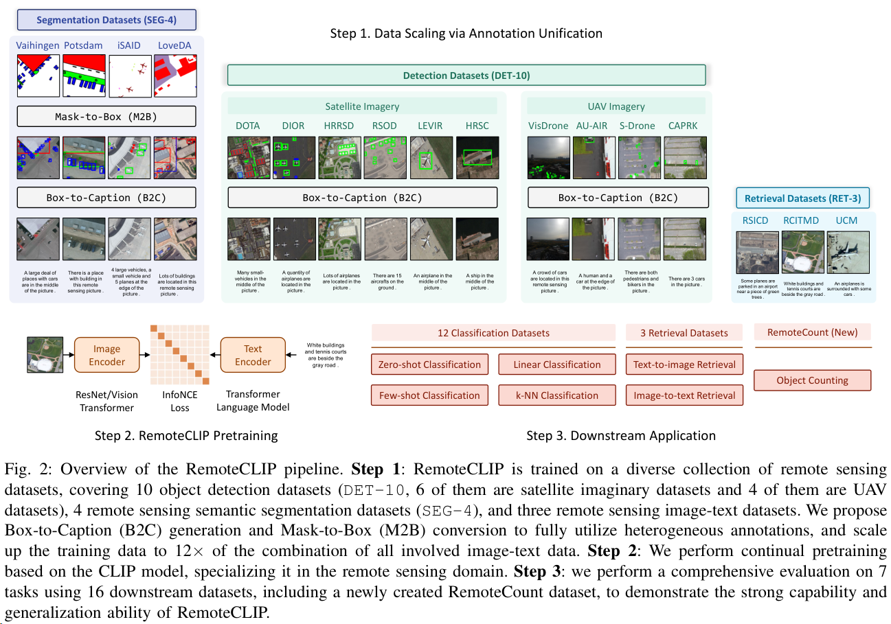

### RemoteCLIP: A Vision Language Foundation Model for Remote Sensing

近年来，通用目标基础模型在人工智能领域取得了重大突破。在遥感领域，自监督学习（SSL）和遮罩图像建模（MIM）已被采用来构建基础模型。然而，这些模型主要学习低级特征，并需要带标注的数据进行微调。此外，由于缺乏语言理解能力，它们不适用于检索和零样本应用。为了解决这些限制，我们提出了RemoteCLIP，这是第一个面向遥感的视觉-语言基础模型，旨在学习具有丰富语义和对齐文本嵌入的强大视觉特征，以便在下游应用中实现无缝连接。为了解决预训练数据稀缺的问题，我们利用数据扩展技术，将异构注释转换为基于盒子到标题（B2C）和遮罩到盒子（M2B）转换的统一图像-字幕数据格式。通过进一步整合无人机图像，我们的预训练数据集比所有可用数据集的组合大12倍。RemoteCLIP可应用于各种下游任务，包括零样本图像分类、线性探测、k-NN分类、少样本分类、图像-文本检索以及遥感图像中的目标计数。在包括新引入的RemoteCount基准测试在内的16个数据集上进行评估显示，RemoteCLIP在不同模型规模下始终优于基础模型。令人印象深刻的是，在RSITMD数据集上，RemoteCLIP相对于最先进的方法提高了9.14%的平均召回率，在RSICD数据集上提高了8.92%。对于零样本分类，我们的RemoteCLIP在12个下游数据集上的平均准确率比CLIP基线高出最多6.39%。

- Results:

- Summary:
通用基础模型在人工智能领域变得日益重要。虽然自监督学习（SSL）和遮罩图像建模（MIM）在建立遥感领域的基础模型方面取得了有希望的成果，但这些模型主要学习低级特征，需要带标注的数据进行微调，并且由于缺乏语言理解而不适用于检索和零样本应用。

针对这些限制，我们提出了RemoteCLIP，这是首个面向遥感的视觉-语言基础模型，旨在学习具有丰富语义的强大视觉特征，以及对齐的文本嵌入，以便在下游应用中实现无缝连接。为了解决预训练数据稀缺的问题，我们利用数据扩展技术，基于box到标题（B2C）和遮罩到box（M2B）转换，将异构注释转换成统一格式，并进一步整合了无人机图像，从而产生了12倍大的预训练数据集。

- Pipeline:

- Contribution:

- Code: