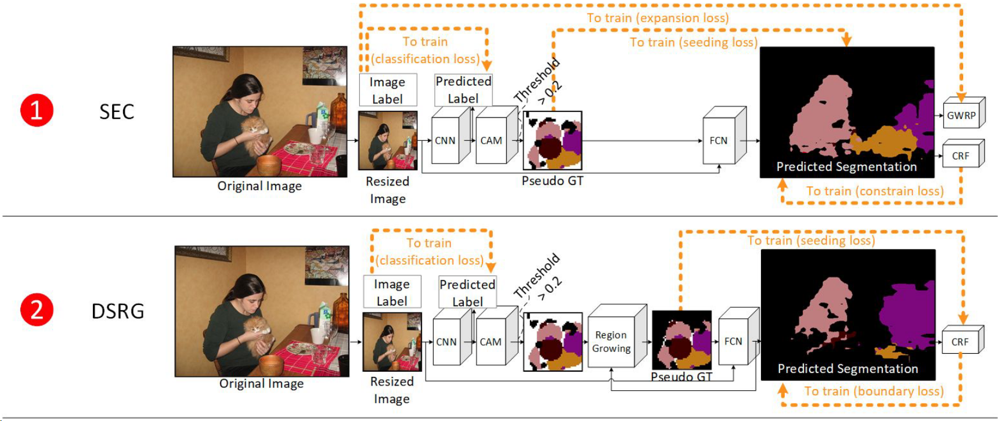
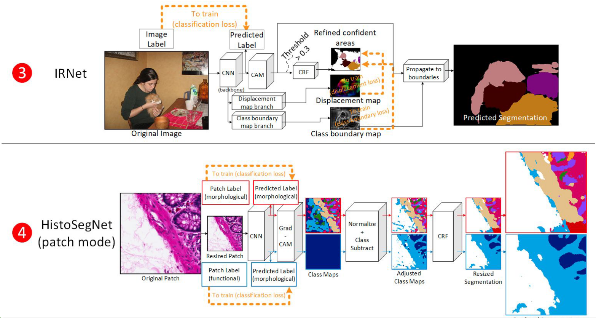

## A Comprehensive Analysis of Weakly-Supervised Semantic Segmentation in Different Image Domains
19年的IJCV综述，分析了三种当时的方法，图比较直观。

### SEC

种子扩展和约束（SEC）（Kolesnikov和Lampert，2016b）是为PASCAL VOC2012数据集开发的，包括四个可训练阶段：（1）对图像标签进行分类CNN训练，（2）从训练的CNN生成CAMs，（3）将CAMs阈值化并解决重叠冲突作为种子/提示，并（4）使用这些种子对FCN进行自监督训练（DeepLabv1，也称为DeepLab-LargeFOV（Chen等人，2014））。

1. 分类CNN。首先，在注释图像上训练两个分类CNN：（1）“前景”网络（VGG16网络的变体，省略了最后两个池化层和最后两个全连接层，并用GAP层替换了平坦层）和（2）“背景”网络（VGG16网络的变体省略了最后两个卷积块）。
2. CAM。然后，对训练集中的每个图像分别应用类激活映射（CAM）于“前景”和“背景”网络。
3. 种子生成。对于“前景”网络，将每个类的CAM阈值化为最大激活的20%以上作为弱定位提示（或种子）；对于“背景”网络，将类CAM相加，应用2D中值滤波器，并将最低激活的10%像素阈值化为附加的背景提示。在提示重叠的区域，具有较小提示的类优先。
4. 自监督FCN学习。最后，使用这些弱定位提示作为自监督学习完全卷积网络（FCN）（Long等人，2015）的伪地面实况。在FCN输出上使用三部分损失函数：（1）使用弱提示的播种损失，（2）使用图像标签的扩展损失，（3）在应用密集CRF后的自身约束损失。在测试时，使用密集CRF进行后处理。

### DRSG

深度种子区域生长（DSRG）（Huang等人，2018）与SEC类似，同样是为PASCAL VOC2012开发的，采用类似的方法使用CAM生成弱种子来训练FCN（这次使用的是DeepLabv2，也称为DeepLab-ASPP（Chen等人，2017a））。然而，这种方法在几个重要方面有所不同。首先，没有“背景”网络 - 背景激活是通过使用固定的DRFI方法（Jiang等人，2013）单独生成的。其次，前景CAM在最大激活的20%以上进行阈值化，然后用作基于卷积特征的区域生长的种子，形成弱定位提示。第三，FCN输出上使用了两部分损失函数：（1）使用区域生长的弱提示的播种损失，和（2）在应用密集CRF（与SEC中的约束损失相同）后的边界损失。同样，在测试时应用密集CRF。

### IRNet

Inter-pixel Relation Network (IRNet)（Ahn等人，2019）是为PASCAL VOC2012中的语义分割和实例分割开发的，尽管我们只考虑语义分割的情况。虽然它像SEC和DSRG一样利用CAM作为伪地面实况，但它训练了来自骨干网络的两个分支来预测辅助信息，而不是直接预测像素类别。该方法包括以下五个阶段：
（1）分类CNN和（2）CAM。与SEC和DSRG类似，首先对带标签的图像进行分类CNN训练（ResNet50架构（He等人，2016）），然后在训练完成后生成CAM。
（3）种子生成。然后对每个有信心的类的CAM进行阈值化，阈值设定为0.3，并使用密集CRF进行细化，作为前景种子。CAM置信度低于0.05的区域，在经过密集CRF细化后没有前景种子的被视为背景种子。
（4）自监督DF和CBM学习。前景和背景种子用作训练来自骨干网络的两个分支的伪地面实况：（1）位移场（DF），用于预测每个像素与每个种子实例的质心之间的位置偏移，和（2）类边界图（CBM），用于预测每个像素是否存在类边界的可能性，通过最大化具有不同类别的种子的相邻像素之间的值（在设定的半径内），并对相同种子类别的像素进行最小化。
（5）带CBM的CAM随机游走传播。最后，使用类边界图的倒数作为转移概率矩阵，通过随机游走传播每个有信心类的CAM。这使得有信心的CAM区域能够传播到可能类边界内部的不太有信心的区域。

