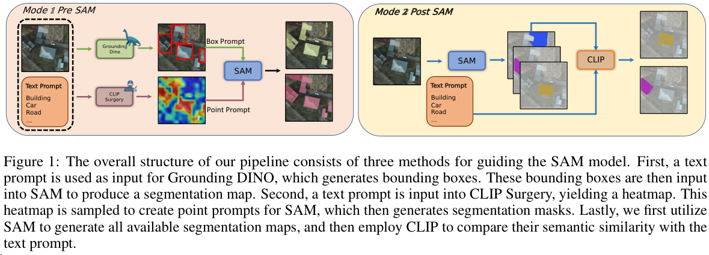

### Text2Seg: Remote Sensing Image Semantic Segmentation via Text-Guided Visual Foundation Models

近期基于 GPT-4 和 LLaMA 等基础模型（FMs）的最新进展引起了极大关注，因为它们在零-shot学习场景中表现出非凡性能。类似地，在视觉学习领域，诸如 Grounding DINO 和 Segment Anything Model（SAM）等模型在开放式检测和实例分割任务中展现了显著进展。毫无疑问，这些基础模型将深刻影响广泛的真实世界视觉学习任务，引领着这些模型发展的新范式转变。在本研究中，我们聚焦于遥感领域，其中的图像与传统场景中的图像明显不同。我们开发了一个利用多个基础模型来促进遥感图像语义分割任务的流程，其以文本提示为指导，我们将其命名为 Text2Seg。该流程在多个广泛使用的遥感数据集上进行了基准测试，并展示初步结果以证明其有效性。通过这项工作，我们旨在洞察如何最大程度地利用视觉基础模型在特定情境下进行应用，同时最大限度地减少模型调整。代码可在 https://github.com/Douglas2Code/Text2Seg 找到。

- Results:

- Summary:
方法论和视觉提示调整可以应用于各种情景，只需对提示调整过程进行最小的调整。

- Pipeline:
提议的架构用于在遥感任务中使用视觉基础模型

SAM 模型在传统分割模型中显示出显著的改进。然而，设计有效的提示以促进其在下游任务中的应用，如遥感图像语义分割，仍然是一个非平凡的任务。原因如下：
   - SAM 最初设计用于对象分割，而生成的对象掩码没有与之相关联的标签，这是语义分割的要求。
   - 遥感图像的特征，特别是卫星图像，与大多数视觉基础模型熟悉的自然图像的视角非常不同。
   - 各种遥感图像数据集是从不同的地理区域、不同时间以及基于各种传感器收集的。这增加了任务的复杂性，并对视觉基础模型的泛化能力提出了高要求。

在这项研究中，我们提出了多种利用其他基础模型进行视觉提示工程的方法，分为两类：SAM 前和SAM 后的方法，见图1。

SAM 前的方法涉及使用基于文本提示的点和边界框预先选择对象区域。我们利用 Grounding DINO [20] 和 CLIP Surgery [22] 来实现这个目的。Grounding DINO 以文本提示作为输入，并返回所指对象的相应边界框，而 CLIP Surgery 返回一组点来表示相应的对象。这些边界框和点作为 SAM 模型的输入，帮助定位特定类别的目标对象。对于 SAM 后的方法，我们首先利用 SAM 获取所有的分割对象，然后使用这个结果作为 CLIP[6] 的输入，根据特定的文本提示进行进一步的过滤，以获得目标类别的对象。这个过程基于 CLIP 学习捕捉图像与相应文本提示之间相似性的能力。

- Contribution:

- Code:

