[Prev]()

我们假设树冠由平面叶片组成，其叶面密度表示为 $u_L(z) \geqslant 0,0 \leqslant z \leqslant H$，定义为在深度 $z$ 处单位体积树冠内的总单面叶面积。让
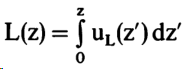
表示累积叶面指数。那么，总叶面指数 $L_H$ 为
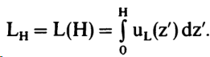

以下函数描述了叶法线的分布以及其在方向 $\Omega$ 上的投影（Ross 1981）：${g}_{{L}}\left({z}, \Omega_{{L}}\right)$ 是相对于上半球的叶法线分布的概率密度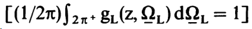，而
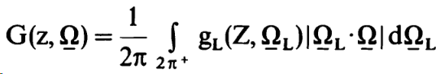

是叶法线在方向 $\Omega$ 上的平均投影。因此，我们有

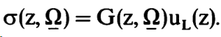

我们还定义了沿着方向 $\underline{\Omega}$ 从点 $z^{\prime}$ 到 $\mathrm{z}$ 之间的光学深度为：

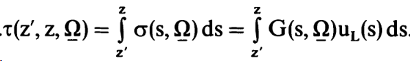
可以看出，与混浊层不同，植被冠的光学深度取决于光子传播的方向。总相互作用截面 $\sigma$ 的倒数被称为光子平均自由程。实际上，平均自由程不仅取决于方向 $\underline{\Omega}$，还取决于先前的传播方向 $\Omega^{\prime}$（见第 2 节）。

设 $\gamma_L\left(\underline{\Omega}_L, \Omega^{\prime} \rightarrow \Omega\right)$ 是叶子散射相函数，表征了最初沿着方向 $\Omega^{\prime}$ 传播的光子被叶子相互作用后（与外法线为 $\Omega_L$ 的叶子相互作用后）向关于方向 $\Omega$ 的单位立体角内散射的能量分数。所有方向 $\Omega^{\prime}$ 中传播的光子通过所有方向 $\Omega_L$ 的叶子散射到关于方向 $\Omega$ 的单位立体角内的总散射能量。

我们还定义了沿着方向 $\underline{\Omega}$ 从点 $z^{\prime}$ 到 $\mathrm{z}$ 之间的光学深度为：
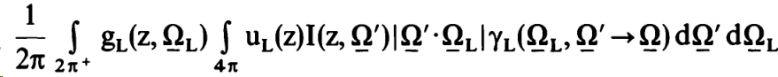

等于等式1.5等号右侧的积分项：
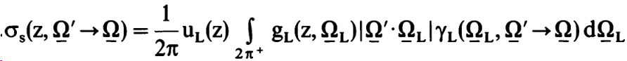

将公式 (1.12) 和 (1.14) 代入公式 (1.5)，并将方程左右两边除以 $u_L(\mathrm{z})$，我们得到以下方程（忽略 $Q(z, \Omega)$）：
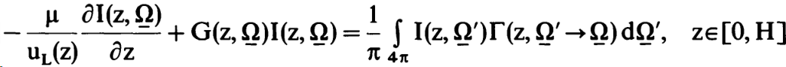

这里 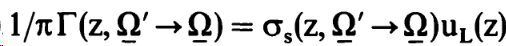。不失一般性，我们可以改变变量，即从 $\mathrm{z}$ 到 $\mathrm{L}$，
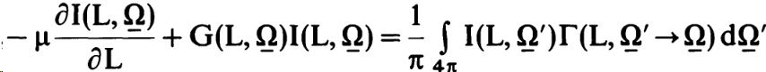
其中
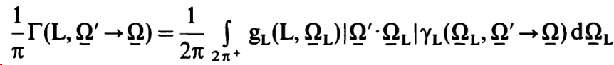
是面积散射相函数。

