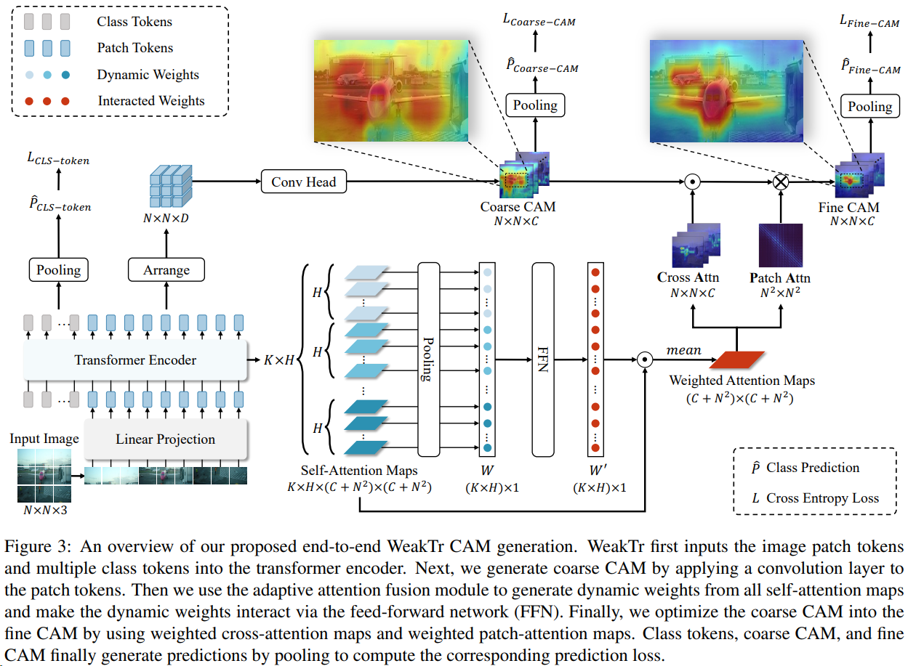
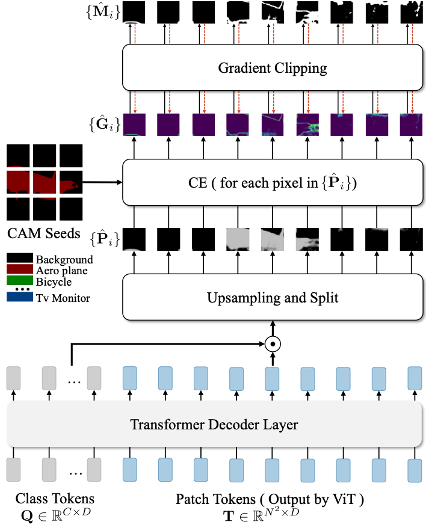

## 一些Vision Transformer 相关 WSSS 的论文

### [WeakTr](https://github.com/hustvl/WeakTr): Exploring Plain Vision Transformer for Weakly-supervised Semantic Segmentation

- 本文介绍了WeakTR，这是一个使用普通视觉转换器（ViT）进行弱监督语义分割（WSSS）的框架。 
- 它探讨了ViT中不同的注意力头如何聚焦于不同的图像区域，并提出了一种估计其重要性的方法。 
- 设计了一种新的自适应注意力融合策略，用于生成高质量的职业激活地图 (CAM)。 -本文介绍了一种基于VIT的梯度剪辑解码器，用于使用CAM结果进行在线再训练。 
- 本文还讨论了梯度剪切解码器的有效性以及在线再训练的上限。 
- 本文的方法使用变压器编码器的自注意力映射来完善粗略的 CAM。 
- 自适应注意力融合模块采用端到端训练策略来优化最终注意力结果。 
- 将WeakTR的训练时间与mcTFormer进行了比较，显示出在提高准确性的同时显著缩短了时间。

如图3所示，我们的框架使用普通的ViT作为主干。首先，我们将输入图像分割成$N^2$个补丁，将它们展平，并将它们线性映射到$N^2$个补丁标记。此外，我们生成$C$个可学习的类标记，其中$C$表示分类类别的总数，并将它们与补丁标记连接起来，作为变压器编码器的输入$T_{i n} \in \mathbb{R}^{\left(C+N^2\right) \times D}$，其中$D$是输入标记的维度。

变压器编码器内部由$K$个编码层组成。每个层包含两个子层：多头自注意力（MSA）和多层感知机（MLP）。在每个子层之前应用层归一化（LN），在每个子层之后应用残差连接。在每个编码层中，我们输入标记$T_{i n}$并接收$T_{\text {out }}$。$T_{\text {out }}$成为下一个编码器层的新$T_{\text {in }}$，以此类推，共进行$K$次迭代。

#### 3.1.2 自适应注意力融合的直接CAM生成

经过$K$个变压器层后，这些标记被排列成最终的标记$T_{\text {final }} \in \mathbb{R}^{\left(C+N^2\right) \times D}$。为了首先获得粗糙的CAM，我们需要从$T_{\text {final }}$中提取最后的$N^2$个补丁标记。然后，我们排列这$N^2$个补丁标记，使它们成为$T_{\text {final-patches }} \in$ $\mathbb{R}^{N \times N \times D}$。接下来，我们使用卷积层获得$C A M_{\text {coarse }} \in \mathbb{R}^{N \times N \times C}$，如下所示：
$$
\begin{aligned}
T_{\text {final-patches }} & =\operatorname{Arrange}\left(T_{\text {final }}\left[C+1: C+N^2\right]\right) \\
C A M_{\text {coarse }} & =\operatorname{Conv}\left(T_{\text {final-patches }}\right) .
\end{aligned}
$$

在获得粗糙的CAM之后，我们使用变压器编码器的自注意力映射对其进行细化。单个自注意力映射的形状为$\left(C+N^2\right)^2$，允许我们获取$C$个类标记对于$N^2$个补丁标记的交叉注意力映射，以及$N^2$个补丁标记相对于它们自身的补丁注意力映射。交叉注意力映射的形状为$N \times N \times C$，而补丁注意力映射的形状为$N^2 \times N^2$。考虑到变压器编码器具有$K$个编码层，每个层有$H$个注意力头，我们可以将交叉注意力映射表示为$C A \in \mathbb{R}^{(K \times H) \times N \times N \times C}$，将补丁注意力映射表示为$P A \in \mathbb{R}^{(K \times H) \times N^2 \times N^2}$。

为了结合所有层中所有注意力头的表示，先前的弱监督语义分割（WSSS）方法[50, 25]直接对同一层中不同头的自注意力映射进行平均，然后在不同层之间进行求和。我们发现，这种对变压器注意力的平均-求和方法是基础的。如图2所示，大多数不同的注意力头集中在不同的区域和类别上。对于注意力头的这种不加区分的方法往往会给前景对象的激活图引入更多干扰。因此，我们提出利用自适应注意力融合模块来估计不同注意力头的重要性。

如图3所示，首先，我们获取与所有变压器层的注意力头相对应的自注意力映射$A \in \mathbb{R}^{(K \times H) \times\left(C+N^2\right) \times\left(C+N^2\right)}$。接下来，通过在头之间进行池化，得到相应的动态权重$W \in \mathbb{R}^{(K \times H) \times 1}$。然后，我们使用一个前馈神经网络（FFN）来相互作用动态权重的信息，如下所示：
$$
W^{\prime}=\operatorname{FFN}(\operatorname{Pooling}(A)),
$$

其中Pooling是全局平均池化，$W^{\prime} \in$ $\mathbb{R}^{(K \times H) \times 1}$是注意力头的相互作用权重。最后，我们将相互作用的权重$W^{\prime}$乘回交叉注意力映射$C A$和补丁注意力映射$P A$，分别得到$\widehat{C A}$和$\widehat{P A}$，如下所示：

$$
\begin{aligned}
& \widehat{C A}=\frac{1}{K H} \sum_{i=1}^{K \cdot H} W_i^{\prime} \cdot C A_i \\
& \widehat{P A}=\frac{1}{K H} \sum_{i=1}^{K \cdot H} W_i^{\prime} \cdot P A_i
\end{aligned}
$$

在这里，$\widehat{C A} \in \mathbb{R}^{N \times N \times C}$和$\widehat{P A} \in \mathbb{R}^{N^2 \times N^2}$是我们通过使用相互作用权重$W^{\prime}$从自注意力映射中得到的加权结果。我们采用了与MCTformer [50]和TransCAM [25]相同的方法来组合$C A M_{\text {coarse }}, \widehat{C A}$和$\widehat{P A}$：

$$
CAM_{\text {fine }}=\mathfrak{R}^{N \times N \times C}\left(\widehat{P A} \cdot \mathfrak{R}^{N^2 \times C}\left(C A M_{\text {coarse }} \odot \widehat{C A}\right)\right) \text {, }
$$

其中$C A M_{\text {fine }}$是由$\widehat{C A}$和$\widehat{P A}$引导的CAM，$\mathfrak{R}^{N^2 \times C}(\cdot)$是用于将矩阵重新形状为$N^2 \times C$的运算符，$\Re^{N \times N \times C}(\cdot)$是用于将矩阵重新形状为$N \times N \times C$的运算符，$\odot$表示Hadamard乘积。如表4和附录中的可视化所示，与平均-求和自注意力映射相比，加权自注意力映射为CAM提供了更准确的引导。

#### 3.1.3 端到端的Fine CAM训练

自适应注意力融合模块提供准确权重的关键在于我们的端到端训练策略。端到端生成Fine CAMs允许自适应注意力融合模块通过图像级别的监督学习进行训练。使用自注意力映射改进粗糙CAMs生成Fine CAMs的过程以及计算损失函数$L_{\text {Fine-CAM }}$是完全可微的。因此，用于分类的损失$L_{\text {Fine-CAM }}$可以为注意力映射的权重分配提供弱监督引导。在这个引导下，与目标对象匹配的注意力头，无论是在关注的类别还是关注的区域方面，都被鼓励分配更大的权重，而不匹配的则具有较小的权重。我们将$L_{F i n e-C A M}$添加到图3中的$L_{C L S-t o k e n}$和$L_{\text {Coarse-CAM }}$，得到总损失$\mathcal{L}$，如下所示：
$$
\mathcal{L}=L_{\text {Fine-CAM }}+L_{\text {CLS-token }}+L_{\text {Coarse-CAM }} .
$$

#### 3.2. WeakTr 在线重新训练与梯度裁剪解码器

传统上，在弱监督语义分割（WSSS）框架中，CAM的质量较低需要在重新训练之前经过CAM细化[2]阶段，这个过程可能既繁琐又耗时。我们提出的在线重新训练方法涉及ViT和一个梯度裁剪解码器。它可以直接使用CAM训练高性能的语义分割模型，避免了CAM细化的需要。

如图4所示，首先，我们将ViT编码器生成的类标记$Q \in \mathbb{R}^{C \times D}$和补丁标记$T \in \mathbb{R}^{N^2 \times D}$一起输入到变压器解码器层，得到相应的输出$\hat{Q} \in \mathbb{R}^{C \times D}$和$\hat{T} \in \mathbb{R}^{N^2 \times D}$。接下来，我们使用L2范数归一化的$\hat{Q}_{\text {norm }}$和$\hat{T}_{\text {norm }}$生成相应的预测序列。然后，我们通过LN和上采样将预测序列传递，得到预测$\hat{P} \in \mathbb{R}^{O \times O \times C}$，如下所示：

$$
\hat{P}=\operatorname{Upsampling}\left(\operatorname{LN}\left(\frac{\hat{T}_{\text {norm }} \cdot \hat{Q}_{\text {norm }}^{\mathrm{T}}}{\sqrt{D}}\right)\right),
$$

其中$(O, O)$是输入图像的原始分辨率。
在噪声标签问题中，一些研究[13, 3, 31]指出，具有较小梯度的样本更有可能被视为干净的样本。在语义分割任务中，我们可以将每个像素视为一个样本，并根据阈值确定是否在该像素处剪切梯度。我们的梯度裁剪解码器的目的是找到一个合适的阈值。为了确定梯度阈值，我们考虑了两个因素：整个图像的梯度和局部区域内的梯度。首先，我们使用整个图像所有像素的平均梯度值作为全局梯度约束。其次，我们将像素分为补丁以从补丁区域获取局部梯度约束，类似于ViT。梯度裁剪解码器充分考虑这两个约束来判断是否剪切每个像素的梯度。它剪切梯度较大的区域，使分割网络集中学习梯度较小的区域。

为了计算局部梯度约束，我们将预测$\hat{P} \in \mathbb{R}^{O \times O \times C}$分割成$L^2$个非重叠的补丁$\left\{\hat{P}_i\right\}, i \in\left\{1, \ldots, L^2\right\}$。$\left\{\hat{P}_i\right\}$中每个补丁的形状为$S \times S \times C$，其中$L=O / S$。请注意，$\left\{\hat{P}_i\right\}$中的补丁大小与ViT编码器中的图像补丁大小无关。利用从$C A M_{\text {fine }}$生成的CAM种子和预测补丁$\left\{\hat{P}_i\right\}$，我们可以计算梯度补丁$\left\{\hat{G}_i\right\}$。$\left\{\hat{G}_i\right\}$中的每个梯度补丁的大小为$S \times S$。同时，我们可以计算$\left\{\hat{G}_i\right\}$中每个梯度补丁的平均梯度$\left\{\lambda_i\right\}$，如下所示：
$$
\begin{aligned}
\hat{G}_i & =\mathrm{CE}\left(\hat{P}_i, C A M \text { seeds }_i\right), i \in\left\{1, \ldots, L^2\right\} \\
\lambda_i & =\operatorname{mean}\left(\hat{G}_i\right), i \in\left\{1, \ldots, L^2\right\},
\end{aligned}
$$
其中$\mathrm{CE}$是为每个像素计算的交叉熵损失。对于$\left\{\hat{G}_i\right\}$中的每个梯度补丁，我们使用$\left\{\lambda_i\right\}$作为局部约束，将$\left\{\lambda_i\right\}$的平均值作为全局约束$\lambda_{\text {global }}$。
$$
\lambda_{\text {global }}=\frac{1}{L^2} \sum_{i=1}^{L^2} \lambda_i
$$

我们选择$\lambda_{\text {global }}$和$\left\{\lambda_i\right\}$的最大值作为剪切掩码$\left\{\hat{M}_i\right\}$生成的阈值。通过这种方式，得到的$\left\{\hat{M}_i\right\}$同时考虑了局部和全局梯度约束，实现了丢弃相对较大梯度的补丁区域。
$$
\hat{M}_i=\left\{\begin{array}{ll}
1, & \hat{G}_{i,(j, k)} \leq \max \left(\lambda_i, \lambda_{\text {global }}\right) \\
0, & \hat{G}_{i,(j, k)}>\max \left(\lambda_i, \lambda_{\text {global }}\right)
\end{array},\right.
$$
其中$1 \leq j \leq S, 1 \leq k \leq S$，max是最大操作。

然而，在分割网络训练初期，通过梯度裁剪解码器选择自信的CAM区域不够可靠。因此，我们设置剪切的起始值$\tau$来确定是否进行剪切。只有当当前批次的全局平均梯度$\lambda_{\text {global }}$低于$\tau$时，我们才进行剪切，如下所示：
$$
\hat{G}_i^{\prime}=\left\{\begin{array}{ll}
\hat{G}_i \odot \hat{M}_i, & \lambda_{\text {global }} \leq \tau \\
\hat{G}_i, & \lambda_{\text {global }}>\tau
\end{array} .\right.
$$

最后，我们得到了掩码梯度补丁$\left\{\hat{G}_i^{\prime}\right\}$并反向传播它们的平均值。通过这样做，我们动态选择梯度较小的区域作为自信的CAM区域，以优先学习分割网络。在推断时，我们应用条件随机场（CRF）[19]来提高分割质量。

