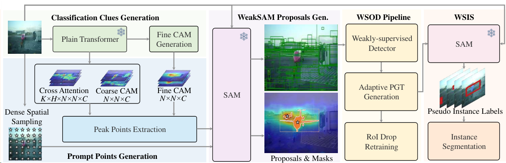

# WeakSAM: Segment Anything Meets Weakly-supervised Instance-level Recognition

弱监督视觉识别使用不精确的监督是一个至关重要但具有挑战性的学习问题。它显著降低了人力标注成本，传统上依赖于多实例学习和伪标记。本文介绍了WeakSAM，并利用预先学习的视觉基础模型中包含的世界知识来解决弱监督目标检测（WSOD）和分割问题，即分段任意模型（SAM）。WeakSAM通过自适应PGT生成和感兴趣区域（RoI）丢弃正则化来解决传统WSOD重新训练的两个关键限制，即伪地面真值（PGT）不完整性和噪声PGT实例。它还解决了SAM对于自动目标检测和分割需要提示和类别不可知性的问题。我们的结果表明，WeakSAM在WSOD和WSIS基准测试中明显优于先前的最先进方法，平均改进分别为7.4%和8.5%。代码可在 https://github.com/hustvl/WeakSAM 获取。



## 2. 相关工作

### 2.1. 分段任意模型

最近的分段任意模型（SAM）（Kirillov等，2023）引起了研究者的极大关注。SAM在SA-1B上进行训练，拥有超过10亿个蒙版，采用了模型循环方式。此外，SAM具有出色的零样本迁移能力，并应用于许多视觉任务，例如，FGVP（Yang等，2023）将SAM纳入其中以实现零样本精细视觉提示，MedSAM（Ma＆Wang，2023）将SAM调整到大规模医学数据集中构建医学基础模型，并且一些方法（Sun等，2023；Jiang＆Yang，2023；Chen等，2023）利用SAM来处理弱监督语义分割问题。然而，SAM是一种交互式分割方法，严重依赖于人类提示。
在我们的方法中，我们创新地提出使用分类线索自动提示SAM，以提取区域建议。这种方法导致高召回建议，效率和效果均超过传统方法，如选择性搜索。这一进步代表了在WSOD框架内建议生成领域的显着改进。

### 2.2. 弱监督目标检测

利用图像级标签进行的弱监督目标检测（WSOD）（Laptev等人；Diba等人，2017；唐等人，2018b；高等人，2018；万等人，2018；张等人，2018a；刘等人，2019；李等人，2019；阿伦等人，2019；孙等人，2020；阿伦等人，2020；贾等人，2021；万等人，2019）对于减轻人类注释负担至关重要。先前的工作，如WSDDN（Bilen＆Vedaldi，2016b）和OICR（唐等人，2017），提出了多实例学习和在线细化范式。后续工作旨在从不同角度改进WSOD性能。例如，WSOD2（曾等人，2019）引入了自下而上的目标证据，PCL（唐等人，2018a）提出了聚类建议，MIST（任等人，2020）利用了自训练算法等。此外，一些方法（唐等人，2018a；杰等人，2017；李等人，2016；隋等人，2022；张等人，2018b；黄等人，2022）还使用生成的伪地面真值（PGT）重新训练了完全监督的目标检测网络。然而，其中大多数使用了低级方法生成的建议，即选择性搜索（Uijlings等人，2013），EdgeBox（Zitnick＆Doll´ar，2014）和MCG（Pont-Tuset等人，2016），其中包含大量冗余建议并带来了优化挑战。
与先前的方法不同，我们的WeakSAM-建议数量较少，召回率较高，从而降低了为WSOD方法找到正确建议的难度。针对PGT不完整性和噪声PGT实例的关键问题，我们分别提出了自适应PGT生成和感兴趣区域（RoI）丢弃正则化来解决这些问题。

### 2.3. 弱监督实例分割

弱监督实例分割（WSIS）旨在通过弱监督实现实例分割，例如框级监督（田等人，2021；王等人，2021；程等人，2023；徐等人，2019；廖等人，2019；李等人，2022；李等人，2022；李等人，2022；李等人，2022；李等人，2022）和图像级监督（葛等人，2019；欧等人，2021；朱等人，2019；刘等人，2020；黄等人，2021；张等人，2021；胡等人，2020；谢等人，2023；Laradji12等人）。使用图像级监督的WSIS具有挑战性，因为缺乏准确的实例位置。一些图像级WSIS方法使用CAM提取粗略的对象位置，例如PRM（周等人，2018），IAM（朱等人，2019），IR-Net（安等人，2019），BESTIE（金等人，2022）等。一些其他图像级WSIS方法尝试从额外先验中整合实例线索，例如Fan等人（Fan等人，2018b），LIID（Liu等人，2020），CIM（Li等人，2023）等。然而，它们通常需要复杂的网络，并且缺乏高质量的实例分割。
与先前的WSIS方法不同，所提出的使用WeakSAM-PGT和SAM预测的WSIS扩展简洁而有效。生成的伪实例标签可以进一步应用于任何完全监督的实例分割方法。

### 3. 方法

我们提出了WeakSAM框架，如图2所示。首先，WeakSAM从分类线索和空间样本自动生成提示。接下来，WeakSAM将提示发送给SAM以获取WeakSAM-建议。然后，我们启动了增强了WeakSAM-建议、自适应伪地面真值（PGT）生成和感兴趣区域（RoI）丢弃正则化的弱监督目标检测（WSOD）流程。最后，我们使用WSOD流程生成的PGT框启动了弱监督实例分割扩展。

#### 3.1. 分类线索作为自动提示

先前的WSOD方法面临着由冗余建议引起的优化问题，例如，选择性搜索（Uijlings等人，2013）和EdgeBox（Zitnick＆Doll´ar，2014），因为这些建议仅基于低级特征。为了解决这个问题，我们提出利用基础模型SAM中的知识进行建议生成。我们使用分类线索自动提示SAM，这也解决了SAM需要交互式提示的缺点。

**分类线索生成** 如图2所示，我们从分类ViT中提取分类线索。具体来说，我们选择了预训练的弱监督语义分割网络WeakTr（Zhu等人，2023a）提供分类线索，因为它具有出色的定位能力。首先，我们从自注意力图中提取交叉注意力图CA ∈ R^K×H×N×N×C，其中K是Transformer编码层的数量，H是每层的注意力头数，N×N是视觉令牌的空间尺寸，C表示分类类别的总数。然后，我们获取粗糙的CAM头，它将最终Transformer层的视觉令牌作为输入，并生成粗糙的CAM。最后，我们使用WeakTr生成细化的CAM，CAMfine ∈ R^N×N×C。

**提示点生成** 如图2所示，我们从密集采样点、交叉注意力图和CAM中提取提示点。首先，密集采样要求将图像分成S×S个块，并将中心点作为提示。值得注意的是，密集采样点提供了空间感知的提示，但缺乏对对象和语义的明确参考，这意味着增加S通常会导致大量无效的采样点。然后，我们从交叉注意力图中获取峰值点作为提示。我们观察到这些图不仅集中于其相应类别的对象，还会关注来自不同类别的对象。因此，我们将这些提示标记为实例感知型。最后，我们从粗糙的CAM和细化的CAM中提取峰值点作为语义感知型提示，这些提示更精确，侧重于前景对象的区域。

```
Require: maps M (either CA or CAM), kernel size k, activation threshold τ
Ensure: peak points coordinates list P = [p0, p1, . . . , pn−1],
corresponding peak values list V = [v0, v1, . . . , vn−1]
1: M = M.view(-1, N, N) // reshape
2: Initialize P, V as empty list
3: Initialize Maxpool() operation with kernel size k
4: P, V = Maxpool(M) // get coordinates and values
5: Sort V in descending order of numerical value, and rearrange
P accordingly
6: Initialize list Pdelete, Vdelete to mark points for deletion
7: for each index i from 0 to length(P) do
8:    // skip further checks for points marked for deletion
9:    if pi in Pdelete then
10:        Continue
11:   end if
12:   // mark activation points with low score
13:   if vi < τ then
14:       Append pi, vi to Pdelete, Vdelete
15:        Continue
16:   end if
17:   // mark lower-score points near the current point
18:   for each index j = i + 1 to length(P) do
19:       if ||pj − pi|| ≤ k/2 then
20:           Append pj, vj to Pdelete, Vdelete
21:       end if
22:   end for
23: end for
24: Remove all points in Pdelete and Vdelete from P and V
25: return P, V
```

具体来说，我们从交叉注意力图和CAM中提取峰值点，如算法1所示。给定交叉注意力图或CAM作为输入，我们首先初始化峰值点列表P、峰值值列表V、已删除列表Pdelete和Vdelete，以及最大池化操作。接下来，我们重塑输入地图，并确保最后两个维度对应于原始图像大小，其他维度作为第一个维度。然后，我们对输入地图M应用最大池化，并根据V对V和P按降序排序。最后，我们移除具有低激活值或接近高分数点的点。

**WeakSAM提议生成** 在WeakSAM提议生成阶段，我们使用三种类型的提示来自动提示SAM。我们直接将语义感知型提示和空间感知型提示添加到提示列表中，因为它们通常分别对前景对象和空间位置具有清晰的定位。对于具有一定冗余性的实例感知型提示，我们对它们进行聚类以过滤重复项，然后将它们添加到提示列表中。最后，提示列表中的所有提示都用于提示SAM生成提议。


