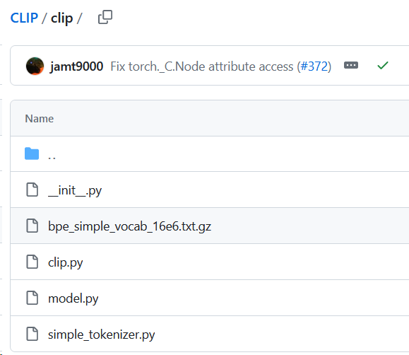

## Learning Transferable Visual Models From Natural Language Supervision


- Results:

- Summary:

- Background:

- Contribution:

- Code:
    - 调用代码
    ```python
    import torch
    import clip
    from PIL import Image

    device = "cuda" if torch.cuda.is_available() else "cpu"
    model, preprocess = clip.load("ViT-B/32", device=device)

    image = preprocess(Image.open("CLIP.png")).unsqueeze(0).to(device)
    text = clip.tokenize(["a diagram", "a dog", "a cat"]).to(device)

    with torch.no_grad():
        image_features = model.encode_image(image)
        text_features = model.encode_text(text)
        logits_per_image, logits_per_text = model(image, text)
        probs = logits_per_image.softmax(dim=-1).cpu().numpy()

    print("Label probs:", probs)  # prints: [[0.9927937  0.00421068 0.00299572]]    

    ```
- clip代码
        
bpe_simple_vocab_16e6.txt.gz 把词表vocabulary化
clip/clip.py            
[model.py#L243](https://github.com/openai/CLIP/blob/main/clip/model.py#L243)
    ```python
    class CLIP(nn.Module):
        def __init__(self,
                    embed_dim: int,
                    # vision
                    image_resolution: int,
                    vision_layers: Union[Tuple[int, int, int, int], int],
                    vision_width: int,
                    vision_patch_size: int,
                    # text
                    context_length: int,
                    vocab_size: int,
                    transformer_width: int,
                    transformer_heads: int,
                    transformer_layers: int
                    ):
            super().__init__()

            self.context_length = context_length # 文本长度

            if isinstance(vision_layers, (tuple, list)):  # 两种encoder
                vision_heads = vision_width * 32 // 64
                self.visual = ModifiedResNet(
                    layers=vision_layers,
                    output_dim=embed_dim,
                    heads=vision_heads,
                    input_resolution=image_resolution,
                    width=vision_width
                )
            else:
                vision_heads = vision_width // 64
                self.visual = VisionTransformer(
                    input_resolution=image_resolution,
                    patch_size=vision_patch_size,
                    width=vision_width,
                    layers=vision_layers,
                    heads=vision_heads,
                    output_dim=embed_dim
                )

            self.transformer = Transformer(
                width=transformer_width,
                layers=transformer_layers,
                heads=transformer_heads,
                attn_mask=self.build_attention_mask()
            )

            self.vocab_size = vocab_size # 词表大小
            self.token_embedding = nn.Embedding(vocab_size, transformer_width)
            self.positional_embedding = nn.Parameter(torch.empty(self.context_length, transformer_width))
            self.ln_final = LayerNorm(transformer_width)

            self.text_projection = nn.Parameter(torch.empty(transformer_width, embed_dim))
            self.logit_scale = nn.Parameter(torch.ones([]) * np.log(1 / 0.07))

            self.initialize_parameters()
                
    ```
[model.py#L328](https://github.com/openai/CLIP/blob/main/clip/model.py#L328)

```python
    def build_attention_mask(self):
        # lazily create causal attention mask, with full attention between the vision tokens
        # pytorch uses additive attention mask; fill with -inf
        mask = torch.empty(self.context_length, self.context_length)
        mask.fill_(float("-inf"))  # 覆盖成0
        mask.triu_(1)  # zero out the lower diagonal
        return mask
```
[model.py#L343](https://github.com/openai/CLIP/blob/main/clip/model.py#L343)
```python
    def encode_text(self, text):
        x = self.token_embedding(text).type(self.dtype)  # [batch_size, n_ctx, d_model]

        x = x + self.positional_embedding.type(self.dtype)
        x = x.permute(1, 0, 2)  # NLD -> LND 交换颠倒
        x = self.transformer(x)
        x = x.permute(1, 0, 2)  # LND -> NLD
        x = self.ln_final(x).type(self.dtype)

        # x.shape = [batch_size, n_ctx, transformer.width]
        # take features from the eot embedding (eot_token is the highest number in each sequence)
        x = x[torch.arange(x.shape[0]), text.argmax(dim=-1)] @ self.text_projection # projection是乘的映射参数

        return x
```
[model.py#L94](https://github.com/openai/CLIP/blob/main/clip/model.py#L94)
```python
class ModifiedResNet(nn.Module):
    """
    A ResNet class that is similar to torchvision's but contains the following changes:
    - There are now 3 "stem" convolutions as opposed to 1, with an average pool instead of a max pool.
    - Performs anti-aliasing strided convolutions, where an avgpool is prepended to convolutions with stride > 1
    - The final pooling layer is a QKV attention instead of an average pool
    """
```


