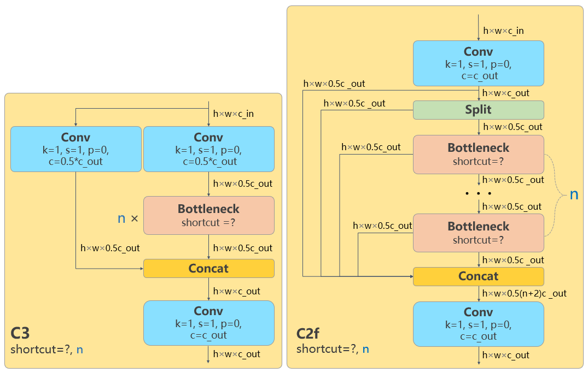
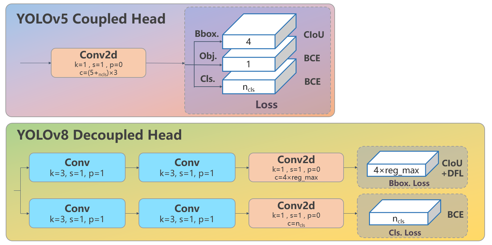
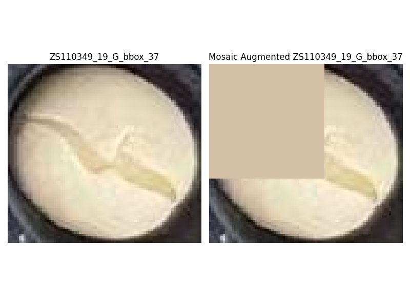
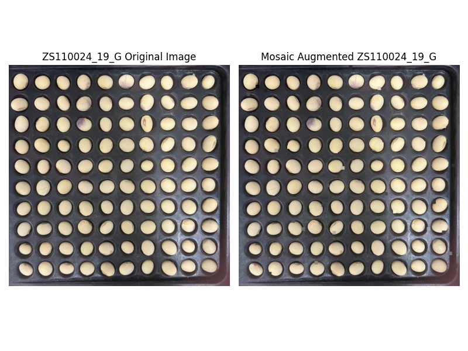

[toc]

# 2023 年秋季学期深度学习实践结课作业——基于深度学习的高通量大豆籽粒表型检测问题

## 一、问题背景
    
大豆是世界上植物蛋白和油脂的首要供应来源作物之一。对于大豆育种而言，高通量表型检测能够加速大豆育种进程，对设计育种研究具有重要的指导价值。因此，如何快速、精确、高通量地对大豆籽粒进行表型检测，进而对其形态性状等指标进行评价，便能够指导优良大豆品种的培育和筛选。传统的大豆籽粒表型检测通常依赖于人工测量，具有人力成本高、准确率较低、提取参数有限等缺点，无法全面、高效地评估大豆籽粒的性状，难以满足大规模高效的数据采集和分析需求。为了解决这一问题，可以通过构建一种基于深度学习的高通量大豆籽粒表型检测方法，可提取表型参数包括大豆籽粒的长度、宽度、种皮面积、种脐长、种脐宽、种脐面积等重要表型参数，并且对种皮裂纹（裂纹扩大后会导致部分种皮脱落，种皮脱落凹陷的部分不属于裂纹）、种皮纹理等反映种子质量的外观指标进行初步评估

## 二、数据集说明

高通量大豆籽粒规格化图像数据集“soybean_dataset”内含有 400 张俯视拍摄的高通量大豆籽粒图像（以下简称图像）。每张图像中均包含有 10×10 规格化排布的 100 颗大豆籽粒，同一张图片中的大豆籽粒均为相同年份、相同地点、相同品种。每张图片的分辨率均为 1276 px×1276 px，现实中的 1mm 约为图片中的 12 个像素。

## 三、任务描述

### 【必做部分】

利用给定的图像数据集，训练、优化并评估大豆籽粒表型检测的深度学习模型，并比较不同模型之间的差异，最后基于最优模型完成对籽粒长、籽粒宽、横截面积、横截周长、圆度、种脐长、种脐宽、种脐面积、种脐周长等表型的提取。

参考步骤如下：
1. 数据预处理、数据标注、数据集划分；
2. 对大豆籽粒、种脐部位做检测/分割模型的训练、优化、对比和评估；
3. 根据模型训练结果，计算得到测试图像中每颗大豆籽粒各项表型参数，并以表格形式汇总导出结果。

### 【选做部分】
任选下列一项完成即可：
1. 选做一：尽可能对大豆籽粒图像中较明显的种皮裂纹进行目标检测，要求能够输出图像的种皮裂纹总数量及占比。
    提示：裂纹不规则且目标较精细，且裂纹与种皮脱落之间可能难以区分。
2. 选做二：尽可能地检测出大豆籽粒图像中存在较明显的种皮纹理的大豆籽粒（如褐色斑纹、灰紫色斑纹等），输出测试图像中带明显纹理的大豆籽粒数量。
    提示：大豆的纹理较复杂，种皮脱落部分也易被错误识别为纹理。
3. 选做三：尝试得到每个大豆籽粒的种皮颜色（不含种脐部分）、种脐颜色。
    提示：需要自行构建特定部位的颜色提取算法，尽可能地表征出种皮和种脐的真实颜色，分析该算法的可行性、鲁棒性。
4. 选做四：在必做部分的基础上，选取其他你认为有价值的相关方向进行深入研究，需使用深度学习相关方法，内容不限。

## 四、作业要求
3 位同学结成一组，最后一次课进行 10min 左右的大作业汇报。各组组长将汇报 PPT、项目文档、源代码（可不含数据集）、结果表格等文件于 2023 年 12月 24 日 24:00 前打包发送至邮箱 18810023758@163.com。

## 五、Supplementary:    

### 5.1 必做：籽粒长、籽粒宽、横截面积、横截周长、圆度

#### 5.1.1 数据集：大豆籽粒自动标注

> 链接：https://pan.baidu.com/s/1TohcW6ChlXnw6b1sAyygtA?pwd=ldaq 
提取码：ldaq 
--来自百度网盘超级会员V3的分享

标注标签在深度学习中是一项非常耗时和繁琐的任务。在全监督式学习中，模型通常需要大量的标记数据来训练，这意味着数据集中的每个样本都需要手动标记其对应的标签或类别。例如，在计算机视觉任务中，需要对图像进行标记，而在自然语言处理中，需要对文本进行分类或命名实体识别等任务。

计算机视觉分为图像分类、目标检测、图像分割、图像生成等一系列任务。在语义分割任务中，标注数据尤其耗时。语义分割是计算机视觉中的一项任务，旨在对图像中的每个像素进行分类，将其分配到对应的语义类别中。与简单的图像分类或目标检测任务相比，语义分割要求对图像中每个像素进行精确的标注，以区分不同的对象或区域，这增加了标注数据的复杂性和耗时性。

对图像进行语义分割标注通常需要人工绘制像素级的边界框或掩码，以标识图像中不同对象或区域的边界。这种精细级别的标注需要更多的时间和专业知识，因为标注者需要精确理解图像中不同区域的语义信息，并正确地为每个像素分配适当的标签。深度学习需要大量精细标注的数据作为“燃料”。例如据 Cityscapes 官方，标注一张该数据集中的语义分割平均需要 1.5小时。降低获得数据集的成本是我们不得不考虑的因素。

由于语义分割所需的像素级标注耗时且复杂，因此寻求减少标注需求的方法变得尤为重要。使用半监督学习、生成模型、迁移学习或利用合成数据等技术可以帮助减少对大量完整标记数据的依赖，从而降低语义分割任务中标注的时间和成本。

在本次作业中我们同过结合数字图像处理方法和视觉基础模型（[segment-anything](https://github.com/facebookresearch/segment-anything)）实现大豆籽粒的自动标注，获得目标检测和语义/实例分割标注，并存储为Yolo格式。

具体实现方式如下：

##### 5.1.1.1 确定大豆边界

首先使用边缘检测在经过高斯滤波去噪的大豆籽粒灰度图像中寻找到大豆边界。

 

##### 5.1.1.2 计算大豆质心

而后近似计算得到大豆质心。

 
 

##### 5.1.1.3 利用质心输入SAM获得掩码

将修正后的质心作为point prompt输入[segment-anything](https://github.com/facebookresearch/segment-anything)得到掩码，取掩码轮廓得到边界框和像素级别分割标签。共37972颗大豆，其中手动调整质心修正25颗。

##### 5.1.1.4 转换标签

将经过视觉基础模型的掩码转换成Yolo格式的目标检测框标签和像素级实例掩码标签

###### 目标检测框

###### 像素级掩码标签

#### 5.1.2 计算籽粒表型参数

计算获得籽粒长、籽粒宽、横截面积、横截周长、圆度

### 5.2 必做：种脐长、种脐宽、种脐面积、种脐周长

#### 5.2.1 YoloV8目标检测模型

YOLOv8 是 Ultralytics 公司在 2023 年 1月 10 号开源的 YOLOv5 的下一个重大更新版本，目前支持图像分类、物体检测和实例分割任务，在还没有开源时就收到了用户的广泛关注。

按照官方描述，YOLOv8 是一个 SOTA 模型，它建立在以前 YOLO 版本的成功基础上，并引入了新的功能和改进，以进一步提升性能和灵活性。具体创新包括一个新的骨干网络、一个新的 Ancher-Free 检测头和一个新的损失函数，可以在从 CPU 到 GPU 的各种硬件平台上运行。 不过 Ultralytics 并没有直接将开源库命名为 YOLOv8，而是直接使用 Ultralytics 这个词，原因是 Ultralytics 将这个库定位为算法框架，而非某一个特定算法，一个主要特点是可扩展性。其希望这个库不仅仅能够用于 YOLO 系列模型，而是能够支持非 YOLO 模型以及分类分割姿态估计等各类任务。 总而言之，Ultralytics 开源库的两个主要优点是：

- 融合众多当前 SOTA 技术于一体
- 未来将支持其他 YOLO 系列以及 YOLO 之外的更多算法

YOLOv8 算法的核心特性和改动可以归结为如下：
1. 提供了一个全新的 SOTA 模型，包括 P5 640 和 P6 1280 分辨率的目标检测网络和基于 YOLACT 的实例分割模型。和 YOLOv5 一样，基于缩放系数也提供了 N/S/M/L/X 尺度的不同大小模型，用于满足不同场景需求
2. 骨干网络和 Neck 部分可能参考了 YOLOv7 ELAN 设计思想，将 YOLOv5 的 C3 结构换成了梯度流更丰富的 C2f 结构，并对不同尺度模型调整了不同的通道数，属于对模型结构精心微调，不再是无脑一套参数应用所有模型，大幅提升了模型性能。不过这个 C2f 模块中存在 Split 等操作对特定硬件部署没有之前那么友好了
3. Head 部分相比 YOLOv5 改动较大，换成了目前主流的解耦头结构，将分类和检测头分离，同时也从 Anchor-Based 换成了 Anchor-Free
4. Loss 计算方面采用了 TaskAlignedAssigner 正样本分配策略，并引入了 Distribution Focal Loss
5. 训练的数据增强部分引入了 YOLOX 中的最后 10 epoch 关闭 Mosiac 增强的操作，可以有效地提升精度

从上面可以看出，YOLOv8 主要参考了最近提出的诸如 YOLOX、YOLOv6、YOLOv7 和 PPYOLOE 等算法的相关设计，本身的创新点不多，偏向工程实践，主推的还是 ultralytics 这个框架本身。

##### 5.2.1.1 Yolov8 结构设计

骨干网络和 Neck 的具体变化为：

1. 第一个卷积层的 kernel 从 6x6 变成了 3x3
2. 所有的 C3 模块换成 C2f，结构如下所示，可以发现多了更多的跳层连接和额外的 Split 操作
3. 去掉了 Neck 模块中的 2 个卷积连接层
4. Backbone 中 C2f 的 block 数从 3-6-9-3 改成了 3-6-6-3
5. 查看 N/S/M/L/X 等不同大小模型，可以发现 N/S 和 L/X 两组模型只是改了缩放系数，但是 S/M/L 等骨干网络的通道数设置不一样，没有遵循同一套缩放系数。如此设计的原因应该是同一套缩放系数下的通道设置不是最优设计，YOLOv7 网络设计时也没有遵循一套缩放系数作用于所有模型

Head 部分变化最大，从原先的耦合头变成了解耦头，并且从 YOLOv5 的 Anchor-Based 变成了 Anchor-Free。其结构如下所示：

可以看出，不再有之前的 objectness 分支，只有解耦的分类和回归分支，并且其回归分支使用了 Distribution Focal Loss 中提出的积分形式表示法。

##### 5.2.1.2 Loss 计算

Loss 计算过程包括 2 个部分：正负样本分配策略和 Loss 计算。现代目标检测器大部分都会在正负样本分配策略上面做文章，典型的如 YOLOX 的 simOTA、TOOD 的 TaskAlignedAssigner 和 RTMDet 的 DynamicSoftLabelAssigner，这类 Assigner 大都是动态分配策略，而 YOLOv5 采用的依然是静态分配策略。考虑到动态分配策略的优异性，YOLOV8 算法中则直接引用了 TOOD 的 TaskAlignedAssigner。TaskAlignedAssigner 的匹配策略简单总结为：根据分类与回归的分数加权的分数选择正样本。

$$
t=s^\alpha+u^\beta
$$

$s$ 是标注类别对应的预测分值，u 是预测框和 gt 框的 iou，两者相乘就可以衡量对齐程度。

1. 对于每一个 ${GT}$ ，对所有的预测框基于 ${GT}$ 类别对应分类分数，预测框与 ${GT}$ 的  $iou$ 的加权得到一个关联分类以及回归的对齐分数 alignment_metrics
2. 对于每一个 GT，直接基于 alignment_metrics 对齐分数选取 topK 大的作为正样本

Loss 计算包括 2 个分支：分类和回归分支，没有了之前的 objectness 分支。
- 分类分支依然采用 BCE Loss 
- 回归分支需要和 Distribution Focal Loss 中提出的积分形式表示法绑定，因此使用了 Distribution Focal Loss，同时还使用了 CloU Loss

3 个 Loss 采用一定权重比例加权即可。

##### 5.2.1.3 目标检测评价指标

训练完成后，对模型的性能进行评估。本文使用 Precision（精确率）、Recall（召回率）、mAP（平均精度均值）和FPS（每秒帧数）：

1. Precision（精确率）：
    精确率是指模型在预测为正类的样本中，真正为正类的比例。数学公式为：Precision = TP / (TP + FP)，其中 TP 是真正例（模型正确预测为正类的样本数），FP 是假正例（模型错误预测为正类的样本数）。精确率衡量了模型预测为正类的准确性。
2. Recall（召回率）：
    召回率是指模型正确预测为正类的样本数占真正为正类的样本数的比例。数学公式为：Recall = TP / (TP + FN)，其中 TP 是真正例，FN 是假负例（模型错误预测为负类的样本数）。召回率衡量了模型找到正类样本的能力。
3. mAP（平均精度均值）：
    mAP 是目标检测中常用的指标之一，它代表了在不同类别下的平均精度。对于每个类别，我们计算其 Precision-Recall 曲线下的面积（AP，平均精度），然后取所有类别的 AP 的平均值。mAP 能更全面地评估模型在各个类别上的检测性能。
4. FPS（每秒帧数）：
    FPS 是指模型处理图像的速度，即每秒处理的图像帧数。在目标检测中，除了模型的准确性，速度也是一个重要指标。较高的 FPS 意味着模型能够更快地处理图像，适用于实时应用。

其中P，R，AP的计算公式如下：

$$P=\frac{T P}{TP+FP}$$

$$R=\frac{T P}{T P+F N}$$

$$A P=\int_0^1 P(R) d R$$

#### 5.2.2 数据和数据预处理

分别使用了具有种脐和裂纹的单个籽粒和整盘籽粒的目标检测数据。

数据增强是在训练神经网络时用于增加训练样本多样性的一种技术。它通过对原始图像进行变换或操作，生成新的训练样本。首先使用几种常见的数据增强方式进行数据增强，包括：

- 水平翻转（Horizontal Flip）：沿着垂直轴翻转图像。例如，一张人脸朝右的图像经过水平翻转后就会变成朝左的图像。
- 旋转（Rotate）：对图像进行旋转，使图像绕着中心点旋转一定角度。旋转可以是任意角度，比如90度、180度等。
- 垂直翻转（Vertical Flip）：沿着水平轴翻转图像。与水平翻转类似，但是是垂直方向上的翻转。
- 马赛克（Mosaic）：将图像分割成网格，然后随机选取一个网格并用该网格中的像素值覆盖其他网格的像素值。这种方法通常用于提高模型对部分遮挡的物体的识别能力。

#### 5.2.3 单个籽粒目标检测

| Models                    | Class   | Precision | Recall | mAP    | FPS |
| :------------------------- | :------ | :---------- | :------ | :----- | :-- |
| YoloV8n                   | All     | 0.74       | 0.656   | 0.728 | 153 |
|                            | Hilum   | 0.813      | 0.646   | 0.783 |      |
|                            | Crack   | 0.666      | 0.666   | 0.672 |      |
| YoloV8-mobilevit         | All     | 0.474      | 0.533   | 0.465 | 135 |
|                            | Hilum   | 0.54       | 0.554   | 0.565 |      |
|                            | Crack   | 0.408      | 0.511   | 0.365 |      |
| YoloV8-ghost              | All     | 0.682      | 0.649   | 0.675 | 714 |
|                            | Hilum   | 0.811      | 0.653   | 0.774 |      |
|                            | Crack0 | 0.554      | 0.644   | 0.575 |      |
| YoloV8-ghost-p2          | All     | 0.663      | 0.697   | 0.567 | 500 |
| 包含了P2层，有四个输出层 | Hilum   | 0.75       | 0.854   | 0.579 |      |
| 提升了小目标检测能力      | Crack   | 0.575      | 0.54    | 0.556 |      |
| YoloV8-ghost-p6          | All     | 0.71       | 0.683   | 0.684 | 714 |
| 包含了P6层，有四个输出层 | Hilum   | 0.806      | 0.66    | 0.763 |      |
| 针对高分辨率图像          | Crack   | 0.613      | 0.705   | 0.605 |      |

#### 5.2.4 整盘籽粒目标检测

| Models           | Class | Precision | Recall | mAP    | FPS |
| :--------------- | :----- | :-------- | :----- | :----- | :-- |
| YoloV8n          | All    | 0.74       | 0.656   | 0.728 |      |
|                  | Hilum | 0.813      | 0.646   | 0.783 |      |
|                  | Crack | 0.666      | 0.666   | 0.672 |      |
| YoloV8-mobilevit | All    |           |        |        |      |
|                  | Hilum |           |        |        |      |
|                  | Crack |           |        |        |      |
| YoloV8-ghost     | All    |           |        |        |      |
|                  | Hilum |           |        |        |      |
|                  | Crack |           |        |        |      |
| YoloV8-ghost-p2  | All    |           |        |        |      |
|                  | Hilum |           |        |        |      |
|                  | Crack |           |        |        |      |
| YoloV8-ghost-p6  | All    |           |        |        |      |
|                  | Hilum |           |        |        |      |
|                  | Crack |           |        |        |      |

### 5.3 选做：

