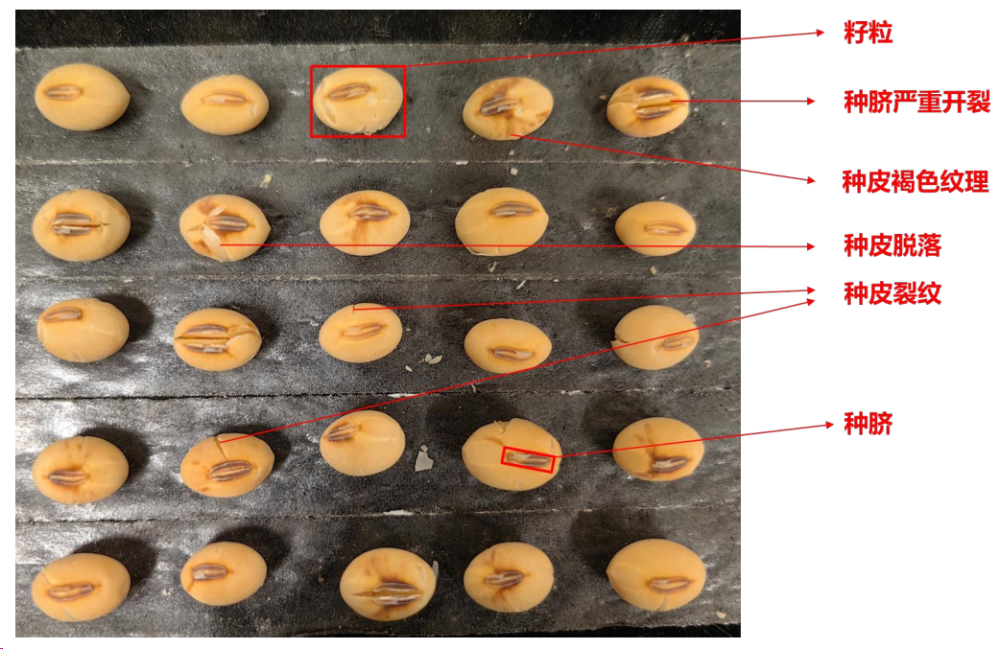
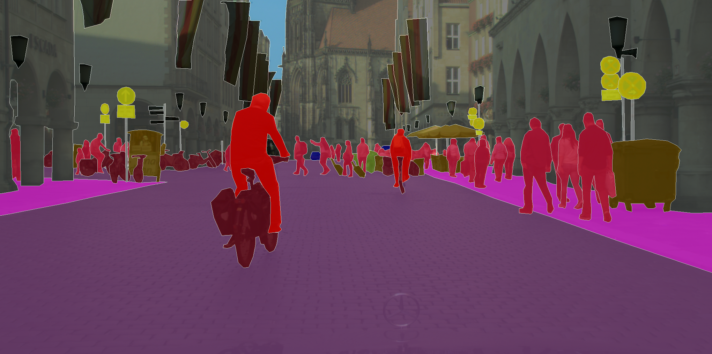
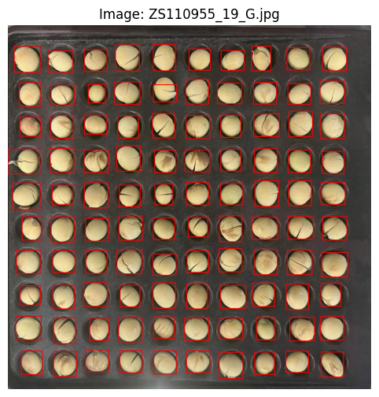
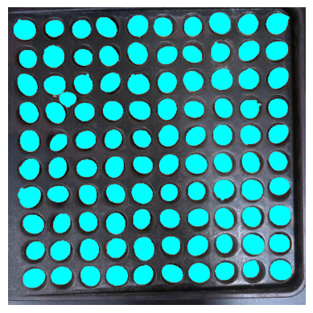
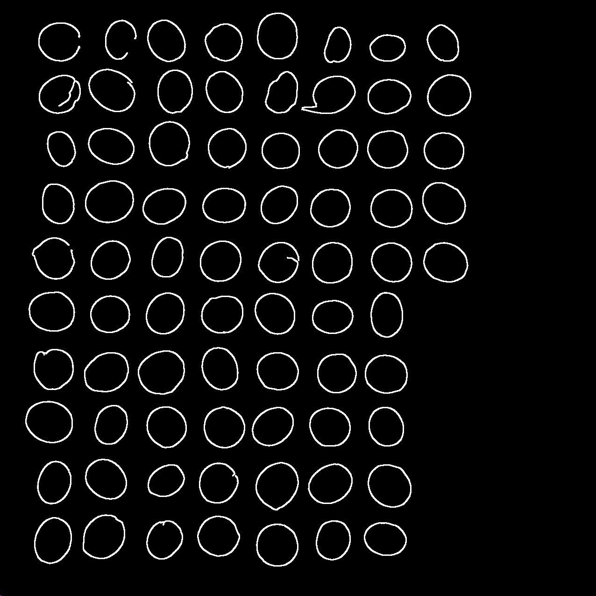
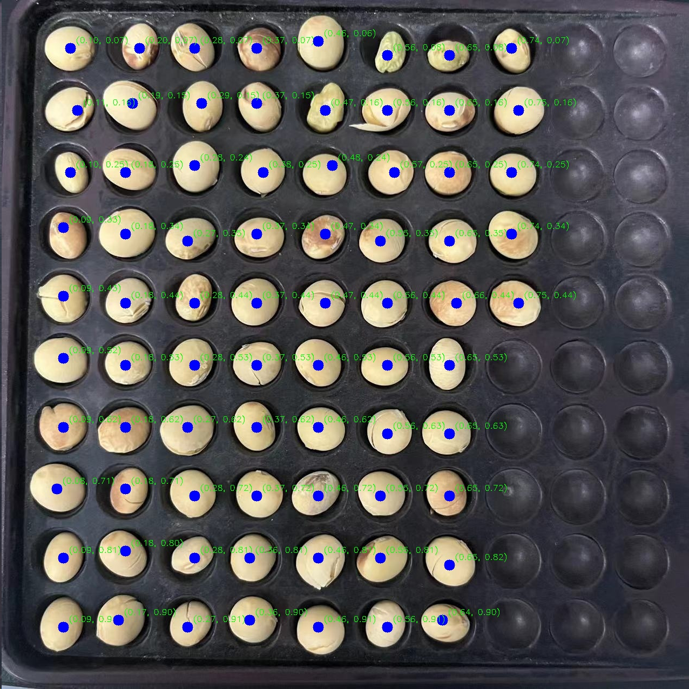
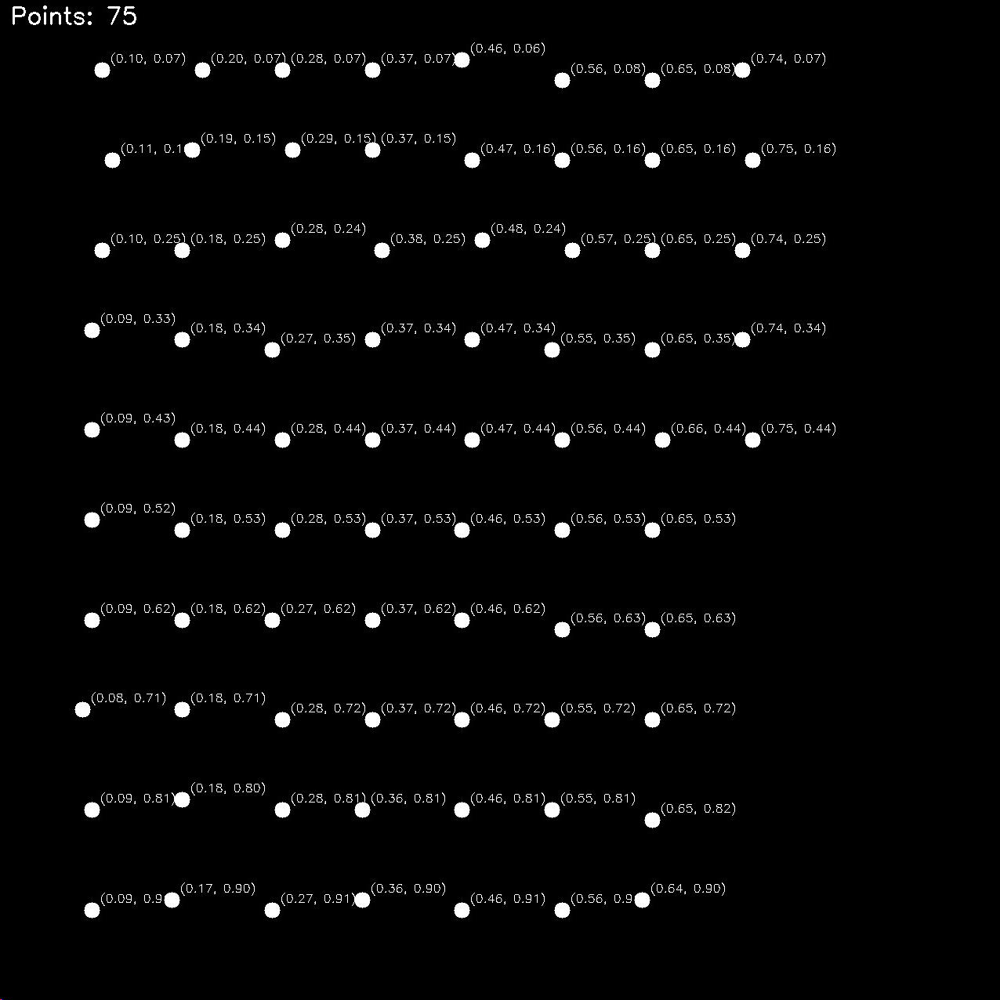
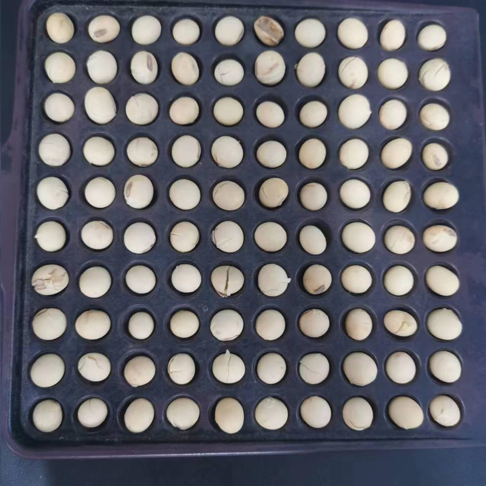
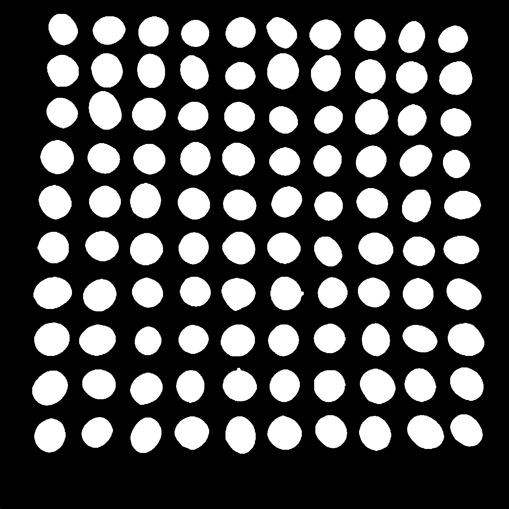

# 2023 年秋季学期深度学习实践结课作业——基于深度学习的高通量大豆籽粒表型检测问题

## 一、问题背景
    
大豆是世界上植物蛋白和油脂的首要供应来源作物之一。对于大豆育种而言，高通量表型检测能够加速大豆育种进程，对设计育种研究具有重要的指导价值。因此，如何快速、精确、高通量地对大豆籽粒进行表型检测，进而对其形态性状等指标进行评价，便能够指导优良大豆品种的培育和筛选。传统的大豆籽粒表型检测通常依赖于人工测量，具有人力成本高、准确率较低、提取参数有限等缺点，无法全面、高效地评估大豆籽粒的性状，难以满足大规模高效的数据采集和分析需求。为了解决这一问题，可以通过构建一种基于深度学习的高通量大豆籽粒表型检测方法，可提取表型参数包括大豆籽粒的长度、宽度、种皮面积、种脐长、种脐宽、种脐面积等重要表型参数，并且对种皮裂纹（裂纹扩大后会导致部分种皮脱落，种皮脱落凹陷的部分不属于裂纹）、种皮纹理等反映种子质量的外观指标进行初步评估

## 二、数据集说明

高通量大豆籽粒规格化图像数据集“soybean_dataset”内含有 400 张俯视拍摄的高通量大豆籽粒图像（以下简称图像）。每张图像中均包含有 10×10 规格化排布的 100 颗大豆籽粒，同一张图片中的大豆籽粒均为相同年份、相同地点、相同品种。每张图片的分辨率均为 1276 px×1276 px，现实中的 1mm 约为图片中的 12 个像素。

## 三、任务描述

### 【必做部分】

利用给定的图像数据集，训练、优化并评估大豆籽粒表型检测的深度学习模型，并比较不同模型之间的差异，最后基于最优模型完成对籽粒长、籽粒宽、横截面积、横截周长、圆度、种脐长、种脐宽、种脐面积、种脐周长等表型的提取。

参考步骤如下：
1. 数据预处理、数据标注、数据集划分；
2. 对大豆籽粒、种脐部位做检测/分割模型的训练、优化、对比和评估；
3. 根据模型训练结果，计算得到测试图像中每颗大豆籽粒各项表型参数，并以表格形式汇总导出结果。

### 【选做部分】
任选下列一项完成即可：
1. 选做一：尽可能对大豆籽粒图像中较明显的种皮裂纹进行目标检测，要求能够输出图像的种皮裂纹总数量及占比。
    提示：裂纹不规则且目标较精细，且裂纹与种皮脱落之间可能难以区分。
2. 选做二：尽可能地检测出大豆籽粒图像中存在较明显的种皮纹理的大豆籽粒（如褐色斑纹、灰紫色斑纹等），输出测试图像中带明显纹理的大豆籽粒数量。
    提示：大豆的纹理较复杂，种皮脱落部分也易被错误识别为纹理。
3. 选做三：尝试得到每个大豆籽粒的种皮颜色（不含种脐部分）、种脐颜色。
    提示：需要自行构建特定部位的颜色提取算法，尽可能地表征出种皮和种脐的真实颜色，分析该算法的可行性、鲁棒性。
4. 选做四：在必做部分的基础上，选取其他你认为有价值的相关方向进行深入研究，需使用深度学习相关方法，内容不限。

## 四、作业要求
3 位同学结成一组，最后一次课进行 10min 左右的大作业汇报。各组组长将汇报 PPT、项目文档、源代码（可不含数据集）、结果表格等文件于 2023 年 12月 24 日 24:00 前打包发送至邮箱 18810023758@163.com。

## Supplementary:    

### 数据集：大豆籽粒自动标注

> 链接：https://pan.baidu.com/s/1TohcW6ChlXnw6b1sAyygtA?pwd=ldaq 
提取码：ldaq 
--来自百度网盘超级会员V3的分享

标注标签在深度学习中是一项非常耗时和繁琐的任务。在全监督式学习中，模型通常需要大量的标记数据来训练，这意味着数据集中的每个样本都需要手动标记其对应的标签或类别。例如，在计算机视觉任务中，需要对图像进行标记，而在自然语言处理中，需要对文本进行分类或命名实体识别等任务。

计算机视觉分为图像分类、目标检测、图像分割、图像生成等一系列任务。在语义分割任务中，标注数据尤其耗时。语义分割是计算机视觉中的一项任务，旨在对图像中的每个像素进行分类，将其分配到对应的语义类别中。与简单的图像分类或目标检测任务相比，语义分割要求对图像中每个像素进行精确的标注，以区分不同的对象或区域，这增加了标注数据的复杂性和耗时性。

对图像进行语义分割标注通常需要人工绘制像素级的边界框或掩码，以标识图像中不同对象或区域的边界。这种精细级别的标注需要更多的时间和专业知识，因为标注者需要精确理解图像中不同区域的语义信息，并正确地为每个像素分配适当的标签。深度学习需要大量精细标注的数据作为“燃料”。例如据 Cityscapes 官方，标注一张该数据集中的语义分割平均需要 1.5小时。降低获得数据集的成本是我们不得不考虑的因素。

由于语义分割所需的像素级标注耗时且复杂，因此寻求减少标注需求的方法变得尤为重要。使用半监督学习、生成模型、迁移学习或利用合成数据等技术可以帮助减少对大量完整标记数据的依赖，从而降低语义分割任务中标注的时间和成本。

在本次作业中我们同过结合数字图像处理方法和视觉基础模型（[segment-anything](https://github.com/facebookresearch/segment-anything)）实现大豆籽粒的自动标注，获得目标检测和语义/实例分割标注，并存储为Yolo格式。从数据集中随机抽取两张进行可视化如下：

具体实现方式如下：
#### 1. 首先使用边缘检测在经过高斯滤波去噪的大豆籽粒灰度图像中寻找到大豆边界。

 

#### 2. 而后近似计算得到大豆质心。
 
 

#### 3. 将修正后的质心作为point prompt输入[segment-anything](https://github.com/facebookresearch/segment-anything)得到掩码，取掩码轮廓得到边界框和像素级别分割标签。共37972颗大豆，其中手动调整质心修正25颗。

#### 4. 将经过视觉基础模型的结果转换成Yolo格式的目标检测框标签和像素级语义标签。

## Reference:    