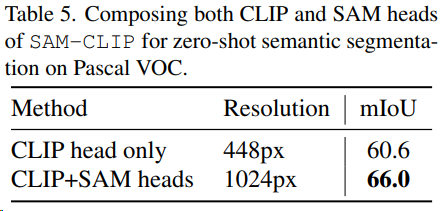
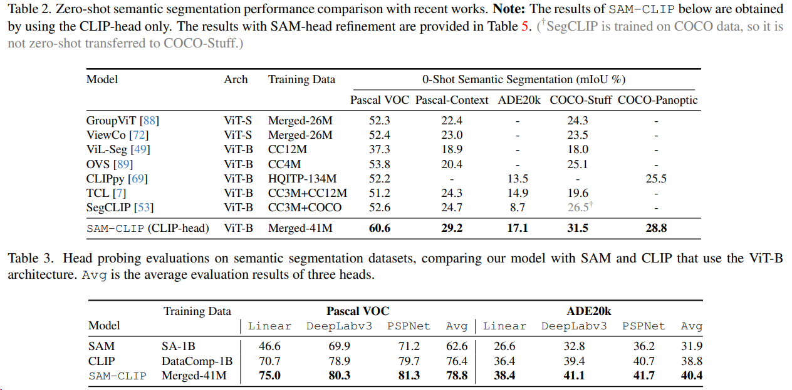
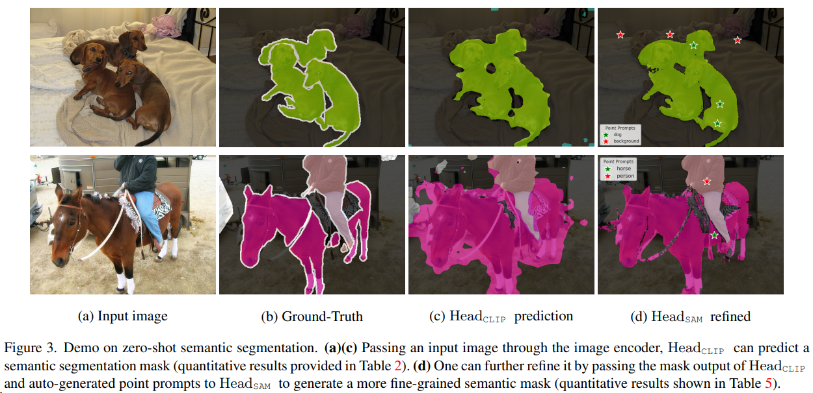

## SAM-CLIP: Merging Vision Foundation Models towardsSemantic and Spatial Understanding

- Results:

- Summary:
SAM结合clip的语义信息进行zero-shot语义分割，同时判断类别。
- Pipeline:

左图训练Pipeline，用SAM的image encoder （vit-b）初始化 Enc SAM-clip；Head clip （3层 transformer）随机初始化，也可以用SAM image encoder最后一层来初始化，加快训练收敛；Head sam 用 MaskDec sam 的参数初始化； Prompt Enc sam
用SAM本身的权重，且固定；Text Enc clip也是。

Dclip 和 Dsam 分别是训练的CLIP的数据和SA-1B的子集。

Enc SAM-clip 后的image feature，经过Head clip 的结果（HW×C）再经过最大池化得到每张图的1×C的embedding ，经过LN ，再经过浅层mlp作为预测的 embedding。
Head clip 和 Enc SAM-clip 都是可学习的，Enc clip是固定权重的。
两阶段训练：
1.  head probing 固定Enc SAM-clip  只用$L_{clip}$训Head clip。
2.  multi-task disillation Enc SAM-clip 解冻可训，Head clip 和 Head sam 都可训，损失是$L_{clip} + \lambda {L_{SAM}}$

将 CLIP 和 SAM 头部组合以获得更好的分割
鉴于 SAM-CLIP 是一个具有 SAM 和 CLIP 头部的多任务模型，人们自然会问两个头部是否可以一起合作以在某些任务上获得更好的性能。在这里，我们展示了一个简单的组合 CLIP 和 SAM 头部的示例，可以带来更好的零样本语义分割。具体而言，我们将输入图像调整大小为 1024px，并通过 EncSAM-CLIP 传递，使用 CLIP head 基于文本提示生成低分辨率的掩码预测（32 × 32）。然后，我们从掩码预测中生成一些点提示（根据掩码预测置信度进行重要采样），并将掩码预测和点提示一起传递到提示编码器模块作为几何提示。最后，HeadSAM 利用提示编码器和图像编码器的嵌入生成高分辨率的掩码预测（256 × 256），如图 2（右侧）所示。此流程的示例在图 3 中显示。可以清楚地观察到 SAM-head 的细分更加精细。关于此流程的实现细节在附录 C 中讨论。

值得注意的是，此流程仅在 Enc SAM-CLIP 上进行一次前向传递，分辨率为 1024px。为了公平比较，在表 1 和图 1 中，我们报告了使用 HeadCLIP 在 448px 分辨率下的 SAM-CLIP 零样本分割性能。使用我们的高分辨率流程，我们在零样本语义分割中获得了进一步的增益，如表 5 所示。

- Contribution:

- Code:

