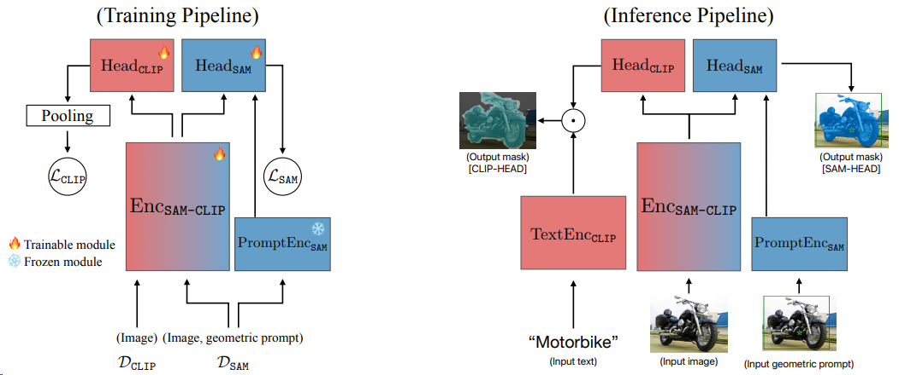
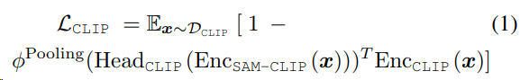
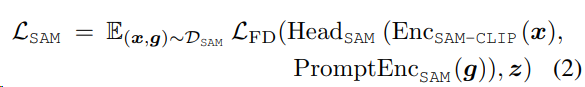

## SAM-CLIP: Merging Vision Foundation Models towardsSemantic and Spatial Understanding

- Results:

- Summary:
SAM结合clip的语义信息进行zero-shot语义分割，同时判断类别。
- Pipeline:

左图训练Pipeline，用SAM的image encoder （vit-b）初始化 Enc SAM-clip；Head clip （3层 transformer）随机初始化，也可以用SAM image encoder最后一层来初始化，加快训练收敛；Head sam 用 MaskDec sam 的参数初始化； Prompt Enc sam
用SAM本身的权重，且固定；Text Enc clip也是。

Dclip 和 Dsam 分别是训练的CLIP的数据和SA-1B的子集。

Enc SAM-clip 后的image feature，经过Head clip 的结果（HW×C）再经过最大池化得到每张图的1×C的embedding ，经过LN ，再经过浅层mlp作为预测的 embedding。
Head clip 和 Enc SAM-clip 都是可学习的，Enc clip是固定权重的。
两阶段训练：
1.  head probing 固定Enc SAM-clip  只用$L_{clip}$训Head clip。
2.  multi-task disillation Enc SAM-clip 解冻可训，Head clip 和 Head sam 都可训，损失是$L_{clip} + \lambda {L_{SAM}}$

- Contribution:

- Code:

