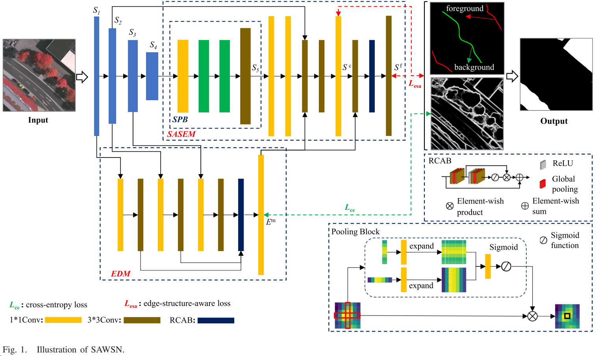

## Comparison Methods

### SAWSN

Structure-Aware Weakly Supervised Network for Building Extraction From Remote Sensing Images

Hui Chen et al., the IEEE Transactions on Geoscience and Remote Sensing, 2022

#### 摘要

使用全监督深度学习方法从遥感图像（RSIs）中提取建筑物已经显示出出色的性能，这需要大量的训练数据，并且需要耗费大量时间进行逐像素标注。与像素密集标注相比，使用涂抹进行标注要容易得多，每张图像只需几秒钟。本文提出了一种一阶段结构感知弱监督网络（SAWSN）用于建筑物提取，并且从容易获取的涂抹中学习，而不是从密集注释的地面真实值中学习。首先，为了解决直接使用涂抹标签进行训练会导致建筑结构不佳的问题，引入了一个辅助边缘检测任务来明确定位建筑物边缘。其次，设计了一个结构感知涂抹扩展模块（SASEM），通过有效利用边缘特征从涂抹中恢复建筑结构。最后，提出了一种边缘-结构感知损失来限制恢复结构的范围。我们对三个新标记的基准建筑提取数据集（WHU、ISPRS波茨坦和Vaihingen）进行了广泛的实验。实验结果显示，我们的方法分别在ISPRS Vaihingen、Potsdam和WHU数据集上实现了91.72%、92.83%和92.22%的F1，并且比最先进的基于涂抹的弱监督（WS）方法的IoU高出了3.27%。

#### 主要贡献

SAWSN方法：作者介绍了结构感知弱监督网络（SAWSN），旨在从涂抹注释中学习。这种方法有益处，因为涂抹注释相对于逐像素注释来说，明显更容易且耗时更少。

辅助边缘检测和SASEM：为了解决仅从涂抹标签中得到的建筑结构描述不佳的问题，论文引入了一个辅助边缘检测任务，明确定位建筑边缘。此外，还提出了一个结构感知涂抹扩展模块（SASEM），通过利用边缘特征有效恢复建筑结构。

边缘-结构感知损失：提出了一种创新的损失函数，称为边缘-结构感知损失，用于限制恢复结构的范围，引导网络更准确地提取建筑。

实验验证：SAWSN模型在三个新标记的基准建筑提取数据集上进行了广泛测试：武汉大学（WHU）、ISPRS波茨坦（Potsdam）和Vaihingen。结果表明，SAWSN优于最先进的基于涂抹的弱监督方法，在ISPRS Vaihingen、Potsdam和WHU数据集上分别实现了91.72%、92.83%和92.22%的F1分数。

#### 方法

#####  边缘检测

涂抹标签不能提供对象的结构信息。因此，在我们的SAWSN中引入了辅助EDM来生成丰富的结构信息。我们注意到，许多先进的边缘检测算法可以很好地检测RSIs中建筑区域的结构，例如更丰富的卷积特征（RCFs，用于边缘检测）[43]和双向级联网络（BDCNs）[45]。受这些工作的启发，提出了一个简单的EDM来生成边缘特征。如图1所示，通过两个卷积层生成的特征图在连接后，输入到一个1×1的卷积层以产生边缘地图Em。残差通道注意块（RCAB）[41]，[46]用于抑制边缘外的无用信息。集成的RCAB利用了通道注意和残差的原理。首先，将输入特征图Finput经过卷积-relu-卷积层，得到特征图Fcrc。然后，Fcrc经过全局池化层和卷积-relu-卷积层，得到Fgcrc。最后，将Finput和Fgcrc组合起来得到输出特征Foutput。

##### 结构感知涂抹扩展模块

为了从涂抹中恢复建筑结构，SASEM使用了条带池块（SPB）进行上下文建模，并采用更灵活的边缘特征融合策略来获得结构完整的建筑。

1）条带池块：上下文建模对语义分割至关重要，由于RSIs中建筑物形状的多样性和标签的稀疏性而更加困难。涂抹的形状通常是多样化的，受标记者主观判断的影响，因此需要高效地捕获长程依赖关系。因此，在SASEM中使用条带池[42]来创建SPB。如图1所示，SPB具有两个池块和两个卷积层。每个池块使用水平和垂直条带池化来获取沿水平或垂直方向的远程上下文。此外，对于池化地图中的每个空间位置，它编码其全局垂直和水平信息，然后使用这些编码进行特征优化。因此，SPB可以在涂抹的监督下有效地进行上下文建模。这使得SASEM能够应对多尺度和多形状的建筑提取任务。我们希望SPB在这个阶段更加语义化，并且不引入任何边缘特征。

2）边缘特征融合：为了更有效地利用边缘特征，在SASEM中采用了更灵活的多类型特征融合策略。增加较低级别特征的语义化，并为较高级别特征添加更多的空间信息是特征融合的有效方法。考虑到EDM可以提供丰富的边缘特征，因此，将S5、Em和S2连接在一个1×1卷积层之后。经过两个3×3卷积层后，使用额外的1×1卷积层将它们映射到一个单通道的粗分割地图Sc。然而，单阶段利用边缘特征可能对结构恢复的帮助有限。与以前的工作不同，SASEM在不同阶段使用边缘信息。具体来说，边缘地图Em和Sc在经过3×3卷积层连接后，然后输入到RCAB和一个3×3卷积层以产生边缘细化。

##### 多类型损失函数

虽然SAWSN生成的建筑提取结果在结构上丰富，但对于要恢复的结构范围没有限制，因此损失函数的选择对于WS网络至关重要。考虑到交叉熵损失对恢复结构信息的指导有限，提出了边缘-结构感知损失（Lesa），它鼓励分割地图的结构与图像中的真实边界相似。

1）边缘-结构感知损失 Lesa：结构相关的损失函数鼓励预测的地图具有与图像的显著区域类似的结构。图像的显著区域的结构通常是通过超像素分割、显著性检测和基于图像低级信息的边缘检测来获取。然而，这种方式中的结构约束容易受到噪声和无用的背景信息的影响。为了使我们的网络专注于建筑区域的结构并减少背景结构和噪声造成的干扰，设计了Lesa来实施结构约束，同时考虑语义。Lesa被定义为

$$
L_{\text {esa }}=L_{\text {ess }}+L_{\text {mce }}
$$

其中 $L_{\text {mce }}$ 是用于引导建筑语义信息恢复的掩模交叉熵损失。用于引导建筑结构恢复的 $L_{\text {ess }}$ 被定义为

$$
L_{\text {ess }}=\sum_{u, v} \sum_{p \in \vec{x}, \vec{y}}\left(\left(\left|\partial_p S_{u, v}\right| e^{-\alpha\left|\partial_p\left(E_{u, v}^g\right)\right|}\right)^2+1 e^{-6}\right)^{1 / 2}+\mathcal{S}
$$

其中 $E_{u, v}^g$ 是像素（$u$, $v$）的边缘图像强度值，$E^g$ 是使用其开源预训练模型从BDCN获得的真实边缘图像。BDCN可以有效地利用分层特征并产生像素准确的边界图。$\partial p$ 表示 $x$- 和 $y$-方向的偏导数。$\alpha$ 是一个常数。 $S$ 是由SAWSN生成的建筑分割地图。$S$ 可以通过以下方式计算：
$$
S=\left(1-\operatorname{SSIM}\left(S, E^g\right)\right)
$$ 
其中SSIM是结构相似性指数。
尽管BDCN生成的边缘地图不可避免地带有噪声，但可以从（2）中看出，Lesa计算了提取的建筑区域的结构与真实边缘的相似性。在训练过程中，更多的关注点放在具有高相似度的真实结构的前景区域的结构上，而不是整个图像。因此，这个设计有效地减少了背景和结构噪声的影响。

2）目标函数：为了更好地利用Lesa来恢复建筑结构，Lesa在SASEM的两个不同部分使用。具体来说，联合损失(Lm)包括两个子损失，交叉熵损失(Lce)和Lesa，可以通过以下方程计算：

$$
\begin{aligned}
L_m= & w_{1 *}\left(L_{\mathrm{mce}}\left(S^c * y, y\right)+L_{\mathrm{mce}}\left(S^f * y, y\right)\right) \\
& +L_{\mathrm{ce}}\left(E^m, E^g\right)+w_2 *\left(L_{\mathrm{ess}}\left(S^c, E^g\right)+L_{\mathrm{ess}}\left(S^f, E^g\right)\right)
\end{aligned}
$$

其中 $y$ 表示涂抹。

##### 训练策略

使用Resnet-34（初始化参数使用在ImageNet上预训练的参数）作为骨干网络。在（4）中的超参数设置为w1 = Aimg/Amask，w2 = 0.2。其中Aimg和Amask分别代表输入图像的大小和涂抹中前景和背景像素的总和。所提出的方法的实现基于PyTorch，在单个NVIDIA GeForce RTX 2060 SUPER GPU（8GB内存）的计算环境下进行。所提出的方法经过50个epochs的训练，不使用任何数据增强。选择Adam优化器，初始学习率为0.0001。由于GPU内存大小的限制，批量大小设置为4。

#### 代码

## Dataset

### WHU [high-resolution (HR)] [下载](https://aistudio.baidu.com/datasetdetail/56502)

WHU建筑数据集包括两个不同的子数据集，即航空和卫星子数据集。本文中称为WHU HR数据集的航空子数据集覆盖新西兰基督城450平方公里，分辨率为30厘米，包含超过187,000个建筑物轮廓。源图像以512×512像素大小提供，其中包括5772个训练集和2416个测试集。

###  Vaihingen
Vaihingen数据集包括16张真正的正射影像，分辨率非常高，平均为2500×2000像素。每个正射影像包含三个通道，即近红外、红色和绿色（NIRRG），地面采样距离为9厘米。该数据集包括五个前景类别，分别是不透水表面、建筑物、低植被、树木、汽车，以及一个背景类别（杂乱）。这16张正射影像被分为一个由12个块组成的训练集和一个由4个块组成的测试集。训练集包括索引编号为1、3、23、26、7、11、13、28、17、32、34、37的正射影像，而测试集则为5、21、15、30。

### Massachusetts [下载](https://aistudio.baidu.com/datasetdetail/57019)

马萨诸塞建筑物数据集包括151张航空图像，分辨率为1500×1500，覆盖波士顿地区，地面分辨率为1.0米。整个数据集分为137张训练集图像、10张测试集图像和4张验证集图像。此外，进行了合并和裁剪以正确使用数据集。验证集被分配给训练集以严格增强深度学习模型。1500×1500像素的图像被裁剪成九个分辨率为512×512的小图像，具有重叠部分，同时一些空白区域被舍弃。因此，我们可以得到1100张训练集图像和90张测试集图像，分辨率为512×512，地面分辨率为1.0米。

## Points Generation

## Boundary Generation

## Iterative Training

